# Multi-Select Filters Parallel Implementation Plan

⚠️ **CRITICAL BUG DISCOVERED**: The existing `transformArrayFilters()` function in unifiedDataProvider.ts has a severe string escaping bug that will cause query failures with special characters. **Task 0.1 MUST be completed first** before any other implementation work begins.

**IMPORTANT**: PostgREST uses **BACKSLASH escaping** (not doubled quotes like PostgreSQL). Without this fix, filters will break in production when users filter by organizations with names containing commas, quotes, backslashes, or parentheses (e.g., "Tech, Inc.", "O'Reilly & Co.", "C:\\Path").

Enable multi-select filtering capabilities on the Opportunities List page to allow users to select multiple values for Stage, Category, Priority, and Customer Organization filters. The implementation leverages React Admin's filter system, extends the Supabase data provider's PostgREST query generation to handle array-to-IN conversion, and provides visual feedback via filter chips and enhanced dropdown multi-select components. The system will maintain existing soft delete filtering while adding support for array filter values throughout the data flow.

## Critically Relevant Files and Documentation

### Core Implementation Files
- `/src/atomic-crm/providers/supabase/unifiedDataProvider.ts` - Data provider requiring array-to-IN conversion
- `/src/atomic-crm/opportunities/OpportunityList.tsx` - Main list component with filter definitions
- `/src/components/admin/multi-select-input.tsx` - Existing multi-select component needing UI enhancements
- `/src/atomic-crm/opportunities/stageConstants.ts` - Stage choices and color definitions

### Critical Documentation
- `/home/krwhynot/Projects/atomic/.docs/plans/multi-select-filters/implementation-gaps.md` - CRITICAL: Array conversion issue and solutions
- `/home/krwhynot/Projects/atomic/.docs/plans/multi-select-filters/requirements.md` - User experience and default behavior specifications
- `/home/krwhynot/Projects/atomic/.docs/plans/multi-select-filters/implementation-strategy.md` - Detailed phase-by-phase implementation guide
- `/home/krwhynot/Projects/atomic/.docs/plans/multi-select-filters/testing-plan.md` - Validation scenarios and test cases

## Implementation Plan

### Parallel Execution Strategy

Tasks are grouped into batches of 2-3 agents running in parallel to optimize resource usage and prevent conflicts. Each batch should complete before starting the next batch.

### Phase 0: Critical Foundation (Sequential - MUST Complete First)

#### Task 0.1: Fix String Escaping in Array-to-IN Conversion [CRITICAL - DO FIRST]

**Status**: ⚠️ PARTIALLY COMPLETE - The basic `transformArrayFilters()` function exists but has a **CRITICAL BUG** with string escaping.

**Current Issue**:
The function at `/src/atomic-crm/providers/supabase/unifiedDataProvider.ts` (lines 301-347) does NOT escape special characters. This will cause query failures when filter values contain:
- Commas (e.g., "Tech, Inc.") - **BREAKS QUERY**
- Quotes (e.g., "O'Reilly") - **SQL INJECTION RISK**
- Parentheses (e.g., "Company (USA)") - **PARSER CONFUSION**
- Spaces (e.g., "Tech Company") - **MAY FAIL**

**Required Fix**:
Add the correct PostgREST escaping function inside `transformArrayFilters()` before line 334:

```javascript
/**
 * Escape values for PostgREST according to official documentation
 * PostgREST uses BACKSLASH escaping, NOT doubled quotes!
 */
function escapeForPostgREST(value) {
  const str = String(value);
  // Check for PostgREST reserved characters
  const needsQuoting = /[,."':() ]/.test(str);

  if (!needsQuoting) {
    return str;
  }

  // IMPORTANT: Escape backslashes first, then quotes
  let escaped = str.replace(/\\/g, '\\\\');  // Backslash → \\
  escaped = escaped.replace(/"/g, '\\"');    // Quote → \"
  return `"${escaped}"`;
}
```

Then update lines 334 and 338 to use this function:
- Line 334: `transformed[\`${key}@cs\`] = \`{${value.map(escapeForPostgREST).join(',')}}\`;`
- Line 338: `transformed[\`${key}@in\`] = \`(${value.map(escapeForPostgREST).join(',')})\`;`

**Testing Priority**:
1. Run `/scripts/postgrest-correct-escaping.mjs` to verify all 10 test cases pass
2. Test with real organization names: "Hebdon,John", "O'Reilly & Co.", "Company (USA)"
3. Verify in Network tab that queries use BACKSLASH escaping: `field=in.("Tech, Inc.","O\'Reilly")`
4. Test values with backslashes: "C:\\Users\\Path" → `("C:\\\\Users\\\\Path")`
5. Test JSONB fields with quotes: `tags@cs={"tag\\"quoted","normal"}`
6. Ensure no SQL injection with inputs like: `"; DROP TABLE--`

### Parallel Batch 1: Test Script & Core Multi-Select (2 agents)
**Execute these 2 tasks in parallel after Phase 0 completion**

#### Task 1.1: Create Array Conversion Test Script

**READ THESE BEFORE TASK**
- `/home/krwhynot/Projects/atomic/.docs/plans/multi-select-filters/testing-plan.md` - Section "Phase 0: Array Conversion Testing"
- `/home/krwhynot/Projects/atomic/.docs/plans/multi-select-filters/implementation-gaps.md` - Solution code examples

**Instructions**

Files to Create:
- `/scripts/test-array-filter-conversion.mjs`

Create a test script that validates the array conversion function:
- Test single values remain unchanged
- Test arrays convert to IN operator format
- Test empty array handling
- Test comma escaping in string values
- Test mixed operator preservation
- Include actual Supabase query testing if possible

The script should output clear pass/fail results and show the actual vs expected query formats.

#### Task 1.2: Replace Single-Select with Multi-Select Components [Depends on: 0.1]

**READ THESE BEFORE TASK**
- `/src/atomic-crm/opportunities/OpportunityList.tsx` - Lines 38-64 for current filter implementation
- `/src/components/admin/multi-select-input.tsx` - Current component structure
- `/home/krwhynot/Projects/atomic/.docs/plans/multi-select-filters/requirements.md` - Default behavior section

**Instructions**

Files to Modify:
- `/src/atomic-crm/opportunities/OpportunityList.tsx`

Import `MultiSelectInput` from the admin layer and replace `SelectInput` components for:
- Stage filter (line 58-62)
- Priority filter (line 48-56)
- Category filter (line 43-47)

Keep the `ReferenceInput` for customer_organization_id but verify it supports multiple selections.
Do NOT modify the OnlyMine toggle or Search input.

### Parallel Batch 2: Default Behavior & Dynamic Generation (2 agents)
**Execute these 2 tasks in parallel after Batch 1 completion**

#### Task 2.1: Implement Default Stage Management

**READ THESE BEFORE TASK**
- `/home/krwhynot/Projects/atomic/.docs/plans/multi-select-filters/requirements.md` - Section "Default Behavior"
- `/home/krwhynot/Projects/atomic/.docs/plans/multi-select-filters/implementation-gaps.md` - Section "Default Stage & URL Precedence"
- `/src/atomic-crm/opportunities/stageConstants.ts` - Stage definitions

**Instructions**

Files to Modify:
- `/src/atomic-crm/opportunities/OpportunityList.tsx`

Add helper functions before the component definition:
- `getInitialStageFilter()` - Returns default visible stages based on localStorage preferences
- `updateStagePreferences()` - Updates localStorage when user changes stage selection

Implement precedence order:
1. URL parameters (highest priority)
2. localStorage preferences
3. Hardcoded defaults (exclude closed_won, closed_lost)

Wire the default values to the stage MultiSelectInput component.

**Table:** opportunities (stage column - opportunity_stage enum)

#### Task 2.2: Dynamic Category Choices Generation

**READ THESE BEFORE TASK**
- `/home/krwhynot/Projects/atomic/.docs/plans/multi-select-filters/implementation-gaps.md` - Section "Category Filter Choices"
- `/src/atomic-crm/opportunities/OpportunityList.tsx` - Line 34 for configuration context
- `/src/atomic-crm/validation/opportunities.ts` - Category validation if present

**Instructions**

Files to Modify:
- `/src/atomic-crm/opportunities/OpportunityList.tsx`

Since category is a free-text field, implement dynamic choice generation:
- Add useState for categoryChoices
- Use useEffect to fetch distinct categories on mount
- Query using data provider's getList with aggregation
- Format as React Admin choice array: `{ id: string, name: string }[]`
- Handle null/empty categories appropriately

Alternative: Use the opportunityCategories from configuration context if sufficient.

**Table:** opportunities (category column - text)

### Parallel Batch 3: UI Component Enhancements (2 agents)
**Execute these 2 tasks in parallel after Batch 2 completion**

#### Task 3.1: Enhance MultiSelectInput Visual Feedback

**READ THESE BEFORE TASK**
- `/src/components/admin/multi-select-input.tsx` - Current implementation
- `/src/components/ui/badge.tsx` - Badge component for count display
- `/home/krwhynot/Projects/atomic/.docs/plans/multi-select-filters/implementation-gaps.md` - Section "MultiSelectInput UI Enhancements"

**Instructions**

Files to Modify:
- `/src/components/admin/multi-select-input.tsx`

Enhance the existing component with:
- Import Badge component from ui layer
- Display selected count in a badge when > 0
- Apply active state styling using `cn()` helper and `border-primary` class
- Update button text to show "(X selected)" when items are selected
- Ensure proper disabled state handling

Follow semantic color system - use CSS variables only (--primary, --destructive).

#### Task 3.2: Add Clear All Functionality

**READ THESE BEFORE TASK**
- `/src/components/admin/multi-select-input.tsx` - Dropdown menu structure
- `/home/krwhynot/Projects/atomic/.docs/plans/multi-select-filters/implementation-gaps.md` - Clear all implementation example
- Engineering Constitution - NO OVER-ENGINEERING principle

**Instructions**

Files to Modify:
- `/src/components/admin/multi-select-input.tsx`

Add "Clear all" option as the first dropdown menu item:
- Import X icon from lucide-react
- Add conditional rendering for Clear all when selectedCount > 0
- Add DropdownMenuSeparator after Clear all
- Implement handleClearAll to set field value to empty array
- Use stopPropagation to prevent dropdown from closing

Keep implementation simple - no complex state management.

### Parallel Batch 4: Filter Chips Panel Components (3 agents)
**Execute these 3 tasks in parallel after Batch 3 completion**

#### Task 4.1: Create FilterChipsPanel Component

**READ THESE BEFORE TASK**
- `/src/atomic-crm/tags/TagChip.tsx` - Existing chip component pattern
- `/src/components/ui/accordion.tsx` - Collapsible component
- `/home/krwhynot/Projects/atomic/.docs/plans/multi-select-filters/implementation-gaps.md` - Section "Filter Chips with Individual Removal"

**Instructions**

Files to Create:
- `/src/atomic-crm/filters/FilterChipsPanel.tsx`

Create a new component that:
- Uses useListContext to access filter values
- Displays each filter value as an individual chip
- Implements individual value removal (not entire filter)
- Uses Collapsible component with defaultOpen when filters active
- Formats labels using choice mappings for enums
- Returns null when no active filters

Import and reuse existing components - TagChip for display, Collapsible for container.

#### Task 4.2: Organization Name Resolution for Chips [Depends on: 4.1]

**READ THESE BEFORE TASK**
- `/src/atomic-crm/filters/FilterChipsPanel.tsx` - Component created in 4.1
- `/home/krwhynot/Projects/atomic/.docs/plans/multi-select-filters/implementation-gaps.md` - Organization resolution code
- React Admin documentation on dataProvider.getMany()

**Instructions**

Files to Modify:
- `/src/atomic-crm/filters/FilterChipsPanel.tsx`

Add organization name fetching:
- Use useEffect to detect customer_organization_id filter values
- Batch fetch organization names using dataProvider.getMany()
- Cache results in component state
- Display organization names instead of IDs in chips
- Handle loading states gracefully

React Admin's React Query integration handles caching automatically.

**Table:** organizations (id, name columns)

#### Task 4.3: Integrate FilterChipsPanel into OpportunityList [Depends on: 4.1]

**READ THESE BEFORE TASK**
- `/src/atomic-crm/opportunities/OpportunityList.tsx` - Component structure
- `/src/atomic-crm/filters/FilterChipsPanel.tsx` - Component created in 4.1
- React Admin List component documentation

**Instructions**

Files to Modify:
- `/src/atomic-crm/opportunities/OpportunityList.tsx`

Import and integrate the FilterChipsPanel:
- Import FilterChipsPanel from filters directory
- Add between filters toolbar and list content
- Apply appropriate spacing classes (mb-4)
- Ensure it's within the List component wrapper
- Test collapsible behavior

### Parallel Batch 5: Testing & Validation (2 agents)
**Execute these 2 tasks in parallel after all previous batches complete**

#### Task 5.1: Manual Testing Checklist Implementation

**READ THESE BEFORE TASK**
- `/home/krwhynot/Projects/atomic/.docs/plans/multi-select-filters/testing-plan.md` - Manual Testing Scenarios
- `/home/krwhynot/Projects/atomic/.docs/plans/multi-select-filters/requirements.md` - Testing Checklist section

**Instructions**

Files to Create:
- `/scripts/test-multi-select-filters.md`

Document and execute all manual test scenarios:
- Multi-selection for each filter type
- Default stage behavior verification
- URL parameter precedence testing
- Filter chip removal testing
- Clear all functionality
- Organization name display
- Performance validation

Record any issues found with reproduction steps.

#### Task 5.2: Network Query Validation

**READ THESE BEFORE TASK**
- `/home/krwhynot/Projects/atomic/.docs/plans/multi-select-filters/testing-plan.md` - Network Validation section
- Browser DevTools Network documentation

**Instructions**

Files to Create:
- `/scripts/validate-postgrest-queries.mjs`

Create validation script to:
- Apply various multi-select filter combinations
- Capture network requests to Supabase
- Verify correct PostgREST IN operator syntax
- Check for query parameter formatting
- Validate no duplicate or malformed queries
- Test special character handling

Output a report of all queries and their validation status.

## Execution Timeline

```mermaid
gantt
    title Multi-Select Filters Implementation Timeline
    dateFormat X
    axisFormat %s

    section Critical
    Phase 0 - String Escaping Fix :crit, phase0, 0, 1

    section Batch 1
    Test Script Creation :batch1a, after phase0, 2
    Replace with Multi-Select :batch1b, after phase0, 2

    section Batch 2
    Default Stage Management :batch2a, after batch1a, 2
    Dynamic Category Generation :batch2b, after batch1a, 2

    section Batch 3
    Visual Feedback Enhancement :batch3a, after batch2a, 2
    Clear All Functionality :batch3b, after batch2a, 2

    section Batch 4
    Create FilterChipsPanel :batch4a, after batch3a, 3
    Organization Name Resolution :batch4b, after batch3a, 3
    Integrate FilterChipsPanel :batch4c, after batch3a, 3

    section Batch 5
    Manual Testing :batch5a, after batch4a, 2
    Network Validation :batch5b, after batch4a, 2
```



## Batch Execution Summary

| Batch | Tasks | Agents | Dependencies | Purpose |
|-------|-------|---------|--------------|---------|
| **Phase 0** | 1 | Sequential | None | Critical bug fix - MUST complete first |
| **Batch 1** | 2 | 2 parallel | Phase 0 | Test infrastructure & core UI replacement |
| **Batch 2** | 2 | 2 parallel | Batch 1 | Default behaviors & dynamic data |
| **Batch 3** | 2 | 2 parallel | Batch 2 | UI enhancements for usability |
| **Batch 4** | 3 | 3 parallel | Batch 3 | Filter chip panel system |
| **Batch 5** | 2 | 2 parallel | Batch 4 | Comprehensive testing & validation |

### Execution Guidelines

1. **Phase 0 is Critical**: The string escaping bug MUST be fixed before any other work. This is a production blocker.

2. **Batch Size Limits**: Never run more than 3 agents in parallel to prevent:
   - Resource contention (CPU/memory)
   - File edit conflicts
   - Debugging complexity

3. **Wait for Batch Completion**: Each batch must fully complete before starting the next batch to ensure:
   - Dependencies are satisfied
   - Changes can be tested incrementally
   - Issues are caught early

4. **Inter-Batch Validation**: Between batches, quickly verify:
   - No TypeScript errors (`npm run build`)
   - No lint violations (`npm run lint:check`)
   - Basic functionality still works

## Implementation Advice

### Critical Success Factors
- **String Escaping MUST Be Fixed First**: ⚠️ Task 0.1 is CRITICAL. The current `transformArrayFilters()` function has a severe bug - it doesn't escape special characters. Without fixing this, filters WILL BREAK when users have organizations like "Tech, Inc." or "O'Reilly & Co." This is a **BLOCKER** for production use.
- **Test PostgREST Queries**: Always verify in the Network tab that queries use the format `field=in.(value1,value2)` - incorrect syntax will cause silent failures.
- **Preserve Soft Delete Logic**: The unifiedDataProvider has complex soft delete filtering. Ensure array conversion doesn't interfere with the `deleted_at: null` automatic filtering.

### Performance Considerations
- **Organization Name Caching**: React Admin's React Query integration provides automatic caching. Don't implement custom caching logic - it's already handled.
- **Dynamic Categories**: Consider limiting the distinct query to recent opportunities (last 6 months) to improve performance if there are many historical categories.
- **Batch Operations**: When fetching organization names for chips, always use getMany() for batch fetching, never individual getOne() calls.

### UI/UX Guidelines
- **Semantic Colors Only**: Never use hex codes. All colors must use CSS variables (--primary, --destructive, etc.) per the Engineering Constitution.
- **Chip Removal Behavior**: Individual chip removal should only remove that specific value, not the entire filter. This is more intuitive for users.
- **Default Stage Logic**: The precedence order (URL > localStorage > hardcoded) ensures bookmarks work while allowing user customization.

### Testing Priorities
- **Network Validation First**: Before any UI testing, verify the PostgREST queries are correct in the Network tab.
- **Edge Cases**: Test with values containing commas, quotes, and special characters to ensure proper escaping.
- **Empty States**: Verify behavior when filters result in no matches - chips should remain visible for easy adjustment.

### Common Pitfalls to Avoid
- **DO NOT SKIP THE ESCAPING FIX**: Task 0.1 is not optional. The current implementation has a critical bug that will cause production failures. Test with real-world data including company names like "Tech, Inc.", "O'Reilly & Co.", and "Company (USA)".
- **Don't Modify Search or OnlyMine**: These filters work differently and should remain unchanged.
- **Don't Over-Engineer**: Resist adding features like saved filter sets or complex persistence - follow the NO OVER-ENGINEERING principle.
- **Don't Create New Validation**: Reuse existing Zod schemas - validation happens at API boundaries only.

### Resource-Specific Constraints
- **Stage Field**: Uses opportunity_stage enum - values must match exactly (new_lead, qualified, etc.)
- **Priority Field**: Uses priority_level enum - only four values (low, medium, high, critical)
- **Category Field**: Free text field - requires dynamic choice generation
- **Customer Organization**: Foreign key reference - requires name resolution for display