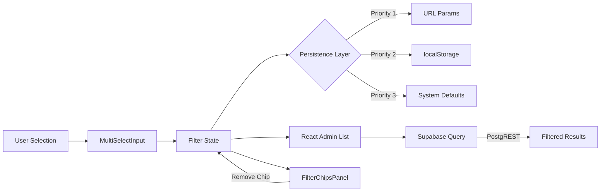

# Multi-Select Filters for Opportunities List

## Feature Summary
Enhance the Opportunities List in Atomic CRM with multi-select filtering capabilities for Stage, Category (tags), Priority, and Customer Organization. This MVP implementation creates a reusable filter foundation that will be shared between List and future Kanban views, with URL-shareable filter states and user preference persistence via localStorage.

## User Stories

1. **As a sales manager**, I want to filter opportunities by multiple stages simultaneously, so that I can view all active opportunities while hiding closed ones by default.

2. **As a sales rep**, I want to share filtered views with my team via URL, so that we can collaborate on specific opportunity segments.

3. **As a power user**, I want my filter preferences to persist between sessions, so that I don't have to reconfigure my view each time I log in.

4. **As a team lead**, I want to filter by multiple categories and priorities at once, so that I can focus on high-value opportunities across different segments.

5. **As an account manager**, I want to see filter chips for active filters, so that I can quickly understand and modify my current view.

## Technical Approach

### Frontend Components

#### New Components
- **`src/hooks/useOpportunityFilters.ts`** - Centralized filter configuration hook
  ```typescript
  export const useOpportunityFilters = () => {
    const categoryChoices = useDynamicCategories(); // Fetches distinct tags
    const filters = [
      <SearchInput source="q" alwaysOn />,
      <MultiSelectInput
        source="stage"
        choices={OPPORTUNITY_STAGE_CHOICES}
        defaultValue={getDefaultVisibleStages()}
        onChange={updateStagePreferences}
      />,
      <MultiSelectInput source="priority" choices={PRIORITY_CHOICES} />,
      <MultiSelectInput source="tags" choices={categoryChoices} />,
      <ReferenceArrayInput
        source="customer_organization_id"
        reference="organizations"
        perPage={250}
      />
    ];
    return filters;
  };
  ```

- **`src/utils/filters/opportunityStages.ts`** - Stage preference management
  ```typescript
  export const getDefaultVisibleStages = () =>
    JSON.parse(localStorage.getItem('opportunity_visible_stages') ||
    '["new_lead","qualified","proposal","demo_scheduled"]');

  export const updateStagePreferences = (selectedStages: string[]) => {
    localStorage.setItem('opportunity_visible_stages', JSON.stringify(selectedStages));
  };
  ```

- **`src/utils/filters/dynamicCategories.ts`** - Dynamic category fetching with cache
  ```typescript
  export const useDynamicCategories = () => {
    const CACHE_KEY = 'opportunity_categories';
    const CACHE_DURATION = 24 * 60 * 60 * 1000; // 24 hours

    // Check cache first
    // If expired or missing, query: SELECT DISTINCT unnest(tags) FROM opportunities
    // Fallback to static list if query fails
  };
  ```

#### Modified Components
- **`src/atomic-crm/opportunities/OpportunityList.tsx`**
  - Replace manual filter array with `useOpportunityFilters()` hook
  - Add performance warning for 500+ results
  - Remove pagination (`pagination={false}`, `perPage={500}`)

- **`src/atomic-crm/filters/FilterChipsPanel.tsx`**
  - Already supports multi-value chips
  - Ensure proper formatting for array values

### API Endpoints & Validation

No new API endpoints required. Existing Supabase PostgREST endpoints support array filtering:

#### Query Format
```
GET /opportunities?stage=in.(new_lead,qualified)&priority=in.(high,medium)&tags=cs.{Software,Enterprise}
```

#### Zod Validation (existing, no changes needed)
- `src/atomic-crm/validation/opportunities.ts` - Already validates enum arrays

### Database Changes

**No migrations required.** Using existing fields:
- `stage` (enum: opportunity_stage)
- `priority` (enum: priority_level)
- `tags` (text[] array)
- `customer_organization_id` (bigint reference)

### Data Flow



## UI/UX Flow

### Step-by-Step User Flow

1. **Initial Load**
   - Check URL for filter parameters (shareable link)
   - If no URL filters, load from localStorage preferences
   - If no preferences, apply system defaults (hide closed_won/closed_lost)

2. **Filter Interaction**
   - User clicks filter dropdown → sees checkboxes with current selections
   - Header shows "(X selected)" count
   - User can toggle individual options or use "Clear All"
   - Changes immediately update the list

3. **Filter Chips Display**
   - Active filters appear as chips below toolbar
   - Each chip shows: `Stage: Qualified ×`
   - Clicking × removes that specific value (not entire filter)
   - Panel auto-expands when filters are active

4. **Performance Feedback**
   - If results > 500, show warning: "Showing first 500 results. Apply more filters to narrow your view."
   - Filters with 250+ options show search input

5. **Persistence**
   - URL updates automatically for sharing
   - localStorage saves preferences for next session
   - User's stage preferences persist across sessions

### Visual Design
- Active filters highlighted with `--brand-500` border
- Filter chips use semantic backgrounds (`--tag-teal-bg`, etc.)
- Smooth transitions (`transition-all duration-150`)
- Responsive spacing for iPad (768px+) and desktop

## Success Metrics

1. **✅ URL Shareability** - Filter state fully encoded in URL parameters
2. **✅ Efficiency** - 30% fewer clicks to toggle between active/closed opportunities
3. **✅ Performance** - Filter panel loads in < 250ms
4. **✅ Device Support** - Optimized for iPad and desktop form factors
5. **✅ No Breaking Changes** - Existing opportunity views continue working
6. **✅ Memory Efficiency** - Max 500 records loaded (no pagination issues)

## Implementation Steps

1. **Create centralized filter hook** (`useOpportunityFilters`)
2. **Implement dynamic category fetching** with 24-hour cache
3. **Fix stage persistence** - store selected stages, not hidden
4. **Update OpportunityList** to use centralized filters
5. **Add performance warning** for 500+ results
6. **Test filter chip removal** with array values
7. **Validate PostgREST queries** for all filter combinations
8. **Add unit tests** for filter helper functions
9. **Test on iPad** for touch targets and responsive layout
10. **Verify URL sharing** works across different browsers

## Testing Plan

### Functional Tests
- [ ] Multi-select returns correct filtered records
- [ ] Default hides "closed_won" and "closed_lost" stages
- [ ] Filter chips update correctly on add/remove
- [ ] "Clear All" resets filter and clears localStorage
- [ ] URL parameters persist and share correctly
- [ ] Dynamic categories load and cache properly

### Performance Tests
- [ ] Filter panel renders in < 250ms
- [ ] List handles 500 records without lag
- [ ] Filter dropdowns handle 250+ options smoothly

### Device/UX Tests
- [ ] Verify spacing and tap targets on iPad (768px+)
- [ ] Confirm hover/focus states meet accessibility standards
- [ ] Ensure WCAG AA contrast with OKLCH semantic colors
- [ ] Test dark theme variant (.dark mode)

## Out of Scope (MVP)

1. **Kanban view toggle** - Hidden behind feature flag for Phase 2
2. **Saved filter presets** - Future enhancement
3. **Complex filter logic** - No AND/OR combinations
4. **Server-side filter preferences** - localStorage only for now
5. **Infinite scroll/pagination** - Hard limit at 500 records
6. **Filter analytics** - No tracking of filter usage patterns
7. **Bulk operations on filtered results** - Future enhancement
8. **Export filtered results** - Phase 2 feature

## Phase 2 Preview (Post-MVP)

- Re-enable Kanban view with same filter state
- Implement drag-and-drop with @dnd-kit/core
- Add inline quick-add to Kanban columns
- Virtual scrolling for 500+ records
- Saved filter presets
- Advanced filter combinations (AND/OR logic)

## Technical Debt & Risks

### Mitigated Risks
- **Performance at scale** → Limited to 500 records with warning
- **Filter complexity** → Centralized configuration prevents spaghetti code
- **localStorage conflicts** → Clear precedence: URL > localStorage > defaults
- **Category explosion** → Caching and search input for large lists

### Accepted Trade-offs
- **No server persistence** → Acceptable for MVP, user preferences are device-specific
- **500 record limit** → Reasonable for typical CRM usage patterns
- **No filter analytics** → Can be added later if needed

## Dependencies
- React Admin 5.10+ (for array filter support)
- ra-supabase-core (for `in()` operator support)
- Existing MultiSelectInput component
- PostgREST array operators (in., cs.)

## Migration Notes
- No database migrations required
- No breaking changes to existing views
- localStorage keys are new (no conflicts)
- URL parameter format unchanged (backward compatible)