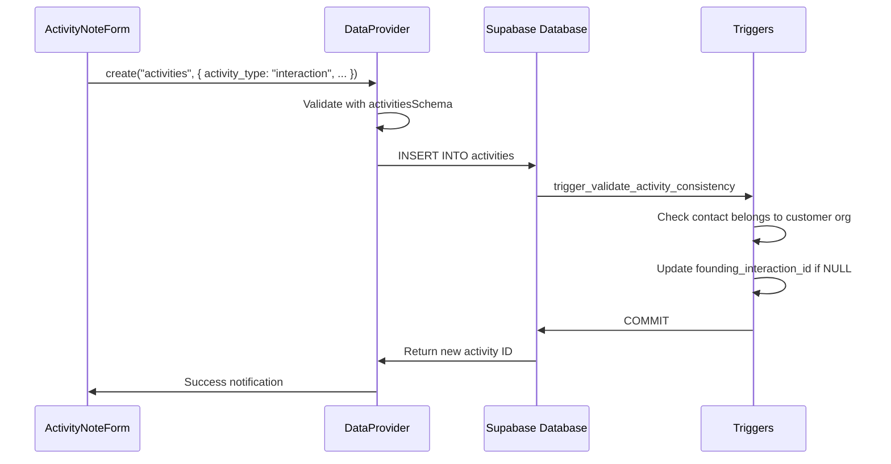
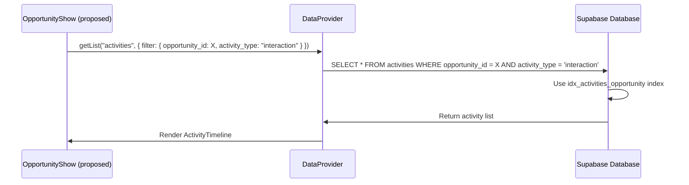

# Interactions & Activities System Architecture

Comprehensive research findings on the interactions and activities system for the opportunity redesign project.

## Overview

The CRM uses a unified `activities` table to track both **engagements** (standalone activities) and **interactions** (opportunity-linked activities). The system distinguishes between these via the `activity_type` column, with business rule enforcement at the database level through constraints and triggers. Currently, there's a gap in the UI: activities are created but not displayed on opportunity detail pages, and there's no interaction count calculation or timeline view.

**Key Finding:** Activities exist in the database with comprehensive metadata support (sentiment, follow-ups, participants), but the UI layer is incomplete - opportunities lack a visual activity timeline and interaction count badges.

## Database Schema

### Activities Table

**Location:** `/home/krwhynot/projects/crispy-crm/supabase/migrations/20251018152315_cloud_schema_fresh.sql` (lines 1103-1133)

```sql
CREATE TABLE IF NOT EXISTS "public"."activities" (
    "id" bigint NOT NULL,

    -- Activity Classification
    "activity_type" "public"."activity_type" NOT NULL,  -- 'engagement' | 'interaction'
    "type" "public"."interaction_type" NOT NULL,        -- call, email, meeting, demo, etc.

    -- Core Fields
    "subject" "text" NOT NULL,
    "description" "text",
    "activity_date" timestamp with time zone DEFAULT "now"(),
    "duration_minutes" integer,

    -- Entity Relationships
    "contact_id" bigint,
    "organization_id" bigint,
    "opportunity_id" bigint,  -- NULL for engagements, REQUIRED for interactions

    -- Follow-up Management
    "follow_up_required" boolean DEFAULT false,
    "follow_up_date" "date",
    "follow_up_notes" "text",

    -- Outcome Tracking
    "outcome" "text",
    "sentiment" character varying(10),  -- 'positive' | 'neutral' | 'negative'

    -- Additional Metadata
    "attachments" "text"[],
    "location" "text",
    "attendees" "text"[],
    "tags" "text"[],

    -- Audit Fields
    "created_at" timestamp with time zone DEFAULT "now"(),
    "updated_at" timestamp with time zone DEFAULT "now"(),
    "created_by" bigint,
    "deleted_at" timestamp with time zone,

    -- Business Rule Constraints
    CONSTRAINT "activities_sentiment_check"
        CHECK (("sentiment")::text = ANY (ARRAY['positive', 'neutral', 'negative'])),
    CONSTRAINT "check_has_contact_or_org"
        CHECK (("contact_id" IS NOT NULL) OR ("organization_id" IS NOT NULL)),
    CONSTRAINT "check_interaction_has_opportunity"
        CHECK ((("activity_type" = 'interaction' AND "opportunity_id" IS NOT NULL)
                OR ("activity_type" = 'engagement')))
);
```

**Critical Business Rules:**
1. **Interactions MUST have `opportunity_id`** - enforced by `check_interaction_has_opportunity` constraint
2. **Engagements CANNOT have `opportunity_id`** - enforced by same constraint
3. **All activities need contact OR organization** - enforced by `check_has_contact_or_org`
4. **Sentiment values are restricted** - only 'positive', 'neutral', 'negative' allowed

### Database Enums

**Location:** Same migration file (lines 22-61)

```sql
-- Activity Type: Engagement vs Interaction
CREATE TYPE "public"."activity_type" AS ENUM (
    'engagement',   -- Standalone activity (no opportunity link)
    'interaction'   -- Opportunity-linked activity
);

-- Interaction Type: All supported activity types
CREATE TYPE "public"."interaction_type" AS ENUM (
    'call',
    'email',
    'meeting',
    'demo',
    'proposal',
    'follow_up',
    'trade_show',
    'site_visit',
    'contract_review',
    'check_in',
    'social'
);
```

**Gap Identified:** TypeScript `ActivityRecord` type (types.ts lines 128-136) only lists 8 interaction types, missing `trade_show`, `site_visit`, `contract_review`, `check_in`, and `social` from the database enum.

### Indexes for Performance

**Location:** Same migration file (lines 2247-2267)

```sql
-- Performance optimized indexes for common queries
CREATE INDEX "idx_activities_contact"
    ON "public"."activities" USING "btree" ("contact_id")
    WHERE ("deleted_at" IS NULL);

CREATE INDEX "idx_activities_date"
    ON "public"."activities" USING "btree" ("activity_date" DESC)
    WHERE ("deleted_at" IS NULL);

CREATE INDEX "idx_activities_follow_up"
    ON "public"."activities" USING "btree" ("follow_up_date")
    WHERE (("follow_up_required" = true) AND ("deleted_at" IS NULL));

CREATE INDEX "idx_activities_opportunity"
    ON "public"."activities" USING "btree" ("opportunity_id")
    WHERE (("deleted_at" IS NULL) AND ("opportunity_id" IS NOT NULL));

CREATE INDEX "idx_activities_organization"
    ON "public"."activities" USING "btree" ("organization_id")
    WHERE ("deleted_at" IS NULL);

CREATE INDEX "idx_activities_type"
    ON "public"."activities" USING "btree" ("activity_type", "type")
    WHERE ("deleted_at" IS NULL);
```

**Observation:** All indexes exclude soft-deleted records (`deleted_at IS NULL`), which is good for query performance. The `idx_activities_date` uses descending order, optimized for "most recent first" timeline views.

### RLS Policies

**Location:** Same migration file (lines 2827-3059)

```sql
-- All authenticated users have full CRUD access
CREATE POLICY "authenticated_delete_activities"
    ON "public"."activities" FOR DELETE
    TO "authenticated" USING (("auth"."uid"() IS NOT NULL));

CREATE POLICY "authenticated_insert_activities"
    ON "public"."activities" FOR INSERT
    TO "authenticated" WITH CHECK (("auth"."uid"() IS NOT NULL));

CREATE POLICY "authenticated_select_activities"
    ON "public"."activities" FOR SELECT
    TO "authenticated" USING (("auth"."uid"() IS NOT NULL));

CREATE POLICY "authenticated_update_activities"
    ON "public"."activities" FOR UPDATE
    TO "authenticated" USING (("auth"."uid"() IS NOT NULL))
    WITH CHECK (("auth"."uid"() IS NOT NULL));
```

**Security Model:** Simple authentication check only - no team-based filtering. All authenticated users can see all activities.

### Database Triggers & Functions

**1. Activity Validation Trigger**

**Location:** Same migration file (lines 946-991, 2583)

```sql
CREATE OR REPLACE FUNCTION "public"."validate_activity_consistency"()
RETURNS "trigger" AS $$
DECLARE
    v_opp_customer_id BIGINT;
    v_contact_org_id BIGINT;
BEGIN
    -- For interactions linked to opportunities
    IF NEW.activity_type = 'interaction' AND NEW.opportunity_id IS NOT NULL THEN
        -- Get the customer organization from opportunity_participants
        SELECT op.organization_id INTO v_opp_customer_id
        FROM opportunity_participants op
        WHERE op.opportunity_id = NEW.opportunity_id
          AND op.role = 'customer'
          AND op.is_primary = true
          AND op.deleted_at IS NULL
        LIMIT 1;

        -- If contact specified, verify it belongs to customer org
        IF NEW.contact_id IS NOT NULL THEN
            SELECT organization_id INTO v_contact_org_id
            FROM contact_organizations
            WHERE contact_id = NEW.contact_id
              AND is_primary_contact = true
              AND deleted_at IS NULL
            LIMIT 1;

            -- Ensure contact belongs to opportunity's customer org
            IF v_contact_org_id IS NOT NULL AND v_contact_org_id != v_opp_customer_id THEN
                RAISE EXCEPTION 'Contact does not belong to opportunity customer organization';
            END IF;
        END IF;
    END IF;

    -- Auto-set founding_interaction_id on opportunities
    IF NEW.activity_type = 'interaction' AND NEW.opportunity_id IS NOT NULL THEN
        UPDATE opportunities
        SET founding_interaction_id = NEW.id
        WHERE id = NEW.opportunity_id
          AND founding_interaction_id IS NULL;
    END IF;

    RETURN NEW;
END;
$$;

-- Trigger fires before INSERT or UPDATE
CREATE OR REPLACE TRIGGER "trigger_validate_activity_consistency"
    BEFORE INSERT OR UPDATE ON "public"."activities"
    FOR EACH ROW EXECUTE FUNCTION "public"."validate_activity_consistency"();
```

**Key Behaviors:**
- **Cross-entity validation:** Ensures contacts belong to the opportunity's customer organization
- **Auto-populates `founding_interaction_id`:** First interaction on an opportunity is automatically marked as founding interaction
- **Data integrity enforcement:** Prevents orphaned relationships

**2. Helper Functions: log_interaction() and log_engagement()**

**Location:** Same migration file (lines 473-613)

```sql
-- Function to log opportunity interactions
CREATE OR REPLACE FUNCTION "public"."log_interaction"(
    "p_opportunity_id" bigint,
    "p_type" "public"."interaction_type",
    "p_subject" "text",
    "p_description" "text" DEFAULT NULL,
    "p_contact_id" bigint DEFAULT NULL,
    "p_organization_id" bigint DEFAULT NULL,
    "p_activity_date" timestamp with time zone DEFAULT "now"(),
    "p_duration_minutes" integer DEFAULT NULL,
    "p_follow_up_required" boolean DEFAULT false,
    "p_follow_up_date" "date" DEFAULT NULL,
    "p_outcome" "text" DEFAULT NULL,
    "p_sentiment" character varying DEFAULT NULL,
    "p_created_by" bigint DEFAULT NULL
) RETURNS bigint AS $$
DECLARE
    v_activity_id BIGINT;
    v_customer_org_id BIGINT;
BEGIN
    -- Validate opportunity exists
    IF NOT EXISTS (SELECT 1 FROM opportunities
                   WHERE id = p_opportunity_id AND deleted_at IS NULL) THEN
        RAISE EXCEPTION 'Opportunity % does not exist or is deleted', p_opportunity_id;
    END IF;

    -- Auto-populate organization_id from opportunity if not provided
    IF p_organization_id IS NULL THEN
        SELECT op.organization_id INTO v_customer_org_id
        FROM opportunity_participants op
        WHERE op.opportunity_id = p_opportunity_id
          AND op.role = 'customer'
          AND op.is_primary = true
          AND op.deleted_at IS NULL
        LIMIT 1;

        p_organization_id := v_customer_org_id;
    END IF;

    -- Insert activity record
    INSERT INTO activities (
        activity_type,
        type,
        subject,
        description,
        activity_date,
        duration_minutes,
        contact_id,
        organization_id,
        opportunity_id,
        follow_up_required,
        follow_up_date,
        outcome,
        sentiment,
        created_by
    ) VALUES (
        'interaction',
        p_type,
        p_subject,
        p_description,
        p_activity_date,
        p_duration_minutes,
        p_contact_id,
        p_organization_id,
        p_opportunity_id,
        p_follow_up_required,
        p_follow_up_date,
        p_outcome,
        p_sentiment,
        p_created_by
    ) RETURNING id INTO v_activity_id;

    RETURN v_activity_id;
END;
$$;

-- Function to log standalone engagements
CREATE OR REPLACE FUNCTION "public"."log_engagement"(
    "p_type" "public"."interaction_type",
    "p_subject" "text",
    "p_description" "text" DEFAULT NULL,
    "p_contact_id" bigint DEFAULT NULL,
    "p_organization_id" bigint DEFAULT NULL,
    "p_activity_date" timestamp with time zone DEFAULT "now"(),
    "p_duration_minutes" integer DEFAULT NULL,
    "p_follow_up_required" boolean DEFAULT false,
    "p_follow_up_date" "date" DEFAULT NULL,
    "p_outcome" "text" DEFAULT NULL,
    "p_created_by" bigint DEFAULT NULL
) RETURNS bigint AS $$
DECLARE
    v_activity_id BIGINT;
BEGIN
    -- Validate required entities
    IF p_contact_id IS NULL AND p_organization_id IS NULL THEN
        RAISE EXCEPTION 'Engagement must have either a contact or organization';
    END IF;

    -- Auto-populate organization from contact if needed
    IF p_contact_id IS NOT NULL AND p_organization_id IS NULL THEN
        SELECT organization_id INTO p_organization_id
        FROM contact_organizations
        WHERE contact_id = p_contact_id
          AND is_primary_contact = true
          AND deleted_at IS NULL
        LIMIT 1;
    END IF;

    -- Insert activity record
    INSERT INTO activities (
        activity_type,
        type,
        subject,
        description,
        activity_date,
        duration_minutes,
        contact_id,
        organization_id,
        follow_up_required,
        follow_up_date,
        outcome,
        created_by
    ) VALUES (
        'engagement',
        p_type,
        p_subject,
        p_description,
        p_activity_date,
        p_duration_minutes,
        p_contact_id,
        p_organization_id,
        p_follow_up_required,
        p_follow_up_date,
        p_outcome,
        p_created_by
    ) RETURNING id INTO v_activity_id;

    RETURN v_activity_id;
END;
$$;
```

**Usage Note:** These functions provide a cleaner API for creating activities with automatic relationship resolution.

### Interaction Participants Table

**Location:** Same migration file (lines 1412-1421)

```sql
CREATE TABLE IF NOT EXISTS "public"."interaction_participants" (
    "id" bigint NOT NULL,
    "activity_id" bigint NOT NULL,  -- FK to activities table
    "contact_id" bigint,             -- Participant contact
    "organization_id" bigint,        -- Participant organization
    "role" character varying(20) DEFAULT 'participant',
    "notes" "text",
    "created_at" timestamp with time zone DEFAULT "now"(),
    CONSTRAINT "has_contact_or_org"
        CHECK (("contact_id" IS NOT NULL) OR ("organization_id" IS NOT NULL))
);
```

**Purpose:** Tracks multiple participants in a single activity (e.g., multi-person meetings). This is separate from the primary `contact_id` on the activities table.

**Indexes:**
```sql
CREATE INDEX "idx_interaction_participants_activity"
    ON "public"."interaction_participants" ("activity_id");
CREATE INDEX "idx_interaction_participants_contact"
    ON "public"."interaction_participants" ("contact_id");
CREATE INDEX "idx_interaction_participants_organization"
    ON "public"."interaction_participants" ("organization_id");
```

### Opportunity Participants Table (for context)

**Location:** Same migration file (lines 1580-1595)

```sql
CREATE TABLE IF NOT EXISTS "public"."opportunity_participants" (
    "id" bigint NOT NULL,
    "opportunity_id" bigint NOT NULL,
    "organization_id" bigint NOT NULL,
    "role" character varying(20) NOT NULL,  -- customer, principal, distributor, partner, competitor
    "is_primary" boolean DEFAULT false,
    "commission_rate" numeric(5,4),
    "territory" "text",
    "notes" "text",
    "created_at" timestamp with time zone DEFAULT "now"(),
    "updated_at" timestamp with time zone DEFAULT "now"(),
    "created_by" bigint,
    "deleted_at" timestamp with time zone,
    CONSTRAINT "opportunity_participants_role_check"
        CHECK (("role")::text = ANY (ARRAY['customer', 'principal', 'distributor', 'partner', 'competitor']))
);
```

**Relationship to Activities:** The `validate_activity_consistency()` trigger uses this table to verify that activity contacts belong to the opportunity's customer organization.

## Type Definitions

### ActivityRecord Type

**Location:** `/home/krwhynot/projects/crispy-crm/src/atomic-crm/types.ts` (lines 125-157)

```typescript
export type ActivityRecord = {
  id: Identifier;

  // Activity Classification
  activity_type: "engagement" | "interaction";
  type:
    | "call"
    | "email"
    | "meeting"
    | "demo"
    | "follow_up"
    | "visit"
    | "proposal"
    | "negotiation";  // ⚠️ Missing: trade_show, site_visit, contract_review, check_in, social

  // Core Fields
  subject: string;
  description?: string;
  activity_date: string;
  duration_minutes?: number;

  // Entity Relationships
  contact_id?: Identifier;
  organization_id?: Identifier;
  opportunity_id?: Identifier; // NULL for engagements, required for interactions

  // Follow-up Management
  follow_up_required?: boolean;
  follow_up_date?: string;
  follow_up_notes?: string;

  // Outcome Tracking
  outcome?: string;
  sentiment?: "positive" | "neutral" | "negative";

  // Additional Metadata
  attachments?: string[];
  location?: string;
  attendees?: string[];
  tags?: string[];

  // Audit Fields
  created_at: string;
  updated_at?: string;
  created_by?: Identifier;
  deleted_at?: string;
} & Pick<RaRecord, "id">;
```

**⚠️ Schema Mismatch:** The TypeScript enum is missing 5 interaction types that exist in the database:
- `trade_show`
- `site_visit`
- `contract_review`
- `check_in`
- `social`

### InteractionParticipant Type

**Location:** Same file (lines 159-167)

```typescript
export type InteractionParticipant = {
  id: Identifier;
  activity_id: Identifier;
  contact_id?: Identifier;
  organization_id?: Identifier;
  role?: string;
  notes?: string;
  created_at: string;
} & Pick<RaRecord, "id">;
```

### Validation Schemas

**Location:** `/home/krwhynot/projects/crispy-crm/src/atomic-crm/validation/activities.ts`

**Interaction Type Schema (lines 15-27):**
```typescript
export const interactionTypeSchema = z.enum([
  "call",
  "email",
  "meeting",
  "demo",
  "proposal",
  "follow_up",
  "trade_show",    // ✅ Present in validation
  "site_visit",    // ✅ Present in validation
  "contract_review",  // ✅ Present in validation
  "check_in",      // ✅ Present in validation
  "social",        // ✅ Present in validation
]);
```

**UI Options (lines 33-45):**
```typescript
export const INTERACTION_TYPE_OPTIONS = [
  { value: "call", label: "Call" },
  { value: "email", label: "Email" },
  { value: "meeting", label: "Meeting" },
  { value: "demo", label: "Demo" },
  { value: "proposal", label: "Proposal" },
  { value: "follow_up", label: "Follow Up" },
  { value: "trade_show", label: "Trade Show" },
  { value: "site_visit", label: "Site Visit" },
  { value: "contract_review", label: "Contract Review" },
  { value: "check_in", label: "Check In" },
  { value: "social", label: "Social" },
] as const;
```

**Main Activities Schema (lines 85-123):**
```typescript
export const activitiesSchema = baseActivitiesSchema.superRefine((data, ctx) => {
  // If it's an interaction, opportunity_id is required
  if (data.activity_type === "interaction" && !data.opportunity_id) {
    ctx.addIssue({
      code: z.ZodIssueCode.custom,
      path: ["opportunity_id"],
      message: "Opportunity is required for interaction activities",
    });
  }

  // If it's an engagement, opportunity_id should not be set
  if (data.activity_type === "engagement" && data.opportunity_id) {
    ctx.addIssue({
      code: z.ZodIssueCode.custom,
      path: ["opportunity_id"],
      message: "Opportunity should not be set for engagement activities",
    });
  }

  // At least one entity relationship is required (contact or organization)
  if (!data.contact_id && !data.organization_id) {
    ctx.addIssue({
      code: z.ZodIssueCode.custom,
      path: ["contact_id"],
      message: "Either contact or organization is required",
    });
  }

  // If follow-up is required, follow_up_date should be set
  if (data.follow_up_required && !data.follow_up_date) {
    ctx.addIssue({
      code: z.ZodIssueCode.custom,
      path: ["follow_up_date"],
      message: "Follow-up date is required when follow-up is enabled",
    });
  }
});
```

**Observation:** Validation schemas mirror database constraints closely, following Engineering Constitution's "Single Source of Truth" principle.

## Current Implementation

### Activity Creation: ActivityNoteForm Component

**Location:** `/home/krwhynot/projects/crispy-crm/src/atomic-crm/opportunities/ActivityNoteForm.tsx`

**Purpose:** Quick-add form for logging interactions directly from opportunity detail pages (not currently visible in UI).

**Key Features:**
```typescript
// Form fields (lines 84-99)
const defaultValues = {
  activity_date: new Date(),
  type: "email",
  contact_id: null,
  stage: opportunity.stage,  // Syncs opportunity stage
  subject: "",
};

// Submission logic (lines 116-137)
const onSubmit = async (data: ActivityNoteFormData) => {
  await dataProvider.create("activities", {
    data: {
      activity_type: "interaction",  // Hard-coded as interaction
      type: data.type,
      subject: data.subject,
      activity_date: data.activity_date.toISOString(),
      contact_id: data.contact_id,
      opportunity_id: opportunity.id,  // Auto-populated from context
      organization_id: opportunity.customer_organization_id,  // Auto-populated
    },
  });

  notify("Activity created successfully", { type: "success" });
  reset();
  onSuccess?.();
};
```

**UI Layout (lines 142-243):**
- **4-column grid:** Date | Type | Contact | Stage
- **Contact Select:** Dynamically loads contacts from customer organization
- **Stage Select:** Allows updating opportunity stage while logging activity
- **Subject Textarea:** Multi-line input for activity details

**Gaps:**
- No description field (only subject)
- No sentiment tracking
- No follow-up scheduling
- No duration input
- No outcome field
- Missing rich activity metadata

### Activity Display: Missing from OpportunityShow

**Location:** `/home/krwhynot/projects/crispy-crm/src/atomic-crm/opportunities/OpportunityShow.tsx`

**Current Tabs (lines 78-80):**
```typescript
<TabsList className="grid w-full grid-cols-2">
  <TabsTrigger value="details">Details</TabsTrigger>
  <TabsTrigger value="notes">Notes & Activity</TabsTrigger>  {/* Misleading name */}
</TabsList>
```

**Notes Tab Content (lines 244-253):**
```typescript
<TabsContent value="notes" className="pt-4">
  <ReferenceManyField
    target="opportunity_id"
    reference="opportunityNotes"  {/* Only shows notes, NOT activities */}
    sort={{ field: "created_at", order: "DESC" }}
    empty={<NoteCreate reference={"opportunities"} />}
  >
    <NotesIterator reference="opportunities" />
  </ReferenceManyField>
</TabsContent>
```

**⚠️ Critical Gap:** Despite the tab being labeled "Notes & Activity", it only displays `opportunityNotes` records. There is **NO** `ReferenceManyField` for `activities` - interactions are created but never shown in the UI.

**Missing Features:**
1. Activity timeline view
2. Interaction count badge/summary
3. Activity filtering by type
4. Sentiment indicators
5. Follow-up reminders display
6. Activity metadata (duration, attendees, location)

### Notes System (for comparison)

**Location:** `/home/krwhynot/projects/crispy-crm/src/atomic-crm/notes/`

**OpportunityNote Type (types.ts lines 224-234):**
```typescript
export type OpportunityNote = {
  opportunity_id: Identifier;
  text: string;
  created_at: string;
  updated_at: string;
  opportunity_owner_id: Identifier;
  attachments?: AttachmentNote[];

  // Compatibility field (notes don't have status)
  status?: undefined;
} & Pick<RaRecord, "id">;
```

**NoteCreate Component (`notes/NoteCreate.tsx`):**
- Simple text + attachments form
- No metadata fields (intentionally minimal)
- Auto-links to parent resource (contact or opportunity)
- Updates `last_seen` timestamp for contacts

**NotesIterator Component (`notes/NotesIterator.tsx`):**
- Displays list of notes with separators
- Shows creation date and author
- Supports attachments display
- Status field only shown for contact notes

**Key Difference:** Notes are simple text entries with timestamps. Activities are structured events with type, duration, sentiment, and relationship tracking.

## Data Provider Integration

### Resource Configuration

**Location:** `/home/krwhynot/projects/crispy-crm/src/atomic-crm/providers/supabase/resources.ts` (lines 36-37)

```typescript
export const RESOURCE_NAMES = {
  // ... other resources
  activities: "activities",
  // ...
} as const;
```

**Validation Registration:**
The activities validation functions are exported from `validation/activities.ts`:
- `validateCreateActivities()`
- `validateUpdateActivities()`
- `validateCreateEngagements()`
- `validateUpdateEngagements()`
- `validateCreateInteractions()`
- `validateUpdateInteractions()`

These are used by the unified data provider for API boundary validation.

### Filter Support

Activities are listed as a filterable resource in the filter registry, suggesting the data provider supports standard React Admin filters.

## Relationship Patterns

### 1. Activities → Opportunities

**Direct Foreign Key:**
```sql
"opportunity_id" bigint
FOREIGN KEY references opportunities(id)
```

**Business Rules:**
- `activity_type = 'interaction'` → `opportunity_id` REQUIRED (enforced by constraint)
- `activity_type = 'engagement'` → `opportunity_id` MUST BE NULL
- First interaction auto-populates `opportunities.founding_interaction_id`

**Usage Pattern:**
```typescript
// In OpportunityShow, you would fetch activities:
<ReferenceManyField
  target="opportunity_id"
  reference="activities"
  filter={{ activity_type: 'interaction' }}  // Only show interactions
  sort={{ field: "activity_date", order: "DESC" }}
>
  <ActivityTimeline />
</ReferenceManyField>
```

### 2. Activities → Organizations

**Direct Foreign Key:**
```sql
"organization_id" bigint
FOREIGN KEY references organizations(id)
```

**Auto-Population Logic:**
- Interactions: Auto-filled from `opportunity_participants` (customer role)
- Engagements: Auto-filled from `contact_organizations` if contact provided
- Can be manually specified

**Validation:** For interactions, if `contact_id` is specified, the contact's organization must match the opportunity's customer organization (enforced by `validate_activity_consistency` trigger).

### 3. Activities → Contacts

**Direct Foreign Key:**
```sql
"contact_id" bigint
FOREIGN KEY references contacts(id)
```

**Optional Field:** Not all activities require a specific contact (e.g., organization-wide trade shows).

**Constraint:** Must have either `contact_id` OR `organization_id` (both can be present, but at least one required).

### 4. Activities → Sales Reps

**Created By Field:**
```sql
"created_by" bigint
FOREIGN KEY references sales(id)
```

**Usage:** Tracks which sales rep logged the activity. This is separate from opportunity ownership.

### 5. Multiple Participants via Junction Table

**Pattern:** `interaction_participants` junction table allows many-to-many between activities and contacts/organizations.

**Use Case:** Multi-person meetings where several contacts participated.

```sql
-- Example: 3-person meeting
-- activities.contact_id = primary contact
-- interaction_participants rows for additional attendees
INSERT INTO interaction_participants (activity_id, contact_id, role)
VALUES
  (123, 456, 'decision_maker'),
  (123, 789, 'influencer');
```

## Gaps for Opportunity Redesign

### 1. Missing Interaction Count

**Current State:** Opportunity cards show name, customer, principal, and priority. No interaction count badge.

**Database Support:** Fully supported - can `COUNT(*)` from activities table where `opportunity_id = X AND activity_type = 'interaction'`.

**Implementation Path:**
- Create `opportunities_summary` view with calculated `nb_interactions` field
- Alternative: Add to `Opportunity` type as optional calculated field
- Display as badge on `OpportunityCard` component

**Example SQL:**
```sql
SELECT
  o.*,
  COUNT(a.id) FILTER (WHERE a.activity_type = 'interaction' AND a.deleted_at IS NULL) as nb_interactions
FROM opportunities o
LEFT JOIN activities a ON a.opportunity_id = o.id
GROUP BY o.id;
```

### 2. No Activity Timeline View

**Current State:** Activities can be created but are never displayed in the UI.

**Database Support:** Full activity history stored with timestamps, types, and metadata.

**Implementation Path:**
- Add `ReferenceManyField` for activities in OpportunityShow "notes" tab
- Create `ActivityTimeline` or `ActivityList` component
- Group by date or interaction type
- Show sentiment indicators, follow-up flags, and metadata

**UI Considerations:**
- Timeline view (chronological)
- Grouped by type (calls, emails, meetings)
- Filterable by date range, type, or sentiment
- Inline editing for quick updates

### 3. No Follow-Up Reminder Display

**Current State:** `follow_up_required` and `follow_up_date` fields exist but no UI to display pending follow-ups.

**Database Support:** Optimized index `idx_activities_follow_up` for querying pending follow-ups.

**Implementation Path:**
- Dashboard widget showing overdue/upcoming follow-ups
- Badge on opportunity card if follow-up pending
- Dedicated follow-up queue page

### 4. Founding Interaction Not Highlighted

**Current State:** `opportunities.founding_interaction_id` is auto-populated but never displayed.

**Database Support:** Fully supported - tracks the first interaction that created/qualified the opportunity.

**Implementation Path:**
- Display "Founding Interaction" badge in activity timeline
- Show founding interaction metadata in opportunity header
- Use as anchor for "Opportunity Age" calculations

### 5. Sentiment Analysis Not Visualized

**Current State:** Sentiment field ('positive', 'neutral', 'negative') is captured but never shown.

**Database Support:** Validated enum with database constraint.

**Implementation Path:**
- Color-coded sentiment badges in activity timeline
- Aggregate sentiment metrics (e.g., "Last 5 interactions: 4 positive, 1 neutral")
- Sentiment trend chart

### 6. ActivityNoteForm Not Integrated

**Current State:** `ActivityNoteForm` component exists but is not rendered in `OpportunityShow`.

**Implementation Path:**
- Add form to "Notes & Activity" tab
- Consider inline quick-add within activity timeline
- Support all activity metadata fields (not just subject)

### 7. No Engagement View for Contacts

**Current State:** Contacts can have engagements (standalone activities), but no UI to display them.

**Database Support:** `activity_type = 'engagement'` with `opportunity_id IS NULL`.

**Implementation Path:**
- Add activity timeline to ContactShow
- Filter for engagements only
- Show conversion path: engagement → opportunity creation

## Data Flow Example

**Creating an Interaction:**



**Querying Opportunity Activities:**



## Recommendations for Redesign

### Priority 1: Add Activity Display to OpportunityShow

**File:** `/home/krwhynot/projects/crispy-crm/src/atomic-crm/opportunities/OpportunityShow.tsx`

**Change:**
```typescript
// Rename tab to be accurate
<TabsTrigger value="notes">Activity & Notes</TabsTrigger>

// In tab content, add activities before notes
<TabsContent value="notes" className="pt-4">
  {/* NEW: Activity Timeline */}
  <div className="mb-8">
    <h3 className="text-lg font-semibold mb-4">Interactions</h3>
    <ReferenceManyField
      target="opportunity_id"
      reference="activities"
      filter={{ activity_type: 'interaction' }}
      sort={{ field: "activity_date", order: "DESC" }}
    >
      <ActivityTimeline showForm />
    </ReferenceManyField>
  </div>

  {/* EXISTING: Notes Section */}
  <div>
    <h3 className="text-lg font-semibold mb-4">Notes</h3>
    <ReferenceManyField
      target="opportunity_id"
      reference="opportunityNotes"
      sort={{ field: "created_at", order: "DESC" }}
      empty={<NoteCreate reference={"opportunities"} />}
    >
      <NotesIterator reference="opportunities" />
    </ReferenceManyField>
  </div>
</TabsContent>
```

### Priority 2: Create ActivityTimeline Component

**New File:** `/home/krwhynot/projects/crispy-crm/src/atomic-crm/activities/ActivityTimeline.tsx`

**Features:**
- List activities grouped by date
- Show interaction type icon
- Display sentiment badges
- Follow-up indicators
- Inline quick-add form (using ActivityNoteForm)
- Click to expand for full details (description, attendees, attachments)

### Priority 3: Fix Type Definition Mismatch

**File:** `/home/krwhynot/projects/crispy-crm/src/atomic-crm/types.ts`

**Add missing interaction types:**
```typescript
export type ActivityRecord = {
  // ...
  type:
    | "call"
    | "email"
    | "meeting"
    | "demo"
    | "follow_up"
    | "visit"
    | "proposal"
    | "negotiation"
    | "trade_show"        // ADD
    | "site_visit"        // ADD
    | "contract_review"   // ADD
    | "check_in"          // ADD
    | "social";           // ADD
  // ...
}
```

### Priority 4: Add Interaction Count to Opportunity Cards

**Option A: Create opportunities_summary View**

```sql
-- New migration: add_opportunities_summary_view.sql
CREATE OR REPLACE VIEW opportunities_summary AS
SELECT
  o.*,
  COUNT(a.id) FILTER (
    WHERE a.activity_type = 'interaction'
      AND a.deleted_at IS NULL
  ) as nb_interactions,
  MAX(a.activity_date) FILTER (
    WHERE a.activity_type = 'interaction'
      AND a.deleted_at IS NULL
  ) as last_interaction_date
FROM opportunities o
LEFT JOIN activities a ON a.opportunity_id = o.id
GROUP BY o.id;

-- Grant permissions
GRANT SELECT ON opportunities_summary TO authenticated;
```

**Option B: Add to Opportunity Type**

```typescript
// types.ts
export type Opportunity = {
  // ... existing fields

  // Calculated fields (optional)
  nb_interactions?: number;
  last_interaction_date?: string;
}
```

**Display in OpportunityCard:**
```typescript
{opportunity.nb_interactions > 0 && (
  <Badge variant="outline" className="text-xs">
    {opportunity.nb_interactions} interactions
  </Badge>
)}
```

### Priority 5: Enhance ActivityNoteForm

**File:** `/home/krwhynot/projects/crispy-crm/src/atomic-crm/opportunities/ActivityNoteForm.tsx`

**Add missing fields:**
- Description (textarea)
- Duration (number input)
- Sentiment (select: positive/neutral/negative)
- Follow-up toggle + date picker
- Outcome (textarea)

**Consider two modes:**
- **Quick Add:** Subject + Type only (minimal friction)
- **Detailed Entry:** All fields (toggle to expand)

## Relevant Files Summary

| File Path | Purpose | Lines of Interest |
|-----------|---------|-------------------|
| `/home/krwhynot/projects/crispy-crm/supabase/migrations/20251018152315_cloud_schema_fresh.sql` | Database schema | 22-61 (enums), 1103-1133 (activities table), 946-991 (triggers), 473-613 (functions), 1412-1421 (participants), 2247-2267 (indexes) |
| `/home/krwhynot/projects/crispy-crm/src/atomic-crm/types.ts` | TypeScript types | 125-157 (ActivityRecord), 159-167 (InteractionParticipant), 224-234 (OpportunityNote) |
| `/home/krwhynot/projects/crispy-crm/src/atomic-crm/validation/activities.ts` | Zod validation | 15-27 (enum), 33-45 (UI options), 85-123 (main schema), 313-321 (form schema) |
| `/home/krwhynot/projects/crispy-crm/src/atomic-crm/opportunities/ActivityNoteForm.tsx` | Quick-add form | 84-99 (defaults), 116-137 (submit), 142-243 (UI) |
| `/home/krwhynot/projects/crispy-crm/src/atomic-crm/opportunities/OpportunityShow.tsx` | Opportunity detail | 78-80 (tabs), 244-253 (notes tab) |
| `/home/krwhynot/projects/crispy-crm/src/atomic-crm/notes/NotesIterator.tsx` | Notes display pattern | 8-37 (full component) |
| `/home/krwhynot/projects/crispy-crm/src/atomic-crm/notes/NoteCreate.tsx` | Notes creation pattern | 23-44 (form), 46-102 (submit button) |
| `/home/krwhynot/projects/crispy-crm/src/atomic-crm/opportunities/OpportunityCard.tsx` | Card component | 8-121 (full component) |
| `/home/krwhynot/projects/crispy-crm/src/atomic-crm/providers/supabase/resources.ts` | Resource registry | 36-37 (activities resource) |

## Relevant Documentation

### Internal Docs
- [Engineering Constitution](docs/claude/engineering-constitution.md) - Core principles including "Single Source of Truth" for validation
- [Architecture Essentials](docs/claude/architecture-essentials.md) - Module patterns and data layer structure
- [Supabase Workflow](docs/supabase/WORKFLOW.md) - Database migration procedures

### Database Schema
- Primary migration: `supabase/migrations/20251018152315_cloud_schema_fresh.sql`
- Activities table definition (lines 1103-1133)
- Enum definitions (lines 22-61)
- Trigger definitions (lines 946-991, 2583)
- Helper functions (lines 473-613)

### Related Systems
- Notes system: `/home/krwhynot/projects/crispy-crm/src/atomic-crm/notes/`
- Opportunity participants: `supabase/migrations/20251018152315_cloud_schema_fresh.sql` (lines 1580-1595)
- Contact organizations: Same migration (contact_organizations table)

---

**Document Version:** 1.0
**Last Updated:** 2025-10-23
**Research Scope:** Complete activities/interactions system architecture for opportunity redesign
**Next Steps:** Implement ActivityTimeline component and add interaction count to opportunity cards
