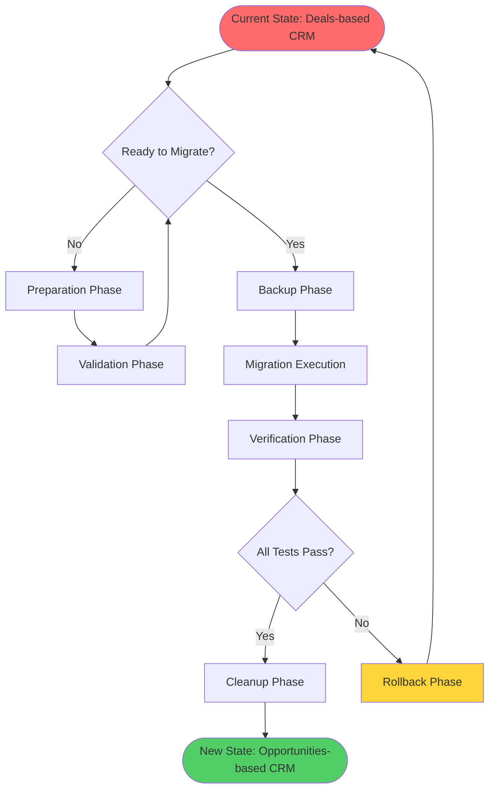
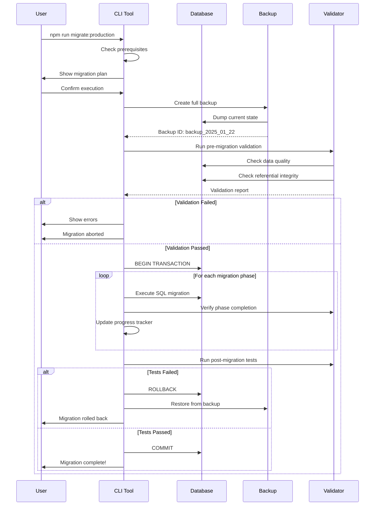
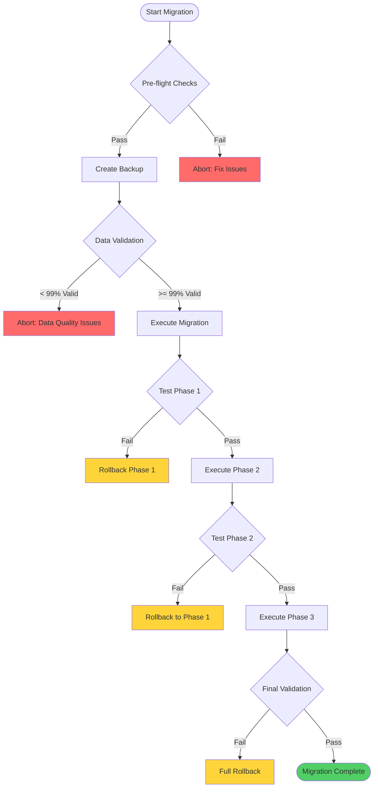
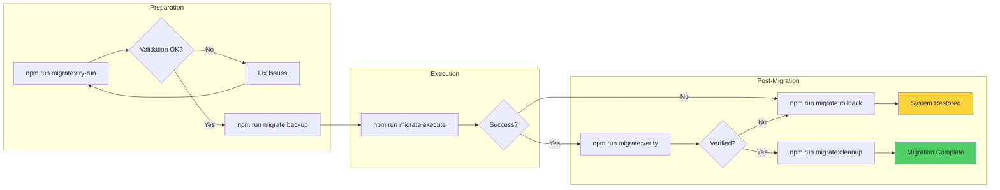

# CRM Migration Visual Guide

## 📊 Migration Overview - The Big Picture



## 🔄 Data Transformation Flow

### Before Migration (Current State)
```
┌─────────────────────────────────────────────────────────┐
│                    CURRENT DATABASE                      │
├─────────────────────────────────────────────────────────┤
│                                                          │
│  ┌──────────┐     ┌──────────┐     ┌──────────┐       │
│  │ COMPANIES│────>│  DEALS   │<────│ CONTACTS │       │
│  └──────────┘     └──────────┘     └──────────┘       │
│       │                │                  │             │
│       │                ▼                  │             │
│       │          ┌──────────┐            │             │
│       └─────────>│DEAL NOTES│<───────────┘             │
│                  └──────────┘                           │
│                                                          │
│  Simple 1-to-many relationships                         │
│  • One company has many deals                          │
│  • One contact belongs to one company                  │
│  • Deals have notes                                    │
└─────────────────────────────────────────────────────────┘
```

### After Migration (Target State)
```
┌─────────────────────────────────────────────────────────┐
│                     NEW DATABASE                         │
├─────────────────────────────────────────────────────────┤
│                                                          │
│  ┌──────────┐     ┌──────────────┐     ┌──────────┐   │
│  │COMPANIES │────>│OPPORTUNITIES │<────│ CONTACTS │   │
│  │(enhanced)│     │  (enhanced)  │     │(enhanced)│   │
│  └────┬─────┘     └──────┬───────┘     └────┬─────┘   │
│       │                   │                   │          │
│       ▼                   ▼                   ▼          │
│  ┌──────────┐     ┌──────────────┐     ┌──────────┐   │
│  │  PARENT  │     │ OPPORTUNITY  │     │ CONTACT  │   │
│  │ COMPANY  │     │    NOTES     │     │   ORGS   │   │
│  └──────────┘     └──────────────┘     └──────────┘   │
│                           │                   │          │
│                           ▼                   ▼          │
│                    ┌──────────────┐     ┌──────────┐   │
│                    │ OPPORTUNITY  │     │ACTIVITIES│   │
│                    │ PARTICIPANTS │     │          │   │
│                    └──────────────┘     └──────────┘   │
│                                                          │
│  Complex many-to-many relationships                     │
│  • Contacts can belong to multiple organizations       │
│  • Opportunities have multiple participants            │
│  • Companies have types, priorities, hierarchies      │
└─────────────────────────────────────────────────────────┘
```

## 🚀 Migration Execution Flow



## 📝 Phase-by-Phase Breakdown

### Phase 1.1: Foundation Setup
```
┌─────────────────────────────────────────────────┐
│              FOUNDATION SETUP                    │
├─────────────────────────────────────────────────┤
│                                                  │
│  1. Add backup columns to existing tables       │
│     • deals.backup_data                        │
│     • contacts.backup_company_id               │
│                                                  │
│  2. Create new tables                          │
│     ┌────────────────┐                         │
│     │ opportunities  │ ← Copy from deals       │
│     └────────────────┘                         │
│     ┌────────────────┐                         │
│     │opportunity_notes│ ← Copy from dealNotes │
│     └────────────────┘                         │
│                                                  │
│  3. Migrate data with transformations          │
│     DEALS ──transform──> OPPORTUNITIES         │
│                                                  │
│  4. Create backward compatibility views        │
│     CREATE VIEW deals AS                       │
│     SELECT * FROM opportunities                │
│                                                  │
└─────────────────────────────────────────────────┘
```

### Phase 1.2: Contact-Organization Relationships
```
┌─────────────────────────────────────────────────┐
│        CONTACT ORGANIZATION SETUP                │
├─────────────────────────────────────────────────┤
│                                                  │
│  Before: Contact ──belongs to──> One Company    │
│                                                  │
│  After:  Contact ←─many-to-many─→ Organizations │
│                                                  │
│  Junction Table Creation:                       │
│  ┌──────────────────────────────────┐          │
│  │   contact_organizations          │          │
│  ├──────────────────────────────────┤          │
│  │ contact_id                       │          │
│  │ organization_id                  │          │
│  │ is_primary_organization          │          │
│  │ role (decision_maker, buyer...)  │          │
│  │ purchase_influence               │          │
│  │ decision_authority               │          │
│  └──────────────────────────────────┘          │
│                                                  │
│  Data Migration:                                │
│  For each contact with company_id:              │
│    INSERT INTO contact_organizations            │
│    (contact_id, organization_id, is_primary)    │
│    VALUES (contact.id, company_id, true)        │
│                                                  │
└─────────────────────────────────────────────────┘
```

### Phase 1.3: Opportunity Enhancements
```
┌─────────────────────────────────────────────────┐
│         OPPORTUNITY ENHANCEMENTS                 │
├─────────────────────────────────────────────────┤
│                                                  │
│  Old Deal Fields:        New Opportunity Fields:│
│  ┌──────────────┐       ┌────────────────────┐ │
│  │ name         │  ───> │ name               │ │
│  │ amount       │  ───> │ amount             │ │
│  │ stage        │  ───> │ stage (enhanced)   │ │
│  │ company_id   │  ───> │ customer_org_id    │ │
│  └──────────────┘       │ + priority         │ │
│                          │ + probability      │ │
│                          │ + status           │ │
│                          │ + value_proposition│ │
│                          │ + competitors      │ │
│                          └────────────────────┘ │
│                                                  │
│  Participant Tracking:                          │
│  ┌──────────────────────────────────┐          │
│  │   opportunity_participants       │          │
│  ├──────────────────────────────────┤          │
│  │ opportunity_id                   │          │
│  │ organization_id                  │          │
│  │ role (customer/partner/vendor)   │          │
│  │ is_primary                       │          │
│  └──────────────────────────────────┘          │
│                                                  │
└─────────────────────────────────────────────────┘
```

## 🔍 Decision Points During Migration



## 🛡️ Safety Mechanisms

### Rollback Strategy
```
┌─────────────────────────────────────────────────┐
│              ROLLBACK LEVELS                     │
├─────────────────────────────────────────────────┤
│                                                  │
│  Level 1: Transaction Rollback (Immediate)      │
│  ├─ Automatic on any SQL error                  │
│  ├─ No data changes committed                   │
│  └─ Zero downtime                               │
│                                                  │
│  Level 2: Phase Rollback (5 minutes)            │
│  ├─ Undo specific phase changes                 │
│  ├─ Uses backup columns                         │
│  └─ Minimal data movement                       │
│                                                  │
│  Level 3: Full Restore (30 minutes)             │
│  ├─ Complete database restore                   │
│  ├─ From backup snapshot                        │
│  └─ Guaranteed original state                   │
│                                                  │
└─────────────────────────────────────────────────┘
```

## 📋 Migration Commands Flow



## 🎯 What Happens to Your Application

### During Migration (2-hour window)
```
┌──────────────────────────────────────┐
│         APPLICATION STATE             │
├──────────────────────────────────────┤
│                                       │
│  1. Maintenance Mode Activated       │
│     • Users see maintenance page     │
│     • No data modifications allowed  │
│                                       │
│  2. Database Migration Running       │
│     • Tables being modified          │
│     • Data being transformed         │
│     • Indexes being rebuilt          │
│                                       │
│  3. Validation in Progress           │
│     • Data integrity checks          │
│     • Reference validation           │
│     • Performance testing            │
│                                       │
└──────────────────────────────────────┘
```

### After Successful Migration
```
┌──────────────────────────────────────┐
│      NEW APPLICATION FEATURES         │
├──────────────────────────────────────┤
│                                       │
│  ✅ Opportunities (not Deals)        │
│  ✅ Multi-org contacts               │
│  ✅ Company hierarchies              │
│  ✅ Enhanced categorization          │
│  ✅ Activity tracking                │
│  ✅ Participant management           │
│                                       │
│  ❌ No backward compatibility        │
│  ❌ Old "deals" endpoints fail       │
│  ❌ Must use new API structure       │
│                                       │
└──────────────────────────────────────┘
```

## 🚨 Critical Points to Understand

1. **NO BACKWARD COMPATIBILITY** - Once migrated, all code must use "opportunities" not "deals"
2. **VALIDATION THRESHOLD** - Migration aborts if data quality < 99%
3. **ATOMIC OPERATION** - Either everything migrates or nothing does
4. **BACKUP WINDOW** - 48 hours to rollback if issues discovered
5. **TESTING REQUIRED** - Post-migration validation must pass before cleanup

## 📊 Migration Progress Tracking

```
Migration Progress: Phase 1.1 Foundation
[████████████████████] 100% Complete

Migration Progress: Phase 1.2 Relationships
[████████████████████] 100% Complete

Migration Progress: Phase 1.3 Enhancements
[████████████████████] 100% Complete

Migration Progress: Phase 1.4 Activities
[████████████████████] 100% Complete

Overall Migration Status: READY FOR EXECUTION
├─ Pre-flight checks:     ✅ PASSED
├─ Validation:            ✅ PASSED
├─ Backup created:        ⏳ PENDING
├─ Migration executed:    ⏳ PENDING
├─ Post-validation:       ⏳ PENDING
└─ Cleanup completed:     ⏳ PENDING
```

## 🎬 Next Steps

1. **Review this guide** - Ensure you understand each phase
2. **Run dry-run** - `npm run migrate:dry-run` to see what would happen
3. **Schedule downtime** - Pick a 2-hour maintenance window
4. **Execute migration** - Follow the command flow above
5. **Verify results** - Thoroughly test the new structure

This migration is like renovating a house while you're living in it - we're changing the foundation (database schema) while keeping everything functional. The safety mechanisms ensure that if anything goes wrong, we can instantly go back to the original state.