# Crispy CRM - Entity Relationship Diagram

> Auto-generated from live Supabase schema on 2026-02-10
> Updated: 2026-02-10 (ERD Remediation: +5 FKs, +2 triggers, +3 functions, RLS hardening)
> Database: PostgreSQL 17.6.1 | Project: aaqnanddcqvfiwhshndl | Region: us-east-2

## Overview

| Metric | Count |
|--------|-------|
| **Tables** | 24 |
| **Views** | 24 |
| **Foreign Keys** | 69 |
| **Functions** | 100 |
| **Triggers** | 84 |
| **RLS Policies** | 80 |
| **Enum Types** | 14 |
| **RLS Enabled** | 24/24 (100%) |

**Domain Areas:** Sales Pipeline (opportunities, activities, products), CRM (contacts, organizations), Authorization (distributor/principal), Audit & Notifications, User Management (sales, segments, tags).

---

## Mermaid ERD

```mermaid
erDiagram
    sales {
        int8 id PK
        uuid user_id UK
        text first_name
        text last_name
        text email
        user_role role
        bool is_admin
        bool disabled
        bool digest_opt_in
        timestamptz deleted_at
    }

    organizations {
        int8 id PK
        text name
        organization_type organization_type
        varchar priority
        int8 segment_id FK
        int8 parent_organization_id FK
        uuid playbook_category_id FK
        int8 sales_id FK
        int8 created_by FK
        text status
        tsvector search_tsv
        timestamptz deleted_at
    }

    contacts {
        int8 id PK
        text name
        text first_name
        text last_name
        jsonb email
        jsonb phone
        int8 organization_id FK
        int8 sales_id FK
        int8 manager_id FK
        int8 created_by FK
        text status
        tsvector search_tsv
        timestamptz deleted_at
    }

    opportunities {
        int8 id PK
        text name
        opportunity_stage stage
        opportunity_status status
        priority_level priority
        int8 customer_organization_id FK
        int8 principal_organization_id FK
        int8 distributor_organization_id FK
        int8 opportunity_owner_id FK
        int8 account_manager_id FK
        int8 primary_contact_id FK
        int8 founding_interaction_id FK
        int8 related_opportunity_id FK
        int4 version
        win_reason win_reason
        loss_reason loss_reason
        tsvector search_tsv
        timestamptz deleted_at
    }

    activities {
        int8 id PK
        activity_type activity_type
        interaction_type type
        text subject
        int8 contact_id FK
        int8 organization_id FK
        int8 opportunity_id FK
        int8 sales_id FK
        int8 created_by FK
        int8 related_task_id FK
        bool completed
        priority_level priority
        date due_date
        timestamptz deleted_at
    }

    products {
        int8 id PK
        int8 principal_id FK
        text name
        text category
        product_status status
        text manufacturer_part_number
        tsvector search_tsv
        timestamptz deleted_at
    }

    segments {
        uuid id PK
        text name
        text segment_type
        uuid parent_id FK
        int4 display_order
    }

    tags {
        int8 id PK
        text name UK
        text color
        int4 usage_count
        timestamptz deleted_at
    }

    notifications {
        int8 id PK
        uuid user_id
        text type
        text message
        bool read
        jsonb metadata
        timestamptz deleted_at
    }

    audit_trail {
        int8 audit_id PK
        text table_name
        int8 record_id
        text field_name
        text old_value
        text new_value
        int8 changed_by FK
    }

    dashboard_snapshots {
        int8 id PK
        date snapshot_date
        int8 sales_id FK
        int4 activities_count
        int4 tasks_completed_count
        int4 overdue_tasks_count
    }

    contact_notes {
        int8 id PK
        int8 contact_id FK
        text text
        int8 sales_id FK
        int8 created_by FK
        jsonb attachments
        timestamptz deleted_at
    }

    organization_notes {
        int8 id PK
        int8 organization_id FK
        text text
        int8 sales_id FK
        jsonb attachments
        timestamptz deleted_at
    }

    opportunity_notes {
        int8 id PK
        int8 opportunity_id FK
        text text
        int8 sales_id FK
        int8 created_by FK
        jsonb attachments
        timestamptz deleted_at
    }

    opportunity_contacts {
        int8 id PK
        int8 opportunity_id FK
        int8 contact_id FK
        varchar role
        bool is_primary
        timestamptz deleted_at
    }

    opportunity_participants {
        int8 id PK
        int8 opportunity_id FK
        int8 organization_id FK "-> organizations.id (RESTRICT)"
        varchar role
        bool is_primary
        timestamptz deleted_at
    }

    opportunity_products {
        int8 id PK
        int8 opportunity_id FK
        int8 product_id_reference FK
        text product_name
        text product_category
        timestamptz deleted_at
    }

    interaction_participants {
        int8 id PK
        int8 activity_id FK
        int8 contact_id FK
        int8 organization_id FK
        varchar role
        timestamptz deleted_at
    }

    organization_distributors {
        int8 id PK
        int8 organization_id FK
        int8 distributor_id FK
        bool is_primary
        timestamptz deleted_at
    }

    distributor_principal_authorizations {
        int8 id PK
        int8 distributor_id FK
        int8 principal_id FK
        bool is_authorized
        date authorization_date
        date expiration_date
        timestamptz deleted_at
    }

    product_distributors {
        int8 product_id PK_FK
        int8 distributor_id PK_FK
        text vendor_item_number
        text status
        timestamptz deleted_at
    }

    product_distributor_authorizations {
        int8 id PK
        int8 product_id FK
        int8 distributor_id FK
        bool is_authorized
        jsonb special_pricing
        timestamptz deleted_at
    }

    product_features {
        int8 id PK
        int8 product_id FK
        text feature_name
        text feature_value
        bool is_highlighted
        timestamptz deleted_at
    }

    user_favorites {
        int8 id PK
        uuid user_id
        varchar entity_type
        int8 entity_id
        varchar display_name
        timestamptz deleted_at
    }

    %% Core relationships
    organizations ||--o{ contacts : "has"
    organizations ||--o{ opportunities : "customer_organization_id"
    organizations ||--o{ opportunities : "principal_organization_id"
    organizations |o--o{ opportunities : "distributor_organization_id"
    organizations |o--o{ organizations : "parent_organization_id"
    organizations }o--|| segments : "segment_id"
    organizations }o--o| segments : "playbook_category_id"
    organizations }o--o| sales : "sales_id"

    contacts |o--o{ activities : "contact_id"
    organizations |o--o{ activities : "organization_id"
    opportunities |o--o{ activities : "opportunity_id"
    sales ||--o{ activities : "sales_id"
    sales ||--o{ activities : "created_by"

    contacts ||--o{ contact_notes : "contact_id"
    organizations ||--o{ organization_notes : "organization_id"
    opportunities ||--o{ opportunity_notes : "opportunity_id"

    opportunities ||--o{ opportunity_contacts : "opportunity_id"
    contacts ||--o{ opportunity_contacts : "contact_id"
    opportunities ||--o{ opportunity_participants : "opportunity_id"
    opportunities ||--o{ opportunity_products : "opportunity_id"
    products ||--o{ opportunity_products : "product_id_reference"

    activities ||--o{ interaction_participants : "activity_id"
    contacts |o--o{ interaction_participants : "contact_id"

    organizations ||--o{ organization_distributors : "organization_id"
    organizations ||--o{ organization_distributors : "distributor_id"

    organizations ||--o{ distributor_principal_authorizations : "distributor_id"
    organizations ||--o{ distributor_principal_authorizations : "principal_id"

    products ||--o{ product_distributors : "product_id"
    organizations ||--o{ product_distributors : "distributor_id"

    products ||--o{ product_distributor_authorizations : "product_id"
    organizations ||--o{ product_distributor_authorizations : "distributor_id"

    products ||--o{ product_features : "product_id"

    sales ||--o{ dashboard_snapshots : "sales_id"
    sales ||--o{ audit_trail : "changed_by"

    contacts |o--o| contacts : "manager_id"
    opportunities |o--o| opportunities : "related_opportunity_id"
    segments |o--o| segments : "parent_id"
    opportunities }o--o| contacts : "primary_contact_id"
    opportunities }o--o| activities : "founding_interaction_id"
    sales }o--o| opportunities : "opportunity_owner_id"
    sales }o--o| opportunities : "account_manager_id"

    %% ERD Remediation (2026-02-10): 5 new FKs
    organizations ||--o{ products : "principal_id"
    activities |o--o| activities : "related_task_id"
    organizations |o--o{ interaction_participants : "organization_id"
    organizations ||--o{ opportunity_participants : "organization_id"
    sales |o--o{ product_features : "created_by"
```

---

## Enum Types

| Enum Name | Values |
|-----------|--------|
| `activity_type` | engagement, interaction, task, activity |
| `contact_role` | decision_maker, influencer, buyer, end_user, gatekeeper, champion, technical, executive |
| `interaction_type` | call, email, meeting, demo, proposal, follow_up, trade_show, site_visit, contract_review, check_in, social, note, sample, administrative, other, stage_change |
| `loss_reason` | price_too_high, no_authorization, competitor_relationship, product_fit, timing, no_response, other |
| `opportunity_stage` | new_lead, initial_outreach, sample_visit_offered, feedback_logged, demo_scheduled, closed_won, closed_lost |
| `opportunity_status` | active, on_hold, nurturing, stalled, expired |
| `organization_type` | customer, prospect, principal, distributor |
| `priority_level` | low, medium, high, critical |
| `product_category` | beverages, dairy, frozen, fresh_produce, meat_poultry, seafood, dry_goods, snacks, condiments, baking_supplies, spices_seasonings, canned_goods, pasta_grains, oils_vinegars, sweeteners, cleaning_supplies, paper_products, equipment, other |
| `product_status` | active, discontinued, seasonal, coming_soon, limited_availability |
| `sample_status` | sent, received, feedback_pending, feedback_received |
| `task_type` | Call, Email, Meeting, Follow-up, Demo, Proposal, Other |
| `user_role` | admin, manager, rep |
| `win_reason` | relationship, product_quality, price_competitive, timing, other |

---

## Tables (Alphabetical)

### activities

> RLS hardened: User/role-based access. Creator, assignee (tasks), or admin/manager.

| Column | Type | Nullable | Default | FK |
|--------|------|----------|---------|-----|
| **id** | int8 | NO | sequence | PK |
| activity_type | activity_type | NO | | |
| type | interaction_type | NO | | |
| subject | text | NO | | |
| description | text | YES | | |
| activity_date | timestamptz | YES | now() | |
| duration_minutes | int4 | YES | | |
| contact_id | int8 | YES | | -> contacts.id |
| organization_id | int8 | YES | | -> organizations.id |
| opportunity_id | int8 | YES | | -> opportunities.id |
| follow_up_required | bool | YES | false | |
| follow_up_date | date | YES | | |
| follow_up_notes | text | YES | | |
| outcome | text | YES | | |
| sentiment | varchar | YES | | |
| attachments | text[] | YES | | |
| location | text | YES | | |
| attendees | text[] | YES | | |
| tags | text[] | YES | | |
| created_at | timestamptz | YES | now() | |
| updated_at | timestamptz | YES | now() | |
| created_by | int8 | YES | | -> sales.id |
| updated_by | int8 | YES | | -> sales.id |
| deleted_at | timestamptz | YES | | |
| related_task_id | int8 | YES | | -> activities.id (self, SET NULL) |
| sample_status | sample_status | YES | | |
| due_date | date | YES | | |
| reminder_date | date | YES | | |
| completed | bool | YES | false | |
| completed_at | timestamptz | YES | | |
| priority | priority_level | YES | 'medium' | |
| sales_id | int8 | YES | | -> sales.id |
| snooze_until | timestamptz | YES | | |
| overdue_notified_at | timestamptz | YES | | |

**Constraints:** PK(id), FK(related_task_id -> activities.id ON DELETE SET NULL)
**Notable Indexes:** idx_activities_due_date (task due dates), idx_activities_overdue_notification (overdue task detection), idx_activities_task_completed, idx_activities_type, idx_activities_snooze_until

**RLS Policies:**
| Policy | Cmd | Summary |
|--------|-----|---------|
| activities_select | SELECT | deleted_at IS NULL (all authenticated) |
| activities_insert | INSERT | admin_or_manager OR created_by/sales_id = current user |
| activities_update | UPDATE | admin_or_manager OR creator/assignee |
| activities_delete | DELETE | admin OR creator/assignee (soft delete) |
| activities_service_role | ALL | service_role bypass |

---

### audit_trail

> Audit log for data changes. SELECT-only via RLS - inserts handled by database triggers and Edge Functions.

| Column | Type | Nullable | Default | FK |
|--------|------|----------|---------|-----|
| **audit_id** | int8 | NO | | PK |
| table_name | text | NO | | |
| record_id | int8 | NO | | |
| field_name | text | NO | | |
| old_value | text | YES | | |
| new_value | text | YES | | |
| changed_by | int8 | YES | | -> sales.id |
| changed_at | timestamptz | NO | now() | |

**Constraints:** PK(audit_id)
**Indexes:** idx_audit_trail_table_record (table_name, record_id, changed_at DESC)

**RLS Policies:**
| Policy | Cmd | Summary |
|--------|-----|---------|
| audit_trail_admin_manager_only | SELECT | Admin or manager only |

---

### contact_notes

> Notes attached to contacts.

| Column | Type | Nullable | Default | FK |
|--------|------|----------|---------|-----|
| **id** | int8 | NO | sequence | PK |
| contact_id | int8 | NO | | -> contacts.id |
| text | text | NO | | |
| sales_id | int8 | YES | | -> sales.id |
| created_at | timestamptz | YES | now() | |
| updated_at | timestamptz | YES | now() | |
| date | timestamptz | NO | now() | |
| updated_by | int8 | YES | | -> sales.id |
| created_by | int8 | YES | get_current_sales_id() | -> sales.id |
| deleted_at | timestamptz | YES | | |
| attachments | jsonb | YES | '[]' | |

**Constraints:** PK(id)
**Indexes:** idx_contact_notes_contact_date, idx_contact_notes_contact_id, idx_contact_notes_created_at

**RLS Policies:**
| Policy | Cmd | Summary |
|--------|-----|---------|
| contact_notes_select_role_based | SELECT | admin_or_manager OR can_access_by_role |
| contact_notes_insert_owner | INSERT | creator/sales_id = current OR admin_or_manager |
| update_contact_notes_owner_or_privileged | UPDATE | owner or privileged |
| delete_contact_notes_privileged_only | DELETE | manager or admin only |

---

### contacts

> Customer contacts linked to organizations. RLS: Role-based access.

| Column | Type | Nullable | Default | FK |
|--------|------|----------|---------|-----|
| **id** | int8 | NO | sequence | PK |
| name | text | NO | | |
| first_name | text | YES | | |
| last_name | text | YES | | |
| email | jsonb | YES | '[]' | |
| phone | jsonb | YES | '[]' | |
| title | text | YES | | |
| department | text | YES | | |
| address | text | YES | | |
| city | text | YES | | |
| state | text | YES | | |
| postal_code | text | YES | | |
| country | text | YES | 'USA' | |
| birthday | date | YES | | |
| linkedin_url | text | YES | | |
| twitter_handle | text | YES | | |
| notes | text | YES | | |
| sales_id | int8 | YES | | -> sales.id |
| created_at | timestamptz | YES | now() | |
| updated_at | timestamptz | YES | now() | |
| created_by | int8 | YES | | -> sales.id |
| updated_by | int8 | YES | | -> sales.id |
| deleted_at | timestamptz | YES | | |
| search_tsv | tsvector | YES | | |
| first_seen | timestamptz | YES | now() | |
| last_seen | timestamptz | YES | now() | |
| gender | text | YES | | |
| tags | bigint[] | YES | '{}' | |
| organization_id | int8 | NO | | -> organizations.id |
| status | text | YES | 'cold' | |
| district_code | text | YES | | |
| territory_name | text | YES | | |
| manager_id | int8 | YES | | -> contacts.id (self) |

**Constraints:** PK(id), UNIQUE(organization_id, name) WHERE deleted_at IS NULL
**Notable Indexes:** idx_contacts_first_name_trgm (GIN trigram), idx_contacts_last_name_trgm (GIN trigram), idx_contacts_name_trgm (GIN trigram), idx_contacts_search_tsv (GIN)

**RLS Policies:**
| Policy | Cmd | Summary |
|--------|-----|---------|
| contacts_select_all | SELECT | deleted_at IS NULL (all authenticated) |
| contacts_insert_owner | INSERT | creator = current OR admin_or_manager |
| contacts_update_owner_or_privileged | UPDATE | creator/sales_id = current OR admin_or_manager |
| delete_contacts | DELETE | deleted_at IS NULL |

---

### dashboard_snapshots

> Pre-computed dashboard metrics. SELECT-only via RLS.

| Column | Type | Nullable | Default | FK |
|--------|------|----------|---------|-----|
| **id** | int8 | NO | sequence | PK |
| snapshot_date | date | NO | | |
| sales_id | int8 | NO | | -> sales.id |
| activities_count | int4 | NO | 0 | |
| tasks_completed_count | int4 | NO | 0 | |
| deals_moved_count | int4 | NO | 0 | |
| open_opportunities_count | int4 | NO | 0 | |
| total_opportunities_count | int4 | NO | 0 | |
| overdue_tasks_count | int4 | NO | 0 | |
| activities_this_week_count | int4 | NO | 0 | |
| stale_deals_count | int4 | NO | 0 | |
| created_at | timestamptz | NO | now() | |

**Constraints:** PK(id), UNIQUE(sales_id, snapshot_date)

**RLS Policies:**
| Policy | Cmd | Summary |
|--------|-----|---------|
| authenticated_select_dashboard_snapshots | SELECT | Own data OR manager/admin |

---

### distributor_principal_authorizations

> Tracks which principals are authorized to sell through which distributors.

| Column | Type | Nullable | Default | FK |
|--------|------|----------|---------|-----|
| **id** | int8 | NO | | PK |
| distributor_id | int8 | NO | | -> organizations.id |
| principal_id | int8 | NO | | -> organizations.id |
| is_authorized | bool | NO | true | |
| authorization_date | date | YES | CURRENT_DATE | |
| expiration_date | date | YES | | |
| territory_restrictions | text[] | YES | | |
| notes | text | YES | | |
| created_at | timestamptz | NO | now() | |
| updated_at | timestamptz | NO | now() | |
| created_by | int8 | YES | | -> sales.id |
| deleted_at | timestamptz | YES | | |

**Constraints:** PK(id), UNIQUE(distributor_id, principal_id)

**RLS Policies:** Authenticated-only CRUD (auth.uid() IS NOT NULL + deleted_at IS NULL for SELECT)

---

### interaction_participants

> Junction: activities to contacts/organizations participating.

| Column | Type | Nullable | Default | FK |
|--------|------|----------|---------|-----|
| **id** | int8 | NO | sequence | PK |
| activity_id | int8 | NO | | -> activities.id |
| contact_id | int8 | YES | | -> contacts.id |
| organization_id | int8 | YES | | -> organizations.id (SET NULL) |
| role | varchar | YES | 'participant' | |
| notes | text | YES | | |
| created_at | timestamptz | YES | now() | |
| deleted_at | timestamptz | YES | | |
| created_by | int8 | YES | | -> sales.id |

**Constraints:** PK(id), FK(organization_id -> organizations.id ON DELETE SET NULL)

**RLS Policies:** SELECT=all authenticated (deleted_at IS NULL), INSERT=owner or activity owner, UPDATE=owner/activity owner/manager, DELETE=admin only

---

### notifications

> User notifications for overdue tasks and activities.

| Column | Type | Nullable | Default | FK |
|--------|------|----------|---------|-----|
| **id** | int8 | NO | | PK |
| user_id | uuid | NO | | |
| type | text | NO | | |
| message | text | NO | | |
| entity_type | text | YES | | |
| entity_id | int8 | YES | | |
| read | bool | NO | false | |
| created_at | timestamptz | NO | now() | |
| deleted_at | timestamptz | YES | | |
| metadata | jsonb | YES | | |

**RLS Policies:** Personal access (user_id = auth.uid()), service_role for INSERT/DELETE

---

### opportunities

> Sales opportunities with dual ownership (owner + account manager).

| Column | Type | Nullable | Default | FK |
|--------|------|----------|---------|-----|
| **id** | int8 | NO | sequence | PK |
| name | text | NO | | |
| description | text | YES | | |
| stage | opportunity_stage | YES | 'new_lead' | |
| status | opportunity_status | YES | 'active' | |
| priority | priority_level | YES | 'medium' | |
| index | int4 | YES | | |
| estimated_close_date | date | YES | CURRENT_DATE + 90 days | |
| actual_close_date | date | YES | | |
| customer_organization_id | int8 | NO | | -> organizations.id |
| principal_organization_id | int8 | NO | | -> organizations.id |
| distributor_organization_id | int8 | YES | | -> organizations.id |
| founding_interaction_id | int8 | YES | | -> activities.id |
| stage_manual | bool | YES | false | |
| status_manual | bool | YES | false | |
| next_action | text | YES | | |
| next_action_date | date | YES | | |
| competition | text | YES | | |
| decision_criteria | text | YES | | |
| contact_ids | bigint[] | YES | '{}' | |
| opportunity_owner_id | int8 | NO | | -> sales.id |
| account_manager_id | int8 | YES | | -> sales.id |
| created_at | timestamptz | YES | now() | |
| updated_at | timestamptz | YES | now() | |
| created_by | int8 | YES | | -> sales.id |
| updated_by | int8 | YES | | -> sales.id |
| deleted_at | timestamptz | YES | | |
| search_tsv | tsvector | YES | | |
| tags | text[] | YES | '{}' | |
| lead_source | text | YES | | |
| campaign | text | YES | | |
| related_opportunity_id | int8 | YES | | -> opportunities.id (self) |
| notes | text | YES | | |
| stage_changed_at | timestamptz | NO | now() | |
| win_reason | win_reason | YES | | |
| loss_reason | loss_reason | YES | | |
| close_reason_notes | text | YES | | |
| version | int4 | NO | 1 | |
| primary_contact_id | int8 | YES | | -> contacts.id |

**Constraints:** PK(id)
**Notable Indexes:** idx_opportunities_name_trgm_gist (GiST trigram), idx_opportunities_search_tsv (GIN), idx_opportunities_closed_stage_reason, idx_opportunities_id_version

**RLS Policies:**
| Policy | Cmd | Summary |
|--------|-----|---------|
| opportunities_select_all | SELECT | deleted_at IS NULL |
| insert_opportunities | INSERT | account_manager_id = current user |
| opportunities_update_dual_ownership | UPDATE | admin_or_manager OR owner/creator/account_manager |
| delete_opportunities | DELETE | admin only |

---

### opportunity_contacts

> Junction: opportunities to contacts.

| Column | Type | Nullable | Default | FK |
|--------|------|----------|---------|-----|
| **id** | int8 | NO | | PK |
| opportunity_id | int8 | NO | | -> opportunities.id |
| contact_id | int8 | NO | | -> contacts.id |
| role | varchar | YES | | |
| is_primary | bool | YES | false | |
| notes | text | YES | | |
| created_at | timestamptz | YES | now() | |
| deleted_at | timestamptz | YES | | |

**Constraints:** PK(id), UNIQUE(opportunity_id, contact_id)

**RLS Policies:** Access through opportunity ownership (creator/owner/account_manager)

---

### opportunity_notes

> Notes attached to opportunities.

| Column | Type | Nullable | Default | FK |
|--------|------|----------|---------|-----|
| **id** | int8 | NO | sequence | PK |
| opportunity_id | int8 | NO | | -> opportunities.id |
| text | text | NO | | |
| sales_id | int8 | YES | | -> sales.id |
| created_at | timestamptz | YES | now() | |
| updated_at | timestamptz | YES | now() | |
| date | timestamptz | NO | now() | |
| updated_by | int8 | YES | | -> sales.id |
| created_by | int8 | YES | get_current_sales_id() | -> sales.id |
| deleted_at | timestamptz | YES | | |
| attachments | jsonb | YES | '[]' | |

**RLS Policies:** Role-based SELECT, owner/privileged INSERT/UPDATE, manager/admin DELETE

---

### opportunity_participants

> Junction: opportunities to organizations (as participants with roles).

| Column | Type | Nullable | Default | FK |
|--------|------|----------|---------|-----|
| **id** | int8 | NO | sequence | PK |
| opportunity_id | int8 | NO | | -> opportunities.id |
| organization_id | int8 | NO | | -> organizations.id (RESTRICT) |
| role | varchar | NO | | |
| is_primary | bool | YES | false | |
| notes | text | YES | | |
| created_at | timestamptz | YES | now() | |
| updated_at | timestamptz | YES | now() | |
| created_by | int8 | YES | | -> sales.id |
| deleted_at | timestamptz | YES | | |

**Constraints:** PK(id), FK(organization_id -> organizations.id ON DELETE RESTRICT)

**RLS Policies (hardened 2026-02-10):**
| Policy | Cmd | Summary |
|--------|-----|---------|
| opportunity_participants_select_policy | SELECT | deleted_at IS NULL (all authenticated) |
| opportunity_participants_insert_validated | INSERT | Organization must exist AND be active (deleted_at IS NULL), AND (creator = self OR admin/manager OR owns opportunity) |
| opportunity_participants_update_validated | UPDATE | USING: creator/owner/manager; WITH CHECK: organization must be active AND authorized |
| opportunity_participants_delete_policy | DELETE | admin only |

---

### opportunity_products

> Junction table linking opportunities to products.

| Column | Type | Nullable | Default | FK |
|--------|------|----------|---------|-----|
| **id** | int8 | NO | sequence | PK |
| opportunity_id | int8 | NO | | -> opportunities.id |
| product_id_reference | int8 | NO | | -> products.id |
| product_name | text | YES | | |
| product_category | text | YES | | |
| notes | text | YES | | |
| created_at | timestamptz | YES | now() | |
| updated_at | timestamptz | YES | now() | |
| deleted_at | timestamptz | YES | | |
| created_by | int8 | YES | get_current_sales_id() | -> sales.id |

**Constraints:** PK(id), UNIQUE(opportunity_id, product_id_reference)

**RLS Policies:** Authenticated CRUD through opportunity existence check

---

### organization_distributors

> Tracks which distributors serve which organizations. Many-to-many with is_primary flag.

| Column | Type | Nullable | Default | FK |
|--------|------|----------|---------|-----|
| **id** | int8 | NO | | PK |
| organization_id | int8 | NO | | -> organizations.id |
| distributor_id | int8 | NO | | -> organizations.id |
| is_primary | bool | NO | false | |
| notes | text | YES | | |
| created_at | timestamptz | NO | now() | |
| updated_at | timestamptz | NO | now() | |
| created_by | int8 | YES | | -> sales.id |
| deleted_at | timestamptz | YES | | |

**Constraints:** PK(id), UNIQUE(organization_id, distributor_id), UNIQUE(organization_id) WHERE is_primary=true AND deleted_at IS NULL

**RLS Policies:** Authenticated-only CRUD (auth.uid() IS NOT NULL)

---

### organization_notes

> Notes attached to organizations.

| Column | Type | Nullable | Default | FK |
|--------|------|----------|---------|-----|
| **id** | int8 | NO | sequence | PK |
| organization_id | int8 | NO | | -> organizations.id |
| text | text | NO | | |
| attachments | jsonb | YES | '[]' | |
| sales_id | int8 | YES | | -> sales.id |
| date | timestamptz | NO | now() | |
| created_at | timestamptz | YES | now() | |
| updated_at | timestamptz | YES | now() | |
| deleted_at | timestamptz | YES | | |
| updated_by | int8 | YES | | -> sales.id |

**RLS Policies:** Role-based SELECT, owner/privileged INSERT/UPDATE, manager/admin DELETE

---

### organizations

> Organizations table with hierarchy support. RLS: Role-based access.

| Column | Type | Nullable | Default | FK |
|--------|------|----------|---------|-----|
| **id** | int8 | NO | sequence | PK |
| name | text | NO | | |
| organization_type | organization_type | YES | 'prospect' | |
| priority | varchar | YES | 'C' | |
| website | text | YES | | |
| address | text | YES | | |
| city | text | YES | | |
| state | text | YES | | |
| postal_code | text | YES | | |
| phone | text | YES | | |
| email | text | YES | | |
| logo_url | text | YES | | |
| linkedin_url | text | YES | | |
| employee_count | int4 | YES | | |
| founded_year | int4 | YES | | |
| notes | text | YES | | |
| description | text | YES | | |
| sales_id | int8 | YES | | -> sales.id |
| created_at | timestamptz | YES | now() | |
| updated_at | timestamptz | YES | now() | |
| created_by | int8 | YES | | -> sales.id |
| updated_by | int8 | YES | | -> sales.id |
| deleted_at | timestamptz | YES | | |
| search_tsv | tsvector | YES | | |
| segment_id | uuid | NO | | -> segments.id |
| parent_organization_id | int8 | YES | | -> organizations.id (self) |
| playbook_category_id | uuid | YES | | -> segments.id |
| org_scope | text | YES | | |
| is_operating_entity | bool | YES | true | |
| status | text | NO | 'active' | |
| status_reason | text | YES | | |
| cuisine | text | YES | | |
| needs_review | text | YES | | |
| import_session_id | uuid | YES | | |
| context_links | jsonb | YES | | |
| tax_identifier | text | YES | | |
| territory | text | YES | | |
| tags | bigint[] | YES | '{}' | |
| billing_street | text | YES | | |
| billing_city | text | YES | | |
| billing_state | text | YES | | |
| billing_postal_code | text | YES | | |
| billing_country | text | YES | 'US' | |
| shipping_street | text | YES | | |
| shipping_city | text | YES | | |
| shipping_state | text | YES | | |
| shipping_postal_code | text | YES | | |
| shipping_country | text | YES | 'US' | |
| payment_terms | text | YES | | |
| credit_limit | numeric | YES | | |

**Constraints:** PK(id), UNIQUE(lower(name)) WHERE deleted_at IS NULL
**Notable Indexes:** idx_organizations_name_trgm (GIN trigram), idx_organizations_search_tsv (GIN), idx_organizations_tags (GIN)

**RLS Policies:**
| Policy | Cmd | Summary |
|--------|-----|---------|
| organizations_select_all | SELECT | deleted_at IS NULL |
| organizations_insert_owner | INSERT | creator = current OR admin_or_manager |
| organizations_update_role_based | UPDATE | admin_or_manager OR can_access_by_role |
| organizations_delete_owner_or_admin | DELETE | creator or admin_or_manager |

---

### product_distributor_authorizations

> Product-level authorization overrides for distributor relationships.

| Column | Type | Nullable | Default | FK |
|--------|------|----------|---------|-----|
| **id** | int8 | NO | | PK |
| product_id | int8 | NO | | -> products.id |
| distributor_id | int8 | NO | | -> organizations.id |
| is_authorized | bool | NO | true | |
| authorization_date | date | YES | CURRENT_DATE | |
| expiration_date | date | YES | | |
| special_pricing | jsonb | YES | | |
| territory_restrictions | text[] | YES | | |
| notes | text | YES | | |
| created_at | timestamptz | NO | now() | |
| updated_at | timestamptz | NO | now() | |
| created_by | int8 | YES | | -> sales.id |
| deleted_at | timestamptz | YES | | |

**Constraints:** PK(id), UNIQUE(product_id, distributor_id)

---

### product_distributors

> Junction: products to distributors with vendor item numbers (DOT#).

| Column | Type | Nullable | Default | FK |
|--------|------|----------|---------|-----|
| **product_id** | int8 | NO | | PK, -> products.id |
| **distributor_id** | int8 | NO | | PK, -> organizations.id |
| vendor_item_number | text | YES | | |
| status | text | NO | 'pending' | |
| valid_from | timestamptz | NO | now() | |
| valid_to | timestamptz | YES | | |
| notes | text | YES | | |
| created_at | timestamptz | YES | now() | |
| updated_at | timestamptz | YES | now() | |
| deleted_at | timestamptz | YES | | |
| created_by | int8 | YES | | |

**Constraints:** PK(product_id, distributor_id)

**RLS Policies:** Dual-auth: admin_or_manager OR product creator AND distributor owner/sales_id. service_role bypass.

---

### product_features

> Feature key-value pairs for products.

| Column | Type | Nullable | Default | FK |
|--------|------|----------|---------|-----|
| **id** | int8 | NO | sequence | PK |
| product_id | int8 | NO | | -> products.id (CASCADE) |
| feature_name | text | NO | | |
| feature_value | text | YES | | |
| display_order | int4 | YES | 0 | |
| is_highlighted | bool | YES | false | |
| created_at | timestamptz | YES | now() | |
| updated_at | timestamptz | YES | now() | |
| deleted_at | timestamptz | YES | | |
| created_by | int8 | YES | | -> sales.id (SET NULL) |

**Constraints:** PK(id), FK(product_id -> products.id ON DELETE CASCADE), FK(created_by -> sales.id ON DELETE SET NULL)

**RLS Policies:** SELECT=all authenticated, INSERT/UPDATE/DELETE=admin only

---

### products

> Products catalog. Distributor relationships via product_distributors junction.

| Column | Type | Nullable | Default | FK |
|--------|------|----------|---------|-----|
| **id** | int8 | NO | sequence | PK |
| principal_id | int8 | NO | | -> organizations.id (RESTRICT) |
| name | text | NO | | |
| description | text | YES | | |
| category | text | NO | | |
| status | product_status | YES | 'active' | |
| manufacturer_part_number | text | YES | | |
| created_at | timestamptz | YES | now() | |
| updated_at | timestamptz | YES | now() | |
| created_by | int8 | YES | | -> sales.id |
| updated_by | int8 | YES | | -> sales.id |
| deleted_at | timestamptz | YES | | |
| search_tsv | tsvector | YES | | |

**Constraints:** PK(id), FK(principal_id -> organizations.id ON DELETE RESTRICT)

**RLS Policies:** SELECT=all authenticated, INSERT=admin_or_manager, UPDATE=admin or creator, DELETE=admin only

---

### sales

> Sales team members and authentication.

| Column | Type | Nullable | Default | FK |
|--------|------|----------|---------|-----|
| **id** | int8 | NO | sequence | PK |
| user_id | uuid | YES | | UK (auth.users) |
| first_name | text | YES | | |
| last_name | text | YES | | |
| email | text | YES | | |
| phone | text | YES | | |
| avatar_url | text | YES | | |
| role | user_role | NO | 'rep' | |
| is_admin | bool | YES | false | |
| disabled | bool | YES | false | |
| digest_opt_in | bool | NO | true | |
| timezone | text | YES | 'America/Chicago' | |
| administrator | bool | YES | | |
| created_at | timestamptz | YES | now() | |
| updated_at | timestamptz | YES | now() | |
| deleted_at | timestamptz | YES | | |

**Constraints:** PK(id), UNIQUE(user_id)

**RLS Policies:**
| Policy | Cmd | Summary |
|--------|-----|---------|
| select_sales | SELECT | deleted_at IS NULL |
| insert_sales | INSERT | admin only |
| update_sales | UPDATE | admin OR own record |
| delete_sales | DELETE | admin only |
| service_role_full_access | ALL | service_role bypass |

---

### segments

> Segments for organization classification. Types: playbook (9 distributor categories) and operator (hierarchical).

| Column | Type | Nullable | Default | FK |
|--------|------|----------|---------|-----|
| **id** | uuid | NO | gen_random_uuid() | PK |
| name | text | NO | | |
| segment_type | text | YES | 'playbook' | |
| parent_id | uuid | YES | | -> segments.id (self) |
| display_order | int4 | YES | 0 | |
| ui_group | text | YES | | |
| created_at | timestamptz | NO | now() | |
| created_by | uuid | YES | | |
| deleted_at | timestamptz | YES | | |

**Constraints:** PK(id), UNIQUE(name, segment_type)

**RLS Policies:** SELECT=authenticated, INSERT/UPDATE/DELETE=admin_or_manager

---

### tags

> Tags for categorizing entities. Admin/manager write access.

| Column | Type | Nullable | Default | FK |
|--------|------|----------|---------|-----|
| **id** | int8 | NO | sequence | PK |
| name | text | NO | | UK |
| color | text | YES | 'blue-500' | |
| description | text | YES | | |
| usage_count | int4 | YES | 0 | |
| created_at | timestamptz | YES | now() | |
| updated_at | timestamptz | YES | now() | |
| deleted_at | timestamptz | YES | | |

**Triggers:**
| Trigger | Event | Function | Behavior |
|---------|-------|----------|----------|
| trg_cleanup_tag_references | AFTER UPDATE OF deleted_at | cleanup_tag_references() | On soft-delete, removes tag ID from `contacts.tags` and `organizations.tags` arrays. **Destructive:** un-deleting a tag does NOT restore array relationships. `opportunities.tags` excluded (text[], not bigint[]). |

**RLS Policies:** SELECT=all authenticated, INSERT/DELETE=admin_or_manager, UPDATE=authenticated (soft delete), service_role bypass

---

### user_favorites

> User-specific favorites for quick access. Polymorphic reference with CHECK + trigger validation.

| Column | Type | Nullable | Default | FK |
|--------|------|----------|---------|-----|
| **id** | int8 | NO | | PK |
| user_id | uuid | NO | | |
| entity_type | varchar | NO | | CHECK: IN ('contacts', 'organizations', 'opportunities') |
| entity_id | int8 | NO | | Validated by trigger (entity must exist and be active) |
| display_name | varchar | NO | | |
| created_at | timestamptz | NO | now() | |
| deleted_at | timestamptz | YES | | |

**Constraints:** PK(id), UNIQUE(user_id, entity_type, entity_id) WHERE deleted_at IS NULL, CHECK(entity_type IN ('contacts', 'organizations', 'opportunities'))

**Triggers:**
| Trigger | Event | Function | Behavior |
|---------|-------|----------|----------|
| trg_validate_user_favorite_entity | BEFORE INSERT OR UPDATE OF entity_type, entity_id | validate_user_favorite_entity() | Validates entity_id references an active (non-deleted) row in the table named by entity_type. Raises exception if entity does not exist or is soft-deleted. |

**Cascade:** When an entity is archived via `archive_*_with_relations()`, its favorites are also soft-deleted.

**RLS Policies:** Personal access only (user_id = auth.uid())

---

## Views

| View | Purpose | Source Tables |
|------|---------|---------------|
| `activities_summary` | Activities with creator/contact/org/opp names | activities, sales, contacts, organizations, opportunities |
| `activities_with_task_details` | Activities with computed task_status (active/overdue/snoozed/completed) | activities |
| `authorization_status` | Distributor-principal auth with validity check | distributor_principal_authorizations, organizations |
| `campaign_choices` | Distinct campaigns with opportunity counts | opportunities |
| `contactNotes` | Legacy compatibility view | contact_notes |
| `contacts_summary` | Contacts with company name + note/task/activity counts | contacts, organizations, contact_notes, activities |
| `contacts_with_account_manager` | Contacts with account manager name | contacts, sales |
| `dashboard_pipeline_summary` | Pipeline stage counts per account manager with stuck counts | opportunities |
| `dashboard_principal_summary` | Principal-level metrics: opportunity count, activity frequency, reps, priority score | organizations, opportunities, activities, sales |
| `distinct_opportunities_campaigns` | Distinct campaign values for filters | opportunities |
| `distinct_product_categories` | Distinct product categories for filters | products |
| `entity_timeline` | Unified timeline: activities + all note types | activities, contact_notes, organization_notes, opportunity_notes |
| `opportunities_summary` | Opportunities with org names, contact name, products JSONB | opportunities, organizations, contacts, opportunity_products, products |
| `opportunityNotes` | Legacy compatibility view | opportunity_notes |
| `opportunity_stage_changes` | Audit trail filtered for stage changes | audit_trail, opportunities, sales |
| `organizationNotes` | Legacy compatibility view | organization_notes |
| `organization_primary_distributor` | Primary distributor for each organization | organization_distributors, organizations |
| `organizations_summary` | Organizations with parent name, segment, child/contact/opp counts | organizations, segments, contacts, opportunities, organization_notes |
| `organizations_with_account_manager` | Organizations with account manager name | organizations, sales |
| `principal_opportunities` | Active opportunities per principal with health status | opportunities, organizations |
| `principal_pipeline_summary` | Principal pipeline metrics: count, momentum, tasks, sales_id | organizations, opportunities, activities |
| `priority_tasks` | Active unsnoozed tasks ordered by priority | activities, contacts, organizations, opportunities, sales |
| `product_distributors_summary` | Product-distributor links with names | product_distributors, products, organizations |
| `products_summary` | Products with principal name | products, organizations |

---

## Functions & Triggers

### Key Functions

| Function | Returns | Purpose |
|----------|---------|---------|
| `current_sales_id()` | bigint | Returns sales record ID for authenticated user (SECURITY DEFINER) |
| `is_admin()` | boolean | Check if current user is admin |
| `is_manager_or_admin()` | boolean | Check if current user is manager or admin |
| `is_owner_or_privileged(bigint)` | boolean | Check if owner or privileged role |
| `user_role()` | user_role | Returns current user's role |
| `archive_contact_with_relations(bigint)` | void | Cascade soft-delete contact + relations + user_favorites |
| `archive_opportunity_with_relations(bigint)` | void | Cascade soft-delete opportunity + relations + user_favorites |
| `archive_organization_with_relations(bigint)` | void | Cascade soft-delete organization + relations + user_favorites |
| `unarchive_contact_with_relations(bigint)` | void | Restore soft-deleted contact |
| `unarchive_opportunity_with_relations(bigint)` | void | Restore soft-deleted opportunity |
| `unarchive_organization_with_relations(bigint)` | void | Restore soft-deleted organization |
| `log_activity_with_task(jsonb, jsonb)` | jsonb | Atomically create activity + optional follow-up task |
| `complete_task_with_followup(bigint, jsonb, text)` | jsonb | Complete task + create linked activity + optional stage update |
| `sync_opportunity_with_contacts(bigint, bigint[])` | void | Atomically sync opportunity-contact relationships |
| `sync_opportunity_with_products(jsonb, jsonb, jsonb, int[], int)` | jsonb | Atomically sync opportunity + products with optimistic locking |
| `create_product_with_distributors(jsonb, jsonb)` | jsonb | Atomically create product + distributor associations |
| `merge_duplicate_contacts(bigint, bigint[])` | jsonb | Merge duplicate contacts into keeper |
| `check_similar_opportunities(text, float, bigint, int)` | TABLE | Find similar opportunities by name (trigram) |
| `generate_daily_digest_v2()` | json | Enhanced daily digest with per-stage stale thresholds |
| `check_overdue_tasks()` | json | Create notifications for overdue tasks |
| `get_user_digest_summary(bigint)` | composite | Complete digest summary for a sales user |
| `admin_update_sale(uuid, ...)` | sales | Admin-only user management (SECURITY DEFINER) |
| `check_authorization(bigint, bigint, bigint)` | jsonb | Check distributor-principal authorization |
| `exec_sql(text)` | jsonb | Execute arbitrary SQL (service_role only) |
| `cleanup_tag_references()` | trigger | Removes soft-deleted tag IDs from contacts/organizations bigint[] arrays (DESTRUCTIVE) |
| `validate_user_favorite_entity()` | trigger | Validates user_favorite entity_id references an active row in entity_type table |

### Trigger Summary by Table

| Table | Triggers | Key Behaviors |
|-------|----------|---------------|
| **activities** | 8 | Auto-set created_by, validate consistency, cascade contact from opp, set founding interaction, log task completed, protect audit fields, update timestamps |
| **contacts** | 11 | Audit changes, audit critical fields, cascade notes on delete, protect audit fields, log org link/unlink, update search_tsv, set updated_by, update timestamps |
| **opportunities** | 15 | Audit changes, audit critical fields, cascade notes on delete, enforce related principal, version increment, protect audit fields, validate closure, log stage change/created/archived, set owner defaults, update search_tsv/stage_changed_at, update timestamps |
| **organizations** | 13 | Audit changes, audit critical fields, cascade notes on delete, check org cycle, check parent deletion, prevent delete with active opps, protect audit fields, set default segment, set updated_by, update search_tsv, update timestamps |
| **products** | 6 | Search trigger, protect audit fields, set updated_by, update search_tsv, update timestamps |
| **sales** | 4 | Audit critical fields, enforce column restrictions, sync is_admin from role, update timestamps |
| **Notes tables** | 3 each | Set updated_by, update timestamps |
| **tags** | 1 | Cleanup tag references from entity arrays on soft-delete (contacts.tags, organizations.tags) |
| **user_favorites** | 1 | Validate entity_id references active row on INSERT/UPDATE |
| **Junction tables** | 1-2 each | Set created_by, update timestamps |

---

## Relationship Summary

| Source Table | Relationship | Target Table | Via Column | On Delete |
|-------------|-------------|-------------|-----------|-----------|
| activities | many-to-one | contacts | contact_id | RESTRICT |
| activities | many-to-one | organizations | organization_id | SET NULL |
| activities | many-to-one | opportunities | opportunity_id | SET NULL |
| activities | many-to-one | sales | sales_id | NO ACTION |
| activities | many-to-one | sales | created_by | NO ACTION |
| activities | many-to-one | sales | updated_by | NO ACTION |
| activities | many-to-one (self) | activities | related_task_id | SET NULL |
| audit_trail | many-to-one | sales | changed_by | NO ACTION |
| contact_notes | many-to-one | contacts | contact_id | RESTRICT |
| contact_notes | many-to-one | sales | sales_id | SET NULL |
| contact_notes | many-to-one | sales | created_by | SET NULL |
| contact_notes | many-to-one | sales | updated_by | SET NULL |
| contacts | many-to-one | organizations | organization_id | RESTRICT |
| contacts | many-to-one | sales | sales_id | NO ACTION |
| contacts | many-to-one | sales | created_by | NO ACTION |
| contacts | many-to-one | sales | updated_by | SET NULL |
| contacts | many-to-one (self) | contacts | manager_id | SET NULL |
| dashboard_snapshots | many-to-one | sales | sales_id | RESTRICT |
| distributor_principal_authorizations | many-to-one | organizations | distributor_id | RESTRICT |
| distributor_principal_authorizations | many-to-one | organizations | principal_id | RESTRICT |
| distributor_principal_authorizations | many-to-one | sales | created_by | NO ACTION |
| interaction_participants | many-to-one | activities | activity_id | RESTRICT |
| interaction_participants | many-to-one | contacts | contact_id | NO ACTION |
| interaction_participants | many-to-one | organizations | organization_id | SET NULL |
| interaction_participants | many-to-one | sales | created_by | NO ACTION |
| opportunities | many-to-one | organizations | customer_organization_id | RESTRICT |
| opportunities | many-to-one | organizations | principal_organization_id | RESTRICT |
| opportunities | many-to-one | organizations | distributor_organization_id | SET NULL |
| opportunities | many-to-one | activities | founding_interaction_id | SET NULL |
| opportunities | many-to-one | sales | opportunity_owner_id | SET NULL |
| opportunities | many-to-one | sales | account_manager_id | SET NULL |
| opportunities | many-to-one | sales | created_by | NO ACTION |
| opportunities | many-to-one | sales | updated_by | SET NULL |
| opportunities | many-to-one | contacts | primary_contact_id | SET NULL |
| opportunities | many-to-one (self) | opportunities | related_opportunity_id | NO ACTION |
| opportunity_contacts | many-to-one | opportunities | opportunity_id | RESTRICT |
| opportunity_contacts | many-to-one | contacts | contact_id | RESTRICT |
| opportunity_notes | many-to-one | opportunities | opportunity_id | RESTRICT |
| opportunity_notes | many-to-one | sales | sales_id | SET NULL |
| opportunity_notes | many-to-one | sales | created_by | SET NULL |
| opportunity_notes | many-to-one | sales | updated_by | SET NULL |
| opportunity_participants | many-to-one | opportunities | opportunity_id | RESTRICT |
| opportunity_participants | many-to-one | organizations | organization_id | RESTRICT |
| opportunity_participants | many-to-one | sales | created_by | NO ACTION |
| opportunity_products | many-to-one | opportunities | opportunity_id | RESTRICT |
| opportunity_products | many-to-one | products | product_id_reference | RESTRICT |
| opportunity_products | many-to-one | sales | created_by | SET NULL |
| organization_distributors | many-to-one | organizations | organization_id | RESTRICT |
| organization_distributors | many-to-one | organizations | distributor_id | RESTRICT |
| organization_distributors | many-to-one | sales | created_by | NO ACTION |
| organization_notes | many-to-one | organizations | organization_id | RESTRICT |
| organization_notes | many-to-one | sales | sales_id | SET NULL |
| organization_notes | many-to-one | sales | updated_by | SET NULL |
| organizations | many-to-one (self) | organizations | parent_organization_id | NO ACTION |
| organizations | many-to-one | segments | segment_id | NO ACTION |
| organizations | many-to-one | segments | playbook_category_id | SET NULL |
| organizations | many-to-one | sales | sales_id | NO ACTION |
| organizations | many-to-one | sales | created_by | NO ACTION |
| organizations | many-to-one | sales | updated_by | SET NULL |
| product_distributor_authorizations | many-to-one | products | product_id | RESTRICT |
| product_distributor_authorizations | many-to-one | organizations | distributor_id | RESTRICT |
| product_distributor_authorizations | many-to-one | sales | created_by | NO ACTION |
| product_distributors | many-to-one | products | product_id | RESTRICT |
| product_distributors | many-to-one | organizations | distributor_id | RESTRICT |
| product_features | many-to-one | products | product_id | CASCADE |
| product_features | many-to-one | sales | created_by | SET NULL |
| products | many-to-one | organizations | principal_id | RESTRICT |
| products | many-to-one | sales | created_by | NO ACTION |
| products | many-to-one | sales | updated_by | NO ACTION |
| segments | many-to-one (self) | segments | parent_id | NO ACTION |

---

## Security Summary

**RLS Coverage:** 100% - All 24 tables have RLS enabled.

**Access Patterns:**
- **Public read (soft-delete filtered):** contacts, organizations, opportunities, activities, products, tags, segments
- **Role-based read:** contact_notes, opportunity_notes, organization_notes, audit_trail, dashboard_snapshots
- **Personal access:** notifications, user_favorites
- **Authenticated-only:** distributor_principal_authorizations, organization_distributors, product_distributor_authorizations
- **Dual-auth (both FK sides):** product_distributors
- **Admin/Manager write:** tags, segments, sales, products (INSERT)
- **Service role bypass:** activities, product_distributors, sales, tags, notifications, dashboard_snapshots (INSERT only)

**Common RLS helpers:** `current_sales_id()`, `is_admin()`, `is_manager_or_admin()`, `is_owner_or_privileged()`, `private.is_admin_or_manager()`, `private.can_access_by_role()`
