# Crispy CRM Data Model

> **Generated:** 2025-12-22
> **Source:** 212 migrations processed
> **Tables:** 26 | **Relationships:** 60 | **Indexes:** 67 | **Enums:** 9

---

## Table of Contents

- [Entity Overview](#entity-overview)
  - [Core Business Entities](#core-business-entities)
  - [Activity & Communication](#activity--communication)
  - [Junction Tables](#junction-tables)
  - [Authorization & Permissions](#authorization--permissions)
  - [System & Utility](#system--utility)
- [Entity Relationship Diagram](#entity-relationship-diagram)
- [Table Reference](#table-reference)
- [Relationship Map](#relationship-map)
- [Enum Types](#enum-types)
- [Dependency Order](#dependency-order)
- [Dropped Tables](#dropped-tables)

---

## Entity Overview

### Core Business Entities

| Entity | Description |
|--------|-------------|
| **organizations** | Companies in the CRM ecosystem. Can be principals (manufacturers MFB represents), distributors (buy from principals, sell to operators), or operators (restaurants/foodservice end customers). Supports parent-child hierarchies. |
| **contacts** | People at operator organizations who are decision-makers, buyers, or influencers. Stores contact info, social links, and full-text search via `search_tsv`. |
| **opportunities** | Sales deals in the pipeline, always tied to one principal. Tracks stage progression from `new_lead` through `closed_won/lost`. Links customer, principal, and distributor organizations. |
| **products** | Items manufactured by principals. Includes SKU, pricing, certifications, allergens, and nutritional info for food distribution tracking. |
| **sales** | Internal CRM users (account managers). Links to Supabase `auth.users` for authentication. Tracks admin status and soft-delete capability. |
| **segments** | Industry/market segments for categorizing organizations (e.g., "Fine Dining", "Healthcare", "Education"). |
| **tags** | Reusable labels with colors for categorizing contacts and opportunities. Tracks usage count for popularity sorting. |

### Activity & Communication

| Entity | Description |
|--------|-------------|
| **activities** | All interactions with customers: calls, emails, meetings, presentations, samples. Two types: `interaction` (tied to opportunity) and `engagement` (standalone). Supports follow-up tracking. |
| **tasks** | Action items for sales reps with due dates, reminders, and snooze capability. Links to contacts, opportunities, or organizations. Powers the daily digest email. |
| **contactNotes** | Timestamped notes attached to contacts. Supports file attachments. |
| **opportunityNotes** | Timestamped notes attached to opportunities. Supports file attachments. |
| **organizationNotes** | Timestamped notes attached to organizations. Supports file attachments. |
| **notifications** | User notifications for task overdue, assignments, mentions, and opportunity status changes. Supports read/unread tracking. |

### Junction Tables

| Entity | Description |
|--------|-------------|
| **opportunity_contacts** | Many-to-many linking opportunities to contacts. Tracks role (buyer, decision-maker) and primary contact designation. |
| **opportunity_participants** | Many-to-many linking opportunities to organizations with roles (customer, principal, distributor, partner). Includes commission rates. |
| **opportunity_products** | Many-to-many linking opportunities to products being sold. Caches product name/category for historical accuracy. |
| **interaction_participants** | Many-to-many linking activities to contacts/organizations who participated. Tracks role in the interaction. |
| **organization_distributors** | Many-to-many linking operator organizations to their preferred distributors. |
| **product_distributors** | Many-to-many linking products to authorized distributors with vendor item numbers and status. |

### Authorization & Permissions

| Entity | Description |
|--------|-------------|
| **distributor_principal_authorizations** | Tracks which distributors are authorized to carry which principals' products. Includes territory restrictions and expiration dates. |
| **product_distributor_authorizations** | Granular product-level authorization for specific distributor-product combinations. Supports special pricing overrides. |

### System & Utility

| Entity | Description |
|--------|-------------|
| **audit_trail** | Tracks field-level changes across all entities. Records old/new values, who made the change, and when. |
| **dashboard_snapshots** | Daily snapshots of sales rep metrics for trending/reporting. Tracks activities, tasks completed, deals moved, etc. |
| **tutorial_progress** | Tracks onboarding tutorial completion per sales rep. Records which entities they've created during the tutorial. |
| **test_user_metadata** | Metadata for automated test users. Tracks role and test data counts for cleanup. |
| **migration_history** | Internal tracking for multi-phase data migrations. Records status, timing, and rollback SQL. |

---

## Entity Relationship Diagram

```mermaid
erDiagram
    %% Core Entities
    organizations ||--o{ contacts : "employs"
    organizations ||--o{ opportunities : "is_customer"
    organizations ||--o{ opportunities : "is_principal"
    organizations ||--o{ opportunities : "is_distributor"
    organizations ||--o{ products : "manufactures"
    organizations ||--o| organizations : "parent_of"
    segments ||--o{ organizations : "categorizes"

    %% Sales/Users
    sales ||--o{ contacts : "owns"
    sales ||--o{ opportunities : "manages"
    sales ||--o{ tasks : "assigned_to"
    sales ||--o{ activities : "created"

    %% Opportunities
    opportunities ||--o{ activities : "has"
    opportunities ||--o{ tasks : "has"
    opportunities ||--o{ opportunityNotes : "has"
    opportunities ||--o{ opportunity_contacts : "involves"
    opportunities ||--o{ opportunity_participants : "involves"
    opportunities ||--o{ opportunity_products : "includes"

    %% Contacts
    contacts ||--o{ contactNotes : "has"
    contacts ||--o{ tasks : "has"
    contacts ||--o{ activities : "involved_in"
    contacts ||--o{ opportunity_contacts : "linked_via"

    %% Organizations Notes & Distributors
    organizations ||--o{ organizationNotes : "has"
    organizations ||--o{ organization_distributors : "served_by"
    organizations ||--o{ organization_distributors : "serves_as_distributor"

    %% Products & Authorizations
    products ||--o{ opportunity_products : "sold_in"
    products ||--o{ product_distributors : "carried_by"
    products ||--o{ product_distributor_authorizations : "authorized_for"

    %% Distributor-Principal Authorizations
    organizations ||--o{ distributor_principal_authorizations : "as_distributor"
    organizations ||--o{ distributor_principal_authorizations : "as_principal"

    %% Activities
    activities ||--o{ interaction_participants : "includes"

    %% System
    sales ||--o{ dashboard_snapshots : "tracked_in"
    sales ||--|| tutorial_progress : "has"
    sales ||--o{ audit_trail : "made_changes"
```

---

## Table Reference

### organizations

Core entity representing companies in the CRM ecosystem.

| Column | Type | Nullable | Default | Notes |
|--------|------|----------|---------|-------|
| id | bigint | NO | nextval sequence | Primary key |
| name | text | NO | - | Required, indexed |
| organization_type | organization_type | YES | 'unknown' | principal/distributor/operator/unknown |
| is_principal | boolean | YES | false | Flag for principal organizations |
| is_distributor | boolean | YES | false | Flag for distributor organizations |
| parent_organization_id | bigint | YES | - | Self-reference for hierarchies |
| priority | varchar(1) | YES | 'C' | A/B/C/D priority ranking |
| website | text | YES | - | Company website |
| address | text | YES | - | Street address |
| city | text | YES | - | City |
| state | text | YES | - | State/province |
| postal_code | text | YES | - | ZIP/postal code |
| phone | text | YES | - | Main phone |
| email | text | YES | - | Main email |
| logo_url | text | YES | - | Logo image URL |
| linkedin_url | text | YES | - | LinkedIn profile |
| annual_revenue | numeric(15,2) | YES | - | Annual revenue |
| employee_count | integer | YES | - | Number of employees |
| founded_year | integer | YES | - | Year founded |
| notes | text | YES | - | General notes |
| description | text | YES | - | Company description |
| tax_identifier | text | YES | - | Tax ID/EIN |
| context_links | jsonb | YES | - | Related URLs/links |
| segment_id | uuid | YES | - | FK → segments.id |
| sales_id | bigint | YES | - | FK → sales.id (owner) |
| created_by | bigint | YES | - | FK → sales.id |
| import_session_id | uuid | YES | - | For batch imports |
| search_tsv | tsvector | YES | - | Full-text search vector |
| created_at | timestamptz | YES | now() | Creation timestamp |
| updated_at | timestamptz | YES | now() | Last update |
| deleted_at | timestamptz | YES | - | Soft delete timestamp |

**Foreign Keys:**
- `parent_organization_id` → `organizations.id` (ON DELETE SET NULL)
- `segment_id` → `segments.id` (ON DELETE NO ACTION)
- `sales_id` → `sales.id` (ON DELETE NO ACTION)
- `created_by` → `sales.id` (ON DELETE NO ACTION)

**Indexes:**
- `idx_organizations_name` on (name)
- `idx_organizations_search_tsv` on (search_tsv) - GIN
- `idx_companies_organization_type` on (organization_type)
- `idx_companies_is_principal` on (is_principal)
- `idx_companies_is_distributor` on (is_distributor)
- `idx_companies_priority` on (priority)
- `idx_companies_parent_company_id` on (parent_organization_id)
- `idx_companies_sales_id` on (sales_id)
- `idx_companies_deleted_at` on (deleted_at)

**Constraints:**
- `CHECK(priority IN ('A','B','C','D'))`

**Source Migration:** `20251018152315_cloud_schema_fresh.sql`

---

### contacts

People at organizations who interact with sales.

| Column | Type | Nullable | Default | Notes |
|--------|------|----------|---------|-------|
| id | bigint | NO | nextval sequence | Primary key |
| name | text | NO | - | Full name (required) |
| first_name | text | YES | - | First name |
| last_name | text | YES | - | Last name |
| email | jsonb | YES | [] | Array of email objects |
| phone | jsonb | YES | [] | Array of phone objects |
| title | text | YES | - | Job title |
| department | text | YES | - | Department |
| address | text | YES | - | Street address |
| city | text | YES | - | City |
| state | text | YES | - | State |
| postal_code | text | YES | - | ZIP code |
| country | text | YES | 'USA' | Country |
| birthday | date | YES | - | Birthday |
| linkedin_url | text | YES | - | LinkedIn profile |
| twitter_handle | text | YES | - | Twitter/X handle |
| gender | text | YES | - | Gender |
| notes | text | YES | - | General notes |
| tags | bigint[] | YES | {} | Array of tag IDs |
| organization_id | bigint | YES | - | FK → organizations.id |
| sales_id | bigint | YES | - | FK → sales.id (owner) |
| created_by | bigint | YES | - | FK → sales.id |
| search_tsv | tsvector | YES | - | Full-text search |
| first_seen | timestamptz | YES | now() | First interaction |
| last_seen | timestamptz | YES | now() | Last interaction |
| created_at | timestamptz | YES | now() | Creation timestamp |
| updated_at | timestamptz | YES | now() | Last update |
| deleted_at | timestamptz | YES | - | Soft delete |

**Foreign Keys:**
- `organization_id` → `organizations.id` (ON DELETE SET NULL)
- `sales_id` → `sales.id` (ON DELETE NO ACTION)
- `created_by` → `sales.id` (ON DELETE NO ACTION)

**Indexes:**
- `idx_contacts_organization_id` on (organization_id)
- `idx_contacts_sales_id` on (sales_id)
- `idx_contacts_search_tsv` on (search_tsv) - GIN
- `idx_contacts_deleted_at` on (deleted_at)

**Source Migration:** `20251018152315_cloud_schema_fresh.sql`

---

### opportunities

Sales deals in the pipeline.

| Column | Type | Nullable | Default | Notes |
|--------|------|----------|---------|-------|
| id | bigint | NO | nextval sequence | Primary key |
| name | text | NO | - | Deal name (required) |
| description | text | YES | - | Deal description |
| stage | opportunity_stage | YES | 'new_lead' | Pipeline stage |
| status | opportunity_status | YES | 'active' | active/on_hold/closed |
| priority | priority_level | YES | 'medium' | low/medium/high/urgent |
| index | integer | YES | - | Sort order in Kanban |
| estimated_close_date | date | YES | CURRENT_DATE + 90 | Expected close |
| actual_close_date | date | YES | - | When actually closed |
| customer_organization_id | bigint | YES | - | FK → organizations (operator) |
| principal_organization_id | bigint | YES | - | FK → organizations (principal) |
| distributor_organization_id | bigint | YES | - | FK → organizations (distributor) |
| founding_interaction_id | bigint | YES | - | First activity that created this |
| contact_ids | bigint[] | YES | {} | Legacy contact array |
| account_manager_id | bigint | YES | - | FK → sales.id |
| opportunity_owner_id | bigint | YES | - | FK → sales.id |
| created_by | bigint | YES | - | FK → sales.id |
| stage_manual | boolean | YES | false | Stage manually set |
| status_manual | boolean | YES | false | Status manually set |
| next_action | text | YES | - | Next step description |
| next_action_date | date | YES | - | When next action due |
| competition | text | YES | - | Competitor notes |
| decision_criteria | text | YES | - | How they decide |
| lead_source | text | YES | - | Where lead came from |
| tags | text[] | YES | {} | Array of tag strings |
| search_tsv | tsvector | YES | - | Full-text search |
| created_at | timestamptz | YES | now() | Creation timestamp |
| updated_at | timestamptz | YES | now() | Last update |
| deleted_at | timestamptz | YES | - | Soft delete |

**Foreign Keys:**
- `customer_organization_id` → `organizations.id` (ON DELETE NO ACTION)
- `principal_organization_id` → `organizations.id` (ON DELETE RESTRICT)
- `distributor_organization_id` → `organizations.id` (ON DELETE NO ACTION)
- `account_manager_id` → `sales.id` (ON DELETE SET NULL)
- `opportunity_owner_id` → `sales.id` (ON DELETE NO ACTION)
- `created_by` → `sales.id` (ON DELETE NO ACTION)

**Indexes:**
- `idx_opportunities_stage` on (stage)
- `idx_opportunities_status` on (status)
- `idx_opportunities_priority` on (priority)
- `idx_opportunities_principal_organization_id` on (principal_organization_id)
- `idx_opportunities_customer_organization_id` on (customer_organization_id)
- `idx_opportunities_distributor_organization_id` on (distributor_organization_id)
- `idx_opportunities_account_manager` on (account_manager_id)
- `idx_opportunities_owner_id` on (opportunity_owner_id)
- `idx_opportunities_estimated_close` on (estimated_close_date)
- `idx_opportunities_search_tsv` on (search_tsv) - GIN
- `idx_opportunities_tags` on (tags) - GIN
- `idx_opportunities_deleted_at` on (deleted_at)

**Constraints:**
- `CHECK(lead_source IN ('referral','trade_show','website','cold_call','email_campaign','social_media','partner','existing_customer'))`

**Source Migration:** `20251018152315_cloud_schema_fresh.sql`

---

### activities

Interactions and engagements with customers.

| Column | Type | Nullable | Default | Notes |
|--------|------|----------|---------|-------|
| id | bigint | NO | nextval sequence | Primary key |
| activity_type | activity_type | NO | - | interaction/engagement |
| type | interaction_type | NO | - | call/email/meeting/etc. |
| subject | text | NO | - | Activity subject (required) |
| description | text | YES | - | Details |
| activity_date | timestamptz | YES | now() | When it occurred |
| duration_minutes | integer | YES | - | Length in minutes |
| contact_id | bigint | YES | - | FK → contacts.id |
| organization_id | bigint | YES | - | FK → organizations.id |
| opportunity_id | bigint | YES | - | FK → opportunities.id |
| created_by | bigint | YES | - | FK → sales.id |
| follow_up_required | boolean | YES | false | Needs follow-up |
| follow_up_date | date | YES | - | When to follow up |
| follow_up_notes | text | YES | - | Follow-up details |
| outcome | text | YES | - | Result of activity |
| sentiment | varchar(10) | YES | - | positive/neutral/negative |
| location | text | YES | - | Where it happened |
| attendees | text[] | YES | - | Who attended |
| attachments | text[] | YES | - | File URLs |
| tags | text[] | YES | - | Activity tags |
| created_at | timestamptz | YES | now() | Creation timestamp |
| updated_at | timestamptz | YES | now() | Last update |
| deleted_at | timestamptz | YES | - | Soft delete |

**Foreign Keys:**
- `contact_id` → `contacts.id` (ON DELETE NO ACTION)
- `organization_id` → `organizations.id` (ON DELETE NO ACTION)
- `opportunity_id` → `opportunities.id` (ON DELETE NO ACTION)
- `created_by` → `sales.id` (ON DELETE NO ACTION)

**Indexes:**
- `idx_activities_type` on (type)
- `idx_activities_date` on (activity_date)
- `idx_activities_contact` on (contact_id)
- `idx_activities_organization` on (organization_id)
- `idx_activities_opportunity` on (opportunity_id)
- `idx_activities_follow_up` on (follow_up_date)

**Constraints:**
- `CHECK(sentiment IN ('positive','neutral','negative'))`
- `CHECK(contact_id IS NOT NULL OR organization_id IS NOT NULL)`
- `CHECK((activity_type='interaction' AND opportunity_id IS NOT NULL) OR activity_type='engagement')`

**Source Migration:** `20251018152315_cloud_schema_fresh.sql`

---

### tasks

Action items for sales reps.

| Column | Type | Nullable | Default | Notes |
|--------|------|----------|---------|-------|
| id | bigint | NO | nextval sequence | Primary key |
| title | text | NO | - | Task title (required) |
| description | text | YES | - | Task details |
| type | task_type | YES | 'None' | None/Call/Email/Meeting/etc. |
| due_date | date | YES | - | When due |
| reminder_date | date | YES | - | When to remind |
| snooze_until | date | YES | - | Snoozed until date |
| priority | priority_level | YES | 'medium' | low/medium/high/urgent |
| completed | boolean | YES | false | Is completed |
| completed_at | timestamptz | YES | - | When completed |
| contact_id | bigint | YES | - | FK → contacts.id |
| organization_id | bigint | YES | - | FK → organizations.id |
| opportunity_id | bigint | YES | - | FK → opportunities.id |
| sales_id | bigint | YES | - | FK → sales.id (assignee) |
| created_at | timestamptz | YES | now() | Creation timestamp |
| updated_at | timestamptz | YES | now() | Last update |
| deleted_at | timestamptz | YES | - | Soft delete |

**Foreign Keys:**
- `contact_id` → `contacts.id` (ON DELETE CASCADE)
- `organization_id` → `organizations.id` (ON DELETE SET NULL)
- `opportunity_id` → `opportunities.id` (ON DELETE NO ACTION)
- `sales_id` → `sales.id` (ON DELETE NO ACTION)

**Indexes:**
- `idx_tasks_due_date` on (due_date)
- `idx_tasks_reminder_date` on (reminder_date)
- `idx_tasks_contact_id` on (contact_id)
- `idx_tasks_opportunity_id` on (opportunity_id)
- `idx_tasks_sales_id` on (sales_id)

**Source Migration:** `20251018152315_cloud_schema_fresh.sql`

---

### products

Items manufactured by principals.

| Column | Type | Nullable | Default | Notes |
|--------|------|----------|---------|-------|
| id | bigint | NO | nextval sequence | Primary key |
| principal_id | bigint | NO | - | FK → organizations.id (required) |
| name | text | NO | - | Product name (required) |
| description | text | YES | - | Product description |
| sku | text | YES | - | Stock keeping unit |
| category | text | YES | - | Product category |
| list_price | numeric(12,2) | YES | - | List price |
| currency_code | text | YES | 'USD' | ISO currency code |
| unit_of_measure | text | YES | 'each' | Unit (each, case, lb, etc.) |
| manufacturer_part_number | text | YES | - | MPN |
| status | product_status | YES | 'active' | active/discontinued/pending |
| certifications | text[] | YES | - | Kosher, Organic, etc. |
| allergens | text[] | YES | - | Contains allergens |
| ingredients | text | YES | - | Ingredient list |
| nutritional_info | jsonb | YES | - | Nutrition facts |
| marketing_description | text | YES | - | Marketing copy |
| search_tsv | tsvector | YES | - | Full-text search |
| created_by | bigint | YES | - | FK → sales.id |
| updated_by | bigint | YES | - | FK → sales.id |
| created_at | timestamptz | YES | now() | Creation timestamp |
| updated_at | timestamptz | YES | now() | Last update |
| deleted_at | timestamptz | YES | - | Soft delete |

**Foreign Keys:**
- `principal_id` → `organizations.id` (ON DELETE NO ACTION)
- `created_by` → `sales.id` (ON DELETE NO ACTION)
- `updated_by` → `sales.id` (ON DELETE NO ACTION)

**Indexes:**
- `idx_products_principal_id` on (principal_id)
- `idx_products_sku` on (sku)
- `idx_products_category` on (category)
- `idx_products_status` on (status)
- `idx_products_search_tsv` on (search_tsv) - GIN

**Constraints:**
- `CHECK(currency_code ~ '^[A-Z]{3}$')`
- `UNIQUE(principal_id, sku, deleted_at)`

**Source Migration:** `20251018152315_cloud_schema_fresh.sql`

---

### sales

Internal CRM users (account managers).

| Column | Type | Nullable | Default | Notes |
|--------|------|----------|---------|-------|
| id | bigint | NO | nextval sequence | Primary key |
| user_id | uuid | YES | - | FK → auth.users.id |
| first_name | text | YES | - | First name |
| last_name | text | YES | - | Last name |
| email | text | YES | - | Email address |
| phone | text | YES | - | Phone number |
| avatar_url | text | YES | - | Profile picture |
| is_admin | boolean | YES | false | Admin privileges |
| disabled | boolean | YES | false | Account disabled |
| created_at | timestamptz | YES | now() | Creation timestamp |
| updated_at | timestamptz | YES | now() | Last update |
| deleted_at | timestamptz | YES | - | Soft delete |

**Foreign Keys:**
- `user_id` → `auth.users.id` (ON DELETE CASCADE)

**Indexes:**
- `idx_sales_disabled` on (disabled)

**Constraints:**
- `UNIQUE(user_id)`

**Source Migration:** `20251018152315_cloud_schema_fresh.sql`

---

### segments

Industry/market segments for organizations.

| Column | Type | Nullable | Default | Notes |
|--------|------|----------|---------|-------|
| id | uuid | NO | gen_random_uuid() | Primary key |
| name | text | NO | - | Segment name (required) |
| created_by | uuid | YES | - | FK → auth.users.id |
| created_at | timestamptz | NO | now() | Creation timestamp |

**Foreign Keys:**
- `created_by` → `auth.users.id` (ON DELETE NO ACTION)

**Indexes:**
- `industries_name_case_insensitive_idx` on (lower(name))

**Constraints:**
- `UNIQUE(name)`

**Source Migration:** `20251018152315_cloud_schema_fresh.sql`

---

### tags

Reusable labels for categorization.

| Column | Type | Nullable | Default | Notes |
|--------|------|----------|---------|-------|
| id | bigint | NO | nextval sequence | Primary key |
| name | text | NO | - | Tag name (required) |
| color | text | YES | 'blue-500' | Tailwind color class |
| description | text | YES | - | Tag description |
| usage_count | integer | YES | 0 | Times used |
| created_at | timestamptz | YES | now() | Creation timestamp |
| updated_at | timestamptz | YES | now() | Last update |

**Constraints:**
- `UNIQUE(name)`

**Source Migration:** `20251018152315_cloud_schema_fresh.sql`

---

### contactNotes

Notes attached to contacts.

| Column | Type | Nullable | Default | Notes |
|--------|------|----------|---------|-------|
| id | bigint | NO | nextval sequence | Primary key |
| contact_id | bigint | NO | - | FK → contacts.id (required) |
| text | text | NO | - | Note content (required) |
| attachments | text[] | YES | - | File URLs |
| sales_id | bigint | YES | - | FK → sales.id (author) |
| date | timestamptz | NO | now() | Note date |
| created_at | timestamptz | YES | now() | Creation timestamp |
| updated_at | timestamptz | YES | now() | Last update |

**Foreign Keys:**
- `contact_id` → `contacts.id` (ON DELETE CASCADE)
- `sales_id` → `sales.id` (ON DELETE NO ACTION)

**Indexes:**
- `idx_contact_notes_contact_id` on (contact_id)

**Source Migration:** `20251018152315_cloud_schema_fresh.sql`

---

### opportunityNotes

Notes attached to opportunities.

| Column | Type | Nullable | Default | Notes |
|--------|------|----------|---------|-------|
| id | bigint | NO | nextval sequence | Primary key |
| opportunity_id | bigint | NO | - | FK → opportunities.id (required) |
| text | text | NO | - | Note content (required) |
| attachments | text[] | YES | - | File URLs |
| sales_id | bigint | YES | - | FK → sales.id (author) |
| date | timestamptz | NO | now() | Note date |
| created_at | timestamptz | YES | now() | Creation timestamp |
| updated_at | timestamptz | YES | now() | Last update |

**Foreign Keys:**
- `opportunity_id` → `opportunities.id` (ON DELETE CASCADE)
- `sales_id` → `sales.id` (ON DELETE CASCADE)

**Indexes:**
- `idx_opportunity_notes_opportunity_id` on (opportunity_id)

**Source Migration:** `20251018152315_cloud_schema_fresh.sql`

---

### organizationNotes

Notes attached to organizations.

| Column | Type | Nullable | Default | Notes |
|--------|------|----------|---------|-------|
| id | bigint | NO | nextval sequence | Primary key |
| organization_id | bigint | NO | - | FK → organizations.id (required) |
| text | text | NO | - | Note content (required) |
| attachments | jsonb | YES | [] | File attachments |
| sales_id | bigint | YES | - | FK → sales.id (author) |
| date | timestamptz | NO | now() | Note date |
| created_at | timestamptz | YES | now() | Creation timestamp |
| updated_at | timestamptz | YES | now() | Last update |

**Foreign Keys:**
- `organization_id` → `organizations.id` (ON DELETE CASCADE)
- `sales_id` → `sales.id` (ON DELETE SET NULL)

**Source Migration:** `20251124225546_add_organization_notes.sql`

---

### notifications

User notifications for events.

| Column | Type | Nullable | Default | Notes |
|--------|------|----------|---------|-------|
| id | bigint | NO | GENERATED ALWAYS | Primary key |
| user_id | uuid | NO | - | FK → auth.users.id (required) |
| type | text | NO | - | Notification type |
| message | text | NO | - | Display message (required) |
| entity_type | text | YES | - | Related entity type |
| entity_id | bigint | YES | - | Related entity ID |
| read | boolean | NO | FALSE | Read status |
| created_at | timestamptz | NO | NOW() | Creation timestamp |
| deleted_at | timestamptz | YES | - | Soft delete |

**Foreign Keys:**
- `user_id` → `auth.users.id` (ON DELETE CASCADE)

**Constraints:**
- `CHECK(type IN ('task_overdue','task_assigned','mention','opportunity_won','opportunity_lost','system'))`
- `CHECK(entity_type IN ('task','opportunity','contact','organization','product') OR entity_type IS NULL)`

**Source Migration:** `20251105001240_add_notifications_table.sql`

---

### opportunity_contacts

Junction: opportunities ↔ contacts (many-to-many).

| Column | Type | Nullable | Default | Notes |
|--------|------|----------|---------|-------|
| id | bigint | NO | GENERATED ALWAYS | Primary key |
| opportunity_id | bigint | NO | - | FK → opportunities.id |
| contact_id | bigint | NO | - | FK → contacts.id |
| role | varchar(50) | YES | - | Contact's role |
| is_primary | boolean | YES | false | Primary contact flag |
| notes | text | YES | - | Relationship notes |
| created_at | timestamptz | YES | NOW() | Creation timestamp |

**Foreign Keys:**
- `opportunity_id` → `opportunities.id` (ON DELETE CASCADE)
- `contact_id` → `contacts.id` (ON DELETE CASCADE)

**Constraints:**
- `UNIQUE(opportunity_id, contact_id)`

**Source Migration:** `20251028213020_create_opportunity_contacts_junction_table.sql`

---

### opportunity_participants

Junction: opportunities ↔ organizations with roles.

| Column | Type | Nullable | Default | Notes |
|--------|------|----------|---------|-------|
| id | bigint | NO | nextval sequence | Primary key |
| opportunity_id | bigint | NO | - | FK → opportunities.id |
| organization_id | bigint | NO | - | FK → organizations.id |
| role | varchar(20) | NO | - | customer/principal/distributor/partner/competitor |
| is_primary | boolean | YES | false | Primary participant |
| commission_rate | numeric(5,4) | YES | - | Commission percentage (0-1) |
| territory | text | YES | - | Territory coverage |
| notes | text | YES | - | Relationship notes |
| created_by | bigint | YES | - | FK → sales.id |
| created_at | timestamptz | YES | now() | Creation timestamp |
| updated_at | timestamptz | YES | now() | Last update |
| deleted_at | timestamptz | YES | - | Soft delete |

**Foreign Keys:**
- `opportunity_id` → `opportunities.id` (ON DELETE CASCADE)
- `organization_id` → `organizations.id` (ON DELETE NO ACTION)
- `created_by` → `sales.id` (ON DELETE NO ACTION)

**Indexes:**
- `idx_opportunity_participants_opp_id` on (opportunity_id)
- `idx_opportunity_participants_org_id` on (organization_id)
- `idx_opportunity_participants_role` on (role)
- `idx_opportunity_participants_primary` on (is_primary)

**Constraints:**
- `CHECK(commission_rate >= 0 AND commission_rate <= 1)`
- `CHECK(role IN ('customer','principal','distributor','partner','competitor'))`

**Source Migration:** `20251018152315_cloud_schema_fresh.sql`

---

### opportunity_products

Junction: opportunities ↔ products.

| Column | Type | Nullable | Default | Notes |
|--------|------|----------|---------|-------|
| id | bigserial | NO | - | Primary key |
| opportunity_id | bigint | NO | - | FK → opportunities.id |
| product_id_reference | bigint | NO | - | FK → products.id |
| product_name | text | YES | - | Cached product name |
| product_category | text | YES | - | Cached category |
| notes | text | YES | - | Product-specific notes |
| created_at | timestamptz | YES | NOW() | Creation timestamp |
| updated_at | timestamptz | YES | NOW() | Last update |
| deleted_at | timestamptz | YES | - | Soft delete |

**Foreign Keys:**
- `opportunity_id` → `opportunities.id` (ON DELETE CASCADE)
- `product_id_reference` → `products.id` (ON DELETE CASCADE)

**Constraints:**
- `UNIQUE(opportunity_id, product_id_reference)`

**Source Migration:** `20251029051540_create_opportunity_products_table.sql`

---

### interaction_participants

Junction: activities ↔ contacts/organizations.

| Column | Type | Nullable | Default | Notes |
|--------|------|----------|---------|-------|
| id | bigint | NO | nextval sequence | Primary key |
| activity_id | bigint | NO | - | FK → activities.id |
| contact_id | bigint | YES | - | FK → contacts.id |
| organization_id | bigint | YES | - | Directly to org if no contact |
| role | varchar(20) | YES | 'participant' | Role in interaction |
| notes | text | YES | - | Participation notes |
| created_at | timestamptz | YES | now() | Creation timestamp |

**Foreign Keys:**
- `activity_id` → `activities.id` (ON DELETE CASCADE)
- `contact_id` → `contacts.id` (ON DELETE NO ACTION)

**Indexes:**
- `idx_interaction_participants_activity` on (activity_id)
- `idx_interaction_participants_contact` on (contact_id)
- `idx_interaction_participants_organization` on (organization_id)

**Constraints:**
- `CHECK(contact_id IS NOT NULL OR organization_id IS NOT NULL)`

**Source Migration:** `20251018152315_cloud_schema_fresh.sql`

---

### organization_distributors

Junction: operators ↔ their distributors.

| Column | Type | Nullable | Default | Notes |
|--------|------|----------|---------|-------|
| id | bigint | NO | GENERATED ALWAYS | Primary key |
| organization_id | bigint | NO | - | FK → organizations.id (operator) |
| distributor_id | bigint | NO | - | FK → organizations.id (distributor) |
| is_primary | boolean | NO | false | Primary distributor |
| notes | text | YES | - | Relationship notes |
| created_at | timestamptz | NO | NOW() | Creation timestamp |
| updated_at | timestamptz | NO | NOW() | Last update |

**Foreign Keys:**
- `organization_id` → `organizations.id` (ON DELETE CASCADE)
- `distributor_id` → `organizations.id` (ON DELETE CASCADE)

**Constraints:**
- `UNIQUE(organization_id, distributor_id)`

**Source Migration:** `20251207211946_add_organization_distributors.sql`

---

### product_distributors

Junction: products ↔ authorized distributors.

| Column | Type | Nullable | Default | Notes |
|--------|------|----------|---------|-------|
| product_id | bigint | NO | - | FK → products.id (PK part) |
| distributor_id | bigint | NO | - | FK → organizations.id (PK part) |
| vendor_item_number | text | YES | - | Distributor's SKU |
| status | text | NO | 'pending' | pending/active/inactive |
| valid_from | timestamptz | NO | NOW() | Authorization start |
| valid_to | timestamptz | YES | - | Authorization end |
| notes | text | YES | - | Authorization notes |
| created_at | timestamptz | YES | NOW() | Creation timestamp |
| updated_at | timestamptz | YES | NOW() | Last update |

**Foreign Keys:**
- `product_id` → `products.id` (ON DELETE CASCADE)
- `distributor_id` → `organizations.id` (ON DELETE CASCADE)

**Constraints:**
- `PRIMARY KEY(product_id, distributor_id)`
- `CHECK(status IN ('pending','active','inactive'))`

**Source Migration:** `20251215054822_08_create_product_distributors.sql`

---

### distributor_principal_authorizations

Which distributors carry which principals' products.

| Column | Type | Nullable | Default | Notes |
|--------|------|----------|---------|-------|
| id | bigint | NO | GENERATED ALWAYS | Primary key |
| distributor_id | bigint | NO | - | FK → organizations.id |
| principal_id | bigint | NO | - | FK → organizations.id |
| is_authorized | boolean | NO | true | Currently authorized |
| authorization_date | date | YES | CURRENT_DATE | When authorized |
| expiration_date | date | YES | - | When expires |
| territory_restrictions | text[] | YES | - | Territory limits |
| notes | text | YES | - | Authorization notes |
| created_by | bigint | YES | - | FK → sales.id |
| created_at | timestamptz | NO | NOW() | Creation timestamp |
| updated_at | timestamptz | NO | NOW() | Last update |
| deleted_at | timestamptz | YES | - | Soft delete |

**Foreign Keys:**
- `distributor_id` → `organizations.id` (ON DELETE CASCADE)
- `principal_id` → `organizations.id` (ON DELETE CASCADE)
- `created_by` → `sales.id` (ON DELETE NO ACTION)

**Constraints:**
- `UNIQUE(distributor_id, principal_id)`

**Source Migration:** `20251129050428_add_distributor_principal_authorizations.sql`

---

### product_distributor_authorizations

Granular product-level distributor authorizations.

| Column | Type | Nullable | Default | Notes |
|--------|------|----------|---------|-------|
| id | bigint | NO | GENERATED ALWAYS | Primary key |
| product_id | bigint | NO | - | FK → products.id |
| distributor_id | bigint | NO | - | FK → organizations.id |
| is_authorized | boolean | NO | true | Currently authorized |
| authorization_date | date | YES | CURRENT_DATE | When authorized |
| expiration_date | date | YES | - | When expires |
| special_pricing | jsonb | YES | - | Override pricing |
| notes | text | YES | - | Authorization notes |
| created_by | bigint | YES | - | FK → sales.id |
| created_at | timestamptz | YES | NOW() | Creation timestamp |
| updated_at | timestamptz | YES | NOW() | Last update |
| deleted_at | timestamptz | YES | - | Soft delete |

**Foreign Keys:**
- `product_id` → `products.id` (ON DELETE CASCADE)
- `distributor_id` → `organizations.id` (ON DELETE CASCADE)
- `created_by` → `sales.id` (ON DELETE NO ACTION)

**Constraints:**
- `UNIQUE(product_id, distributor_id)`

**Source Migration:** `20251129051625_add_product_distributor_authorizations.sql`

---

### audit_trail

Field-level change tracking.

| Column | Type | Nullable | Default | Notes |
|--------|------|----------|---------|-------|
| audit_id | bigint | NO | GENERATED ALWAYS | Primary key |
| table_name | text | NO | - | Which table changed |
| record_id | bigint | NO | - | Which record changed |
| field_name | text | NO | - | Which field changed |
| old_value | text | YES | - | Previous value |
| new_value | text | YES | - | New value |
| changed_by | bigint | YES | - | FK → sales.id |
| changed_at | timestamptz | NO | NOW() | When changed |

**Foreign Keys:**
- `changed_by` → `sales.id` (ON DELETE NO ACTION)

**Indexes:**
- `idx_audit_trail_table_record` on (table_name, record_id)
- `idx_audit_trail_changed_by` on (changed_by)

**Source Migration:** `20251103232837_create_audit_trail_system.sql`

---

### dashboard_snapshots

Daily metrics snapshots per sales rep.

| Column | Type | Nullable | Default | Notes |
|--------|------|----------|---------|-------|
| id | bigserial | NO | - | Primary key |
| snapshot_date | date | NO | - | Snapshot date |
| sales_id | bigint | NO | - | FK → sales.id |
| activities_count | integer | NO | 0 | Activities logged |
| tasks_completed_count | integer | NO | 0 | Tasks completed |
| deals_moved_count | integer | NO | 0 | Deals stage-changed |
| open_opportunities_count | integer | NO | 0 | Open deals |
| total_opportunities_count | integer | NO | 0 | Total deals |
| overdue_tasks_count | integer | NO | 0 | Overdue tasks |
| activities_this_week_count | integer | NO | 0 | Week's activities |
| stale_deals_count | integer | NO | 0 | Stale opportunities |
| created_at | timestamptz | NO | NOW() | Creation timestamp |

**Foreign Keys:**
- `sales_id` → `sales.id` (ON DELETE CASCADE)

**Constraints:**
- `UNIQUE(sales_id, snapshot_date)`

**Source Migration:** `20251212094908_create_dashboard_snapshots_table.sql`

---

### tutorial_progress

Onboarding progress tracking.

| Column | Type | Nullable | Default | Notes |
|--------|------|----------|---------|-------|
| id | bigint | NO | GENERATED BY DEFAULT | Primary key |
| sales_id | bigint | NO | - | FK → sales.id |
| organization_completed | boolean | NO | false | Created an org |
| contact_completed | boolean | NO | false | Created a contact |
| opportunity_completed | boolean | NO | false | Created an opp |
| activity_completed | boolean | NO | false | Created an activity |
| task_completed | boolean | NO | false | Created a task |
| created_organization_id | bigint | YES | - | FK → organizations.id |
| created_contact_id | bigint | YES | - | FK → contacts.id |
| created_opportunity_id | bigint | YES | - | FK → opportunities.id |
| created_activity_id | bigint | YES | - | FK → activities.id |

**Foreign Keys:**
- `sales_id` → `sales.id` (ON DELETE CASCADE)
- `created_organization_id` → `organizations.id` (ON DELETE SET NULL)
- `created_contact_id` → `contacts.id` (ON DELETE SET NULL)
- `created_opportunity_id` → `opportunities.id` (ON DELETE SET NULL)
- `created_activity_id` → `activities.id` (ON DELETE SET NULL)

**Constraints:**
- `UNIQUE(sales_id)`

**Source Migration:** `20251206000001_create_tutorial_progress.sql`

---

### test_user_metadata

Metadata for automated test users.

| Column | Type | Nullable | Default | Notes |
|--------|------|----------|---------|-------|
| id | uuid | NO | gen_random_uuid() | Primary key |
| user_id | uuid | YES | - | FK → auth.users.id |
| role | text | NO | - | admin/sales_director/account_manager |
| created_by | text | YES | 'automated_script' | Creator identifier |
| created_at | timestamptz | YES | now() | Creation timestamp |
| last_sync_at | timestamptz | YES | - | Last sync time |
| test_data_counts | jsonb | YES | {...} | Count of test data |

**Foreign Keys:**
- `user_id` → `auth.users.id` (ON DELETE CASCADE)

**Indexes:**
- `idx_test_user_metadata_user_id` on (user_id)
- `idx_test_user_metadata_role` on (role)

**Constraints:**
- `UNIQUE(user_id)`
- `CHECK(role IN ('admin','sales_director','account_manager'))`

**Source Migration:** `20251018152315_cloud_schema_fresh.sql`

---

### migration_history

Internal migration tracking.

| Column | Type | Nullable | Default | Notes |
|--------|------|----------|---------|-------|
| id | bigint | NO | nextval sequence | Primary key |
| phase_number | text | NO | - | Phase identifier |
| phase_name | text | NO | - | Phase description |
| status | text | NO | 'pending' | pending/running/complete/failed |
| started_at | timestamptz | YES | - | Start time |
| completed_at | timestamptz | YES | - | End time |
| error_message | text | YES | - | Error details |
| rollback_sql | text | YES | - | SQL to rollback |
| rows_affected | bigint | YES | - | Rows changed |
| created_at | timestamptz | YES | now() | Creation timestamp |

**Source Migration:** `20251018152315_cloud_schema_fresh.sql`

---

## Relationship Map

### Cardinality Reference

| From Table | To Table | Type | FK Column | On Delete |
|------------|----------|------|-----------|-----------|
| activities | contacts | N:1 | contact_id | NO ACTION |
| activities | organizations | N:1 | organization_id | NO ACTION |
| activities | opportunities | N:1 | opportunity_id | NO ACTION |
| activities | sales | N:1 | created_by | NO ACTION |
| audit_trail | sales | N:1 | changed_by | NO ACTION |
| contactNotes | contacts | N:1 | contact_id | CASCADE |
| contactNotes | sales | N:1 | sales_id | NO ACTION |
| contacts | organizations | N:1 | organization_id | SET NULL |
| contacts | sales | N:1 | sales_id | NO ACTION |
| contacts | sales | N:1 | created_by | NO ACTION |
| dashboard_snapshots | sales | N:1 | sales_id | CASCADE |
| distributor_principal_authorizations | organizations | N:1 | distributor_id | CASCADE |
| distributor_principal_authorizations | organizations | N:1 | principal_id | CASCADE |
| distributor_principal_authorizations | sales | N:1 | created_by | NO ACTION |
| interaction_participants | activities | N:1 | activity_id | CASCADE |
| interaction_participants | contacts | N:1 | contact_id | NO ACTION |
| notifications | auth.users | N:1 | user_id | CASCADE |
| opportunities | organizations | N:1 | customer_organization_id | NO ACTION |
| opportunities | organizations | N:1 | principal_organization_id | RESTRICT |
| opportunities | organizations | N:1 | distributor_organization_id | NO ACTION |
| opportunities | sales | N:1 | account_manager_id | SET NULL |
| opportunities | sales | N:1 | opportunity_owner_id | NO ACTION |
| opportunities | sales | N:1 | created_by | NO ACTION |
| opportunityNotes | opportunities | N:1 | opportunity_id | CASCADE |
| opportunityNotes | sales | N:1 | sales_id | CASCADE |
| opportunity_contacts | opportunities | N:1 | opportunity_id | CASCADE |
| opportunity_contacts | contacts | N:1 | contact_id | CASCADE |
| opportunity_participants | opportunities | N:1 | opportunity_id | CASCADE |
| opportunity_participants | organizations | N:1 | organization_id | NO ACTION |
| opportunity_participants | sales | N:1 | created_by | NO ACTION |
| opportunity_products | opportunities | N:1 | opportunity_id | CASCADE |
| opportunity_products | products | N:1 | product_id_reference | CASCADE |
| organization_distributors | organizations | N:1 | organization_id | CASCADE |
| organization_distributors | organizations | N:1 | distributor_id | CASCADE |
| organizationNotes | organizations | N:1 | organization_id | CASCADE |
| organizationNotes | sales | N:1 | sales_id | SET NULL |
| organizations | organizations | N:1 | parent_organization_id | SET NULL |
| organizations | segments | N:1 | segment_id | NO ACTION |
| organizations | sales | N:1 | sales_id | NO ACTION |
| organizations | sales | N:1 | created_by | NO ACTION |
| product_distributor_authorizations | products | N:1 | product_id | CASCADE |
| product_distributor_authorizations | organizations | N:1 | distributor_id | CASCADE |
| product_distributor_authorizations | sales | N:1 | created_by | NO ACTION |
| product_distributors | products | N:1 | product_id | CASCADE |
| product_distributors | organizations | N:1 | distributor_id | CASCADE |
| products | organizations | N:1 | principal_id | NO ACTION |
| products | sales | N:1 | created_by | NO ACTION |
| products | sales | N:1 | updated_by | NO ACTION |
| sales | auth.users | 1:1 | user_id | CASCADE |
| tasks | contacts | N:1 | contact_id | CASCADE |
| tasks | organizations | N:1 | organization_id | SET NULL |
| tasks | opportunities | N:1 | opportunity_id | NO ACTION |
| tasks | sales | N:1 | sales_id | NO ACTION |
| test_user_metadata | auth.users | 1:1 | user_id | CASCADE |
| tutorial_progress | sales | 1:1 | sales_id | CASCADE |
| tutorial_progress | organizations | N:1 | created_organization_id | SET NULL |
| tutorial_progress | contacts | N:1 | created_contact_id | SET NULL |
| tutorial_progress | opportunities | N:1 | created_opportunity_id | SET NULL |
| tutorial_progress | activities | N:1 | created_activity_id | SET NULL |

---

## Enum Types

### activity_type
Activity classification for workflow rules.

| Value | Description |
|-------|-------------|
| `interaction` | Must be tied to an opportunity |
| `engagement` | Standalone customer engagement |

### interaction_type
Specific type of customer interaction.

| Value | Description |
|-------|-------------|
| `call` | Phone conversation |
| `email` | Email correspondence |
| `meeting` | In-person or video meeting |
| `presentation` | Formal presentation |
| `sample` | Product sample delivery |
| `note` | General note/observation |

### organization_type
Classification of organizations in the supply chain.

| Value | Description |
|-------|-------------|
| `principal` | Food manufacturer MFB represents |
| `distributor` | Buys from principals, sells to operators |
| `operator` | Restaurant/foodservice end customer |
| `unknown` | Not yet classified |

### opportunity_stage
Pipeline stage progression (7 stages).

| Value | Description |
|-------|-------------|
| `new_lead` | New opportunity identified |
| `initial_outreach` | First contact made |
| `sample_visit_offered` | Sample or visit scheduled |
| `feedback_logged` | Customer feedback received |
| `demo_scheduled` | Demo/presentation scheduled |
| `closed_won` | Deal won |
| `closed_lost` | Deal lost |

### opportunity_status
Overall opportunity status.

| Value | Description |
|-------|-------------|
| `active` | Currently being worked |
| `on_hold` | Temporarily paused |
| `closed` | No longer active |

### priority_level
Universal priority ranking.

| Value | Description |
|-------|-------------|
| `low` | Low priority |
| `medium` | Normal priority |
| `high` | High priority |
| `urgent` | Requires immediate attention |

### product_status
Product availability status.

| Value | Description |
|-------|-------------|
| `active` | Currently available |
| `discontinued` | No longer produced |
| `pending` | Not yet available |

### task_type
Classification of task actions.

| Value | Description |
|-------|-------------|
| `None` | Unclassified |
| `Call` | Make a phone call |
| `Email` | Send an email |
| `Meeting` | Schedule/attend meeting |
| `Demo` | Product demonstration |
| `Follow-up` | Follow up on previous action |
| `Sample` | Send/deliver sample |

### contact_role
Role of contact in decision-making.

| Value | Description |
|-------|-------------|
| `buyer` | Makes purchasing decisions |
| `influencer` | Influences decisions |
| `decision_maker` | Final authority |
| `end_user` | Uses the product |
| `other` | Other role |

---

## Dependency Order

For migrations and seed data, tables must be created/seeded in this order to satisfy foreign key constraints:

### Tier 1: No Dependencies (Foundation)
1. `auth.users` (Supabase built-in)
2. `segments`
3. `tags`
4. `migration_history`

### Tier 2: Depends on Auth
5. `sales` (→ auth.users)
6. `test_user_metadata` (→ auth.users)
7. `notifications` (→ auth.users)

### Tier 3: Depends on Sales/Segments
8. `organizations` (→ sales, segments, self-reference)

### Tier 4: Depends on Organizations
9. `contacts` (→ organizations, sales)
10. `products` (→ organizations, sales)
11. `organizationNotes` (→ organizations, sales)
12. `organization_distributors` (→ organizations)
13. `distributor_principal_authorizations` (→ organizations, sales)

### Tier 5: Depends on Contacts/Products
14. `opportunities` (→ organizations, sales)
15. `contactNotes` (→ contacts, sales)
16. `product_distributors` (→ products, organizations)
17. `product_distributor_authorizations` (→ products, organizations, sales)

### Tier 6: Depends on Opportunities
18. `activities` (→ contacts, organizations, opportunities, sales)
19. `tasks` (→ contacts, organizations, opportunities, sales)
20. `opportunityNotes` (→ opportunities, sales)
21. `opportunity_contacts` (→ opportunities, contacts)
22. `opportunity_participants` (→ opportunities, organizations, sales)
23. `opportunity_products` (→ opportunities, products)

### Tier 7: Depends on Activities
24. `interaction_participants` (→ activities, contacts)
25. `tutorial_progress` (→ sales, organizations, contacts, opportunities, activities)
26. `dashboard_snapshots` (→ sales)
27. `audit_trail` (→ sales)

---

## Dropped Tables

Tables removed during development (do not recreate):

| Table | Dropped In | Reason |
|-------|------------|--------|
| `contact_organizations` | 20251103220544 | Deprecated - contacts now use direct `organization_id` |
| `contact_preferred_principals` | 20251103215645 | Phase 3 feature removed |
| `product_category_hierarchy` | 20251103220544 | Not MVP - removed |
| `product_features` | 20251103220544 | Not MVP - removed |
| `product_pricing_models` | 20251103220516 | Not MVP - removed |
| `product_pricing_tiers` | 20251103220516 | Not MVP - removed |

---

*This documentation is auto-generated from schema discovery. For the latest schema, run the schema discovery process.*
