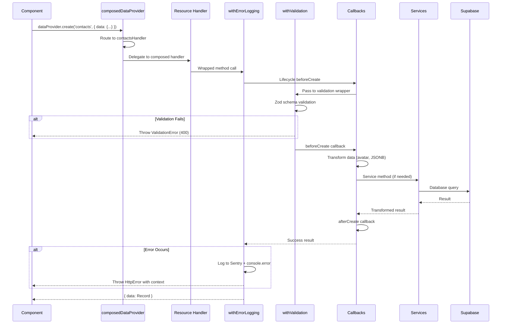

# Data Provider Architecture

> Generated: 2026-01-21
> Resources: 25 | Schema Files: 66 | Handlers: 19 | Services: 8 | Extensions: 9

## Architecture Overview

All data access flows through the **composed handler-based architecture**. This is a **hard rule** per the Engineering Constitution.

**Migration Status:** ✅ **COMPLETE** - The monolithic `unifiedDataProvider.ts` (1625 lines) has been fully replaced by a modular composed architecture.

```
┌─────────────────────────────────────────────────────────────────┐
│                     React Admin Components                       │
│              (Lists, Forms, Show views, Custom UI)              │
└────────────────────────────┬────────────────────────────────────┘
                             │
                             │ React Admin API Calls
                             │ (getList, create, update, etc.)
                             ▼
┌─────────────────────────────────────────────────────────────────┐
│                    4-Stage Provider Initialization               │
│                    (index.ts - 80 lines)                         │
├─────────────────────────────────────────────────────────────────┤
│  Stage 1: Base Provider (CRUD only)                             │
│  Stage 2: Services (breaks circular dependency)                 │
│  Stage 3: Composed Provider (handler routing)                   │
│  Stage 4: Extended Provider (custom methods)                    │
└────────────────────────────┬────────────────────────────────────┘
                             │
                             ▼
┌─────────────────────────────────────────────────────────────────┐
│              composedDataProvider.ts (260 lines)                 │
│                  Proxy Pattern Router                            │
├─────────────────────────────────────────────────────────────────┤
│  Routes to Resource Handlers (19 explicit handlers)             │
│  • contacts, organizations, opportunities, activities            │
│  • products, tasks, tags, sales, segments                       │
│  • 3 note types, 6 junction tables, notifications, timeline     │
│  • Fallback to base provider for unknown resources              │
└────────────────────────────┬────────────────────────────────────┘
                             │
                             ▼
┌─────────────────────────────────────────────────────────────────┐
│                   Resource Handler (Composed)                    │
│         handlers/*.ts (19 files, 3,430 lines total)             │
├─────────────────────────────────────────────────────────────────┤
│  Composition Order (innermost to outermost):                    │
│  baseProvider → withValidation → withLifecycleCallbacks         │
│                → withErrorLogging                                │
├─────────────────────────────────────────────────────────────────┤
│  Wrappers (4 modules):                                          │
│  • withErrorLogging - Sentry + structured logging               │
│  • withValidation - Zod at API boundary                         │
│  • withLifecycleCallbacks - Resource-specific hooks             │
│  • withSkipDelete - Soft delete enforcement                     │
├─────────────────────────────────────────────────────────────────┤
│  Callbacks (11 modules):                                        │
│  • beforeCreate, afterCreate, beforeUpdate, afterUpdate         │
│  • beforeGetList, beforeGetOne (filter/transform)               │
│  • Resource-specific: contacts, organizations, opportunities    │
│                       products, tasks, notes, etc.              │
├─────────────────────────────────────────────────────────────────┤
│  Services (8 total):                                            │
│  Provider Services (3): Validation, Transform, Storage          │
│  Business Services (5): Sales, Opportunities, Activities,       │
│                         Junctions, Segments                     │
└────────────────────────────┬────────────────────────────────────┘
                             │
                             │ Validated + Transformed Queries
                             ▼
┌─────────────────────────────────────────────────────────────────┐
│                     Supabase PostgreSQL                          │
│              (RLS Policies, Soft Deletes, JSONB)                │
└─────────────────────────────────────────────────────────────────┘
```

## Provider Files

All provider-related code lives in `src/atomic-crm/providers/supabase/` with modular structure:

### Core Provider Files

1. **index.ts** (80 lines) - Entry point with 4-stage initialization
2. **composedDataProvider.ts** (260 lines) - Handler routing proxy
3. **authProvider.ts** (192 lines) - Authentication logic
4. **dataProviderUtils.ts** (507 lines) - Shared utilities
5. **dataProviderCache.ts** (58 lines) - Caching layer
6. **filterRegistry.ts** (658 lines) - Custom filter transformations
7. **resources.ts** (172 lines) - Resource type definitions
8. **supabase.ts** (39 lines) - Supabase client initialization
9. **typeGuards.ts** (103 lines) - Type safety utilities
10. **types.ts** (28 lines) - TypeScript type definitions

### Handler Directory (`handlers/` - 19 files, 3,430 lines)

Resource-specific composed DataProviders:

- **contactsHandler.ts** (33 lines) - Contacts CRUD with soft delete + JSONB
- **organizationsHandler.ts** (33 lines) - Organizations with logo handling
- **opportunitiesHandler.ts** (242 lines) - Most complex: product sync, RPC archive
- **activitiesHandler.ts** (37 lines) - Activities with STI base table
- **productsHandler.ts** (318 lines) - Products with distributor junction sync
- **tasksHandler.ts** (244 lines) - STI wrapper over activities table
- **notesHandler.ts** (74 lines) - 3 note types with attachment handling
- **tagsHandler.ts** (36 lines) - Tags with color validation
- **salesHandler.ts** (98 lines) - Account managers via Edge Functions
- **segmentsHandler.ts** (240 lines) - Segments with get-or-create pattern
- **productDistributorsHandler.ts** (306 lines) - Product-distributor junctions
- **junctionHandlers.ts** (108 lines) - 6 junction tables with soft delete
- **notificationsHandler.ts** (33 lines) - User notifications
- **timelineHandler.ts** (192 lines) - Read-only timeline view
- **index.ts** (57 lines) - Handler exports

### Callback Directory (`callbacks/` - 11 files, 4,244 lines)

Lifecycle hooks for resource-specific transformations:

- **activitiesCallbacks.ts** (195 lines) - Activity-specific transformations
- **contactsCallbacks.ts** (275 lines) - Contact avatar, JSONB normalization
- **organizationsCallbacks.ts** (220 lines) - Organization logo handling
- **opportunitiesCallbacks.ts** (352 lines) - RPC archive, product sync
- **productsCallbacks.ts** (103 lines) - Distributor junction sync
- **tasksCallbacks.ts** (111 lines) - Task-to-activity mapping
- **notesCallbacks.ts** (50 lines) - Attachment uploads (3 note types)
- **salesCallbacks.ts** (103 lines) - Edge Function delegation
- **tagsCallbacks.ts** (35 lines) - Color validation
- **notificationsCallbacks.ts** (6 lines) - Minimal callbacks
- **commonTransforms.ts** (228 lines) - Shared transformation utilities
- **createResourceCallbacks.ts** (362 lines) - Callback factory pattern
- **index.ts** (91 lines) - Callback exports

### Service Directory (`services/` - 4 files, 992 lines)

Provider-level utility services:

- **ValidationService.ts** (359 lines) - Zod validation at API boundary
- **TransformService.ts** (354 lines) - Data transformation pipeline
- **StorageService.ts** (155 lines) - File upload/download/removal
- **index.ts** (124 lines) - Service container factory

### Wrapper Directory (`wrappers/` - 4 files, 1,721 lines including tests)

Composable cross-cutting concerns:

- **withErrorLogging.ts** (349 lines) - Structured error logging + Sentry
- **withValidation.ts** (177 lines) - Zod validation wrapper
- **withSkipDelete.ts** (88 lines) - Soft delete enforcement
- **index.ts** (28 lines) - Wrapper exports

### Extension Directory (`extensions/` - 10 files, 1,969 lines)

Custom method layer beyond React Admin's 9 core operations:

- **customMethodsExtension.ts** (178 lines) - Main extension orchestrator
- **salesExtension.ts** (78 lines) - 3 sales methods
- **opportunitiesExtension.ts** (57 lines) - 2 opportunity methods
- **activitiesExtension.ts** (46 lines) - 1 activity method
- **junctionsExtension.ts** (305 lines) - 13 junction methods
- **rpcExtension.ts** (180 lines) - Generic RPC execution
- **storageExtension.ts** (167 lines) - 4 storage methods
- **edgeFunctionsExtension.ts** (144 lines) - Edge Function invocation
- **specializedExtension.ts** (98 lines) - 1 specialized method (booth visitors)
- **types.ts** (696 lines) - Extension type definitions
- **index.ts** (20 lines) - Extension exports

## Architecture Type

✅ **Composed Handler-Based Architecture** (Migration Complete)

- **Main Router:** `composedDataProvider.ts` (260 lines)
- **Pattern:** Proxy pattern with resource-specific handler routing
- **Composition:** Base → Validation → Lifecycle → Error Logging
- **Old Monolith:** `unifiedDataProvider.ts` (1625 lines) - **DELETED**
- **Feature Flag:** `VITE_USE_COMPOSED_PROVIDER` - **REMOVED** (no longer needed)

### Migration Benefits

| Aspect | Before (Monolithic) | After (Composed) | Improvement |
|--------|---------------------|------------------|-------------|
| Main file size | 1625 lines | 260 lines | 84% reduction |
| Resource handlers | 0 (all in monolith) | 19 modular files | ✅ Separated |
| Callback logic | Embedded | 11 callback modules | ✅ Extracted |
| Service instances | 8 inline | 8 in service directory | ✅ Organized |
| Custom methods | 30 embedded | 9 extension modules | ✅ Layered |
| Testability | Difficult (1625-line file) | Easy (isolated modules) | ✅ Improved |
| Strangler Fig | In progress | Complete | ✅ Done |

## Service Instances

Eight service instances handle specialized business logic:

### Provider Services (3) - Infrastructure Support

| Service | Class | File | Purpose |
|---------|-------|------|---------|
| `validationService` | `ValidationService` | `services/ValidationService.ts:109` | Zod schema validation at API boundary |
| `transformService` | `TransformService` | `services/TransformService.ts:87` | Data transformation pipeline (JSONB, files) |
| `storageService` | `StorageService` | `services/StorageService.ts:22` | File upload/download/removal via Supabase Storage |

### Business Services (5) - Domain Logic

| Service | Class | File | Purpose |
|---------|-------|------|---------|
| `salesService` | `SalesService` | `src/services/sales.service.ts` | User management via Edge Functions |
| `opportunitiesService` | `OpportunitiesService` | `src/services/opportunities.service.ts` | Product sync, archive/unarchive workflows |
| `activitiesService` | `ActivitiesService` | `src/services/activities.service.ts` | Activity log aggregation via RPC |
| `junctionsService` | `JunctionsService` | `src/services/junctions.service.ts` | Many-to-many relationship management |
| `segmentsService` | `SegmentsService` | `src/services/segments.service.ts` | Segment get-or-create logic |

**Service Container Factory:** `services/index.ts:85-107`

## Request Lifecycle



## Operation Reference

All operations are routed through `composedDataProvider.ts:163-260` to resource-specific handlers.

### getList

- **Purpose:** Fetch paginated list of records with filtering, sorting, and computed fields
- **Router:** `composedDataProvider.ts:164-173`
- **Signature:** `getList(resource, params) → Promise<{ data: Record[], total: number }>`
- **Params:**
  - `filter`: Object with filter conditions (transformed via callbacks)
  - `pagination`: `{ page: number, perPage: number }`
  - `sort`: `{ field: string, order: 'ASC' | 'DESC' }`
- **Features:**
  - Maps to database view (e.g., `opportunities` → `opportunities_summary`)
  - Custom search filters (`q` parameter)
  - Soft delete filtering (`deleted_at IS NULL` via callbacks)
  - Organization scoping (multi-tenant via RLS)

### getOne

- **Purpose:** Fetch single record by ID with all computed fields
- **Router:** `composedDataProvider.ts:175-183`
- **Signature:** `getOne(resource, params) → Promise<{ data: Record }>`
- **Params:**
  - `id`: Record identifier (number or UUID)
- **Features:**
  - Maps to database view for computed fields
  - Soft delete filtering via callbacks
- **Error Handling:**
  - Throws if record not found
  - Throws if record soft-deleted

### getMany

- **Purpose:** Fetch multiple records by ID array (used for reference resolution)
- **Router:** `composedDataProvider.ts:185-194`
- **Signature:** `getMany(resource, params) → Promise<{ data: Record[] }>`
- **Params:**
  - `ids`: Array of record identifiers
- **Features:**
  - Uses database view to filter soft-deleted records (FIX [SF-C09])
  - Batch fetching for performance
  - Maintains order of input IDs

### getManyReference

- **Purpose:** Fetch records related to a specific parent record
- **Router:** `composedDataProvider.ts:196-216`
- **Signature:** `getManyReference(resource, params) → Promise<{ data: Record[], total: number }>`
- **Params:**
  - `target`: Foreign key field name
  - `id`: Parent record ID
  - `pagination`, `sort`, `filter`: Same as `getList`
- **Features:**
  - Automatic soft delete filtering (FIX [SF-C09])
  - Pagination support
- **Example:** Fetch all contacts for organization ID 123

### create

- **Purpose:** Create new record with Zod validation and callbacks
- **Router:** `composedDataProvider.ts:218-224`
- **Signature:** `create(resource, params) → Promise<{ data: Record }>`
- **Params:**
  - `data`: Record to create (validated against schema)
- **Lifecycle:**
  1. Router delegates to resource handler
  2. withErrorLogging wraps call
  3. beforeCreate callback (transform, compute)
  4. withValidation runs Zod schema validation
  5. Database insert
  6. afterCreate callback (side effects)
  7. Error logging on failure (Sentry + console)

### update

- **Purpose:** Update existing record with optimistic locking and validation
- **Router:** `composedDataProvider.ts:226-232`
- **Signature:** `update(resource, params) → Promise<{ data: Record }>`
- **Params:**
  - `id`: Record identifier
  - `data`: Partial update (validated)
  - `previousData`: Used for optimistic locking
- **Features:**
  - Silent update detection (throws if update doesn't persist)
  - Computed field stripping (via TransformService)
  - Virtual field handling (e.g., `products_to_sync`)
- **Handler Examples:**
  - Simple: contactsHandler.ts:30-32
  - Complex: opportunitiesHandler.ts:166-199 (product sync)

### updateMany

- **Purpose:** Bulk update multiple records with same changes
- **Router:** `composedDataProvider.ts:234-240`
- **Signature:** `updateMany(resource, params) → Promise<{ data: number[] }>`
- **Params:**
  - `ids`: Array of record identifiers
  - `data`: Partial update applied to all
- **Note:** No optimistic locking for bulk operations

### delete

- **Purpose:** Soft delete single record (sets `deleted_at` timestamp)
- **Router:** `composedDataProvider.ts:242-248`
- **Signature:** `delete(resource, params) → Promise<{ data: Record }>`
- **Params:**
  - `id`: Record identifier
  - `previousData`: Record snapshot before delete
- **Features:**
  - Idempotent (already deleted = success via withErrorLogging)
  - RPC cascade for opportunities (`archive_opportunity_with_relations`)
  - Hard delete for tags (exception via withSkipDelete)

### deleteMany

- **Purpose:** Bulk soft delete multiple records
- **Router:** `composedDataProvider.ts:250-257`
- **Signature:** `deleteMany(resource, params) → Promise<{ data: number[] }>`
- **Params:**
  - `ids`: Array of record identifiers
- **Features:**
  - Idempotent handling
  - Batch processing for performance

## Error Handling

### Pattern

**Fail-fast with structured logging** (Engineering Constitution principle)

- NO retry logic
- NO circuit breakers
- NO graceful fallbacks
- Let errors throw to surface issues early

### Sentry Integration

All errors logged to Sentry via `withErrorLogging.ts:349` with:
- Resource name
- Operation type
- User context
- Redacted data (no sensitive fields)
- Operation timing metrics

### Intentional Exceptions

Two exceptions to fail-fast rule:

1. **Idempotent Delete** (`withErrorLogging.ts:143-165`)
   - Already deleted record returns success (not error)
   - Prevents UI confusion on repeated delete attempts

2. **Silent Update Detection** (Handler-specific)
   - Throws error if update doesn't persist (prevents data loss)
   - Catches PostgreSQL silent UPDATE (0 rows affected)

## Wrappers

### withErrorLogging

- **File:** `wrappers/withErrorLogging.ts` (349 lines)
- **Purpose:** Structured error logging with Sentry integration
- **Wrapped Methods:** All 9 core operations
- **Features:**
  - Data redaction in logs (no passwords, tokens, or PII)
  - Idempotent delete handling (already deleted = success)
  - Validation error formatting (Zod → React Admin)
  - Operation timing metrics
  - Sentry breadcrumbs with context

### withValidation

- **File:** `wrappers/withValidation.ts` (177 lines)
- **Purpose:** Zod validation at API boundary (only place validation happens)
- **Wrapped Methods:** `create`, `update`, `getList`
- **Features:**
  - Delegates to ValidationService for schema validation
  - Zod to React Admin error transformation
  - Filter field cleaning (removes empty values)
  - Nested field validation
  - Coercion handling (strings → numbers/dates/booleans)

### withLifecycleCallbacks

- **File:** React Admin built-in
- **Purpose:** Resource-specific transformation hooks
- **Wrapped Methods:** All 9 core operations
- **Callbacks:**
  - `beforeCreate`, `afterCreate`
  - `beforeUpdate`, `afterUpdate`
  - `beforeGetList`, `beforeGetOne`
  - `beforeDelete`, `afterDelete`

### withSkipDelete

- **File:** `wrappers/withSkipDelete.ts` (88 lines)
- **Purpose:** Soft delete enforcement with hard delete exceptions
- **Features:**
  - Converts `delete` to `update({ deleted_at: new Date() })`
  - Allows hard delete for tags resource
  - Fail-fast if soft delete not supported

## Custom Methods

Beyond the 9 core React Admin operations, the provider exposes **30 custom methods** via the extension layer.

### Extension Architecture

**File:** `extensions/customMethodsExtension.ts:118-178`

**Pattern:** Decorator function that spreads category extensions onto composedDataProvider

**Categories:**
1. **Sales** (3 methods) → SalesService
2. **Opportunities** (2 methods) → OpportunitiesService
3. **Activities** (1 method) → ActivitiesService
4. **Junctions** (13 methods) → JunctionsService
5. **RPC** (1 method) → Direct Supabase with Zod validation
6. **Storage** (4 methods) → Direct Supabase Storage API
7. **Edge Functions** (1 method) → Direct Supabase Functions API
8. **Specialized** (1 method) → Direct Supabase RPC

### SalesService (3 methods)

**File:** `extensions/salesExtension.ts:78`

- `salesCreate(data)` - Create user via Edge Function `/users POST` (bypasses RLS)
- `salesUpdate(id, data)` - Update user via Edge Function `/users PATCH`
- `updatePassword(userId, newPassword)` - Password reset via Edge Function

**Delegation:** All methods delegate to SalesService which calls Edge Functions

### OpportunitiesService (2 methods)

**File:** `extensions/opportunitiesExtension.ts:57`

- `archiveOpportunity(id)` - Soft delete with cascade via RPC `archive_opportunity_with_relations`
- `unarchiveOpportunity(id)` - Restore deleted opportunity (sets `deleted_at = NULL`)

**Delegation:** Methods delegate to OpportunitiesService

**Note:** Product sync methods (`createWithProducts`, `updateWithProducts`) are handled INSIDE opportunitiesHandler.ts (lines 132-199), not as custom methods.

### ActivitiesService (1 method)

**File:** `extensions/activitiesExtension.ts:46`

- `getActivityLog(entityType, entityId, options)` - Fetch activity timeline via RPC

**Delegation:** Delegates to ActivitiesService which calls RPC

### JunctionsService (13 methods)

**File:** `extensions/junctionsExtension.ts:305`

**Contact-Organization Junctions (deprecated, 0 methods):**
- Removed after deprecation of `contact_organizations` junction table

**Opportunity Participant Junctions (5 methods):**
- `addOpportunityParticipant(opportunityId, userId)`
- `removeOpportunityParticipant(opportunityId, userId)`
- `getOpportunityParticipants(opportunityId)`
- `isOpportunityParticipant(opportunityId, userId)`
- `updateOpportunityParticipantRole(opportunityId, userId, role)`

**Opportunity Contact Junctions (4 methods):**
- `addOpportunityContact(opportunityId, contactId)`
- `removeOpportunityContact(opportunityId, contactId)`
- `getOpportunityContacts(opportunityId)`
- `isOpportunityContact(opportunityId, contactId)`

**Interaction Participant Junctions (4 methods):**
- `addInteractionParticipant(interactionId, contactId)`
- `removeInteractionParticipant(interactionId, contactId)`
- `getInteractionParticipants(interactionId)`
- `isInteractionParticipant(interactionId, contactId)`

**Delegation:** All methods delegate to JunctionsService

### RPC Operations (1 method)

**File:** `extensions/rpcExtension.ts:180`

- `rpc(functionName, params)` - Generic RPC execution with Zod validation

**Features:**
- Validates `functionName` against RPC_SCHEMAS registry
- Type-safe parameter validation
- Error handling with context

**Supported RPCs:**
- `sync_opportunity_with_products`
- `archive_opportunity_with_relations`
- `get_activity_log`
- Custom business logic RPCs

### Storage Operations (4 methods)

**File:** `extensions/storageExtension.ts:167`

- `upload(bucket, path, file)` - Upload file to Supabase Storage (10MB limit)
- `getPublicUrl(bucket, path)` - Get public URL for file
- `remove(bucket, paths)` - Remove files from storage
- `list(bucket, path?)` - List files in bucket

**Delegation:** Direct Supabase Storage API calls

### Edge Function Invocation (1 method)

**File:** `extensions/edgeFunctionsExtension.ts:144`

- `invoke(functionName, body)` - Invoke Edge Function with Zod validation

**Features:**
- Validates `functionName` and `body` against edgeFunctionSchemas
- Type-safe parameter validation
- Error handling with context

**Supported Edge Functions:**
- `/users POST` - Create account manager
- `/users PATCH` - Update account manager
- Custom business logic functions

### Specialized Business Operations (1 method)

**File:** `extensions/specializedExtension.ts:98`

- `createBoothVisitor(params)` - Create booth visitor via RPC

**Delegation:** Direct Supabase RPC call

## Resource Matrix

Complete reference of all 25 handled resources:

| Resource | Handler | Database Table/View | Validation Schema | Soft Delete | Notes |
|----------|---------|---------------------|-------------------|-------------|-------|
| **Core CRM** | | | | | |
| `contacts` | contactsHandler | `contacts` / `contacts_summary` | `contacts/index.ts` | ✅ | Avatar handling, JSONB arrays |
| `organizations` | organizationsHandler | `organizations` / `organizations_summary` | `organizations.ts` | ✅ | Logo handling |
| `opportunities` | opportunitiesHandler | `opportunities` / `opportunities_summary` | `opportunities/index.ts` | ✅ | Product sync, RPC archive |
| `activities` | activitiesHandler | `activities` | `activities.ts` | ✅ | STI base table (engagements, interactions, tasks) |
| `products` | productsHandler | `products` | `products.ts` | ✅ | Distributor junction sync |
| **Task Management** | | | | | |
| `tasks` | tasksHandler | `activities` (STI) | `task.ts` | ✅ | Wrapper over activities with `activity_type='task'` |
| **Notes (3 types)** | | | | | |
| `contact_notes` | notesHandler | `contact_notes` | `notes.ts` | ✅ | Attachment uploads |
| `opportunity_notes` | notesHandler | `opportunity_notes` | `notes.ts` | ✅ | Attachment uploads |
| `organization_notes` | notesHandler | `organization_notes` | `notes.ts` | ✅ | Attachment uploads |
| **Supporting Resources** | | | | | |
| `tags` | tagsHandler | `tags` | `tags.ts` | ✅ (exception: hard delete allowed) | Color validation |
| `sales` | salesHandler | `auth.users` (via RPC) | `sales.ts` | ❌ | Edge Function delegation |
| `segments` | segmentsHandler | `segments` | `segments.ts` | ✅ | Get-or-create pattern |
| **Product Relations** | | | | | |
| `product_distributors` | productDistributorsHandler | `product_distributors` | `productDistributors.ts` | ❌ | Product-distributor junctions |
| **Junction Tables (7)** | | | | | |
| `opportunity_participants` | junctionHandlers | `opportunity_participants` | N/A | ✅ | Opportunity team members |
| `opportunity_contacts` | junctionHandlers | `opportunity_contacts` | N/A | ✅ | Contacts linked to opportunity |
| `interaction_participants` | junctionHandlers | `interaction_participants` | N/A | ✅ | Contacts in interaction |
| `distributor_principal_authorizations` | junctionHandlers | `distributor_principal_authorizations` | `distributorAuthorizations.ts` | ✅ | Distributor-principal auth |
| `organization_distributors` | junctionHandlers | `organization_distributors` | `organizationDistributors.ts` | ✅ | Organization distributor links |
| `user_favorites` | junctionHandlers | `user_favorites` | `favorites.ts` | ✅ | User-specific favorites |
| `contact_preferred_principals` | (base provider) | `contact_preferred_principals` | N/A | ✅ | Contact principal preferences |
| **Views/Read-Only** | | | | | |
| `notifications` | notificationsHandler | `notifications` | N/A | ✅ | User notifications |
| `entity_timeline` | timelineHandler | `entity_timeline` (view) | N/A | N/A | Read-only activity timeline |
| **Dashboard Views (3)** | | | | | |
| `opportunities_summary` | (base provider) | `opportunities_summary` (view) | N/A | N/A | Read-only summary |
| `dashboard_principal_summary` | (base provider) | `dashboard_principal_summary` (view) | N/A | N/A | Principal-centric dashboard |
| `priority_tasks` | (base provider) | `priority_tasks` (view) | N/A | N/A | Prioritized tasks view |

**Total:** 25 resources (19 with explicit handlers, 6 with base provider fallback)

## Security Patterns

### Row Level Security (RLS)

All database operations respect RLS policies defined in Supabase migrations.

**Policy Pattern:**
```sql
-- SELECT policy - soft delete filtering + organization scoping
CREATE POLICY "Users can view their org's contacts"
  ON contacts FOR SELECT
  USING (
    deleted_at IS NULL AND
    organization_id IN (SELECT organization_id FROM user_organizations WHERE user_id = auth.uid())
  );
```

**Handler Integration:**
- Soft delete filtering handled by RLS policies
- No application-level filtering needed (trust the database)
- RLS errors surfaced as 403 Forbidden

### Soft Deletes

**Implementation:** `deleted_at` timestamp column

**Resources with Soft Delete:**
- contacts, organizations, opportunities, activities, products
- tasks (via activities table)
- segments, notes (all 3 types), tags
- Junction tables: opportunity_participants, opportunity_contacts, interaction_participants, distributor_principal_authorizations, organization_distributors, user_favorites

**Enforcement:** `withSkipDelete` wrapper (wrappers/withSkipDelete.ts:88)

**Exception:** Tags allow hard delete when explicitly requested

### Validation at Boundary

**Principle:** Zod validation at API boundary only (Engineering Constitution #5)

**Implementation:**
1. **withValidation wrapper** delegates to ValidationService
2. **ValidationService** validates against Zod schemas in `src/atomic-crm/validation/`
3. **Fail-fast:** Validation errors throw immediately (no silent failures)

**Schemas:** 66 validation files covering:
- Core entities (contacts, organizations, opportunities, activities, products)
- Notes, tags, tasks, sales
- Product distributors, organization distributors
- RPC parameters, Edge Function parameters
- Quick add forms, filters

## Debugging

### Enable Detailed Logging

```typescript
// In browser console
localStorage.setItem('DEBUG', 'true');
```

**Logged Information:**
- All DataProvider method calls (resource, params, timing)
- Validation errors with Zod path details
- RPC/Edge Function calls with parameters
- Sentry breadcrumbs for error context

### Common Issues

**1. Validation Error: "Unexpected key in object"**
- **Cause:** View-only field sent to database
- **Fix:** TransformService should strip computed fields
- **Debug:** Check `transformOpportunityForValidation` in TransformService.ts:315

**2. Soft Delete Not Working**
- **Cause:** RLS policy missing `deleted_at IS NULL` filter
- **Fix:** Update RLS policy in migration
- **Debug:** Check policy with `\d+ table_name` in psql

**3. Custom Method Not Found**
- **Cause:** TypeScript type mismatch (using DataProvider instead of ExtendedDataProvider)
- **Fix:** Import and use ExtendedDataProvider type
- **Example:**
  ```typescript
  import type { ExtendedDataProvider } from '@/atomic-crm/providers/supabase/extensions';
  const provider = dataProvider as ExtendedDataProvider;
  await provider.rpc('function_name', params);
  ```

**4. Handler Not Invoked**
- **Cause:** Resource not in HANDLED_RESOURCES list
- **Fix:** Add resource to composedDataProvider.ts:49-78
- **Debug:** Check console for "Using base provider for resource: X"

## Adding a New Resource

Follow this checklist to add a new resource with the composed handler pattern:

### 1. Create Database Schema

```sql
-- Migration: supabase/migrations/YYYYMMDDHHMMSS_create_my_resource.sql
CREATE TABLE my_resource (
  id BIGINT GENERATED ALWAYS AS IDENTITY PRIMARY KEY,
  name TEXT NOT NULL,
  organization_id BIGINT REFERENCES organizations(id),
  created_at TIMESTAMPTZ DEFAULT NOW(),
  updated_at TIMESTAMPTZ DEFAULT NOW(),
  deleted_at TIMESTAMPTZ
);

-- RLS policies
ALTER TABLE my_resource ENABLE ROW LEVEL SECURITY;

CREATE POLICY "Users can view their org's records"
  ON my_resource FOR SELECT
  USING (
    deleted_at IS NULL AND
    organization_id IN (SELECT organization_id FROM user_organizations WHERE user_id = auth.uid())
  );

-- Add soft delete support to resources.ts
```

### 2. Create Validation Schema

**File:** `src/atomic-crm/validation/myResource.ts`

```typescript
import { z } from 'zod';

export const myResourceSchema = z.strictObject({
  id: z.coerce.number().optional(),
  name: z.string().min(1).max(255),
  organization_id: z.coerce.number(),
  created_at: z.string().optional(),
  updated_at: z.string().optional(),
  deleted_at: z.string().nullable().optional(),
});

export const createMyResourceSchema = myResourceSchema.omit({
  id: true,
  created_at: true,
  updated_at: true,
  deleted_at: true
});

export const updateMyResourceSchema = createMyResourceSchema.partial();

export function validateCreateMyResource(data: unknown) {
  return createMyResourceSchema.parse(data);
}

export function validateUpdateMyResource(data: unknown) {
  return updateMyResourceSchema.parse(data);
}
```

### 3. Register Validation in ValidationService

**File:** `src/atomic-crm/providers/supabase/services/ValidationService.ts:240`

```typescript
my_resource: {
  create: async (data: unknown) => validateCreateMyResource(data),
  update: async (data: unknown) => validateUpdateMyResource(data),
},
```

### 4. Create Callbacks (if needed)

**File:** `src/atomic-crm/providers/supabase/callbacks/myResourceCallbacks.ts`

```typescript
import type { ResourceCallbacks } from 'react-admin';

export const myResourceCallbacks: ResourceCallbacks = {
  beforeCreate: async (data) => {
    // Transform data before insert
    return data;
  },
  afterCreate: async (data) => {
    // Side effects after insert
    return data;
  },
  // Add other callbacks as needed
};
```

### 5. Create Resource Handler

**File:** `src/atomic-crm/providers/supabase/handlers/myResourceHandler.ts`

```typescript
import { withLifecycleCallbacks, type DataProvider } from 'react-admin';
import { withErrorLogging, withValidation, withSkipDelete } from '../wrappers';
import { myResourceCallbacks } from '../callbacks';

/**
 * Create a fully composed DataProvider for my_resource
 *
 * Composition order (innermost to outermost):
 * baseProvider → withValidation → withLifecycleCallbacks → withErrorLogging
 *
 * @param baseProvider - The raw Supabase DataProvider
 * @returns Composed DataProvider with all my_resource-specific behavior
 */
export function createMyResourceHandler(baseProvider: DataProvider): DataProvider {
  return withErrorLogging(
    withLifecycleCallbacks(
      withSkipDelete(withValidation(baseProvider)),
      [myResourceCallbacks]
    )
  );
}
```

### 6. Register Handler in composedDataProvider

**File:** `src/atomic-crm/providers/supabase/composedDataProvider.ts`

**Step 6a:** Import the handler (line ~39):
```typescript
import { createMyResourceHandler } from './handlers/myResourceHandler';
```

**Step 6b:** Add to HANDLED_RESOURCES (line ~78):
```typescript
export const HANDLED_RESOURCES = [
  // ... existing resources
  "my_resource", // Add your resource
] as const;
```

**Step 6c:** Add to handler registry (line ~150):
```typescript
const handlers: HandlerRegistry = {
  // ... existing handlers
  my_resource: createMyResourceHandler(baseProvider),
};
```

### 7. Export Handler

**File:** `src/atomic-crm/providers/supabase/handlers/index.ts`

```typescript
export { createMyResourceHandler } from './myResourceHandler';
```

### 8. Update Resource Mapping (if needed)

**File:** `src/atomic-crm/providers/supabase/resources.ts`

```typescript
export const RESOURCE_MAPPING = {
  // ... existing mappings
  my_resource: "my_resource",
} as const;

export const SOFT_DELETE_RESOURCES = [
  // ... existing resources
  "my_resource", // If soft delete is supported
] as const;
```

### 9. Add TypeScript Types

**File:** `src/atomic-crm/types.ts`

```typescript
export interface MyResource {
  id: number;
  name: string;
  organization_id: number;
  created_at: string;
  updated_at: string;
  deleted_at: string | null;
}
```

### 10. Test the Implementation

**File:** `src/atomic-crm/providers/supabase/handlers/__tests__/myResourceHandler.test.ts`

```typescript
import { describe, it, expect, vi } from 'vitest';
import { createMyResourceHandler } from '../myResourceHandler';

describe('myResourceHandler', () => {
  it('should create record with validation', async () => {
    const mockBaseProvider = {
      create: vi.fn().mockResolvedValue({ data: { id: 1, name: 'Test' } }),
      // Mock other methods
    };

    const handler = createMyResourceHandler(mockBaseProvider as any);
    const result = await handler.create('my_resource', {
      data: { name: 'Test', organization_id: 1 },
    });

    expect(result.data).toHaveProperty('id');
    expect(mockBaseProvider.create).toHaveBeenCalled();
  });
});
```

### Verification Checklist

- [ ] Migration applied to database
- [ ] RLS policies enabled and tested
- [ ] Validation schema created with Zod
- [ ] ValidationService registered
- [ ] Callbacks created (if needed)
- [ ] Handler created and exported
- [ ] Handler registered in composedDataProvider
- [ ] Resource added to HANDLED_RESOURCES
- [ ] Resource mapping updated
- [ ] Soft delete support added (if applicable)
- [ ] TypeScript types defined
- [ ] Unit tests written
- [ ] Manual testing in UI (List, Create, Edit, Delete)

## Related Documentation

- [Engineering Constitution](../ENGINEERING_CONSTITUTION.md) - Core principles
- [Provider Rules](../../.claude/rules/PROVIDER_RULES.md) - Golden rules for data providers
- [Strangler Fig Migration](../migrations/STRANGLER_FIG_MIGRATION.md) - Migration strategy (COMPLETE)
- [Validation Patterns](./validation-architecture.md) - Zod validation architecture
- [Service Layer](./service-layer.md) - Business logic organization
- [Testing Guide](../testing/TESTING_GUIDE.md) - Testing data providers

---

**Last Updated:** 2026-01-21 | **Architecture Status:** ✅ Composed Handler-Based (Migration Complete)
