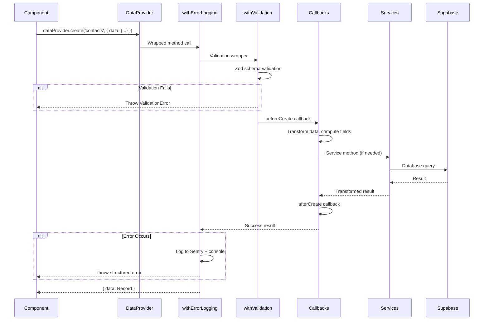

# Data Provider Architecture

> Generated: 2025-12-22
> Resources: 14 | Schema Files: 18 | Handlers: 9 | Services: 8

## Architecture Overview

All data access flows through `unifiedDataProvider.ts`. This is a **hard rule** per the Engineering Constitution.

```
┌─────────────────────────────────────────────────────────────────┐
│                     React Admin Components                       │
│              (Lists, Forms, Show views, Custom UI)              │
└────────────────────────────┬────────────────────────────────────┘
                             │
                             │ React Admin API Calls
                             │ (getList, create, update, etc.)
                             ▼
┌─────────────────────────────────────────────────────────────────┐
│                    unifiedDataProvider.ts                        │
│                      (1625 lines - Single Entry Point)           │
├─────────────────────────────────────────────────────────────────┤
│  ┌──────────────────┐  ┌──────────────────┐  ┌──────────────┐  │
│  │ Error Wrapper    │  │ Validation       │  │ Callbacks    │  │
│  │ withErrorLogging │→ │ withValidation   │→ │ beforeGet*   │  │
│  │ (Sentry + logs)  │  │ (Zod at boundary)│  │ afterCreate  │  │
│  └──────────────────┘  └──────────────────┘  └──────────────┘  │
├─────────────────────────────────────────────────────────────────┤
│  Services:                                                       │
│  • ValidationService  • StorageService  • TransformService      │
│  • SalesService       • OpportunitiesService                    │
│  • ActivitiesService  • JunctionsService  • SegmentsService     │
└────────────────────────────┬────────────────────────────────────┘
                             │
                             │ Validated + Transformed Queries
                             ▼
┌─────────────────────────────────────────────────────────────────┐
│                     Supabase PostgreSQL                          │
│              (RLS Policies, Soft Deletes, JSONB)                │
└─────────────────────────────────────────────────────────────────┘
```

## Provider Files

All provider-related code lives in `src/atomic-crm/providers/supabase/`:

1. **unifiedDataProvider.ts** - Main monolithic provider (1625 lines)
2. **composedDataProvider.ts** - Feature flag alternative (174 lines)
3. **authProvider.ts** - Authentication logic
4. **dataProviderUtils.ts** - Shared utilities
5. **dataProviderCache.ts** - Caching layer
6. **filterRegistry.ts** - Custom filter transformations
7. **resources.ts** - Resource type definitions
8. **index.ts** - Public exports
9. **supabase.ts** - Supabase client initialization
10. **types.ts** - TypeScript type definitions

## Architecture Type

- **Main Provider:** `unifiedDataProvider.ts` (1625 lines)
- **Pattern:** Monolithic with service delegation
- **Feature Flag Alternative:** `VITE_USE_COMPOSED_PROVIDER` → `composedDataProvider.ts`
  - Handler-based composition pattern for gradual migration
  - Allows incremental refactoring without breaking changes

## Service Instances

Eight service instances handle specialized business logic:

| Service | Class | Line | Purpose |
|---------|-------|------|---------|
| `storageService` | `StorageService` | 151 | File upload/download/removal |
| `transformService` | `TransformService` | 152 | Data transformation pipeline |
| `validationService` | `ValidationService` | 153 | Zod schema validation |
| `salesService` | `SalesService` | 170 | User management via Edge Functions |
| `opportunitiesService` | `OpportunitiesService` | 171 | Opportunity-specific operations |
| `activitiesService` | `ActivitiesService` | 172 | Activity logging and retrieval |
| `junctionsService` | `JunctionsService` | 173 | Many-to-many relationship management |
| `segmentsService` | `SegmentsService` | 174 | Segment get-or-create logic |

## Request Lifecycle



## Operation Reference

All operations are defined in `/home/krwhynot/projects/crispy-crm/src/atomic-crm/providers/supabase/unifiedDataProvider.ts`.

### getList

- **Purpose:** Fetch paginated list of records with filtering, sorting, and computed fields
- **Location:** `unifiedDataProvider.ts:465-535`
- **Signature:** `getList(resource, params) → Promise<{ data: Record[], total: number }>`
- **Params:**
  - `filter`: Object with filter conditions (transformed via callbacks)
  - `pagination`: `{ page: number, perPage: number }`
  - `sort`: `{ field: string, order: 'ASC' | 'DESC' }`
- **Features:**
  - Custom search filters (`q` parameter)
  - Computed field selection
  - Soft delete filtering (`deleted_at IS NULL`)
  - Organization scoping (multi-tenant)

### getOne

- **Purpose:** Fetch single record by ID with all computed fields
- **Location:** `unifiedDataProvider.ts:537-601`
- **Signature:** `getOne(resource, params) → Promise<{ data: Record }>`
- **Params:**
  - `id`: Record identifier (number or UUID)
- **Error Handling:**
  - Throws if record not found
  - Throws if record soft-deleted

### getMany

- **Purpose:** Fetch multiple records by ID array (used for reference resolution)
- **Location:** `unifiedDataProvider.ts:603-628`
- **Signature:** `getMany(resource, params) → Promise<{ data: Record[] }>`
- **Params:**
  - `ids`: Array of record identifiers
- **Features:**
  - Batch fetching for performance
  - Maintains order of input IDs

### getManyReference

- **Purpose:** Fetch records related to a specific parent record
- **Location:** `unifiedDataProvider.ts:630-660`
- **Signature:** `getManyReference(resource, params) → Promise<{ data: Record[], total: number }>`
- **Params:**
  - `target`: Foreign key field name
  - `id`: Parent record ID
  - `pagination`, `sort`, `filter`: Same as `getList`
- **Example:** Fetch all contacts for organization ID 123

### create

- **Purpose:** Create new record with Zod validation and callbacks
- **Location:** `unifiedDataProvider.ts:662-760`
- **Signature:** `create(resource, params) → Promise<{ data: Record }>`
- **Params:**
  - `data`: Record to create (validated against schema)
- **Lifecycle:**
  1. Zod validation (`withValidation`)
  2. `beforeCreate` callback (transform, compute)
  3. Database insert
  4. `afterCreate` callback (side effects)
  5. Error logging on failure

### update

- **Purpose:** Update existing record with optimistic locking and validation
- **Location:** `unifiedDataProvider.ts:762-933`
- **Signature:** `update(resource, params) → Promise<{ data: Record }>`
- **Params:**
  - `id`: Record identifier
  - `data`: Partial update (validated)
  - `previousData`: Used for optimistic locking
- **Features:**
  - Silent update detection (throws if update doesn't persist)
  - Computed field stripping
  - Virtual field handling

### updateMany

- **Purpose:** Bulk update multiple records with same changes
- **Location:** `unifiedDataProvider.ts:935-956`
- **Signature:** `updateMany(resource, params) → Promise<{ data: number[] }>`
- **Params:**
  - `ids`: Array of record identifiers
  - `data`: Partial update applied to all
- **Note:** No optimistic locking for bulk operations

### delete

- **Purpose:** Soft delete single record (sets `deleted_at` timestamp)
- **Location:** `unifiedDataProvider.ts:958-1015`
- **Signature:** `delete(resource, params) → Promise<{ data: Record }>`
- **Params:**
  - `id`: Record identifier
  - `previousData`: Record snapshot before delete
- **Features:**
  - Idempotent (already deleted = success)
  - RPC cascade for opportunities (`archive_opportunity_with_relations`)

### deleteMany

- **Purpose:** Bulk soft delete multiple records
- **Location:** `unifiedDataProvider.ts:1017-1063`
- **Signature:** `deleteMany(resource, params) → Promise<{ data: number[] }>`
- **Params:**
  - `ids`: Array of record identifiers
- **Features:**
  - Idempotent handling
  - Batch processing for performance

## Error Handling

### Pattern

**Fail-fast with structured logging** (pre-launch philosophy)

- NO retry logic
- NO circuit breakers
- NO graceful fallbacks
- Let errors throw to surface issues early

### Sentry Integration

All errors logged to Sentry with:
- Resource name
- Operation type
- User context
- Redacted data (no sensitive fields)

### Intentional Exceptions

Two exceptions to fail-fast rule:

1. **Idempotent Delete:** Already deleted record returns success (not error)
2. **Silent Update Detection:** Throws error if update doesn't persist (prevents data loss)

## Wrappers

### withErrorLogging

- **File:** `/home/krwhynot/projects/crispy-crm/src/atomic-crm/providers/supabase/wrappers/withErrorLogging.ts`
- **Purpose:** Structured error logging with Sentry integration
- **Wrapped Methods:** All 9 core operations
- **Features:**
  - Data redaction in logs (no passwords, tokens, or PII)
  - Idempotent delete handling (already deleted = success)
  - Validation error formatting (Zod → React Admin)
  - Operation timing metrics

### withValidation

- **File:** `/home/krwhynot/projects/crispy-crm/src/atomic-crm/providers/supabase/wrappers/withValidation.ts`
- **Purpose:** Zod validation at API boundary (only place validation happens)
- **Wrapped Methods:** `create`, `update`, `getList`
- **Features:**
  - Zod to React Admin error transformation
  - Filter field cleaning (removes empty values)
  - Nested field validation
  - Coercion handling (strings → numbers/dates/booleans)

## Custom Methods

Beyond the 9 core React Admin operations, the provider exposes **30 custom methods**:

### SalesService (3 methods)

- `salesCreate(data)` - Create user via Edge Function (bypasses RLS)
- `salesUpdate(id, data)` - Update user via Edge Function
- `updatePassword(userId, newPassword)` - Password reset

### OpportunitiesService (4 methods)

- `archiveOpportunity(id)` - Soft delete with cascade (RPC)
- `unarchiveOpportunity(id)` - Restore deleted opportunity
- `createWithProducts(data)` - Create opportunity + link products
- `updateWithProducts(id, data, productIds)` - Update with product sync

### ActivitiesService (1 method)

- `getActivityLog(params)` - Unified activity timeline across resources

### JunctionsService (9 methods)

- `getContactOrganizations(contactId)` - List contact's organizations
- `addContactToOrganization(contactId, orgId, isPrimary)` - Junction create
- `removeContactFromOrganization(contactId, orgId)` - Junction delete
- `setPrimaryOrganization(contactId, orgId)` - Update primary flag
- `getOpportunityParticipants(opportunityId)` - List opportunity team
- `addOpportunityParticipant(opportunityId, salesId, role)` - Add team member
- `removeOpportunityParticipant(opportunityId, salesId)` - Remove team member
- `getOpportunityContacts(opportunityId)` - List related contacts
- `addOpportunityContact(opportunityId, contactId)` - Link contact
- `removeOpportunityContact(opportunityId, contactId)` - Unlink contact

### SegmentsService (1 method)

- `getOrCreateSegment(name, category)` - Idempotent segment creation via RPC

## Adding a New Resource

Follow this 5-step process to add a new resource to the data provider:

### Step 1: Create Zod Schema

Create `/home/krwhynot/projects/crispy-crm/src/atomic-crm/validation/{resource}.ts`:

```typescript
import { z } from 'zod';

export const myResourceSchema = z.strictObject({
  id: z.number().int().positive().optional(),
  name: z.string().min(1).max(255),
  description: z.string().max(1000).nullable().optional(),
  created_at: z.coerce.date().optional(),
  updated_at: z.coerce.date().optional(),
  deleted_at: z.coerce.date().nullable().optional(),
  organization_id: z.number().int().positive(),
});

export type MyResource = z.infer<typeof myResourceSchema>;
export type MyResourceInput = z.input<typeof myResourceSchema>;

export const createMyResourceSchema = myResourceSchema.omit({
  id: true,
  created_at: true,
  updated_at: true,
  deleted_at: true,
});

export const updateMyResourceSchema = myResourceSchema.partial().required({
  id: true,
  organization_id: true,
});
```

**Key Requirements:**
- Use `z.strictObject()` (prevents mass assignment attacks)
- All strings must have `.max()` limits (DoS prevention)
- Use `z.coerce` for dates, numbers, booleans (form compatibility)
- Use `z.enum()` for constrained values (allowlist pattern)
- Export both `Input` and output types

### Step 2: Create Callbacks

Create `/home/krwhynot/projects/crispy-crm/src/atomic-crm/providers/supabase/callbacks/{resource}Callbacks.ts`:

```typescript
import { createResourceCallbacks } from '../utils/createResourceCallbacks';

const COMPUTED_FIELDS = [
  'related_entity_name',
  'computed_total',
];

export const myResourceCallbacks = createResourceCallbacks({
  resource: 'my_resources',
  tableName: 'my_resources',
  computedFields: COMPUTED_FIELDS,
});
```

**For custom logic:**

```typescript
import type { ResourceCallbacks } from '../types';

export const myResourceCallbacks: ResourceCallbacks = {
  beforeGetList: async (params) => {
    // Transform filters
    if (params.filter?.q) {
      params.filter.name = { $ilike: `%${params.filter.q}%` };
      delete params.filter.q;
    }
    return params;
  },

  beforeCreate: async (data) => {
    // Compute fields
    data.slug = data.name.toLowerCase().replace(/\s+/g, '-');
    return data;
  },

  afterCreate: async (record) => {
    // Side effects (e.g., create related records)
    await createDefaultSettings(record.id);
    return record;
  },
};
```

### Step 3: Create Handler

Create `/home/krwhynot/projects/crispy-crm/src/atomic-crm/providers/supabase/handlers/{resource}Handler.ts`:

```typescript
import { myResourceCallbacks } from '../callbacks/myResourceCallbacks';
import type { ResourceHandler } from '../types';

export const myResourceHandler: ResourceHandler = {
  resource: 'my_resources',
  callbacks: myResourceCallbacks,

  // Optional: Override specific operations
  getList: async (params) => {
    // Custom implementation if needed
  },
};
```

### Step 4: Wire to unifiedDataProvider

In `/home/krwhynot/projects/crispy-crm/src/atomic-crm/providers/supabase/unifiedDataProvider.ts`:

```typescript
import { myResourceSchema, createMyResourceSchema, updateMyResourceSchema } from '../../validation/myResource';
import { myResourceCallbacks } from './callbacks/myResourceCallbacks';

// Add to validation registry (around line 140)
validationService.register('my_resources', {
  schema: myResourceSchema,
  createSchema: createMyResourceSchema,
  updateSchema: updateMyResourceSchema,
});

// Add to transform registry (around line 160)
transformService.register('my_resources', (data) => {
  // Custom transforms if needed
  return data;
});

// Add callbacks to switch statement in each operation
// Example in getList (line 465+):
case 'my_resources':
  if (myResourceCallbacks.beforeGetList) {
    params = await myResourceCallbacks.beforeGetList(params);
  }
  break;
```

### Step 5: Export from Index

In `/home/krwhynot/projects/crispy-crm/src/atomic-crm/providers/supabase/index.ts`:

```typescript
export { myResourceHandler } from './handlers/myResourceHandler';
export type { MyResource, MyResourceInput } from '../../validation/myResource';
```

### Verification Checklist

After adding a new resource, verify:

- [ ] Schema uses `z.strictObject()` (not `z.object()`)
- [ ] All strings have `.max()` limits
- [ ] Computed fields listed in callbacks
- [ ] Validation registered in `unifiedDataProvider.ts`
- [ ] All 9 operations handle the new resource (if applicable)
- [ ] TypeScript types exported from index
- [ ] No direct Supabase imports in UI components
- [ ] Soft delete handling (`deleted_at` field)
- [ ] Organization scoping (if multi-tenant)

## Resource Matrix

Complete reference of all 14 resources:

| Resource | Table | Handler | Schema | Operations | Special Handling |
|----------|-------|---------|--------|------------|------------------|
| `activities` | `activities` | `activitiesHandler.ts` | `validation/activities.ts` | All | Soft delete, computed fields |
| `contacts` | `contacts` | `contactsHandler.ts` | `validation/contacts.ts` | All | Custom search (ILIKE), JSONB normalization |
| `opportunities` | `opportunities` | `opportunitiesHandler.ts` | `validation/opportunities.ts` | All | RPC cascading soft delete, product sync |
| `organizations` | `organizations` | `organizationsHandler.ts` | `validation/organizations.ts` | All | Custom search (ILIKE), logo storage |
| `products` | `products` | `productsHandler.ts` | `validation/products.ts` | All | Distributor junction management |
| `product_distributors` | `product_distributors` | Inline | `validation/productDistributors.ts` | All | Composite key (hard delete) |
| `sales` | `sales` | `salesHandler.ts` | `validation/sales.ts` | All | Edge Function writes (RLS bypass) |
| `tags` | `tags` | `tagsHandler.ts` | `validation/tags.ts` | All | Soft delete |
| `tasks` | `tasks` | `tasksHandler.ts` | `validation/task.ts` | All | Completion timestamp auto, snooze normalization |
| `contact_notes` | `contact_notes` | `notesHandler.ts` | `validation/notes.ts` | All | Attachment storage |
| `opportunity_notes` | `opportunity_notes` | `notesHandler.ts` | `validation/notes.ts` | All | Attachment storage |
| `organization_notes` | `organization_notes` | `notesHandler.ts` | `validation/notes.ts` | All | Attachment storage |
| `segments` | `segments` | Inline | `validation/segments.ts` | All | Get-or-create via RPC |
| `distributor_authorizations` | `distributor_authorizations` | Inline | `validation/distributorAuthorizations.ts` | All | Soft delete |

## Security Patterns

### strictObject Usage

**All schemas use `z.strictObject()`** to prevent mass assignment attacks.

**Exceptions** (2 only):
1. `importContactSchema` - CSV import flexibility requires unknown keys
2. `specialPricingSchema` - Flexible JSONB pricing data (intentional)

### Coercion

**Consistent use of `z.coerce`** for all non-string form inputs:
- `z.coerce.date()` - Date pickers
- `z.coerce.number()` - Number inputs
- `z.coerce.boolean()` - Checkboxes

### Length Limits

**All string fields have `.max()` constraints** to prevent DoS attacks:

```typescript
name: z.string().min(1).max(255),
description: z.string().max(1000),
notes: z.string().max(5000),
```

Limits defined in `/home/krwhynot/projects/crispy-crm/src/atomic-crm/validation/constants.ts`.

### Allowlist Patterns

**Always use `z.enum()` for constrained values** (never denylist):

```typescript
// CORRECT
priority: z.enum(['low', 'medium', 'high', 'urgent'])

// WRONG
priority: z.string().refine(val => val !== 'invalid')
```

## Architecture Patterns

Six core patterns enforced throughout the provider:

1. **Composed Data Provider** - Base provider → wrappers → callbacks → custom methods
2. **Single Entry Point** - All DB access through `unifiedDataProvider.ts` (Engineering Constitution)
3. **Fail-Fast Error Handling** - No retry logic, no fallbacks (pre-launch velocity)
4. **Zod Validation at API Boundary Only** - Forms submit unvalidated data, provider validates
5. **Service Delegation for Business Logic** - Complex operations delegated to services
6. **Factory Pattern for Handler/Callback Creation** - DRY resource registration

## Performance Considerations

### Computed Fields

Computed fields are **selected at query time** via database views/functions:

```sql
-- Example: contacts view with computed fields
SELECT
  c.*,
  CONCAT(c.first_name, ' ', c.last_name) AS full_name,
  o.name AS organization_name,
  COUNT(opp.id) AS total_opportunities
FROM contacts c
LEFT JOIN organizations o ON c.primary_organization_id = o.id
LEFT JOIN opportunities opp ON opp.customer_organization_id = o.id
GROUP BY c.id, o.name
```

This avoids N+1 queries and keeps React Admin responsive.

### Batch Operations

Use `getMany` instead of multiple `getOne` calls:

```typescript
// SLOW (3 queries)
const contact1 = await dataProvider.getOne('contacts', { id: 1 });
const contact2 = await dataProvider.getOne('contacts', { id: 2 });
const contact3 = await dataProvider.getOne('contacts', { id: 3 });

// FAST (1 query)
const contacts = await dataProvider.getMany('contacts', { ids: [1, 2, 3] });
```

### Caching

`dataProviderCache.ts` provides optional caching layer (currently disabled for pre-launch development).

## Debugging

### Enable Debug Logging

Set environment variable:

```bash
VITE_DEBUG_DATA_PROVIDER=true
```

This logs:
- All operation calls with params
- Validation results
- Query timing
- Sentry events (without sending)

### Common Issues

**Validation Errors:**
- Check schema in `validation/` directory
- Ensure form fields use `z.coerce` for non-strings
- Verify `.max()` limits not exceeded

**Computed Field Errors:**
- Ensure field listed in `COMPUTED_FIELDS` array
- Check database view includes the field
- Strip computed fields before writes

**RLS Policy Errors:**
- Verify `organization_id` set correctly
- Check user role permissions in Supabase
- For writes, consider Edge Function bypass (like `sales` resource)

## Related Documentation

- [Zod Validation Schemas](/docs/validation/schemas.md)
- [Supabase RLS Policies](/docs/database/rls-policies.md)
- [React Admin Data Provider API](https://marmelab.com/react-admin/DataProviderWriting.html)
- [Engineering Constitution](/CLAUDE.md#engineering-principles)

---

**Last Updated:** 2025-12-22
**Maintainer:** Crispy CRM Team
**Source:** Generated from `/docs/_state/data-provider-discovery.json`
