# Crispy CRM Database Schema

**Generated:** 2026-02-09T09:04:04.273Z
**Database:** PostgreSQL 17 (Supabase)
**Schema:** public

---

## Executive Summary

### Database Overview
- **Total Tables:** 28
- **Total Relationships:** 78
- **Total Indexes:** 192
- **Total RLS Policies:** 107

### Data Quality
- **Orphaned Tables:** 6
- **Tables with Orphaned Records:** 2
- **Empty Tables:** 17
- **Total Orphaned Records:** 1195

### UI Coverage
- **Handled Resources:** 21
- **Resources with UI:** 13
- **Total Components:** 75
- **Unmapped Tables:** 20
- **Total Database Tables:** 28

### Key Findings

1. **Data Integrity Warning:** 1195 orphaned records found across 2 tables - review cascade policies
2. **Active Database:** Core tables have data: activities (503), contacts (2007), opportunities (372), organizations (2369)
3. **UI Coverage:** 13 resources with UI components (46% of 28 tables)
4. **Security Posture:** 107 RLS policies across 28 tables (avg 3.8 per table)
5. **Orphaned Tables:** `migration_history`, `notifications`, `tags`, `task_id_mapping`, `test_user_metadata`, `user_favorites` have no FK relationships - review for integration opportunities

---

## Orphaned Data Analysis

### Tables Without Relationships
- `migration_history`
- `notifications`
- `tags`
- `task_id_mapping`
- `test_user_metadata`
- `user_favorites`

### Tables with Orphaned Records
- **`activities`.opportunity_id** → 369 orphaned records (soft_deleted_parent)
- **`activities`.organization_id** → 308 orphaned records (soft_deleted_parent)
- **`opportunity_contacts`.contact_id** → 149 orphaned records (soft_deleted_parent)
- **`opportunity_contacts`.opportunity_id** → 369 orphaned records (soft_deleted_parent)

### Empty Tables
- `contact_notes`
- `dashboard_snapshots`
- `distributor_principal_authorizations`
- `interaction_participants`
- `migration_history`
- `notifications`
- `opportunity_notes`
- `opportunity_participants`
- `opportunity_products`
- `organization_notes`
- `product_distributor_authorizations`
- `product_distributors`
- `products`
- `tags`
- `test_user_metadata`
- `tutorial_progress`
- `user_favorites`

**Recommended Actions:**

1. **Orphaned Tables:** Review the `migration_history, notifications, tags, task_id_mapping, test_user_metadata, user_favorites` table(s) for potential integration with other entities
2. **Empty Tables:** Seed with test data or production migration data
3. **Data Integrity:** Address 1195 orphaned records - review soft-delete cascade behavior

---

## Entity Relationship Diagram

```mermaid
erDiagram
    activities ||--o{ activities : "related_task_id"
    activities ||--o{ interaction_participants : "activity_id"
    activities ||--o{ opportunities : "founding_interaction_id"
    activities ||--o{ tutorial_progress : "created_activity_id"
    contacts ||--o{ activities : "contact_id"
    contacts ||--o{ contact_notes : "contact_id"
    contacts ||--o{ contacts : "manager_id"
    contacts ||--o{ interaction_participants : "contact_id"
    contacts ||--o{ opportunities : "primary_contact_id"
    contacts ||--o{ opportunity_contacts : "contact_id"
    contacts ||--o{ tasks_deprecated : "contact_id"
    contacts ||--o{ tutorial_progress : "created_contact_id"
    opportunities ||--o{ activities : "opportunity_id"
    opportunities ||--o{ opportunities : "related_opportunity_id"
    opportunities ||--o{ opportunity_contacts : "opportunity_id"
    opportunities ||--o{ opportunity_notes : "opportunity_id"
    opportunities ||--o{ opportunity_participants : "opportunity_id"
    opportunities ||--o{ opportunity_products : "opportunity_id"
    opportunities ||--o{ tasks_deprecated : "opportunity_id"
    opportunities ||--o{ tutorial_progress : "created_opportunity_id"
    organizations ||--o{ activities : "organization_id"
    organizations ||--o{ contacts : "organization_id"
    organizations ||--o{ distributor_principal_authorizations : "distributor_id"
    organizations ||--o{ distributor_principal_authorizations : "principal_id"
    organizations ||--o{ opportunities : "customer_organization_id"
    organizations ||--o{ opportunities : "distributor_organization_id"
    organizations ||--o{ opportunities : "principal_organization_id"
    organizations ||--o{ organization_distributors : "distributor_id"
    organizations ||--o{ organization_distributors : "organization_id"
    organizations ||--o{ organization_notes : "organization_id"
    organizations ||--o{ organizations : "parent_organization_id"
    organizations ||--o{ product_distributor_authorizations : "distributor_id"
    organizations ||--o{ product_distributors : "distributor_id"
    organizations ||--o{ tasks_deprecated : "organization_id"
    organizations ||--o{ tutorial_progress : "created_organization_id"
    products ||--o{ opportunity_products : "product_id_reference"
    products ||--o{ product_distributor_authorizations : "product_id"
    products ||--o{ product_distributors : "product_id"
    sales ||--o{ activities : "created_by"
    sales ||--o{ activities : "sales_id"
    sales ||--o{ activities : "updated_by"
    sales ||--o{ audit_trail : "changed_by"
    sales ||--o{ contact_notes : "created_by"
    sales ||--o{ contact_notes : "sales_id"
    sales ||--o{ contact_notes : "updated_by"
    sales ||--o{ contacts : "created_by"
    sales ||--o{ contacts : "sales_id"
    sales ||--o{ contacts : "updated_by"
    sales ||--o{ dashboard_snapshots : "sales_id"
    sales ||--o{ distributor_principal_authorizations : "created_by"
    sales ||--o{ interaction_participants : "created_by"
    sales ||--o{ opportunities : "account_manager_id"
    sales ||--o{ opportunities : "created_by"
    sales ||--o{ opportunities : "opportunity_owner_id"
    sales ||--o{ opportunities : "updated_by"
    sales ||--o{ opportunity_notes : "created_by"
    sales ||--o{ opportunity_notes : "sales_id"
    sales ||--o{ opportunity_notes : "updated_by"
    sales ||--o{ opportunity_participants : "created_by"
    sales ||--o{ opportunity_products : "created_by"
    sales ||--o{ organization_distributors : "created_by"
    sales ||--o{ organization_notes : "sales_id"
    sales ||--o{ organization_notes : "updated_by"
    sales ||--o{ organizations : "created_by"
    sales ||--o{ organizations : "sales_id"
    sales ||--o{ organizations : "updated_by"
    sales ||--o{ product_distributor_authorizations : "created_by"
    sales ||--o{ product_distributors : "created_by"
    sales ||--o{ product_distributors : "updated_by"
    sales ||--o{ products : "created_by"
    sales ||--o{ products : "updated_by"
    sales ||--o{ tasks_deprecated : "created_by"
    sales ||--o{ tasks_deprecated : "sales_id"
    sales ||--o{ tutorial_progress : "sales_id"
    segments ||--o{ organizations : "playbook_category_id"
    segments ||--o{ organizations : "segment_id"
    segments ||--o{ segments : "parent_id"
    tasks_deprecated ||--o{ tutorial_progress : "created_task_id"
```



**Diagram Legend:**
- `||--o{` One-to-many relationship
- Tables with `deleted_at` column support soft-delete (23 of 28 tables)

---

## UI Component Mapping


### `contacts` → ContactsResource

**Database Table:** `contacts` (2007 rows)
**Summary View:** `contacts_summary`
**Feature Directory:** `src/atomic-crm/contacts`
**Resource Config:** {
  "recordRepresentation": "contactRecordRepresentation"
}

**Components:**

| File | Type | Features |
|------|------|----------|
| ContactCreate.tsx | create | Basic CRUD |
| ContactEdit.tsx | edit | Basic CRUD |
| ContactList.tsx | list | PremiumDatagrid, Filters, BulkActions, ExportButton |
| ContactListFilter.tsx | list | Filters |
| ContactShow.tsx | show | ReferenceManyField, ReferenceField |
| ContactSlideOver.tsx | slideOver | Basic CRUD |
| QuickCreateContactPopover.tsx | create | Basic CRUD |
| TagsList.tsx | list | Filters |
| TagsListEdit.tsx | list | Basic CRUD |

**Rendered Relationships:**

- **tasks** (`ReferenceManyField`) → `tasks`
- **organizations** (`ReferenceField`) → `organizations`
- **sales** (`ReferenceField`) → `sales`
- **contact_notes** (`ReferenceManyField`) → `contact_notes`
- **tags** (`ReferenceField`) → `tags`
- **contacts** (`ReferenceManyField`) → `contacts`

---

### `organizations` → OrganizationsResource

**Database Table:** `organizations` (2369 rows)
**Summary View:** `organizations_summary`
**Feature Directory:** `src/atomic-crm/organizations`
**Resource Config:** {
  "recordRepresentation": "organizationRecordRepresentation"
}

**Components:**

| File | Type | Features |
|------|------|----------|
| ContactListCells.tsx | list | Basic CRUD |
| OrganizationCreate.tsx | create | Basic CRUD |
| OrganizationCreateFormFooter.tsx | create | Basic CRUD |
| OrganizationEdit.tsx | edit | Basic CRUD |
| OrganizationList.tsx | list | PremiumDatagrid, Filters, BulkActions, ExportButton |
| OrganizationListFilter.tsx | list | Filters |
| OrganizationShow.tsx | show | ReferenceManyField |
| OrganizationSlideOver.tsx | slideOver | Basic CRUD |
| QuickCreatePopover.tsx | create | Basic CRUD |

**Rendered Relationships:**

- **segments** (`ReferenceField`) → `segments`
- **sales** (`ReferenceField`) → `sales`
- **contacts_summary** (`ReferenceManyField`) → `contacts_summary`
- **opportunities** (`ReferenceManyField`) → `opportunities`

---

### `opportunities` → OpportunitiesResource

**Database Table:** `opportunities` (372 rows)
**Summary View:** `opportunities_summary`
**Feature Directory:** `src/atomic-crm/opportunities`
**Resource Config:** {
  "recordRepresentation": "opportunityRecordRepresentation"
}

**Components:**

| File | Type | Features |
|------|------|----------|
| ActivitiesList.tsx | list | Basic CRUD |
| CampaignGroupedList.tsx | list | Basic CRUD |
| ContactList.tsx | list | Basic CRUD |
| OpportunityArchivedList.tsx | list | Basic CRUD |
| OpportunityCreate.tsx | create | Basic CRUD |
| OpportunityCreateFormFooter.tsx | create | Basic CRUD |
| OpportunityCreateSaveButton.tsx | create | Basic CRUD |
| OpportunityEdit.tsx | edit | DeleteButton, ReferenceField |
| OpportunityList.tsx | list | Filters, ExportButton |
| OpportunityListFilter.tsx | list | Filters |
| OpportunityListTutorial.tsx | list | Filters |
| OpportunityRowListView.tsx | list | BulkActions, EditButton, ReferenceField |
| OpportunityShow.tsx | show | Filters, ReferenceManyField, ReferenceField |
| OpportunitySlideOver.tsx | slideOver | Basic CRUD |
| PrincipalGroupedList.tsx | list | Basic CRUD |

**Rendered Relationships:**

- **opportunity_notes** (`ReferenceManyField`) → `opportunity_notes`
- **tasks** (`ReferenceManyField`) → `tasks`
- **sales** (`ReferenceField`) → `sales`
- **organizations** (`ReferenceField`) → `organizations`

---

### `activities` → ActivitiesResource

**Database Table:** `activities` (503 rows)
**Summary View:** `activities_summary`
**Feature Directory:** `src/atomic-crm/activities`
**Resource Config:** {
  "recordRepresentation": "activityRecordRepresentation"
}

**Components:**

| File | Type | Features |
|------|------|----------|
| ActivityEdit.tsx | edit | Basic CRUD |
| ActivityList.tsx | list | PremiumDatagrid, Filters, BulkActions, ExportButton, ReferenceField |
| ActivityListFilter.tsx | list | Filters |
| ActivityShow.tsx | show | ReferenceField |
| ActivitySlideOver.tsx | slideOver | Basic CRUD |

**Rendered Relationships:**

- **organizations** (`ReferenceField`) → `organizations`
- **opportunities** (`ReferenceField`) → `opportunities`
- **sales** (`ReferenceField`) → `sales`
- **contacts_summary** (`ReferenceField`) → `contacts_summary`

---

### `products` → ProductsResource

**Database Table:** `products` (0 rows)
**Summary View:** `products_summary`
**Feature Directory:** `src/atomic-crm/products`
**Resource Config:** {
  "recordRepresentation": "productRecordRepresentation"
}

**Components:**

| File | Type | Features |
|------|------|----------|
| ProductCreate.tsx | create | Basic CRUD |
| ProductEdit.tsx | edit | DeleteButton |
| ProductList.tsx | list | PremiumDatagrid, Filters, BulkActions, ExportButton |
| ProductListContent.tsx | list | Basic CRUD |
| ProductListFilter.tsx | list | Filters |
| ProductShow.tsx | show | ReferenceField |
| ProductSlideOver.tsx | slideOver | Basic CRUD |

**Rendered Relationships:**

- **organizations** (`ReferenceField`) → `organizations`
- **opportunities** (`ReferenceField`) → `opportunities`

---

### `tasks` → TasksResource

**Database Table:** `tasks_deprecated` (6 rows)
**Summary View:** `tasks_summary`
**Feature Directory:** `src/atomic-crm/tasks`
**Resource Config:** {
  "recordRepresentation": "taskRecordRepresentation"
}

**Components:**

| File | Type | Features |
|------|------|----------|
| TaskCreate.tsx | create | Basic CRUD |
| TaskEdit.tsx | edit | Basic CRUD |
| TaskList.tsx | list | PremiumDatagrid, Filters, BulkActions, ExportButton, ReferenceField |
| TaskListFilter.tsx | list | Filters |
| TaskShow.tsx | show | ReferenceField |
| TaskSlideOver.tsx | slideOver | Basic CRUD |
| TaskSlideOverDetailsTab.tsx | slideOver | ReferenceField |

**Rendered Relationships:**

- **sales** (`ReferenceField`) → `sales`
- **contacts_summary** (`ReferenceField`) → `contacts_summary`
- **opportunities** (`ReferenceField`) → `opportunities`
- **contacts** (`ReferenceField`) → `contacts`

---

### `contact_notes` → Contact_notesResource

**Database Table:** `contact_notes` (0 rows)
**Feature Directory:** `src/atomic-crm/notes`
**Resource Config:** None

**Components:**

| File | Type | Features |
|------|------|----------|
| NoteCreate.tsx | create | Basic CRUD |
| NotesList.tsx | list | ReferenceManyField |

**Rendered Relationships:**

- **opportunities** (`ReferenceField`) → `opportunities`
- **organizations** (`ReferenceField`) → `organizations`
- **sales** (`ReferenceField`) → `sales`

---

### `opportunity_notes` → Opportunity_notesResource

**Database Table:** `opportunity_notes` (0 rows)
**Feature Directory:** `src/atomic-crm/notes`
**Resource Config:** None

**Components:**

| File | Type | Features |
|------|------|----------|
| NoteCreate.tsx | create | Basic CRUD |
| NotesList.tsx | list | ReferenceManyField |

**Rendered Relationships:**

- **opportunities** (`ReferenceField`) → `opportunities`
- **organizations** (`ReferenceField`) → `organizations`
- **sales** (`ReferenceField`) → `sales`

---

### `organization_notes` → Organization_notesResource

**Database Table:** `organization_notes` (0 rows)
**Feature Directory:** `src/atomic-crm/notes`
**Resource Config:** None

**Components:**

| File | Type | Features |
|------|------|----------|
| NoteCreate.tsx | create | Basic CRUD |
| NotesList.tsx | list | ReferenceManyField |

**Rendered Relationships:**

- **opportunities** (`ReferenceField`) → `opportunities`
- **organizations** (`ReferenceField`) → `organizations`
- **sales** (`ReferenceField`) → `sales`

---

### `tags` → TagsResource

**Database Table:** `tags` (0 rows)
**Feature Directory:** `src/atomic-crm/tags`
**Resource Config:** None

**Components:**

| File | Type | Features |
|------|------|----------|
| TagCreate.tsx | create | Basic CRUD |
| TagCreateModal.tsx | create | Basic CRUD |
| TagEdit.tsx | edit | Basic CRUD |
| TagEditModal.tsx | edit | Basic CRUD |
| TagList.tsx | list | PremiumDatagrid |
| TagSelectWithCreate.tsx | create | Basic CRUD |

---

### `sales` → SalesResource

**Database Table:** `sales` (4 rows)
**Feature Directory:** `src/atomic-crm/sales`
**Resource Config:** {
  "recordRepresentation": "record"
}

**Components:**

| File | Type | Features |
|------|------|----------|
| SalesCreate.tsx | create | SimpleForm |
| SalesEdit.tsx | edit | SimpleForm |
| SalesList.tsx | list | PremiumDatagrid, Filters |
| SalesListFilter.tsx | list | Filters |
| SalesShow.tsx | show | Basic CRUD |
| SalesSlideOver.tsx | slideOver | Basic CRUD |

---

### `product_distributors` → Product_distributorsResource

**Database Table:** `product_distributors` (0 rows)
**Summary View:** `product_distributors_summary`
**Feature Directory:** `src/atomic-crm/productDistributors`
**Resource Config:** {}

**Components:**

| File | Type | Features |
|------|------|----------|
| ProductDistributorCreate.tsx | create | Basic CRUD |
| ProductDistributorEdit.tsx | edit | SimpleForm, ReferenceField |
| ProductDistributorList.tsx | list | PremiumDatagrid, Filters |
| ProductDistributorShow.tsx | show | ReferenceField |

**Rendered Relationships:**

- **products** (`ReferenceField`) → `products`
- **organizations** (`ReferenceField`) → `organizations`

---

### `notifications` → NotificationsResource

**Database Table:** `notifications` (0 rows)
**Feature Directory:** `src/atomic-crm/notifications`
**Resource Config:** {
  "recordRepresentation": "record"
}

**Components:**

| File | Type | Features |
|------|------|----------|
| NotificationsList.tsx | list | Filters, BulkActions |

---

### `entity_timeline` → Entity_timelineResource

**Database Table:** `null` (N/A rows)
**Feature Directory:** `src/atomic-crm/timeline`
**Resource Config:** None

**Components:**

| File | Type | Features |
|------|------|----------|

**Rendered Relationships:**

- **sales** (`ReferenceField`) → `sales`
- **organizations** (`ReferenceField`) → `organizations`

---

## Unmapped Tables

The following 20 tables do not have dedicated React Admin resources:

| Table | Reason |
|-------|--------|
| `segments` | Configuration resource - managed via settings |
| `opportunity_participants` | Junction table - no dedicated UI |
| `opportunity_contacts` | Junction table - no dedicated UI |
| `interaction_participants` | Junction table - no dedicated UI |
| `distributor_principal_authorizations` | Junction table - no dedicated UI |
| `organization_distributors` | Junction table - no dedicated UI |
| `user_favorites` | System resource - no dedicated UI |
| `audit_trail` | System table - logging/audit trail |
| `contact_organizations` | Junction table - managed via contact_organizations resource |
| `contact_preferred_principals` | Junction table - no dedicated UI |
| `dashboard_snapshots` | System table - computed dashboard data |
| `migration_history` | System table - database migrations tracking |
| `opportunity_products` | Junction table - no dedicated UI |
| `product_category_hierarchy` | System table - product hierarchy structure |
| `product_features` | Supporting table - product metadata |
| `product_pricing_models` | Supporting table - pricing structure |
| `product_pricing_tiers` | Supporting table - pricing tiers |
| `task_id_mapping` | System table - migration tracking |
| `tutorial_progress` | System table - user tutorial state |
| `test_user_metadata` | Test data - not production table |

---

## Detailed Table Documentation


### Table: `activities`

**Row Count:** 503 rows
**Soft Delete:** Yes
**UI Resource:** [`activities`](#activities--activitiesresource)

#### Columns

| Column | Type | Nullable | Default | Notes |
|--------|------|----------|---------|-------|
| `id` | bigint | No | nextval('activities_id_seq'::regclass) | PK |
| `activity_type` | USER-DEFINED | No | — | — |
| `type` | USER-DEFINED | No | — | — |
| `subject` | text | No | — | — |
| `description` | text | Yes | — | — |
| `activity_date` | timestamp with time zone | Yes | now() | — |
| `duration_minutes` | integer | Yes | — | — |
| `contact_id` | bigint | Yes | — | FK |
| `organization_id` | bigint | Yes | — | FK |
| `opportunity_id` | bigint | Yes | — | FK |
| `follow_up_required` | boolean | Yes | false | — |
| `follow_up_date` | date | Yes | — | — |
| `follow_up_notes` | text | Yes | — | — |
| `outcome` | text | Yes | — | — |
| `sentiment` | character varying | Yes | — | — |
| `attachments` | ARRAY | Yes | — | — |
| `location` | text | Yes | — | — |
| `attendees` | ARRAY | Yes | — | — |
| `tags` | ARRAY | Yes | — | — |
| `created_at` | timestamp with time zone | Yes | now() | Timestamp |
| `updated_at` | timestamp with time zone | Yes | now() | Timestamp |
| `created_by` | bigint | Yes | get_current_sales_id() | — |
| `deleted_at` | timestamp with time zone | Yes | — | Soft delete |
| `related_task_id` | bigint | Yes | — | FK |
| `sample_status` | USER-DEFINED | Yes | — | — |
| `due_date` | date | Yes | — | — |
| `reminder_date` | date | Yes | — | — |
| `completed` | boolean | Yes | false | — |
| `completed_at` | timestamp with time zone | Yes | — | — |
| `priority` | USER-DEFINED | Yes | 'medium'::priority_level | — |
| `sales_id` | bigint | Yes | — | FK |
| `snooze_until` | timestamp with time zone | Yes | — | — |
| `overdue_notified_at` | timestamp with time zone | Yes | — | — |
| `updated_by` | bigint | Yes | — | — |

#### Foreign Keys

| Column | References | On Delete | On Update | Orphaned Records |
|--------|------------|-----------|-----------|------------------|
| `contact_id` | `contacts`(`id`) | CASCADE | NO ACTION | 0 |
| `created_by` | `sales`(`id`) | NO ACTION | NO ACTION | 0 |
| `opportunity_id` | `opportunities`(`id`) | SET NULL | NO ACTION | 369 |
| `organization_id` | `organizations`(`id`) | SET NULL | NO ACTION | 308 |
| `related_task_id` | `activities`(`id`) | SET NULL | NO ACTION | 0 |
| `sales_id` | `sales`(`id`) | NO ACTION | NO ACTION | 0 |
| `updated_by` | `sales`(`id`) | NO ACTION | NO ACTION | 0 |

#### Indexes

- **activities_pkey**: (columns data unavailable)
- **idx_activities_activity_date_active**: (columns data unavailable)
- **idx_activities_activity_date_not_deleted**: (columns data unavailable)
- **idx_activities_contact**: (columns data unavailable)
- **idx_activities_created_by**: (columns data unavailable)
- **idx_activities_due_date**: (columns data unavailable)
- **idx_activities_opportunity**: (columns data unavailable)
- **idx_activities_organization_id**: (columns data unavailable)
- **idx_activities_overdue_notification**: (columns data unavailable)
- **idx_activities_related_task_id**: (columns data unavailable)
- **idx_activities_sales_id**: (columns data unavailable)
- **idx_activities_sales_id_rls**: (columns data unavailable)
- **idx_activities_snooze_until**: (columns data unavailable)
- **idx_activities_task_completed**: (columns data unavailable)
- **idx_activities_type**: (columns data unavailable)

#### RLS Policies (4)


**DELETE** (1 policies):
- **activities_delete** (PERMISSIVE)

**INSERT** (1 policies):
- **activities_insert** (PERMISSIVE)

**SELECT** (1 policies):
- **activities_select** (PERMISSIVE)

**UPDATE** (1 policies):
- **activities_update** (PERMISSIVE)

---

### Table: `audit_trail`

**Row Count:** 75029 rows
**Soft Delete:** No
**UI Resource:** None (see [Unmapped Tables](#unmapped-tables))

#### Columns

| Column | Type | Nullable | Default | Notes |
|--------|------|----------|---------|-------|
| `audit_id` | bigint | No | — | FK |
| `table_name` | text | No | — | — |
| `record_id` | bigint | No | — | FK |
| `field_name` | text | No | — | — |
| `old_value` | text | Yes | — | — |
| `new_value` | text | Yes | — | — |
| `changed_by` | bigint | Yes | — | — |
| `changed_at` | timestamp with time zone | No | now() | — |

#### Foreign Keys

| Column | References | On Delete | On Update | Orphaned Records |
|--------|------------|-----------|-----------|------------------|
| `changed_by` | `sales`(`id`) | NO ACTION | NO ACTION | 0 |

#### Indexes

- **audit_trail_pkey**: (columns data unavailable)
- **idx_audit_trail_table_record**: (columns data unavailable)

#### RLS Policies (1)


**SELECT** (1 policies):
- **audit_trail_admin_manager_only** (PERMISSIVE)

---

### Table: `contact_notes`

**Row Count:** 0 rows
**Soft Delete:** Yes
**UI Resource:** [`contact_notes`](#contact-notes--contact_notesresource)

#### Columns

| Column | Type | Nullable | Default | Notes |
|--------|------|----------|---------|-------|
| `id` | bigint | No | nextval('"contactNotes_id_seq"'::regclass) | PK |
| `contact_id` | bigint | No | — | FK |
| `text` | text | No | — | — |
| `sales_id` | bigint | Yes | — | FK |
| `created_at` | timestamp with time zone | Yes | now() | Timestamp |
| `updated_at` | timestamp with time zone | Yes | now() | Timestamp |
| `date` | timestamp with time zone | No | now() | — |
| `updated_by` | bigint | Yes | — | — |
| `created_by` | bigint | Yes | get_current_sales_id() | — |
| `deleted_at` | timestamp with time zone | Yes | — | Soft delete |
| `attachments` | jsonb | Yes | '[]'::jsonb | — |

#### Foreign Keys

| Column | References | On Delete | On Update | Orphaned Records |
|--------|------------|-----------|-----------|------------------|
| `contact_id` | `contacts`(`id`) | CASCADE | NO ACTION | 0 |
| `created_by` | `sales`(`id`) | SET NULL | NO ACTION | 0 |
| `sales_id` | `sales`(`id`) | SET NULL | NO ACTION | 0 |
| `updated_by` | `sales`(`id`) | SET NULL | NO ACTION | 0 |

#### Indexes

- **contact_notes_pkey**: (columns data unavailable)
- **idx_contact_notes_contact_date**: (columns data unavailable)
- **idx_contact_notes_contact_id**: (columns data unavailable)
- **idx_contact_notes_created_at**: (columns data unavailable)
- **idx_contact_notes_created_by**: (columns data unavailable)
- **idx_contact_notes_sales_id**: (columns data unavailable)
- **idx_contactnotes_deleted_at**: (columns data unavailable)

#### RLS Policies (7)


**DELETE** (3 policies):
- **contact_notes_delete_owner_or_privileged** (PERMISSIVE)
- **delete_contact_notes** (PERMISSIVE)
- **delete_contact_notes_privileged_only** (PERMISSIVE)

**INSERT** (1 policies):
- **contact_notes_insert_owner** (PERMISSIVE)

**SELECT** (1 policies):
- **contact_notes_select_role_based** (PERMISSIVE)

**UPDATE** (2 policies):
- **contact_notes_update_owner_or_privileged** (PERMISSIVE)
- **update_contact_notes_owner_or_privileged** (PERMISSIVE)

---

### Table: `contacts`

**Row Count:** 2007 rows
**Soft Delete:** Yes
**UI Resource:** [`contacts`](#contacts--contactsresource)

#### Columns

| Column | Type | Nullable | Default | Notes |
|--------|------|----------|---------|-------|
| `id` | bigint | No | nextval('contacts_id_seq'::regclass) | PK |
| `name` | text | No | — | — |
| `first_name` | text | Yes | — | — |
| `last_name` | text | Yes | — | — |
| `email` | jsonb | Yes | '[]'::jsonb | — |
| `phone` | jsonb | Yes | '[]'::jsonb | — |
| `title` | text | Yes | — | — |
| `department` | text | Yes | — | — |
| `address` | text | Yes | — | — |
| `city` | text | Yes | — | — |
| `state` | text | Yes | — | — |
| `postal_code` | text | Yes | — | — |
| `country` | text | Yes | 'USA'::text | — |
| `birthday` | date | Yes | — | — |
| `linkedin_url` | text | Yes | — | — |
| `twitter_handle` | text | Yes | — | — |
| `notes` | text | Yes | — | — |
| `sales_id` | bigint | Yes | — | FK |
| `created_at` | timestamp with time zone | Yes | now() | Timestamp |
| `updated_at` | timestamp with time zone | Yes | now() | Timestamp |
| `created_by` | bigint | Yes | get_current_sales_id() | — |
| `deleted_at` | timestamp with time zone | Yes | — | Soft delete |
| `search_tsv` | tsvector | Yes | — | — |
| `first_seen` | timestamp with time zone | Yes | now() | — |
| `last_seen` | timestamp with time zone | Yes | now() | — |
| `gender` | text | Yes | — | — |
| `tags` | ARRAY | Yes | '{}'::bigint[] | — |
| `organization_id` | bigint | No | — | FK |
| `updated_by` | bigint | Yes | — | — |
| `status` | text | Yes | 'cold'::text | — |
| `district_code` | text | Yes | — | — |
| `territory_name` | text | Yes | — | — |
| `manager_id` | bigint | Yes | — | FK |

#### Foreign Keys

| Column | References | On Delete | On Update | Orphaned Records |
|--------|------------|-----------|-----------|------------------|
| `created_by` | `sales`(`id`) | NO ACTION | NO ACTION | 0 |
| `manager_id` | `contacts`(`id`) | SET NULL | NO ACTION | 0 |
| `organization_id` | `organizations`(`id`) | RESTRICT | NO ACTION | 0 |
| `sales_id` | `sales`(`id`) | NO ACTION | NO ACTION | 0 |
| `updated_by` | `sales`(`id`) | SET NULL | NO ACTION | 0 |

#### Indexes

- **contacts_pkey**: (columns data unavailable)
- **idx_contacts_created_by**: (columns data unavailable)
- **idx_contacts_deleted_at**: (columns data unavailable)
- **idx_contacts_district**: (columns data unavailable)
- **idx_contacts_first_name_trgm**: (columns data unavailable)
- **idx_contacts_last_name_trgm**: (columns data unavailable)
- **idx_contacts_manager**: (columns data unavailable)
- **idx_contacts_name_trgm**: (columns data unavailable)
- **idx_contacts_organization_id**: (columns data unavailable)
- **idx_contacts_sales_id**: (columns data unavailable)
- **idx_contacts_search_tsv**: (columns data unavailable)
- **idx_contacts_unique_org_name**: (columns data unavailable)
- **idx_contacts_updated_by**: (columns data unavailable)

#### RLS Policies (5)


**DELETE** (2 policies):
- **contacts_delete_owner_or_privileged** (PERMISSIVE)
- **delete_contacts** (PERMISSIVE)

**INSERT** (1 policies):
- **contacts_insert_owner** (PERMISSIVE)

**SELECT** (1 policies):
- **contacts_select_all** (PERMISSIVE)

**UPDATE** (1 policies):
- **contacts_update_owner_or_privileged** (PERMISSIVE)

---

### Table: `dashboard_snapshots`

**Row Count:** 0 rows
**Soft Delete:** No
**UI Resource:** None (see [Unmapped Tables](#unmapped-tables))

#### Columns

| Column | Type | Nullable | Default | Notes |
|--------|------|----------|---------|-------|
| `id` | bigint | No | nextval('dashboard_snapshots_id_seq'::regclass) | PK |
| `snapshot_date` | date | No | — | — |
| `sales_id` | bigint | No | — | FK |
| `activities_count` | integer | No | 0 | — |
| `tasks_completed_count` | integer | No | 0 | — |
| `deals_moved_count` | integer | No | 0 | — |
| `open_opportunities_count` | integer | No | 0 | — |
| `total_opportunities_count` | integer | No | 0 | — |
| `overdue_tasks_count` | integer | No | 0 | — |
| `activities_this_week_count` | integer | No | 0 | — |
| `stale_deals_count` | integer | No | 0 | — |
| `created_at` | timestamp with time zone | No | now() | Timestamp |

#### Foreign Keys

| Column | References | On Delete | On Update | Orphaned Records |
|--------|------------|-----------|-----------|------------------|
| `sales_id` | `sales`(`id`) | CASCADE | NO ACTION | 0 |

#### Indexes

- **dashboard_snapshots_pkey**: (columns data unavailable)
- **idx_dashboard_snapshots_date**: (columns data unavailable)
- **idx_dashboard_snapshots_sales_date**: (columns data unavailable)
- **unique_snapshot_per_user_per_date**: (columns data unavailable)

#### RLS Policies (1)


**SELECT** (1 policies):
- **authenticated_select_dashboard_snapshots** (PERMISSIVE)

---

### Table: `distributor_principal_authorizations`

**Row Count:** 0 rows
**Soft Delete:** Yes
**UI Resource:** None (see [Unmapped Tables](#unmapped-tables))

#### Columns

| Column | Type | Nullable | Default | Notes |
|--------|------|----------|---------|-------|
| `id` | bigint | No | — | PK |
| `distributor_id` | bigint | No | — | FK |
| `principal_id` | bigint | No | — | FK |
| `is_authorized` | boolean | No | true | — |
| `authorization_date` | date | Yes | CURRENT_DATE | — |
| `expiration_date` | date | Yes | — | — |
| `territory_restrictions` | ARRAY | Yes | — | — |
| `notes` | text | Yes | — | — |
| `created_at` | timestamp with time zone | No | now() | Timestamp |
| `updated_at` | timestamp with time zone | No | now() | Timestamp |
| `created_by` | bigint | Yes | get_current_sales_id() | — |
| `deleted_at` | timestamp with time zone | Yes | — | Soft delete |

#### Foreign Keys

| Column | References | On Delete | On Update | Orphaned Records |
|--------|------------|-----------|-----------|------------------|
| `created_by` | `sales`(`id`) | NO ACTION | NO ACTION | 0 |
| `distributor_id` | `organizations`(`id`) | CASCADE | NO ACTION | 0 |
| `principal_id` | `organizations`(`id`) | CASCADE | NO ACTION | 0 |

#### Indexes

- **distributor_principal_authorizations_pkey**: (columns data unavailable)
- **idx_dpa_distributor_id_partial**: (columns data unavailable)
- **idx_dpa_principal_id_partial**: (columns data unavailable)
- **uq_distributor_principal_authorization**: (columns data unavailable)

#### RLS Policies (4)


**DELETE** (1 policies):
- **authenticated_delete_distributor_principal_authorizations** (PERMISSIVE)

**INSERT** (1 policies):
- **authenticated_insert_distributor_principal_authorizations** (PERMISSIVE)

**SELECT** (1 policies):
- **authenticated_select_distributor_principal_authorizations** (PERMISSIVE)

**UPDATE** (1 policies):
- **authenticated_update_distributor_principal_authorizations** (PERMISSIVE)

---

### Table: `interaction_participants`

**Row Count:** 0 rows
**Soft Delete:** Yes
**UI Resource:** None (see [Unmapped Tables](#unmapped-tables))

#### Columns

| Column | Type | Nullable | Default | Notes |
|--------|------|----------|---------|-------|
| `id` | bigint | No | nextval('interaction_participants_id_seq'::regclass) | PK |
| `activity_id` | bigint | No | — | FK |
| `contact_id` | bigint | Yes | — | FK |
| `organization_id` | bigint | Yes | — | FK |
| `role` | character varying | Yes | 'participant'::character varying | — |
| `notes` | text | Yes | — | — |
| `created_at` | timestamp with time zone | Yes | now() | Timestamp |
| `deleted_at` | timestamp with time zone | Yes | — | Soft delete |
| `created_by` | bigint | Yes | — | — |
| `updated_at` | timestamp with time zone | Yes | now() | Timestamp |

#### Foreign Keys

| Column | References | On Delete | On Update | Orphaned Records |
|--------|------------|-----------|-----------|------------------|
| `activity_id` | `activities`(`id`) | CASCADE | NO ACTION | 0 |
| `contact_id` | `contacts`(`id`) | NO ACTION | NO ACTION | 0 |
| `created_by` | `sales`(`id`) | NO ACTION | NO ACTION | 0 |

#### Indexes

- **idx_interaction_participants_activity**: (columns data unavailable)
- **idx_interaction_participants_activity_id_partial**: (columns data unavailable)
- **idx_interaction_participants_contact**: (columns data unavailable)
- **idx_interaction_participants_contact_id_partial**: (columns data unavailable)
- **idx_interaction_participants_created_by**: (columns data unavailable)
- **idx_interaction_participants_deleted_at**: (columns data unavailable)
- **idx_interaction_participants_organization**: (columns data unavailable)
- **interaction_participants_pkey**: (columns data unavailable)

#### RLS Policies (4)


**DELETE** (1 policies):
- **interaction_participants_delete_policy** (PERMISSIVE)

**INSERT** (1 policies):
- **interaction_participants_insert_owner** (PERMISSIVE)

**SELECT** (1 policies):
- **interaction_participants_select_policy** (PERMISSIVE)

**UPDATE** (1 policies):
- **interaction_participants_update_policy** (PERMISSIVE)

---

### Table: `migration_history`

**Row Count:** 0 rows
**Soft Delete:** No
**UI Resource:** None (see [Unmapped Tables](#unmapped-tables))

#### Columns

| Column | Type | Nullable | Default | Notes |
|--------|------|----------|---------|-------|
| `id` | bigint | No | nextval('migration_history_id_seq'::regclass) | PK |
| `phase_number` | text | No | — | — |
| `phase_name` | text | No | — | — |
| `status` | text | No | 'pending'::text | — |
| `started_at` | timestamp with time zone | Yes | — | — |
| `completed_at` | timestamp with time zone | Yes | — | — |
| `error_message` | text | Yes | — | — |
| `rollback_sql` | text | Yes | — | — |
| `rows_affected` | bigint | Yes | — | — |
| `created_at` | timestamp with time zone | Yes | now() | Timestamp |

#### Indexes

- **migration_history_pkey**: (columns data unavailable)

#### RLS Policies (1)


**SELECT** (1 policies):
- **authenticated_select_migration_history** (PERMISSIVE)

---

### Table: `notifications`

**Row Count:** 0 rows
**Soft Delete:** Yes
**UI Resource:** [`notifications`](#notifications--notificationsresource)

#### Columns

| Column | Type | Nullable | Default | Notes |
|--------|------|----------|---------|-------|
| `id` | bigint | No | — | PK |
| `user_id` | uuid | No | — | FK |
| `type` | text | No | — | — |
| `message` | text | No | — | — |
| `entity_type` | text | Yes | — | — |
| `entity_id` | bigint | Yes | — | FK |
| `read` | boolean | No | false | — |
| `created_at` | timestamp with time zone | No | now() | Timestamp |
| `deleted_at` | timestamp with time zone | Yes | — | Soft delete |
| `updated_at` | timestamp with time zone | Yes | now() | Timestamp |

#### Indexes

- **notifications_pkey**: (columns data unavailable)

#### RLS Policies (4)


**SELECT** (1 policies):
- **authenticated_select_own_notifications** (PERMISSIVE)

**UPDATE** (1 policies):
- **authenticated_update_own_notifications** (PERMISSIVE)

**DELETE** (1 policies):
- **service_delete_old_notifications** (PERMISSIVE)

**INSERT** (1 policies):
- **service_insert_notifications** (PERMISSIVE)

---

### Table: `opportunities`

**Row Count:** 372 rows
**Soft Delete:** Yes
**UI Resource:** [`opportunities`](#opportunities--opportunitiesresource)

#### Columns

| Column | Type | Nullable | Default | Notes |
|--------|------|----------|---------|-------|
| `id` | bigint | No | nextval('opportunities_id_seq'::regclass) | PK |
| `name` | text | No | — | — |
| `description` | text | Yes | — | — |
| `stage` | USER-DEFINED | Yes | 'new_lead'::opportunity_stage | — |
| `status` | USER-DEFINED | Yes | 'active'::opportunity_status | — |
| `priority` | USER-DEFINED | Yes | 'medium'::priority_level | — |
| `index` | integer | Yes | — | — |
| `estimated_close_date` | date | Yes | (CURRENT_DATE + '90 days'::interval) | — |
| `actual_close_date` | date | Yes | — | — |
| `customer_organization_id` | bigint | No | — | FK |
| `principal_organization_id` | bigint | No | — | FK |
| `distributor_organization_id` | bigint | Yes | — | FK |
| `founding_interaction_id` | bigint | Yes | — | FK |
| `stage_manual` | boolean | Yes | false | — |
| `status_manual` | boolean | Yes | false | — |
| `next_action` | text | Yes | — | — |
| `next_action_date` | date | Yes | — | — |
| `competition` | text | Yes | — | — |
| `decision_criteria` | text | Yes | — | — |
| `contact_ids` | ARRAY | Yes | '{}'::bigint[] | — |
| `opportunity_owner_id` | bigint | Yes | — | FK |
| `created_at` | timestamp with time zone | Yes | now() | Timestamp |
| `updated_at` | timestamp with time zone | Yes | now() | Timestamp |
| `created_by` | bigint | Yes | get_current_sales_id() | — |
| `deleted_at` | timestamp with time zone | Yes | — | Soft delete |
| `search_tsv` | tsvector | Yes | — | — |
| `tags` | ARRAY | Yes | '{}'::text[] | — |
| `account_manager_id` | bigint | Yes | — | FK |
| `lead_source` | text | Yes | — | — |
| `updated_by` | bigint | Yes | — | — |
| `campaign` | text | Yes | — | — |
| `related_opportunity_id` | bigint | Yes | — | FK |
| `notes` | text | Yes | — | — |
| `stage_changed_at` | timestamp with time zone | No | now() | — |
| `win_reason` | USER-DEFINED | Yes | — | — |
| `loss_reason` | USER-DEFINED | Yes | — | — |
| `close_reason_notes` | text | Yes | — | — |
| `version` | integer | No | 1 | — |
| `primary_contact_id` | bigint | Yes | — | FK |

#### Foreign Keys

| Column | References | On Delete | On Update | Orphaned Records |
|--------|------------|-----------|-----------|------------------|
| `principal_organization_id` | `organizations`(`id`) | RESTRICT | NO ACTION | 0 |
| `account_manager_id` | `sales`(`id`) | SET NULL | NO ACTION | 0 |
| `created_by` | `sales`(`id`) | NO ACTION | NO ACTION | 0 |
| `customer_organization_id` | `organizations`(`id`) | RESTRICT | NO ACTION | 0 |
| `distributor_organization_id` | `organizations`(`id`) | SET NULL | NO ACTION | 0 |
| `founding_interaction_id` | `activities`(`id`) | SET NULL | NO ACTION | 0 |
| `opportunity_owner_id` | `sales`(`id`) | SET NULL | NO ACTION | 0 |
| `primary_contact_id` | `contacts`(`id`) | SET NULL | NO ACTION | 0 |
| `related_opportunity_id` | `opportunities`(`id`) | NO ACTION | NO ACTION | 0 |
| `updated_by` | `sales`(`id`) | SET NULL | NO ACTION | 0 |

#### Indexes

- **idx_opportunities_account_manager**: (columns data unavailable)
- **idx_opportunities_closed_stage_reason**: (columns data unavailable)
- **idx_opportunities_created_by**: (columns data unavailable)
- **idx_opportunities_customer_org**: (columns data unavailable)
- **idx_opportunities_customer_organization_id**: (columns data unavailable)
- **idx_opportunities_deleted_at**: (columns data unavailable)
- **idx_opportunities_distributor_organization_id**: (columns data unavailable)
- **idx_opportunities_estimated_close**: (columns data unavailable)
- **idx_opportunities_founding_interaction_id**: (columns data unavailable)
- **idx_opportunities_id_not_deleted**: (columns data unavailable)
- **idx_opportunities_id_version**: (columns data unavailable)
- **idx_opportunities_name_trgm_gist**: (columns data unavailable)
- **idx_opportunities_owner_id**: (columns data unavailable)
- **idx_opportunities_primary_contact_id**: (columns data unavailable)
- **idx_opportunities_principal_created**: (columns data unavailable)
- **idx_opportunities_principal_org**: (columns data unavailable)
- **idx_opportunities_principal_org_id_restrict**: (columns data unavailable)
- **idx_opportunities_priority**: (columns data unavailable)
- **idx_opportunities_search_tsv**: (columns data unavailable)
- **idx_opportunities_stage_active**: (columns data unavailable)
- **idx_opportunities_status**: (columns data unavailable)
- **idx_opportunities_updated_at_active**: (columns data unavailable)
- **idx_opportunities_updated_by**: (columns data unavailable)
- **opportunities_pkey**: (columns data unavailable)

#### RLS Policies (4)


**DELETE** (1 policies):
- **delete_opportunities** (PERMISSIVE)

**INSERT** (1 policies):
- **insert_opportunities** (PERMISSIVE)

**SELECT** (1 policies):
- **opportunities_select_all** (PERMISSIVE)

**UPDATE** (1 policies):
- **opportunities_update_dual_ownership** (PERMISSIVE)

---

### Table: `opportunity_contacts`

**Row Count:** 369 rows
**Soft Delete:** Yes
**UI Resource:** None (see [Unmapped Tables](#unmapped-tables))

#### Columns

| Column | Type | Nullable | Default | Notes |
|--------|------|----------|---------|-------|
| `id` | bigint | No | — | PK |
| `opportunity_id` | bigint | No | — | FK |
| `contact_id` | bigint | No | — | FK |
| `role` | character varying | Yes | — | — |
| `is_primary` | boolean | Yes | false | — |
| `notes` | text | Yes | — | — |
| `created_at` | timestamp with time zone | Yes | now() | Timestamp |
| `deleted_at` | timestamp with time zone | Yes | — | Soft delete |
| `updated_at` | timestamp with time zone | Yes | now() | Timestamp |

#### Foreign Keys

| Column | References | On Delete | On Update | Orphaned Records |
|--------|------------|-----------|-----------|------------------|
| `contact_id` | `contacts`(`id`) | CASCADE | NO ACTION | 149 |
| `opportunity_id` | `opportunities`(`id`) | CASCADE | NO ACTION | 369 |

#### Indexes

- **idx_opportunity_contacts_contact_id**: (columns data unavailable)
- **idx_opportunity_contacts_contact_id_partial**: (columns data unavailable)
- **idx_opportunity_contacts_deleted_at**: (columns data unavailable)
- **idx_opportunity_contacts_opportunity_id**: (columns data unavailable)
- **idx_opportunity_contacts_opportunity_id_partial**: (columns data unavailable)
- **opportunity_contacts_pkey**: (columns data unavailable)
- **unique_opportunity_contact**: (columns data unavailable)

#### RLS Policies (4)


**DELETE** (1 policies):
- **Users can delete opportunity_contacts** (PERMISSIVE)

**INSERT** (1 policies):
- **Users can insert opportunity_contacts** (PERMISSIVE)

**UPDATE** (1 policies):
- **Users can update opportunity_contacts** (PERMISSIVE)

**SELECT** (1 policies):
- **opportunity_contacts_select_through_opportunities** (PERMISSIVE)

---

### Table: `opportunity_notes`

**Row Count:** 0 rows
**Soft Delete:** Yes
**UI Resource:** [`opportunity_notes`](#opportunity-notes--opportunity_notesresource)

#### Columns

| Column | Type | Nullable | Default | Notes |
|--------|------|----------|---------|-------|
| `id` | bigint | No | nextval('"opportunityNotes_id_seq"'::regclass) | PK |
| `opportunity_id` | bigint | No | — | FK |
| `text` | text | No | — | — |
| `sales_id` | bigint | Yes | — | FK |
| `created_at` | timestamp with time zone | Yes | now() | Timestamp |
| `updated_at` | timestamp with time zone | Yes | now() | Timestamp |
| `date` | timestamp with time zone | No | now() | — |
| `updated_by` | bigint | Yes | — | — |
| `created_by` | bigint | Yes | get_current_sales_id() | — |
| `deleted_at` | timestamp with time zone | Yes | — | Soft delete |
| `attachments` | jsonb | Yes | '[]'::jsonb | — |

#### Foreign Keys

| Column | References | On Delete | On Update | Orphaned Records |
|--------|------------|-----------|-----------|------------------|
| `created_by` | `sales`(`id`) | SET NULL | NO ACTION | 0 |
| `opportunity_id` | `opportunities`(`id`) | CASCADE | NO ACTION | 0 |
| `sales_id` | `sales`(`id`) | SET NULL | NO ACTION | 0 |
| `updated_by` | `sales`(`id`) | SET NULL | NO ACTION | 0 |

#### Indexes

- **idx_opportunity_notes_created_at**: (columns data unavailable)
- **idx_opportunity_notes_created_by**: (columns data unavailable)
- **idx_opportunity_notes_opportunity_date**: (columns data unavailable)
- **idx_opportunity_notes_opportunity_id**: (columns data unavailable)
- **idx_opportunity_notes_sales_id**: (columns data unavailable)
- **opportunity_notes_pkey**: (columns data unavailable)

#### RLS Policies (4)


**DELETE** (1 policies):
- **delete_opportunity_notes** (PERMISSIVE)

**INSERT** (1 policies):
- **opportunity_notes_insert_owner** (PERMISSIVE)

**SELECT** (1 policies):
- **opportunity_notes_select_role_based** (PERMISSIVE)

**UPDATE** (1 policies):
- **opportunity_notes_update_owner_or_privileged** (PERMISSIVE)

---

### Table: `opportunity_participants`

**Row Count:** 0 rows
**Soft Delete:** Yes
**UI Resource:** None (see [Unmapped Tables](#unmapped-tables))

#### Columns

| Column | Type | Nullable | Default | Notes |
|--------|------|----------|---------|-------|
| `id` | bigint | No | nextval('opportunity_participants_id_seq'::regclass) | PK |
| `opportunity_id` | bigint | No | — | FK |
| `organization_id` | bigint | No | — | FK |
| `role` | character varying | No | — | — |
| `is_primary` | boolean | Yes | false | — |
| `notes` | text | Yes | — | — |
| `created_at` | timestamp with time zone | Yes | now() | Timestamp |
| `updated_at` | timestamp with time zone | Yes | now() | Timestamp |
| `created_by` | bigint | Yes | — | — |
| `deleted_at` | timestamp with time zone | Yes | — | Soft delete |

#### Foreign Keys

| Column | References | On Delete | On Update | Orphaned Records |
|--------|------------|-----------|-----------|------------------|
| `created_by` | `sales`(`id`) | NO ACTION | NO ACTION | 0 |
| `opportunity_id` | `opportunities`(`id`) | CASCADE | NO ACTION | 0 |

#### Indexes

- **idx_opportunity_participants_created_by**: (columns data unavailable)
- **idx_opportunity_participants_opp_id**: (columns data unavailable)
- **idx_opportunity_participants_role**: (columns data unavailable)
- **opportunity_participants_pkey**: (columns data unavailable)

#### RLS Policies (4)


**DELETE** (1 policies):
- **opportunity_participants_delete_policy** (PERMISSIVE)

**INSERT** (1 policies):
- **opportunity_participants_insert_owner** (PERMISSIVE)

**SELECT** (1 policies):
- **opportunity_participants_select_policy** (PERMISSIVE)

**UPDATE** (1 policies):
- **opportunity_participants_update_policy** (PERMISSIVE)

---

### Table: `opportunity_products`

**Row Count:** 0 rows
**Soft Delete:** Yes
**UI Resource:** None (see [Unmapped Tables](#unmapped-tables))

#### Columns

| Column | Type | Nullable | Default | Notes |
|--------|------|----------|---------|-------|
| `id` | bigint | No | nextval('opportunity_products_id_seq'::regclass) | PK |
| `opportunity_id` | bigint | No | — | FK |
| `product_id_reference` | bigint | No | — | — |
| `product_name` | text | Yes | — | — |
| `product_category` | text | Yes | — | — |
| `notes` | text | Yes | — | — |
| `created_at` | timestamp with time zone | Yes | now() | Timestamp |
| `updated_at` | timestamp with time zone | Yes | now() | Timestamp |
| `deleted_at` | timestamp with time zone | Yes | — | Soft delete |
| `created_by` | bigint | Yes | get_current_sales_id() | — |

#### Foreign Keys

| Column | References | On Delete | On Update | Orphaned Records |
|--------|------------|-----------|-----------|------------------|
| `created_by` | `sales`(`id`) | SET NULL | NO ACTION | 0 |
| `opportunity_id` | `opportunities`(`id`) | CASCADE | NO ACTION | 0 |
| `product_id_reference` | `products`(`id`) | CASCADE | NO ACTION | 0 |

#### Indexes

- **idx_opportunity_products_deleted_at**: (columns data unavailable)
- **idx_opportunity_products_opp_id_deleted**: (columns data unavailable)
- **idx_opportunity_products_opportunity_id**: (columns data unavailable)
- **idx_opportunity_products_product_id_reference**: (columns data unavailable)
- **idx_opportunity_products_unique_active**: (columns data unavailable)
- **opportunity_products_pkey**: (columns data unavailable)

#### RLS Policies (4)


**DELETE** (1 policies):
- **opportunity_products_delete_authenticated** (PERMISSIVE)

**INSERT** (1 policies):
- **opportunity_products_insert_authenticated** (PERMISSIVE)

**SELECT** (1 policies):
- **opportunity_products_select_all** (PERMISSIVE)

**UPDATE** (1 policies):
- **opportunity_products_update_authenticated** (PERMISSIVE)

---

### Table: `organization_distributors`

**Row Count:** 673 rows
**Soft Delete:** Yes
**UI Resource:** None (see [Unmapped Tables](#unmapped-tables))

#### Columns

| Column | Type | Nullable | Default | Notes |
|--------|------|----------|---------|-------|
| `id` | bigint | No | — | PK |
| `organization_id` | bigint | No | — | FK |
| `distributor_id` | bigint | No | — | FK |
| `is_primary` | boolean | No | false | — |
| `notes` | text | Yes | — | — |
| `created_at` | timestamp with time zone | No | now() | Timestamp |
| `updated_at` | timestamp with time zone | No | now() | Timestamp |
| `created_by` | bigint | Yes | get_current_sales_id() | — |
| `deleted_at` | timestamp with time zone | Yes | — | Soft delete |

#### Foreign Keys

| Column | References | On Delete | On Update | Orphaned Records |
|--------|------------|-----------|-----------|------------------|
| `created_by` | `sales`(`id`) | NO ACTION | NO ACTION | 0 |
| `distributor_id` | `organizations`(`id`) | CASCADE | NO ACTION | 0 |
| `organization_id` | `organizations`(`id`) | CASCADE | NO ACTION | 0 |

#### Indexes

- **idx_org_distributors_dist_id**: (columns data unavailable)
- **idx_org_distributors_org_id**: (columns data unavailable)
- **idx_org_distributors_primary**: (columns data unavailable)
- **idx_organization_distributors_unique_active**: (columns data unavailable)
- **idx_organization_one_primary_distributor**: (columns data unavailable)
- **organization_distributors_pkey**: (columns data unavailable)

#### RLS Policies (5)


**DELETE** (1 policies):
- **authenticated_delete_organization_distributors** (PERMISSIVE)

**INSERT** (1 policies):
- **authenticated_insert_organization_distributors** (PERMISSIVE)

**SELECT** (2 policies):
- **authenticated_select_organization_distributors** (PERMISSIVE)
- **select_organization_distributors_visible** (PERMISSIVE)

**UPDATE** (1 policies):
- **authenticated_update_organization_distributors** (PERMISSIVE)

---

### Table: `organization_notes`

**Row Count:** 0 rows
**Soft Delete:** Yes
**UI Resource:** [`organization_notes`](#organization-notes--organization_notesresource)

#### Columns

| Column | Type | Nullable | Default | Notes |
|--------|------|----------|---------|-------|
| `id` | bigint | No | nextval('"organizationNotes_id_seq"'::regclass) | PK |
| `organization_id` | bigint | No | — | FK |
| `text` | text | No | — | — |
| `attachments` | jsonb | Yes | '[]'::jsonb | — |
| `sales_id` | bigint | Yes | — | FK |
| `date` | timestamp with time zone | No | now() | — |
| `created_at` | timestamp with time zone | Yes | now() | Timestamp |
| `updated_at` | timestamp with time zone | Yes | now() | Timestamp |
| `deleted_at` | timestamp with time zone | Yes | — | Soft delete |
| `updated_by` | bigint | Yes | — | — |

#### Foreign Keys

| Column | References | On Delete | On Update | Orphaned Records |
|--------|------------|-----------|-----------|------------------|
| `organization_id` | `organizations`(`id`) | CASCADE | NO ACTION | 0 |
| `sales_id` | `sales`(`id`) | SET NULL | NO ACTION | 0 |
| `updated_by` | `sales`(`id`) | SET NULL | NO ACTION | 0 |

#### Indexes

- **idx_organization_notes_org_date**: (columns data unavailable)
- **idx_organization_notes_organization_id**: (columns data unavailable)
- **idx_organization_notes_sales_id**: (columns data unavailable)
- **organization_notes_pkey**: (columns data unavailable)

#### RLS Policies (4)


**DELETE** (1 policies):
- **delete_organization_notes** (PERMISSIVE)

**INSERT** (1 policies):
- **organization_notes_insert_owner** (PERMISSIVE)

**SELECT** (1 policies):
- **organization_notes_select_role_based** (PERMISSIVE)

**UPDATE** (1 policies):
- **organization_notes_update_owner_or_privileged** (PERMISSIVE)

---

### Table: `organizations`

**Row Count:** 2369 rows
**Soft Delete:** Yes
**UI Resource:** [`organizations`](#organizations--organizationsresource)

#### Columns

| Column | Type | Nullable | Default | Notes |
|--------|------|----------|---------|-------|
| `id` | bigint | No | nextval('organizations_id_seq'::regclass) | PK |
| `name` | text | No | — | — |
| `priority` | character varying | Yes | 'C'::character varying | — |
| `website` | text | Yes | — | — |
| `address` | text | Yes | — | — |
| `city` | text | Yes | — | — |
| `state` | text | Yes | — | — |
| `postal_code` | text | Yes | — | — |
| `phone` | text | Yes | — | — |
| `email` | text | Yes | — | — |
| `logo_url` | text | Yes | — | — |
| `linkedin_url` | text | Yes | — | — |
| `employee_count` | integer | Yes | — | — |
| `founded_year` | integer | Yes | — | — |
| `notes` | text | Yes | — | — |
| `sales_id` | bigint | Yes | — | FK |
| `created_at` | timestamp with time zone | Yes | now() | Timestamp |
| `updated_at` | timestamp with time zone | Yes | now() | Timestamp |
| `created_by` | bigint | Yes | get_current_sales_id() | — |
| `deleted_at` | timestamp with time zone | Yes | — | Soft delete |
| `import_session_id` | uuid | Yes | — | FK |
| `search_tsv` | tsvector | Yes | — | — |
| `context_links` | jsonb | Yes | — | — |
| `description` | text | Yes | — | — |
| `tax_identifier` | text | Yes | — | — |
| `segment_id` | uuid | No | — | FK |
| `updated_by` | bigint | Yes | — | — |
| `parent_organization_id` | bigint | Yes | — | FK |
| `playbook_category_id` | uuid | Yes | — | FK |
| `cuisine` | text | Yes | — | — |
| `needs_review` | text | Yes | — | — |
| `organization_type` | USER-DEFINED | Yes | 'prospect'::organization_type | — |
| `org_scope` | text | Yes | — | — |
| `is_operating_entity` | boolean | Yes | true | — |
| `status` | text | No | 'active'::text | — |
| `status_reason` | text | Yes | — | — |
| `billing_street` | text | Yes | — | — |
| `billing_city` | text | Yes | — | — |
| `billing_state` | text | Yes | — | — |
| `billing_postal_code` | text | Yes | — | — |
| `billing_country` | text | Yes | 'US'::text | — |
| `shipping_street` | text | Yes | — | — |
| `shipping_city` | text | Yes | — | — |
| `shipping_state` | text | Yes | — | — |
| `shipping_postal_code` | text | Yes | — | — |
| `shipping_country` | text | Yes | 'US'::text | — |
| `payment_terms` | text | Yes | — | — |
| `credit_limit` | numeric | Yes | — | — |
| `territory` | text | Yes | — | — |

#### Foreign Keys

| Column | References | On Delete | On Update | Orphaned Records |
|--------|------------|-----------|-----------|------------------|
| `created_by` | `sales`(`id`) | NO ACTION | NO ACTION | 0 |
| `parent_organization_id` | `organizations`(`id`) | NO ACTION | NO ACTION | 0 |
| `playbook_category_id` | `segments`(`id`) | SET NULL | NO ACTION | 0 |
| `sales_id` | `sales`(`id`) | NO ACTION | NO ACTION | 0 |
| `segment_id` | `segments`(`id`) | NO ACTION | NO ACTION | 0 |
| `updated_by` | `sales`(`id`) | SET NULL | NO ACTION | 0 |

#### Indexes

- **idx_companies_priority**: (columns data unavailable)
- **idx_companies_sales_id**: (columns data unavailable)
- **idx_organizations_created_by**: (columns data unavailable)
- **idx_organizations_created_by_active**: (columns data unavailable)
- **idx_organizations_cuisine**: (columns data unavailable)
- **idx_organizations_id_not_deleted**: (columns data unavailable)
- **idx_organizations_name**: (columns data unavailable)
- **idx_organizations_name_trgm**: (columns data unavailable)
- **idx_organizations_needs_review**: (columns data unavailable)
- **idx_organizations_parent_organization_id**: (columns data unavailable)
- **idx_organizations_playbook_category_id**: (columns data unavailable)
- **idx_organizations_sales_id_active**: (columns data unavailable)
- **idx_organizations_search_tsv**: (columns data unavailable)
- **idx_organizations_segment_id**: (columns data unavailable)
- **idx_organizations_updated_by**: (columns data unavailable)
- **idx_orgs_operating**: (columns data unavailable)
- **idx_orgs_org_scope**: (columns data unavailable)
- **idx_orgs_organization_type**: (columns data unavailable)
- **idx_orgs_parent_organization_id**: (columns data unavailable)
- **idx_orgs_status**: (columns data unavailable)
- **idx_orgs_territory**: (columns data unavailable)
- **organizations_name_unique_idx**: (columns data unavailable)
- **organizations_pkey**: (columns data unavailable)

#### RLS Policies (4)


**DELETE** (1 policies):
- **organizations_delete_owner_or_admin** (PERMISSIVE)

**INSERT** (1 policies):
- **organizations_insert_owner** (PERMISSIVE)

**SELECT** (1 policies):
- **organizations_select_all** (PERMISSIVE)

**UPDATE** (1 policies):
- **organizations_update_role_based** (PERMISSIVE)

---

### Table: `product_distributor_authorizations`

**Row Count:** 0 rows
**Soft Delete:** Yes
**UI Resource:** None (see [Unmapped Tables](#unmapped-tables))

#### Columns

| Column | Type | Nullable | Default | Notes |
|--------|------|----------|---------|-------|
| `id` | bigint | No | — | PK |
| `product_id` | bigint | No | — | FK |
| `distributor_id` | bigint | No | — | FK |
| `is_authorized` | boolean | No | true | — |
| `authorization_date` | date | Yes | CURRENT_DATE | — |
| `expiration_date` | date | Yes | — | — |
| `special_pricing` | jsonb | Yes | — | — |
| `territory_restrictions` | ARRAY | Yes | — | — |
| `notes` | text | Yes | — | — |
| `created_at` | timestamp with time zone | No | now() | Timestamp |
| `updated_at` | timestamp with time zone | No | now() | Timestamp |
| `created_by` | bigint | Yes | get_current_sales_id() | — |
| `deleted_at` | timestamp with time zone | Yes | — | Soft delete |

#### Foreign Keys

| Column | References | On Delete | On Update | Orphaned Records |
|--------|------------|-----------|-----------|------------------|
| `created_by` | `sales`(`id`) | NO ACTION | NO ACTION | 0 |
| `distributor_id` | `organizations`(`id`) | CASCADE | NO ACTION | 0 |
| `product_id` | `products`(`id`) | CASCADE | NO ACTION | 0 |

#### Indexes

- **idx_pda_distributor_id_partial**: (columns data unavailable)
- **idx_pda_product_id_partial**: (columns data unavailable)
- **idx_product_distributor_auth_active**: (columns data unavailable)
- **idx_product_distributor_auth_deleted_at**: (columns data unavailable)
- **product_distributor_authorizations_pkey**: (columns data unavailable)
- **uq_product_distributor_authorization**: (columns data unavailable)

#### RLS Policies (4)


**DELETE** (1 policies):
- **authenticated_delete_product_distributor_authorizations** (PERMISSIVE)

**INSERT** (1 policies):
- **authenticated_insert_product_distributor_authorizations** (PERMISSIVE)

**SELECT** (1 policies):
- **authenticated_select_product_distributor_authorizations** (PERMISSIVE)

**UPDATE** (1 policies):
- **authenticated_update_product_distributor_authorizations** (PERMISSIVE)

---

### Table: `product_distributors`

**Row Count:** 0 rows
**Soft Delete:** Yes
**UI Resource:** [`product_distributors`](#product-distributors--product_distributorsresource)

#### Columns

| Column | Type | Nullable | Default | Notes |
|--------|------|----------|---------|-------|
| `product_id` | bigint | No | — | FK |
| `distributor_id` | bigint | No | — | FK |
| `vendor_item_number` | text | Yes | — | — |
| `status` | text | No | 'pending'::text | — |
| `valid_from` | timestamp with time zone | No | now() | — |
| `valid_to` | timestamp with time zone | Yes | — | — |
| `notes` | text | Yes | — | — |
| `created_at` | timestamp with time zone | Yes | now() | Timestamp |
| `updated_at` | timestamp with time zone | Yes | now() | Timestamp |
| `deleted_at` | timestamp with time zone | Yes | — | Soft delete |
| `created_by` | bigint | Yes | get_current_sales_id() | — |
| `updated_by` | bigint | Yes | — | — |

#### Foreign Keys

| Column | References | On Delete | On Update | Orphaned Records |
|--------|------------|-----------|-----------|------------------|
| `created_by` | `sales`(`id`) | SET NULL | NO ACTION | 0 |
| `distributor_id` | `organizations`(`id`) | CASCADE | NO ACTION | 0 |
| `product_id` | `products`(`id`) | CASCADE | NO ACTION | 0 |
| `updated_by` | `sales`(`id`) | SET NULL | NO ACTION | 0 |

#### Indexes

- **idx_product_dist_active**: (columns data unavailable)
- **idx_product_dist_status**: (columns data unavailable)
- **idx_product_dist_vendor_item**: (columns data unavailable)
- **idx_product_distributors_deleted_at**: (columns data unavailable)
- **idx_product_distributors_distributor_id**: (columns data unavailable)
- **idx_product_distributors_distributor_id_partial**: (columns data unavailable)
- **idx_product_distributors_product_id**: (columns data unavailable)
- **idx_product_distributors_product_id_partial**: (columns data unavailable)
- **product_distributors_pkey**: (columns data unavailable)

#### RLS Policies (5)


**DELETE** (1 policies):
- **product_distributors_delete_dual_auth** (PERMISSIVE)

**INSERT** (1 policies):
- **product_distributors_insert_dual_auth** (PERMISSIVE)

**SELECT** (1 policies):
- **product_distributors_select_dual_auth** (PERMISSIVE)

**ALL** (1 policies):
- **product_distributors_service_role_bypass** (PERMISSIVE)

**UPDATE** (1 policies):
- **product_distributors_update_dual_auth** (PERMISSIVE)

---

### Table: `products`

**Row Count:** 0 rows
**Soft Delete:** Yes
**UI Resource:** [`products`](#products--productsresource)

#### Columns

| Column | Type | Nullable | Default | Notes |
|--------|------|----------|---------|-------|
| `id` | bigint | No | nextval('products_id_seq'::regclass) | PK |
| `principal_id` | bigint | No | — | FK |
| `name` | text | No | — | — |
| `description` | text | Yes | — | — |
| `status` | USER-DEFINED | Yes | 'active'::product_status | — |
| `created_at` | timestamp with time zone | Yes | now() | Timestamp |
| `updated_at` | timestamp with time zone | Yes | now() | Timestamp |
| `created_by` | bigint | Yes | get_current_sales_id() | — |
| `updated_by` | bigint | Yes | — | — |
| `deleted_at` | timestamp with time zone | Yes | — | Soft delete |
| `search_tsv` | tsvector | Yes | — | — |
| `manufacturer_part_number` | text | Yes | — | — |
| `category` | text | No | — | — |

#### Foreign Keys

| Column | References | On Delete | On Update | Orphaned Records |
|--------|------------|-----------|-----------|------------------|
| `created_by` | `sales`(`id`) | NO ACTION | NO ACTION | 0 |
| `updated_by` | `sales`(`id`) | NO ACTION | NO ACTION | 0 |

#### Indexes

- **idx_products_created_by_active**: (columns data unavailable)
- **idx_products_search_tsv**: (columns data unavailable)
- **idx_products_status**: (columns data unavailable)
- **products_pkey**: (columns data unavailable)

#### RLS Policies (4)


**DELETE** (1 policies):
- **delete_products** (PERMISSIVE)

**INSERT** (1 policies):
- **products_insert_privileged** (PERMISSIVE)

**UPDATE** (1 policies):
- **products_update_privileged** (PERMISSIVE)

**SELECT** (1 policies):
- **select_products** (PERMISSIVE)

---

### Table: `sales`

**Row Count:** 4 rows
**Soft Delete:** Yes
**UI Resource:** [`sales`](#sales--salesresource)

#### Columns

| Column | Type | Nullable | Default | Notes |
|--------|------|----------|---------|-------|
| `id` | bigint | No | nextval('sales_id_seq'::regclass) | PK |
| `user_id` | uuid | Yes | — | FK |
| `created_at` | timestamp with time zone | Yes | now() | Timestamp |
| `updated_at` | timestamp with time zone | Yes | now() | Timestamp |
| `first_name` | text | Yes | — | — |
| `last_name` | text | Yes | — | — |
| `email` | text | Yes | — | — |
| `phone` | text | Yes | — | — |
| `avatar_url` | text | Yes | — | — |
| `is_admin` | boolean | Yes | false | — |
| `deleted_at` | timestamp with time zone | Yes | — | Soft delete |
| `disabled` | boolean | Yes | false | — |
| `role` | USER-DEFINED | No | 'rep'::user_role | — |
| `administrator` | boolean | Yes | — | — |
| `timezone` | text | Yes | 'America/Chicago'::text | — |
| `digest_opt_in` | boolean | No | true | — |

#### Indexes

- **idx_sales_disabled**: (columns data unavailable)
- **idx_sales_unique_non_user**: (columns data unavailable)
- **idx_sales_user_id**: (columns data unavailable)
- **sales_pkey**: (columns data unavailable)
- **sales_user_id_key**: (columns data unavailable)

#### RLS Policies (5)


**DELETE** (1 policies):
- **delete_sales** (PERMISSIVE)

**INSERT** (1 policies):
- **insert_sales** (PERMISSIVE)

**SELECT** (1 policies):
- **select_sales** (PERMISSIVE)

**ALL** (1 policies):
- **service_role_full_access** (PERMISSIVE)

**UPDATE** (1 policies):
- **update_sales** (PERMISSIVE)

---

### Table: `segments`

**Row Count:** 40 rows
**Soft Delete:** Yes
**UI Resource:** None (see [Unmapped Tables](#unmapped-tables))

#### Columns

| Column | Type | Nullable | Default | Notes |
|--------|------|----------|---------|-------|
| `id` | uuid | No | gen_random_uuid() | PK |
| `name` | text | No | — | — |
| `created_at` | timestamp with time zone | No | now() | Timestamp |
| `created_by` | uuid | No | auth.uid() | — |
| `deleted_at` | timestamp with time zone | Yes | — | Soft delete |
| `segment_type` | text | Yes | 'playbook'::text | — |
| `parent_id` | uuid | Yes | — | FK |
| `display_order` | integer | Yes | 0 | — |
| `ui_group` | text | Yes | — | — |
| `updated_at` | timestamp with time zone | Yes | now() | Timestamp |

#### Foreign Keys

| Column | References | On Delete | On Update | Orphaned Records |
|--------|------------|-----------|-----------|------------------|
| `parent_id` | `segments`(`id`) | NO ACTION | NO ACTION | 0 |

#### Indexes

- **idx_segments_parent**: (columns data unavailable)
- **idx_segments_type**: (columns data unavailable)
- **industries_pkey**: (columns data unavailable)
- **segments_name_case_insensitive_idx**: (columns data unavailable)
- **segments_name_type_case_insensitive_idx**: (columns data unavailable)

#### RLS Policies (4)


**DELETE** (1 policies):
- **segments_delete_admin** (PERMISSIVE)

**INSERT** (1 policies):
- **segments_insert_privileged** (PERMISSIVE)

**UPDATE** (1 policies):
- **segments_update_privileged** (PERMISSIVE)

**SELECT** (1 policies):
- **select_segments** (PERMISSIVE)

---

### Table: `tags`

**Row Count:** 0 rows
**Soft Delete:** Yes
**UI Resource:** [`tags`](#tags--tagsresource)

#### Columns

| Column | Type | Nullable | Default | Notes |
|--------|------|----------|---------|-------|
| `id` | bigint | No | nextval('tags_id_seq'::regclass) | PK |
| `name` | text | No | — | — |
| `color` | text | Yes | 'blue-500'::text | — |
| `description` | text | Yes | — | — |
| `usage_count` | integer | Yes | 0 | — |
| `created_at` | timestamp with time zone | Yes | now() | Timestamp |
| `updated_at` | timestamp with time zone | Yes | now() | Timestamp |
| `deleted_at` | timestamp with time zone | Yes | — | Soft delete |

#### Indexes

- **idx_tags_deleted_at**: (columns data unavailable)
- **tags_name_key**: (columns data unavailable)
- **tags_pkey**: (columns data unavailable)

#### RLS Policies (4)


**SELECT** (1 policies):
- **authenticated_select_tags** (PERMISSIVE)

**DELETE** (1 policies):
- **delete_tags_admin** (PERMISSIVE)

**INSERT** (1 policies):
- **tags_insert_privileged** (PERMISSIVE)

**UPDATE** (1 policies):
- **update_tags_admin** (PERMISSIVE)

---

### Table: `task_id_mapping`

**Row Count:** 6 rows
**Soft Delete:** No
**UI Resource:** None (see [Unmapped Tables](#unmapped-tables))

#### Columns

| Column | Type | Nullable | Default | Notes |
|--------|------|----------|---------|-------|
| `old_task_id` | bigint | No | — | FK |
| `new_activity_id` | bigint | No | — | FK |
| `migrated_at` | timestamp with time zone | Yes | now() | — |

#### Indexes

- **idx_task_id_mapping_new_id**: (columns data unavailable)
- **task_id_mapping_pkey**: (columns data unavailable)

#### RLS Policies (1)


**SELECT** (1 policies):
- **task_id_mapping_admin_select** (PERMISSIVE)

---

### Table: `tasks_deprecated`

**Row Count:** 6 rows
**Soft Delete:** Yes
**UI Resource:** [`tasks`](#tasks--tasksresource)

#### Columns

| Column | Type | Nullable | Default | Notes |
|--------|------|----------|---------|-------|
| `id` | bigint | No | nextval('tasks_deprecated_id_seq'::regclass) | PK |
| `title` | text | No | — | — |
| `description` | text | Yes | — | — |
| `due_date` | date | Yes | — | — |
| `reminder_date` | date | Yes | — | — |
| `completed` | boolean | Yes | false | — |
| `completed_at` | timestamp with time zone | Yes | — | — |
| `priority` | USER-DEFINED | Yes | 'medium'::priority_level | — |
| `contact_id` | bigint | Yes | — | FK |
| `opportunity_id` | bigint | Yes | — | FK |
| `sales_id` | bigint | No | — | FK |
| `created_at` | timestamp with time zone | Yes | now() | Timestamp |
| `updated_at` | timestamp with time zone | Yes | now() | Timestamp |
| `type` | USER-DEFINED | Yes | 'Call'::task_type | — |
| `created_by` | bigint | Yes | get_current_sales_id() | — |
| `deleted_at` | timestamp with time zone | Yes | — | Soft delete |
| `overdue_notified_at` | timestamp with time zone | Yes | — | — |
| `organization_id` | bigint | Yes | — | FK |
| `snooze_until` | timestamp with time zone | Yes | — | — |

#### Foreign Keys

| Column | References | On Delete | On Update | Orphaned Records |
|--------|------------|-----------|-----------|------------------|
| `contact_id` | `contacts`(`id`) | CASCADE | NO ACTION | 0 |
| `created_by` | `sales`(`id`) | SET NULL | NO ACTION | 0 |
| `opportunity_id` | `opportunities`(`id`) | NO ACTION | NO ACTION | 0 |
| `organization_id` | `organizations`(`id`) | SET NULL | NO ACTION | 0 |
| `sales_id` | `sales`(`id`) | NO ACTION | NO ACTION | 0 |

#### Indexes

- **idx_tasks_contact_id**: (columns data unavailable)
- **idx_tasks_entry_date**: (columns data unavailable)
- **idx_tasks_opportunity_id**: (columns data unavailable)
- **idx_tasks_organization_id**: (columns data unavailable)
- **idx_tasks_sales_due_date_incomplete**: (columns data unavailable)
- **idx_tasks_sales_id**: (columns data unavailable)
- **idx_tasks_sales_id_not_completed**: (columns data unavailable)
- **idx_tasks_snooze_until**: (columns data unavailable)
- **tasks_pkey**: (columns data unavailable)

#### RLS Policies (7)


**INSERT** (3 policies):
- **deprecated_no_insert** (PERMISSIVE)
- **insert_tasks_self_or_mgr** (PERMISSIVE)
- **tasks_insert_policy** (PERMISSIVE)

**UPDATE** (2 policies):
- **deprecated_no_update** (PERMISSIVE)
- **update_tasks_owner_or_privileged** (PERMISSIVE)

**DELETE** (1 policies):
- **tasks_delete_policy** (PERMISSIVE)

**SELECT** (1 policies):
- **tasks_deprecated_read_only** (PERMISSIVE)

---

### Table: `test_user_metadata`

**Row Count:** 0 rows
**Soft Delete:** No
**UI Resource:** None (see [Unmapped Tables](#unmapped-tables))

#### Columns

| Column | Type | Nullable | Default | Notes |
|--------|------|----------|---------|-------|
| `id` | uuid | No | gen_random_uuid() | PK |
| `user_id` | uuid | Yes | — | FK |
| `role` | text | No | — | — |
| `created_by` | text | Yes | 'automated_script'::text | — |
| `created_at` | timestamp with time zone | Yes | now() | Timestamp |
| `last_sync_at` | timestamp with time zone | Yes | — | — |
| `test_data_counts` | jsonb | Yes | '{"notes": 0, "tasks": 0, "contacts": 0, "activities": 0, "opportunities": 0, "organizations": 0}'::jsonb | — |

#### Indexes

- **test_user_metadata_pkey**: (columns data unavailable)
- **unique_user_id**: (columns data unavailable)

#### RLS Policies (2)


**SELECT** (1 policies):
- **Test metadata readable by authenticated users** (PERMISSIVE)

**ALL** (1 policies):
- **Test metadata writable by service role** (PERMISSIVE)

---

### Table: `tutorial_progress`

**Row Count:** 0 rows
**Soft Delete:** Yes
**UI Resource:** None (see [Unmapped Tables](#unmapped-tables))

#### Columns

| Column | Type | Nullable | Default | Notes |
|--------|------|----------|---------|-------|
| `id` | bigint | No | — | PK |
| `sales_id` | bigint | No | — | FK |
| `organization_completed` | boolean | No | false | — |
| `contact_completed` | boolean | No | false | — |
| `opportunity_completed` | boolean | No | false | — |
| `activity_completed` | boolean | No | false | — |
| `task_completed` | boolean | No | false | — |
| `created_organization_id` | bigint | Yes | — | FK |
| `created_contact_id` | bigint | Yes | — | FK |
| `created_opportunity_id` | bigint | Yes | — | FK |
| `created_activity_id` | bigint | Yes | — | FK |
| `created_task_id` | bigint | Yes | — | FK |
| `dismissed` | boolean | No | false | — |
| `dismissed_at` | timestamp with time zone | Yes | — | — |
| `created_at` | timestamp with time zone | Yes | now() | Timestamp |
| `updated_at` | timestamp with time zone | Yes | now() | Timestamp |
| `deleted_at` | timestamp with time zone | Yes | — | Soft delete |

#### Foreign Keys

| Column | References | On Delete | On Update | Orphaned Records |
|--------|------------|-----------|-----------|------------------|
| `created_activity_id` | `activities`(`id`) | SET NULL | NO ACTION | 0 |
| `created_contact_id` | `contacts`(`id`) | SET NULL | NO ACTION | 0 |
| `created_opportunity_id` | `opportunities`(`id`) | SET NULL | NO ACTION | 0 |
| `created_organization_id` | `organizations`(`id`) | SET NULL | NO ACTION | 0 |
| `created_task_id` | `tasks_deprecated`(`id`) | SET NULL | NO ACTION | 0 |
| `sales_id` | `sales`(`id`) | CASCADE | NO ACTION | 0 |

#### Indexes

- **idx_tutorial_progress_created_activity_id**: (columns data unavailable)
- **idx_tutorial_progress_created_contact_id**: (columns data unavailable)
- **idx_tutorial_progress_created_opportunity_id**: (columns data unavailable)
- **idx_tutorial_progress_created_organization_id**: (columns data unavailable)
- **idx_tutorial_progress_created_task_id**: (columns data unavailable)
- **idx_tutorial_progress_sales_id**: (columns data unavailable)
- **tutorial_progress_pkey**: (columns data unavailable)
- **unique_sales_tutorial**: (columns data unavailable)

#### RLS Policies (3)


**INSERT** (1 policies):
- **insert_tutorial_progress** (PERMISSIVE)

**SELECT** (1 policies):
- **select_tutorial_progress** (PERMISSIVE)

**UPDATE** (1 policies):
- **update_tutorial_progress** (PERMISSIVE)

---

### Table: `user_favorites`

**Row Count:** 0 rows
**Soft Delete:** Yes
**UI Resource:** None (see [Unmapped Tables](#unmapped-tables))

#### Columns

| Column | Type | Nullable | Default | Notes |
|--------|------|----------|---------|-------|
| `id` | bigint | No | — | PK |
| `user_id` | uuid | No | — | FK |
| `entity_type` | character varying | No | — | — |
| `entity_id` | bigint | No | — | FK |
| `display_name` | character varying | No | — | — |
| `created_at` | timestamp with time zone | No | now() | Timestamp |
| `deleted_at` | timestamp with time zone | Yes | — | Soft delete |
| `updated_at` | timestamp with time zone | Yes | now() | Timestamp |
| `updated_by` | uuid | Yes | — | — |

#### Indexes

- **idx_user_favorites_deleted_at**: (columns data unavailable)
- **idx_user_favorites_unique_active**: (columns data unavailable)
- **idx_user_favorites_user_id**: (columns data unavailable)
- **user_favorites_pkey**: (columns data unavailable)

#### RLS Policies (4)


**DELETE** (1 policies):
- **delete_own** (PERMISSIVE)

**INSERT** (1 policies):
- **insert_own** (PERMISSIVE)

**SELECT** (1 policies):
- **select_own** (PERMISSIVE)

**UPDATE** (1 policies):
- **update_own** (PERMISSIVE)

---

## Relationship Summary

### By Domain

**Organizations Domain:**
- `activities.organization_id` → `organizations.id`
- `contacts.organization_id` → `organizations.id`
- `distributor_principal_authorizations.distributor_id` → `organizations.id`
- `distributor_principal_authorizations.principal_id` → `organizations.id`
- `opportunities.principal_organization_id` → `organizations.id`
- `opportunities.customer_organization_id` → `organizations.id`
- `opportunities.distributor_organization_id` → `organizations.id`
- `organization_distributors.distributor_id` → `organizations.id`
- `organization_distributors.organization_id` → `organizations.id`
- `organization_notes.organization_id` → `organizations.id`
- `organizations.parent_organization_id` → `organizations.id`
- `product_distributor_authorizations.distributor_id` → `organizations.id`
- `product_distributors.distributor_id` → `organizations.id`
- `tasks_deprecated.organization_id` → `organizations.id`
- `tutorial_progress.created_organization_id` → `organizations.id`

**Sales Pipeline Domain:**
- `activities.opportunity_id` → `opportunities.id`
- `activities.related_task_id` → `activities.id`
- `interaction_participants.activity_id` → `activities.id`
- `opportunities.founding_interaction_id` → `activities.id`
- `opportunities.related_opportunity_id` → `opportunities.id`
- `opportunity_contacts.opportunity_id` → `opportunities.id`
- `opportunity_notes.opportunity_id` → `opportunities.id`
- `opportunity_participants.opportunity_id` → `opportunities.id`
- `opportunity_products.opportunity_id` → `opportunities.id`
- `tasks_deprecated.opportunity_id` → `opportunities.id`
- `tutorial_progress.created_activity_id` → `activities.id`
- `tutorial_progress.created_opportunity_id` → `opportunities.id`
- `tutorial_progress.created_task_id` → `tasks_deprecated.id`

**Polymorphic Relationships:**
- *None detected*

**Many-to-Many Relationships (Junction Tables):**
- `opportunity_participants`: `sales` ↔ `opportunities`
- `opportunity_contacts`: `contacts` ↔ `opportunities`
- `interaction_participants`: `activities` ↔ `contacts` ↔ `sales`
- `distributor_principal_authorizations`: `sales` ↔ `organizations` ↔ `organizations`
- `organization_distributors`: `sales` ↔ `organizations` ↔ `organizations`
- `opportunity_products`: `sales` ↔ `opportunities` ↔ `products`

---

## RLS Policy Inventory

### Policy Coverage by Table

| Table | Total Policies | SELECT | INSERT | UPDATE | DELETE | ALL |
|-------|----------------|--------|--------|--------|--------|-----|
| `activities` | 4 | 1 | 1 | 1 | 1 | — |
| `audit_trail` | 1 | 1 | — | — | — | — |
| `contact_notes` | 7 | 1 | 1 | 2 | 3 | — |
| `contacts` | 5 | 1 | 1 | 1 | 2 | — |
| `dashboard_snapshots` | 1 | 1 | — | — | — | — |
| `distributor_principal_authorizations` | 4 | 1 | 1 | 1 | 1 | — |
| `interaction_participants` | 4 | 1 | 1 | 1 | 1 | — |
| `migration_history` | 1 | 1 | — | — | — | — |
| `notifications` | 4 | 1 | 1 | 1 | 1 | — |
| `opportunities` | 4 | 1 | 1 | 1 | 1 | — |
| `opportunity_contacts` | 4 | 1 | 1 | 1 | 1 | — |
| `opportunity_notes` | 4 | 1 | 1 | 1 | 1 | — |
| `opportunity_participants` | 4 | 1 | 1 | 1 | 1 | — |
| `opportunity_products` | 4 | 1 | 1 | 1 | 1 | — |
| `organization_distributors` | 5 | 2 | 1 | 1 | 1 | — |
| `organization_notes` | 4 | 1 | 1 | 1 | 1 | — |
| `organizations` | 4 | 1 | 1 | 1 | 1 | — |
| `product_distributor_authorizations` | 4 | 1 | 1 | 1 | 1 | — |
| `product_distributors` | 5 | 1 | 1 | 1 | 1 | 1 |
| `products` | 4 | 1 | 1 | 1 | 1 | — |
| `sales` | 5 | 1 | 1 | 1 | 1 | 1 |
| `segments` | 4 | 1 | 1 | 1 | 1 | — |
| `tags` | 4 | 1 | 1 | 1 | 1 | — |
| `task_id_mapping` | 1 | 1 | — | — | — | — |
| `tasks_deprecated` | 7 | 1 | 3 | 2 | 1 | — |
| `test_user_metadata` | 2 | 1 | — | — | — | 1 |
| `tutorial_progress` | 3 | 1 | 1 | 1 | — | — |
| `user_favorites` | 4 | 1 | 1 | 1 | 1 | — |

---

## Recommendations

### Data Integrity

1. **Address Orphaned Records:** 1195 orphaned records found across 2 tables. Review soft-delete cascade policies.
2. **Soft Delete Coverage:** 23 of 28 tables support soft-delete. Consider adding to remaining tables where applicable.
3. **Foreign Key Constraints:** All foreign keys should have explicit ON DELETE and ON UPDATE clauses (currently many use NO ACTION default).

### UI Completeness

1. **Junction Table UI:** 8 junction tables lack dedicated UI. Consider adding inline relationship management in parent resources.
2. **Orphaned Table Integration:** The `tags` table lacks foreign key relationships. Implement tagging system via junction tables (contact_tags, organization_tags).
3. **Component Standardization:** Ensure all resources follow the standard pattern (List, Create, Edit, Show, SlideOver).

### Performance

1. **Index High-Volume Tables:** Activities table (503 rows) should have indexes on frequently filtered columns.
2. **Summary Views:** 7 resources use summary views - verify all list views use pre-computed aggregates.
3. **Partial Indexes:** Use partial indexes with `WHERE deleted_at IS NULL` for soft-delete tables to improve query performance.

### Maintenance

1. **Empty Tables:** 17 tables are currently empty. Seed with test data or verify production data migration is pending.
2. **RLS Policy Audits:** Average 3.8 policies per table. Audit for consistency and ensure all tables have appropriate SELECT/INSERT/UPDATE/DELETE policies.
3. **Schema Documentation:** Keep this ERD document in sync with migrations using automated generation workflow.

---

## Appendix

### Generation Metadata

- **Schema Introspection:** 2026-02-09T08:52:42.862Z
- **Orphan Detection:** 2026-02-09T08:52:08.558Z
- **UI Mapping:** 2026-02-09T08:56:25.712Z
- **Assembly:** 2026-02-09T09:04:04.273Z

### Source Artifacts

- `schema-metadata.json` (169 KB)
- `orphan-analysis.json` (3 KB)
- `ui-mapping.json` (35 KB)

### Generation Command

```bash
node scripts/generate-erd-doc.js
```

---

*This document was automatically generated from database introspection. Do not edit manually.*
