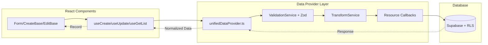

# Integration Patterns

> How React Admin components connect to the data layer in Crispy CRM

This document describes the patterns for connecting React Admin UI components to the unified data provider, following the engineering constitution's single-entry-point principle.

## Table of Contents
- [Form → Data Provider Flow](#form--data-provider-flow)
- [Create Form Pattern](#create-form-pattern)
- [Edit Form Pattern](#edit-form-pattern)
- [List with Filters Pattern](#list-with-filters-pattern)
- [Slide-Over Pattern](#slide-over-pattern)
- [Custom Hook Pattern](#custom-hook-pattern)
- [Reference Field Pattern](#reference-field-pattern)
- [Quick Reference](#quick-reference)

---

## Form → Data Provider Flow

All data operations flow through a single entry point, ensuring consistent validation, transformation, and error handling.



### Key Principles

1. **Single Entry Point**: All DB access through `src/atomic-crm/providers/supabase/unifiedDataProvider.ts`
2. **Zod at API Boundary**: Validation happens in the provider, NOT in forms
3. **Form Defaults from Schema**: Use `schema.partial().parse({})` for default values
4. **Fail-Fast**: No retry logic or graceful fallbacks (pre-launch)

---

## Create Form Pattern

Create forms use `CreateBase` + `Form` with schema-derived defaults.

### Standard Pattern
```typescript
// From: src/atomic-crm/opportunities/OpportunityCreate.tsx

import { CreateBase, Form, useGetIdentity } from "ra-core";
import { opportunitySchema } from "../validation/opportunities";

const OpportunityCreate = () => {
  const { data: identity } = useGetIdentity();

  // P5: FORM STATE DERIVED FROM TRUTH
  // Use .partial() to make all fields optional during default generation
  // This extracts fields with .default() (stage, priority, estimated_close_date)
  const formDefaults = {
    ...opportunitySchema.partial().parse({}),
    opportunity_owner_id: identity?.id,
    account_manager_id: identity?.id,
    contact_ids: [],           // Explicitly initialize array fields
    products_to_sync: [],      // for React Hook Form tracking
  };

  return (
    <CreateBase redirect="show">
      <div className="bg-muted px-6 py-6">
        <div className="max-w-4xl mx-auto">
          <Form defaultValues={formDefaults}>
            <Card>
              <CardContent>
                <OpportunityInputs mode="create" />
                <FormToolbar>
                  <CancelButton />
                  <SaveButton />
                </FormToolbar>
              </CardContent>
            </Card>
          </Form>
        </div>
      </div>
    </CreateBase>
  );
};
```

### Key Elements

| Element | Purpose | Location |
|---------|---------|----------|
| `CreateBase` | Provides create context & mutation | `ra-core` |
| `Form` | React Hook Form wrapper with RA integration | `ra-core` |
| `defaultValues` | Schema-derived defaults + identity overrides | Component |
| `redirect="show"` | Navigate to show view after successful create | `CreateBase` prop |

### Default Value Strategy

```typescript
// CORRECT: Schema-driven defaults
const defaults = opportunitySchema.partial().parse({});
// Returns: { stage: 'new_lead', priority: 'medium', estimated_close_date: <30 days from now> }

// CORRECT: Merge with runtime values
const formDefaults = {
  ...opportunitySchema.partial().parse({}),
  opportunity_owner_id: identity?.id,  // Current user
};

// WRONG: Hardcoded defaults
const defaults = { stage: 'new_lead', priority: 'medium' };  // Duplicates schema
```

---

## Edit Form Pattern

Edit forms use `EditBase` with pessimistic mutation mode and optimistic locking.

### Standard Pattern
```typescript
// From: src/atomic-crm/opportunities/OpportunityEdit.tsx

import { useMemo } from "react";
import { EditBase, Form, useRecordContext, useNotify, useRefresh } from "ra-core";
import { useQueryClient } from "@tanstack/react-query";
import { opportunitySchema } from "@/atomic-crm/validation/opportunities";

const OpportunityEdit = () => {
  const queryClient = useQueryClient();
  const notify = useNotify();
  const refresh = useRefresh();

  return (
    <EditBase
      actions={false}
      redirect="show"
      mutationMode="pessimistic"
      mutationOptions={{
        onSuccess: () => {
          // Invalidate queries to refresh related lists
          queryClient.invalidateQueries({ queryKey: ["opportunities"] });
        },
        onError: (error: Error) => {
          // Handle optimistic locking conflicts
          if (error.message?.includes("CONFLICT")) {
            notify(
              "This opportunity was modified by another user. Refreshing...",
              { type: "warning" }
            );
            refresh();
          } else {
            notify(error.message || "Failed to save", { type: "error" });
          }
        },
      }}
    >
      <OpportunityEditForm />
    </EditBase>
  );
};

const OpportunityEditForm = () => {
  const record = useRecordContext<Opportunity>();

  // Parse existing record through schema for validation/transformation
  const defaultValues = useMemo(
    () => opportunitySchema.partial().parse(record),
    [record]
  );

  if (!record) return null;

  return (
    <Form
      defaultValues={defaultValues}
      key={record.id}  // Force remount when record changes
    >
      <OpportunityCompactForm mode="edit" />
      <FormToolbar>
        <DeleteButton />
        <CancelButton />
        <SaveButton />
      </FormToolbar>
    </Form>
  );
};
```

### Mutation Modes

| Mode | Behavior | Use Case |
|------|----------|----------|
| `pessimistic` | Wait for server confirmation | Default, data integrity |
| `optimistic` | Update UI immediately, rollback on failure | UX priority |
| `undoable` | Undo snackbar with delayed commit | Destructive operations |

### Edit Form Key Elements

| Element | Purpose |
|---------|---------|
| `useRecordContext` | Access current record within EditBase context |
| `key={record.id}` | Force form remount when editing different record |
| `mutationMode="pessimistic"` | Ensure data consistency |
| `queryClient.invalidateQueries` | Refresh related data after save |

---

## List with Filters Pattern

Lists combine `List` context with filter components and view layouts.

### Standard Pattern
```typescript
// From: src/atomic-crm/opportunities/OpportunityList.tsx

import { List } from "@/components/admin/list";
import { useListContext, useGetIdentity } from "ra-core";

const OpportunityList = () => {
  const { data: identity, isPending } = useGetIdentity();
  const [view, setView] = useState<OpportunityView>(getViewPreference);

  if (isPending) return <ListSkeleton rows={8} columns={5} />;

  return (
    <List
      perPage={25}
      filter={{
        "deleted_at@is": null,  // Exclude soft-deleted
      }}
      sort={{ field: "created_at", order: "DESC" }}
      exporter={opportunityExporter}
      pagination={<ListPagination rowsPerPageOptions={[10, 25, 50]} />}
    >
      <OpportunityListLayout view={view} onViewChange={setView} />
    </List>
  );
};

// Child component that uses useListContext
const OpportunityListLayout = ({ view, onViewChange }) => {
  const { data, isPending, filterValues, setFilters } = useListContext();
  const hasFilters = filterValues && Object.keys(filterValues).length > 0;

  if (isPending) return <ListSkeleton />;
  if (!data?.length && !hasFilters) return <OpportunityEmpty />;

  return (
    <StandardListLayout
      resource="opportunities"
      filterComponent={<OpportunityListFilter />}
    >
      {view === "kanban" ? <KanbanView /> : <TableView />}
    </StandardListLayout>
  );
};
```

### Filter Pattern
```typescript
// From: src/atomic-crm/opportunities/OpportunityListFilter.tsx

import { FilterLiveForm, useListContext, useGetList } from "ra-core";

export const OpportunityListFilter = () => {
  const { filterValues, setFilters } = useListContext();

  // Fetch filter options from related resources
  const { data: principalsData } = useGetList("organizations", {
    pagination: { page: 1, perPage: 50 },
    filter: { organization_type: "principal", deleted_at: null },
  });

  // Programmatic filter updates
  const handlePrincipalChange = (value: string) => {
    if (value === "all") {
      const { principal_organization_id: _, ...rest } = filterValues || {};
      setFilters(rest);
    } else {
      setFilters({
        ...filterValues,
        principal_organization_id: Number(value),
      });
    }
  };

  return (
    <div className="flex flex-col gap-4">
      {/* Search with live updates */}
      <FilterLiveForm>
        <SearchInput source="q" placeholder="Search..." />
      </FilterLiveForm>

      {/* Toggle filters (multi-select) */}
      <FilterCategory label="Stage">
        {OPPORTUNITY_STAGES.map((stage) => (
          <ToggleFilterButton
            multiselect
            key={stage.value}
            label={stage.label}
            value={{ stage: stage.value }}
          />
        ))}
      </FilterCategory>

      {/* Dropdown filter */}
      <Select value={currentFilter} onValueChange={handlePrincipalChange}>
        <SelectTrigger><SelectValue /></SelectTrigger>
        <SelectContent>
          <SelectItem value="all">All</SelectItem>
          {principalsData?.map((org) => (
            <SelectItem key={org.id} value={String(org.id)}>
              {org.name}
            </SelectItem>
          ))}
        </SelectContent>
      </Select>
    </div>
  );
};
```

### Filter Operators

The data provider supports PostgREST-style filter operators:

| Operator | Meaning | Example |
|----------|---------|---------|
| `@is` | IS NULL check | `{ "deleted_at@is": null }` |
| `@in` | IN array | `{ "stage@in": "(new_lead,initial_outreach)" }` |
| `@not_in` | NOT IN | `{ "stage@not_in": ["closed_won", "closed_lost"] }` |
| `@gte` / `@lte` | Greater/less than or equal | `{ "created_at@gte": "2024-01-01" }` |
| `@ilike` | Case-insensitive LIKE | Handled via `q` filter transformation |

---

## Slide-Over Pattern

Side panels for viewing/editing records without full page navigation.

### Standard Pattern
```typescript
// From: src/atomic-crm/opportunities/OpportunitySlideOver.tsx

import { ResourceSlideOver, type TabConfig } from "@/components/layouts/ResourceSlideOver";

export function OpportunitySlideOver({
  recordId,
  isOpen,
  onClose,
  mode,
  onModeToggle,
}: OpportunitySlideOverProps) {
  // Define tabs for the slide-over
  const tabs: TabConfig[] = [
    {
      key: "details",
      label: "Details",
      component: OpportunitySlideOverDetailsTab,
      icon: TargetIcon,
    },
    {
      key: "contacts",
      label: "Contacts",
      component: OpportunityContactsTab,
      icon: Users,
      countFromRecord: (record) => record.nb_contacts,  // Badge count
    },
  ];

  return (
    <ResourceSlideOver
      resource="opportunities"
      recordId={recordId}
      isOpen={isOpen}
      onClose={onClose}
      mode={mode}
      onModeToggle={onModeToggle}
      tabs={tabs}
      recordRepresentation={(record) => record.name}
    />
  );
}
```

### Tab Component Pattern
```typescript
// Tab components receive standard props
interface TabComponentProps {
  record: RaRecord;
  mode: "view" | "edit";
  onModeToggle?: () => void;
  isActiveTab: boolean;  // Use to enable/disable data fetching
}

const OpportunityDetailsTab = ({ record, mode, isActiveTab }: TabComponentProps) => {
  // Only fetch when tab is active (performance optimization)
  const { data } = useGetList("activities", {
    filter: { opportunity_id: record.id },
  }, { enabled: isActiveTab });

  return mode === "view"
    ? <DetailsView record={record} activities={data} />
    : <DetailsEditForm record={record} />;
};
```

### Slide-Over State Hook
```typescript
// From: src/hooks/useSlideOverState.ts

const {
  slideOverId,
  isOpen,
  mode,
  openSlideOver,
  closeSlideOver,
  toggleMode
} = useSlideOverState();

// Open from list
<button onClick={() => openSlideOver(record.id, "view")}>View</button>

// URL-synced: ?view=123 or ?edit=123
```

---

## Custom Hook Pattern

Domain-specific hooks encapsulate data fetching and business logic.

### Standard Pattern
```typescript
// From: src/atomic-crm/opportunities/hooks/useSimilarOpportunityCheck.ts

import { useState, useCallback, useMemo } from "react";
import { useGetList } from "ra-core";

export function useSimilarOpportunityCheck(
  options: UseSimilarOpportunityCheckOptions = {}
): UseSimilarOpportunityCheckResult {
  const { threshold = 3, excludeId, disabled = false } = options;

  // State for dialog management
  const [showDialog, setShowDialog] = useState(false);
  const [proposedName, setProposedName] = useState("");
  const [similarOpportunities, setSimilarOpportunities] = useState<SimilarOpportunity[]>([]);
  const [hasConfirmed, setHasConfirmed] = useState(false);

  // Fetch data through React Admin hooks (NOT direct Supabase)
  const { data: opportunities = [], isLoading } = useGetList<OpportunityWithOrgs>(
    "opportunities",
    {
      pagination: { page: 1, perPage: 1000 },
      sort: { field: "name", order: "ASC" },
      filter: {
        "deleted_at@is": null,
        "stage@not_in": ["closed_won", "closed_lost"],
      },
    },
    {
      enabled: !disabled,
      staleTime: 5 * 60 * 1000,  // Cache for 5 minutes
    }
  );

  // Memoized computation
  const opportunityList = useMemo(() =>
    opportunities.map((opp) => ({
      id: opp.id,
      name: opp.name,
      stage: opp.stage,
    })),
    [opportunities]
  );

  // Business logic
  const checkForSimilar = useCallback((name: string): SimilarityCheckResult => {
    if (disabled || hasConfirmed || !name?.trim()) {
      return { hasSimilar: false, matches: [] };
    }

    const result = findSimilarOpportunities(opportunityList, { name, threshold, excludeId });

    if (result.hasSimilar) {
      setProposedName(name);
      setSimilarOpportunities(result.matches);
      setShowDialog(true);
    }

    return result;
  }, [disabled, hasConfirmed, opportunityList, threshold, excludeId]);

  return {
    checkForSimilar,
    showDialog,
    closeDialog: () => setShowDialog(false),
    confirmCreate: () => { setHasConfirmed(true); setShowDialog(false); },
    proposedName,
    similarOpportunities,
    isLoading,
    hasConfirmed,
    resetConfirmation: () => { setHasConfirmed(false); setSimilarOpportunities([]); },
  };
}
```

### Usage in Form
```typescript
const OpportunityCreate = () => {
  const {
    checkForSimilar,
    showDialog,
    closeDialog,
    confirmCreate,
    proposedName,
    similarOpportunities,
    hasConfirmed,
    resetConfirmation,
  } = useSimilarOpportunityCheck();

  return (
    <CreateBase>
      <Form>
        <OpportunityInputs />
        <OpportunityCreateSaveButton
          checkForSimilar={checkForSimilar}
          hasConfirmed={hasConfirmed}
          resetConfirmation={resetConfirmation}
        />
      </Form>

      <SimilarOpportunitiesDialog
        open={showDialog}
        onClose={closeDialog}
        onConfirm={confirmCreate}
        proposedName={proposedName}
        similarOpportunities={similarOpportunities}
      />
    </CreateBase>
  );
};
```

---

## Reference Field Pattern

Display related record data within lists and forms.

### Standard Usage
```typescript
import { ReferenceField } from "@/components/admin/reference-field";

// In a list/table
<ReferenceField source="customer_organization_id" reference="organizations">
  <TextField source="name" />
</ReferenceField>

// With custom rendering
<ReferenceField
  source="customer_organization_id"
  reference="organizations"
  link={false}  // Disable click navigation
>
  <OrganizationAvatar />
</ReferenceField>

// With fallback
<ReferenceField
  source="principal_organization_id"
  reference="organizations"
  emptyText="No principal"
>
  <TextField source="name" />
</ReferenceField>
```

### Reference Input Pattern
```typescript
import { ReferenceInput, SelectInput, AutocompleteInput } from "react-admin";

// Dropdown select
<ReferenceInput
  source="customer_organization_id"
  reference="organizations"
  filter={{ organization_type: "customer", deleted_at: null }}
>
  <SelectInput optionText="name" />
</ReferenceInput>

// Autocomplete with search
<ReferenceInput
  source="principal_organization_id"
  reference="organizations"
  filter={{ organization_type: "principal" }}
>
  <AutocompleteInput
    optionText="name"
    filterToQuery={(searchText) => ({ q: searchText })}
  />
</ReferenceInput>

// Multiple selection
<ReferenceArrayInput
  source="contact_ids"
  reference="contacts"
>
  <AutocompleteArrayInput optionText="full_name" />
</ReferenceArrayInput>
```

---

## Quick Reference

### Component → Hook Mapping

| Component | Hook | Provider Method |
|-----------|------|-----------------|
| `<Create>` / `<CreateBase>` | `useCreate` | `create()` |
| `<Edit>` / `<EditBase>` | `useUpdate` | `update()` |
| `<Show>` | `useGetOne` | `getOne()` |
| `<List>` | `useGetList` | `getList()` |
| `<ReferenceField>` | `useGetOne` | `getOne()` |
| `<ReferenceInput>` | `useGetList` | `getList()` |

### Data Flow Summary

```
┌─────────────────────────────────────────────────────────────┐
│                     React Component                         │
│  ┌─────────────────────────────────────────────────────┐   │
│  │ Form (defaultValues from schema.partial().parse({})) │   │
│  └──────────────────────┬──────────────────────────────┘   │
└─────────────────────────┼───────────────────────────────────┘
                          ▼
┌─────────────────────────────────────────────────────────────┐
│                React Admin Hooks                            │
│  useCreate / useUpdate / useGetList / useGetOne            │
└─────────────────────────┬───────────────────────────────────┘
                          ▼
┌─────────────────────────────────────────────────────────────┐
│              unifiedDataProvider.ts                         │
│  ┌───────────────┐  ┌───────────────┐  ┌───────────────┐   │
│  │ValidationSvc  │  │TransformSvc   │  │ResourceCalls  │   │
│  │(Zod schemas)  │  │(normalize)    │  │(beforeCreate) │   │
│  └───────────────┘  └───────────────┘  └───────────────┘   │
└─────────────────────────┬───────────────────────────────────┘
                          ▼
┌─────────────────────────────────────────────────────────────┐
│                    Supabase                                 │
│  PostgreSQL 17 + Row Level Security + Soft Deletes         │
└─────────────────────────────────────────────────────────────┘
```

### File Locations

| Pattern | Example File |
|---------|--------------|
| Create Form | `src/atomic-crm/opportunities/OpportunityCreate.tsx` |
| Edit Form | `src/atomic-crm/opportunities/OpportunityEdit.tsx` |
| List View | `src/atomic-crm/opportunities/OpportunityList.tsx` |
| List Filter | `src/atomic-crm/opportunities/OpportunityListFilter.tsx` |
| Slide-Over | `src/atomic-crm/opportunities/OpportunitySlideOver.tsx` |
| Custom Hook | `src/atomic-crm/opportunities/hooks/useSimilarOpportunityCheck.ts` |
| Data Provider | `src/atomic-crm/providers/supabase/unifiedDataProvider.ts` |
| Validation Schemas | `src/atomic-crm/validation/*.ts` |

---

## Related Documentation

- [Data Provider Architecture](./data-provider.md) - Internal provider structure
- [Validation Patterns](./validation-patterns.md) - Zod schema conventions
- [Form Components](../architecture/form-components.md) - Form wrapper components
- [Engineering Constitution](../adr/engineering-constitution.md) - Core principles
