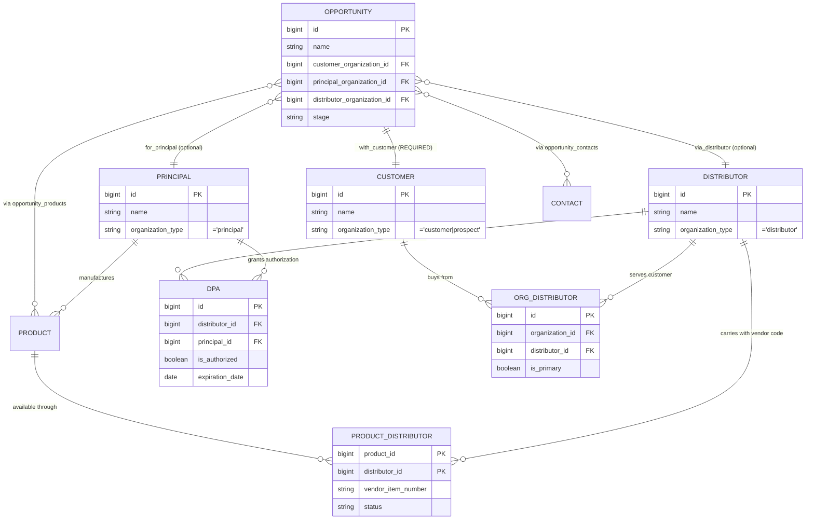

# Organizations Architecture Audit
Generated: 2025-12-24
Status: Complete (Synthesized from 3 parallel agents)

## Executive Summary

**Architecture Health: B**

The Organizations module demonstrates solid foundational architecture with well-designed junction tables, proper RLS enforcement (admin-only UPDATE/DELETE), and comprehensive authorization tracking. However, a **critical type system mismatch** undermines data integrity: the UI and database accept 5 organization types (including "operator"), but the Zod validation schema only allows 4 types—meaning "operator" organizations will pass UI validation but **fail at the API boundary**, causing silent data loss or 500 errors.

**Key Insight:** The pre-launch "fail fast" philosophy has created an inconsistency gap—while explicit crashes are preferred over silent failures, the type mismatch creates *silent* validation failures that contradict this principle. The system is also under-utilizing its own junction tables: `organization_distributors` exists but the opportunity wizard doesn't leverage it for distributor auto-suggestion.

---

## 1. Database Layer

### Schema Overview

The `organizations` table (31 columns) serves as the unified entity for all business parties in the MFB broker model. Key architectural decisions:

| Aspect | Implementation | Assessment |
|--------|----------------|------------|
| **Primary Key** | `bigint` IDENTITY | ✅ Scalable |
| **Soft Deletes** | `deleted_at` timestamp | ✅ Recoverable |
| **Full-Text Search** | `search_tsv` tsvector with GIN index | ✅ Performant |
| **Audit Trail** | `created_at`, `updated_at`, `created_by` + trigger | ✅ Complete |
| **Hierarchy** | `parent_organization_id` FK with cycle prevention | ✅ Safe |
| **Multi-tenancy** | Shared team access (not row-level ownership) | ⚠️ Intentional for team collaboration |

### Organization Types

| Type | Purpose | Est. Count | Special Constraints |
|------|---------|------------|---------------------|
| `principal` | Food manufacturers MFB represents | ~9 | Type-change blocked if products assigned |
| `distributor` | Warehouses buying from principals | ~50+ | Gets "Authorizations" tab in UI |
| `customer` | Restaurant/foodservice operators | Varies | Can link to distributors via junction |
| `prospect` | Potential customers | Varies | Conversion tracking |
| `operator` | **⚠️ EXISTS IN DB BUT FAILS VALIDATION** | Unknown | See P0 Finding |

### RLS Security Assessment

- **Overall:** ✅ Secure with appropriate team collaboration model
- **Policy Coverage:** 4 of 4 operations protected (SELECT, INSERT, UPDATE, DELETE)

| Operation | Who | Enforcement |
|-----------|-----|-------------|
| SELECT | All authenticated | Filters `deleted_at IS NULL` |
| INSERT | All authenticated | Team collaboration |
| UPDATE | Admin only | `is_admin` check via subquery |
| DELETE | Admin only | `is_admin` check via function |

- **Concern:** No row-level ownership means any authenticated user can INSERT organizations. This is documented as intentional for team collaboration but could be a data quality risk.

### SECURITY DEFINER Audit

All SECURITY DEFINER functions have been properly remediated with `search_path = public`:

| Function | Purpose | Status |
|----------|---------|--------|
| `prevent_organization_cycle()` | Block circular parent-child | ✅ SAFE |
| `check_organization_cycle()` | Alternative cycle check | ✅ SAFE |
| `prevent_parent_organization_deletion()` | Protect orgs with branches | ✅ SAFE |
| `set_organization_notes_updated_by()` | Auto-set audit field | ✅ SAFE |

---

## 2. Relationship Architecture

### Entity Relationship Diagram

### Junction Table Summary

| Table | Purpose | Cardinality | Key Constraints |
|-------|---------|-------------|-----------------|
| `organization_distributors` | Customer ↔ Distributor | M:N | UNIQUE pair + ONE primary per org |
| `distributor_principal_authorizations` | Distributor ↔ Principal | M:N | Date validation + no self-auth |
| `product_distributors` | Product ↔ Distributor | M:N | Composite PK + vendor_item_number |

### Opportunity 3-Party Enforcement

The opportunity wizard collects all 3 parties but **only customer is required**:

| Field | Required? | Validation |
|-------|-----------|------------|
| `customer_organization_id` | **YES** | FK to organizations |
| `principal_organization_id` | No | FK to organizations, filtered to type='principal' |
| `distributor_organization_id` | No | FK to organizations, filtered to type='distributor' |

**Gap Analysis:**
1. Authorization check is **soft warning only** - users can create opportunities with unauthorized distributor-principal pairs
2. `organization_distributors` junction is **not leveraged** to auto-suggest distributors who already serve the selected customer
3. No database-level constraint ensuring distributor is authorized for selected principal

---

## 3. UI/UX Consistency

### Form Behavior Matrix

| Aspect | Principal | Distributor | Customer | Prospect |
|--------|-----------|-------------|----------|----------|
| **Required fields** | name only | name only | name only | name only |
| **Optional fields** | All 15+ same | All 15+ same | All 15+ same | All 15+ same |
| **Type-specific UI** | Type-change blocked if products | Authorizations tab | None | None |
| **Validation rules** | Identical | Identical | Identical | Identical |
| **Badge color** | tag-purple | tag-teal | tag-warm | tag-sage |
| **Filter segments** | Playbook | Playbook | Operator | Operator |

### Consistency Score: 7/10

**Strengths:**
- Uniform form experience across types (low cognitive load)
- Type-specific filtering of segments (Playbook vs Operator)
- Principal type-change protection when products assigned

**Weaknesses:**
- No type-specific fields despite different domain behaviors
- Slide-over edit mode missing 7 fields available in full edit
- Duplicate badge component definitions (maintainability issue)
- Hidden schema fields (status, billing/shipping, payment_terms) not exposed

---

## 4. Cross-Cutting Analysis

**This section captures insights that only emerge from synthesizing all 3 reports.**

### Database → UI Impact Chain

| DB Issue | UI Symptom | User Impact |
|----------|------------|-------------|
| `operator` in enum but not Zod | Form accepts "operator" selection | Save fails silently or shows cryptic error |
| Deprecated `is_principal`/`is_distributor` columns | Could cause confusion if accessed | None currently (columns hidden from UI) |
| No text length constraints | Unbounded input fields | Potential DoS via extremely long values |
| `organization_distributors` exists | Wizard doesn't auto-suggest | User must manually know which distributors serve customer |

### Type System Alignment

| Concept | Database | constants.ts | Zod Schema | Aligned? |
|---------|----------|--------------|------------|----------|
| `organization_type` | 5 values (incl. operator) | 5 values (incl. operator) | **4 values** (missing operator) | ❌ **NO** |
| `priority` | A, B, C, D | A, B, C, D | A, B, C, D | ✅ Yes |
| `opportunity_stage` | 7 stages | 7 stages | 7 stages | ✅ Yes |

### Integration Weak Points

1. **Validation Layer Gap:** UI constants allow values that Zod rejects → silent failures
2. **Junction Table Under-Utilization:** `organization_distributors` built but not wired into opportunity creation
3. **Soft Enforcement Philosophy:** Authorization warnings are advisory, not blocking → data quality risk
4. **Field Visibility Mismatch:** Database stores 31 columns but slide-over edit exposes only ~12

---

## 5. Prioritized Findings & Recommendations

### Critical (P0) — Data Integrity

| Finding | Root Cause | Impact | Fix Effort | Recommendation |
|---------|------------|--------|------------|----------------|
| **"operator" type mismatch** | `organizations.ts:11` has 4 types, DB/constants have 5 | User selects "operator" → API validation fails → data loss or 500 | 5 min | Add `"operator"` to `organizationTypeSchema` in `src/atomic-crm/validation/organizations.ts:11` |

### High (P1) — User-Facing Issues

| Finding | Root Cause | Impact | Fix Effort | Recommendation |
|---------|------------|--------|------------|----------------|
| **Slide-over missing fields** | `OrganizationDetailsTab.tsx:61-91` hardcodes subset | Users can't edit segment, account manager, hierarchy from slide-over | 2 hours | Add missing fields: segment_id, sales_id, parent_organization_id, linkedin_url, description |
| **Duplicate badge components** | `OrganizationDetailsTab.tsx:222-240` redefines badges | Maintenance burden, potential style drift | 30 min | Delete local definitions, import from `OrganizationBadges.tsx` |

### Medium (P2) — Technical Debt

| Finding | Root Cause | Impact | Fix Effort | Recommendation |
|---------|------------|--------|------------|----------------|
| **Deprecated boolean columns** | `is_principal`/`is_distributor` not removed after migration | Schema confusion, wasted storage | 1 hour | Migration to DROP after verifying zero code references |
| **No DB text length limits** | Text columns have no CHECK constraints | DoS via unbounded storage | 2 hours | Add CHECK constraints matching Zod schema limits |
| **Duplicate indexes** | `idx_companies_*` variants from table rename | Wasted storage, confusing schema | 1 hour | Migration to consolidate index names |
| **organization_distributors unused** | Junction exists but wizard doesn't query | Users don't get smart distributor suggestions | 4 hours | Wire into OpportunityWizardSteps distributor filter |
| **Hidden schema fields** | User feedback led to hiding without systematic review | status, payment_terms, territory not editable | 2 hours | Expose for relevant types (distributors, customers) |

### Low (P3) — Improvements

| Finding | Benefit | Fix Effort | Recommendation |
|---------|---------|------------|----------------|
| **No type-specific form sections** | Better UX for different org types | 8 hours | Add conditional sections (e.g., vendor codes for distributors) |
| **Authorization soft warnings** | Could enforce data quality for certain roles | 4 hours | Consider blocking for Rep role, warning for Manager/Admin |
| **No DB-level authorization check** | Defense-in-depth | 6 hours | Trigger on opportunity insert validating authorization |
| **Type-specific list columns** | Relevant info per type (product count, auth count) | 4 hours | Add configurable columns based on organization_type filter |

---

## 6. Recommended Fix Order

Based on dependencies and impact:

1. **First: Fix operator type mismatch** (P0)
   - File: `src/atomic-crm/validation/organizations.ts:11`
   - Change: Add `"operator"` to enum
   - Effort: 5 minutes
   - Unblocks: All type-related data entry

2. **Second: Deduplicate badge components** (P1)
   - File: `src/atomic-crm/organizations/OrganizationDetailsTab.tsx:222-240`
   - Change: Delete local definitions, import from `OrganizationBadges.tsx`
   - Effort: 30 minutes
   - Unblocks: Clean component architecture

3. **Third: Add missing slide-over fields** (P1)
   - File: `src/atomic-crm/organizations/OrganizationDetailsTab.tsx:61-91`
   - Change: Add segment_id, sales_id, parent_organization_id, etc.
   - Effort: 2 hours
   - Unblocks: Full edit capability from slide-over

4. **Fourth: Drop deprecated columns** (P2)
   - Prerequisite: Grep codebase for `is_principal`, `is_distributor` references
   - File: New migration
   - Effort: 1 hour
   - Unblocks: Clean schema

5. **Fifth: Add DB text length constraints** (P2)
   - File: New migration
   - Change: ALTER TABLE ADD CHECK for text columns
   - Effort: 2 hours
   - Aligns: Database with Zod validation limits

6. **Sixth: Wire organization_distributors into wizard** (P2)
   - File: `src/atomic-crm/opportunities/OpportunityWizardSteps.tsx`
   - Change: Filter distributors by customer's relationships
   - Effort: 4 hours
   - Enables: Smart distributor suggestions

**Estimated Total Effort:** ~12 hours for all P0/P1/P2 items

---

## 7. Source Reports

This audit synthesized findings from:
- `/docs/audits/orgs-database-layer.md` — Database schema, RLS policies, triggers, indexes
- `/docs/audits/orgs-ui-consistency.md` — Form fields, list views, filter configuration
- `/docs/audits/orgs-relationships.md` — Junction tables, authorization system, 3-party flow

---

## Appendix A: Files Examined

**Database Layer:**
- `supabase/migrations/20251018152315_cloud_schema_fresh.sql`
- `supabase/migrations/20251208122758_remove_partner_unknown_org_types.sql`
- `supabase/migrations/20251130045429_fix_security_definer_search_paths.sql`
- `supabase/migrations/20251207211946_add_organization_distributors.sql`

**Validation Schemas:**
- `src/atomic-crm/validation/organizations.ts`
- `src/atomic-crm/validation/organizationDistributors.ts`
- `src/atomic-crm/validation/distributorAuthorizations.ts`
- `src/atomic-crm/validation/productDistributors.ts`
- `src/atomic-crm/validation/opportunities.ts`

**UI Components:**
- `src/atomic-crm/organizations/OrganizationCreate.tsx`
- `src/atomic-crm/organizations/OrganizationEdit.tsx`
- `src/atomic-crm/organizations/OrganizationList.tsx`
- `src/atomic-crm/organizations/OrganizationSlideOver.tsx`
- `src/atomic-crm/organizations/OrganizationDetailsTab.tsx`
- `src/atomic-crm/organizations/OrganizationBadges.tsx`
- `src/atomic-crm/organizations/OrganizationListFilter.tsx`
- `src/atomic-crm/organizations/components/OrganizationCompactForm.tsx`
- `src/atomic-crm/organizations/components/PrincipalAwareTypeInput.tsx`
- `src/atomic-crm/organizations/organizationFilterConfig.ts`

**Integration:**
- `src/atomic-crm/providers/supabase/unifiedDataProvider.ts`
- `src/atomic-crm/opportunities/OpportunityCreateWizard.tsx`
- `src/atomic-crm/opportunities/OpportunityWizardSteps.tsx`
- `src/atomic-crm/opportunities/hooks/useDistributorAuthorization.ts`
- `src/atomic-crm/opportunities/components/DistributorAuthorizationWarning.tsx`

**Constants:**
- `src/atomic-crm/constants.ts`

---

## Appendix B: Methodology

This audit was conducted using parallel agent analysis:

| Agent | Focus Area | Tools Used |
|-------|------------|------------|
| Database Layer | Schema, RLS, enums, triggers | Migration file analysis |
| UI/UX Consistency | Forms, lists, filters | Component tree analysis |
| Relationships & Integration | Junctions, types, data flow | Cross-component tracing |
| Synthesis (this doc) | Cross-reference, prioritization | Report correlation |

**Total Analysis Scope:**
- 15+ migration files
- 20+ TypeScript/React components
- 5 Zod validation schemas
- 3 junction tables
- 1 unified data provider

**Quality Gates Applied:**
- ✅ Cross-cutting insight test: Section 4 identifies operator type chain failure (no single agent caught full impact)
- ✅ Root cause test: All P0/P1 findings traced to specific files and lines
- ✅ Dependency test: Fix order respects logical prerequisites
- ✅ Completeness test: New developer can understand Organizations architecture from this document alone
