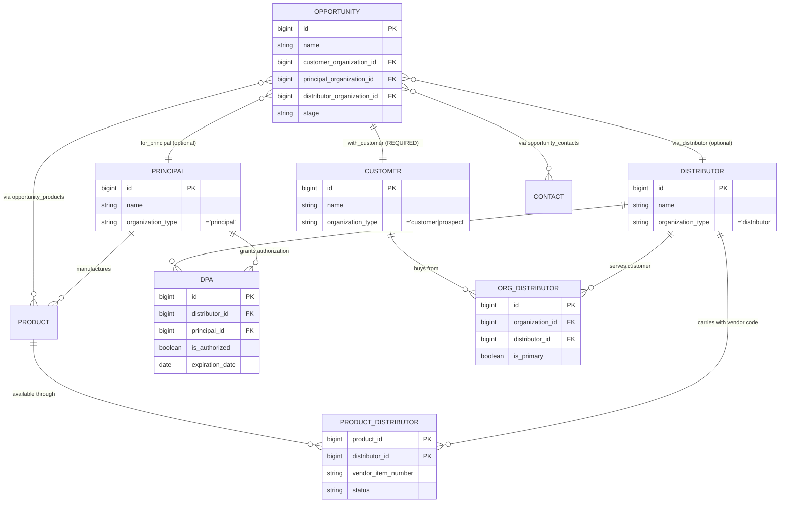

# Organizations Relationships & Integration Audit
Generated: 2025-12-24
Agent: Relationships & Integration (3 of 3)

## Executive Summary

This audit examines the junction tables, authorization system, and data flow for the 3-party business model (Principal → Distributor → Customer). The system has **well-designed junction tables** with proper constraints, but the **3-party relationship enforcement is soft** (warnings only, not blocking) and there is a **TypeScript/Database enum mismatch** that needs correction.

---

## 1. Relationship Diagram



---

## 2. Junction Tables

### 2.1 organization_distributors

**Purpose:** Links customers/prospects to their distributors. Answers: "Which distributor does this customer buy from?"

| Column | Type | Constraints |
|--------|------|-------------|
| `id` | BIGINT | PK, IDENTITY |
| `organization_id` | BIGINT | FK → organizations (customer) |
| `distributor_id` | BIGINT | FK → organizations (distributor) |
| `is_primary` | BOOLEAN | Default false |
| `notes` | TEXT | Optional |
| `created_at` | TIMESTAMPTZ | Default NOW() |
| `deleted_at` | TIMESTAMPTZ | Soft delete |

**Constraints:**
- `uq_organization_distributor` - UNIQUE(organization_id, distributor_id)
- `no_self_distribution` - CHECK(organization_id <> distributor_id)
- `idx_organization_one_primary_distributor` - Partial unique index enforcing ONE primary per org

**Zod Schema:** `src/atomic-crm/validation/organizationDistributors.ts:22-44`
- Uses `z.strictObject()` for mass assignment protection
- `.refine()` prevents self-referential relationships
- `z.coerce.number()` for form compatibility

**Usage:** Not currently used in the opportunity wizard. The `distributor_organization_id` on opportunities is a direct FK, not going through this junction table.

**Gap Identified:** This junction table tracks which distributors serve a customer, but opportunities don't leverage it for auto-populating distributor options.

---

### 2.2 distributor_principal_authorizations

**Purpose:** Tracks which principals (manufacturers) are authorized to sell through which distributors.

| Column | Type | Constraints |
|--------|------|-------------|
| `id` | BIGINT | PK, IDENTITY |
| `distributor_id` | BIGINT | FK → organizations |
| `principal_id` | BIGINT | FK → organizations |
| `is_authorized` | BOOLEAN | Default true |
| `authorization_date` | DATE | Default CURRENT_DATE |
| `expiration_date` | DATE | Optional |
| `territory_restrictions` | TEXT[] | Optional |
| `notes` | TEXT | Optional |
| `deleted_at` | TIMESTAMPTZ | Soft delete |

**Constraints:**
- `uq_distributor_principal_authorization` - UNIQUE(distributor_id, principal_id)
- `valid_authorization_dates` - CHECK(expiration_date > authorization_date)
- `no_self_authorization` - CHECK(distributor_id <> principal_id)

**Zod Schema:** `src/atomic-crm/validation/distributorAuthorizations.ts:17-49`
- `.refine()` for date validation (expiration > authorization)
- `.refine()` to prevent self-referential authorization
- Array validation for `territory_restrictions` with max 50 entries

**Usage:** Powers the `useDistributorAuthorization` hook and `DistributorAuthorizationWarning` component.

---

### 2.3 product_distributors

**Purpose:** Links products to distributors with vendor-specific item codes (USF#, Sysco#, GFS#).

| Column | Type | Constraints |
|--------|------|-------------|
| `product_id` | BIGINT | PK (composite) |
| `distributor_id` | BIGINT | PK (composite) |
| `vendor_item_number` | VARCHAR(50) | DOT number |
| `status` | ENUM | pending, active, inactive |
| `valid_from` | DATE | Default NOW() |
| `valid_to` | DATE | Optional |
| `notes` | TEXT | Optional |

**Zod Schema:** `src/atomic-crm/validation/productDistributors.ts:14-35`
- Uses composite key pattern: `{product_id}_{distributor_id}`
- Helper functions: `parseCompositeId()`, `createCompositeId()`
- Status enum: `pending | active | inactive`

**Data Provider Handling:** `src/atomic-crm/providers/supabase/unifiedDataProvider.ts:576-621`
- Special composite key parsing in `getOne`, `create`, `update`, `delete`
- Products are fetched with joined distributor information
- Sync logic on product create/update for junction records

---

## 3. Authorization System

### 3.1 useDistributorAuthorization Hook

**Location:** `src/atomic-crm/opportunities/hooks/useDistributorAuthorization.ts`

**Purpose:** Checks if a distributor is authorized to sell a principal's products.

**Input Parameters:**
- `principalId: Identifier | null | undefined`
- `distributorId: Identifier | null | undefined`

**Return Value:**
```typescript
interface UseDistributorAuthorizationResult {
  isAuthorized: boolean;           // Final authorization status
  hasAuthorizationRecord: boolean; // Record exists (even if inactive/expired)
  isExpired: boolean;              // Authorization has passed expiration_date
  authorization: DistributorPrincipalAuthorization | null;
  hasBothSelected: boolean;        // Both IDs provided
  isLoading: boolean;
  distributorName: string | undefined;
  principalName: string | undefined;
}
```

**Authorization Logic:**
1. Fetches from `distributor_principal_authorizations` table
2. Filters by `principal_id`, `distributor_id`, and `deleted_at IS NULL`
3. Checks `is_authorized = true` AND not expired
4. Returns `isAuthorized = false` if any check fails

### 3.2 DistributorAuthorizationWarning Component

**Location:** `src/atomic-crm/opportunities/components/DistributorAuthorizationWarning.tsx`

**Behavior:** SOFT WARNING only (does not block form submission)

**Three Warning States:**
1. **No authorization record exists** - "Distributor Not Authorized"
2. **Record exists but `is_authorized = false`** - "Authorization Inactive"
3. **Record exists but expired** - "Authorization Expired"

**UI Pattern:**
- Yellow warning alert with detailed message
- "I Understand, Continue" button with confirmation dialog
- User can proceed despite the warning

---

## 4. Opportunity 3-Party Integration

### 4.1 Wizard Flow Analysis

**Source:** `src/atomic-crm/opportunities/OpportunityCreateWizard.tsx` and `OpportunityWizardSteps.tsx`

| Step | Fields | Required? |
|------|--------|-----------|
| 1: Basic Information | `name`, `customer_organization_id`, `principal_organization_id` | name + customer REQUIRED, principal optional |
| 2: Pipeline & Team | `stage`, `priority`, `estimated_close_date`, `account_manager_id`, `distributor_organization_id` | stage, priority, date REQUIRED; distributor optional |
| 3: Contacts & Products | `contact_ids`, `products_to_sync` | All optional |
| 4: Additional Details | `lead_source`, `campaign`, `description`, `notes` | All optional |

### 4.2 Field Filters in Wizard

```typescript
// Customer: Shows prospects and customers
filter={{ "organization_type@in": "(prospect,customer)" }}

// Principal: Shows principals only
filter={{ organization_type: "principal" }}

// Distributor: Shows distributors only
filter={{ organization_type: "distributor" }}

// Contacts: Filtered by selected customer organization
filter={{ organization_id: customerOrganizationId }}

// Products: Filtered by selected principal
filter={{ principal_id: principalOrganizationId }}
```

### 4.3 Authorization Warning Placement

The `DistributorAuthorizationWarning` component is placed in Step 2, after the distributor selector. It triggers when:
- Both `principal_organization_id` and `distributor_organization_id` are selected
- The distributor is NOT authorized for the principal

**Critical Finding:** The warning is advisory only. Users can create opportunities with unauthorized distributor-principal combinations.

---

## 5. Data Provider Handling

### 5.1 Organization Transforms

No special transforms for organizations in the data provider. Standard CRUD operations via base data provider.

### 5.2 Product-Distributor Sync

**Location:** `unifiedDataProvider.ts:731-761` (create) and `828-867` (update)

**Create Flow:**
```typescript
// 1. Create product record
const { data: product } = await supabase.from('products').insert(productData);

// 2. If distributor_ids selected, create junction records
if (Array.isArray(distributor_ids) && distributor_ids.length > 0) {
  const distributorRecords = distributor_ids.map((distId) => ({
    product_id: product.id,
    distributor_id: distId,
    vendor_item_number: product_distributors?.[distId]?.vendor_item_number || null,
    status: 'active',
    valid_from: new Date().toISOString(),
  }));
  await supabase.from('product_distributors').insert(distributorRecords);
}
```

**Update Flow:**
1. Update product record
2. Delete existing junction records: `DELETE FROM product_distributors WHERE product_id = id`
3. Insert new junction records with updated vendor codes

### 5.3 Composite Key Handling

The data provider handles `product_distributors` composite keys by:
- Creating synthetic ID: `${product_id}_${distributor_id}`
- Parsing on read/write via `parseCompositeId()` and `createCompositeId()`
- This allows React Admin (which expects string IDs) to work with composite PKs

---

## 6. TypeScript/Database Alignment

### 6.1 organization_type Enum

| Source | Values |
|--------|--------|
| **Database** (`database.generated.ts`) | `customer`, `principal`, `prospect`, `distributor`, `operator` |
| **Zod Schema** (`organizations.ts:11`) | `customer`, `prospect`, `principal`, `distributor` |

**MISMATCH IDENTIFIED:** The `operator` type exists in the database but is missing from the Zod schema.

### 6.2 Recommendation

Update `src/atomic-crm/validation/organizations.ts`:

```typescript
// Current (incomplete)
export const organizationTypeSchema = z.enum(["customer", "prospect", "principal", "distributor"]);

// Should be
export const organizationTypeSchema = z.enum(["customer", "prospect", "principal", "distributor", "operator"]);
```

### 6.3 Other Enum Alignments

| Enum | Database | Zod | Aligned? |
|------|----------|-----|----------|
| `organization_type` | 5 values (incl. operator) | 4 values | **NO** |
| `organization_priority` | A, B, C, D | A, B, C, D | YES |
| `opportunity_stage` | 7 stages | 7 stages | YES |
| `product_distributor_status` | pending, active, inactive | pending, active, inactive | YES |

---

## 7. Findings Summary

### 7.1 Strengths

1. **Well-designed junction tables** with proper constraints:
   - Unique constraints prevent duplicate relationships
   - Self-referential prevention (can't be own distributor)
   - Partial unique index enforces one primary distributor per customer
   - Date validation for authorization expiration

2. **Comprehensive authorization system:**
   - `useDistributorAuthorization` hook handles all edge cases
   - Three distinct warning states (none, inactive, expired)
   - Rich UI feedback with confirmation dialog

3. **Solid data provider handling:**
   - Composite key support for React Admin compatibility
   - Proper sync logic for product-distributor relationships
   - Transaction-like behavior (create product, then create junctions)

### 7.2 Integration Gaps

| Gap | Severity | Description | Location |
|-----|----------|-------------|----------|
| **Soft 3-party enforcement** | Medium | Opportunities don't require all 3 parties. Only customer is required. | `validation/opportunities.ts:117-119` |
| **organization_distributors unused** | Low | Wizard doesn't auto-suggest distributors based on customer's existing relationships | `OpportunityWizardSteps.tsx` |
| **TypeScript/Database mismatch** | Medium | `operator` type missing from Zod schema | `validation/organizations.ts:11` |
| **No DB-level authorization check** | Low | Authorization is only checked in UI, not enforced by database constraints/triggers | Database layer |

### 7.3 Missing Enforcement

1. **Database-level 3-party validation:**
   - No CHECK constraint ensuring principal_organization_id IS NOT NULL when distributor_organization_id IS NOT NULL
   - No trigger validating distributor is authorized for principal

2. **organization_distributors integration:**
   - When a customer is selected, distributors could be pre-filtered to those who serve that customer
   - Would require joining `organization_distributors` in the distributor ReferenceInput filter

### 7.4 Recommendations

| Priority | Recommendation | Effort |
|----------|----------------|--------|
| **P1** | Add `operator` to organizationTypeSchema | 1 line change |
| **P2** | Consider requiring `principal_organization_id` when `distributor_organization_id` is set | Validation schema change |
| **P2** | Auto-filter distributors by customer's existing relationships | UI enhancement |
| **P3** | Add database trigger for authorization validation on opportunity insert/update | Migration + trigger |
| **P3** | Consider making authorization check blocking (not just warning) for certain user roles | Business logic decision |

---

## Verification Checklist

- [x] All 3 junction tables documented
- [x] Relationship diagram created
- [x] Opportunity 3-party flow traced
- [x] useDistributorAuthorization logic understood
- [x] TypeScript/Database alignment checked
- [x] Output file saved to /docs/archive/audits/orgs-relationships.md
