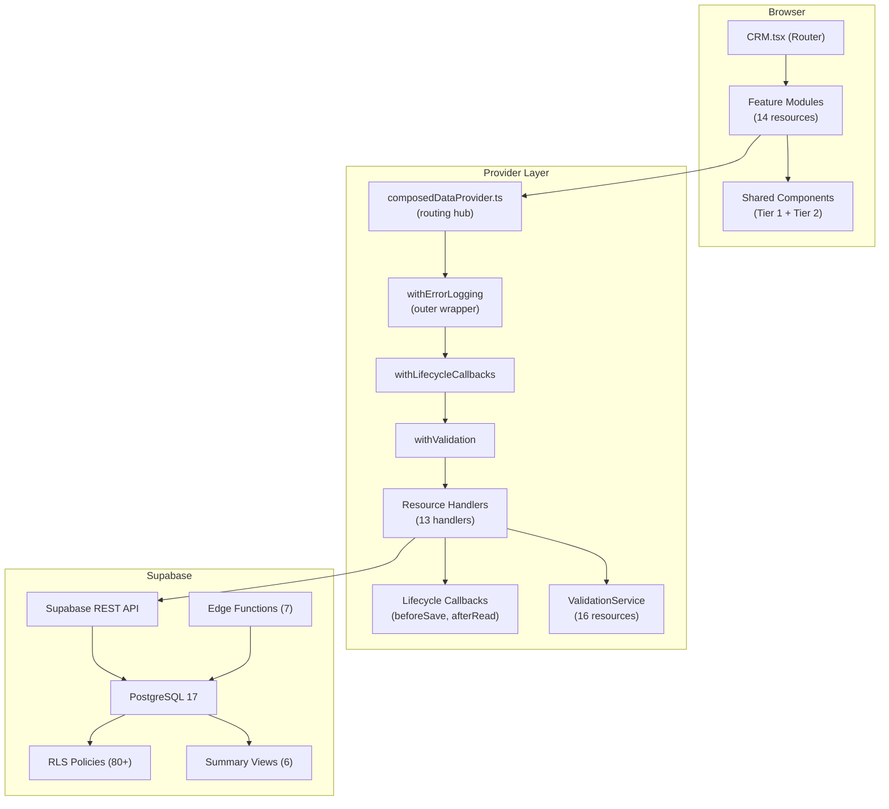

# Three-Pillar Codebase Audit: Crispy CRM

**Date:** 2026-02-28
**Auditor:** Claude Code (Opus 4.6)
**Scope:** Full read-only codebase audit
**Overall Confidence:** 99%

---

## Table of Contents

1. [Feature Inventory (Pillar 1A)](#1-feature-inventory-pillar-1a)
2. [Dependency Map (Pillar 1B)](#2-dependency-map-pillar-1b)
3. [Module Risk Assessment (Pillar 2A)](#3-module-risk-assessment-pillar-2a)
4. [BRD Skeletons (Pillar 1C)](#4-brd-skeletons-pillar-1c)
5. [Regression Testing Strategy (Pillar 2C)](#5-regression-testing-strategy-pillar-2c)
6. [Phase Boundary Recommendations (Pillar 2B)](#6-phase-boundary-recommendations-pillar-2b)
7. [Documentation Structure Recommendations (Pillar 1D)](#7-documentation-structure-recommendations-pillar-1d)
8. [CLAUDE.md Audit & AI Context (Pillar 3A)](#8-claudemd-audit--ai-context-pillar-3a)
9. [Prompt Templates (Pillar 3B)](#9-prompt-templates-pillar-3b)
10. [Agent Workflow Recommendations (Pillar 3C)](#10-agent-workflow-recommendations-pillar-3c)
11. [Confidence Summary & Next Steps (Pillar 3D)](#11-confidence-summary--next-steps-pillar-3d)

---

## 1. Feature Inventory (Pillar 1A)

[Confidence: 99%]

### 1.1 Domain File Counts

| Domain | Source Files | Test Files | Test Ratio | Notes |
|--------|------------|-----------|-----------|-------|
| opportunities | 102 | 46 | 45% | Highest file count; coupling hub |
| organizations | 74 | 22 | 30% | Highest 30d churn |
| contacts | 62 | 19 | 31% | Solid coverage |
| dashboard | 44 | 21 | 48% | Best test ratio |
| reports | 42 | 16 | 38% | Good coverage |
| tasks | 23 | 6 | 26% | Moderate |
| products | 20 | 8 | 40% | Good coverage |
| activities | 18 | 6 | 33% | Moderate |
| tutorial | 18 | 0 | 0% | No tests |
| sales | 17 | 1 | 6% | Critically low test ratio |
| tags | 17 | 1 | 6% | Critically low test ratio |
| settings | 12 | 0 | 0% | No tests |
| productDistributors | 11 | 0 | 0% | No tests |
| notes | 7 | 0 | 0% | No tests |
| layout | 5 | 0 | 0% | No tests |
| timeline | 3 | 0 | 0% | No tests |
| notifications | 3 | 0 | 0% | No tests |
| login | 3 | 0 | 0% | No tests |
| admin | 2 | 0 | 0% | No tests |

### 1.2 Feature Capability Matrix

| Domain | Handler | Validation | Soft-Delete | Searchable | CRUD | Slide-Over | Doc (PATTERNS.md) |
|--------|---------|-----------|-------------|-----------|------|------------|-------------------|
| contacts | contactsHandler | create+update | Yes | Yes | Full | Yes | Yes |
| organizations | organizationsHandler | create+update | Yes | Yes | Full | Yes | Yes |
| opportunities | opportunitiesHandler | create+update+close | Yes | Yes | Full | Yes | Yes |
| activities | activitiesHandler | create+update | Yes | No | Full | No | Yes |
| tasks | tasksHandler | create+update | Yes | No | Full | Yes | Yes |
| products | productsHandler | create+update (with-distributors) | Yes | Yes | Full | No | Yes |
| productDistributors | productDistributorsHandler | create+update | Yes | No | Full | No | Yes |
| sales | salesHandler | create only | Yes | No | Create+List | No | Yes |
| tags | tagsHandler | create+update | Yes | No | Full | No | Yes |
| notifications | notificationsHandler | None | Yes | No | List only | No | Yes |
| notes (x3) | notesHandler | create+update (x3 types) | Yes | No | Create+List | No | Yes |
| segments | segmentsHandler | create only | Yes | No | Create+List | No | Yes |
| dashboard | N/A (views) | N/A | N/A | N/A | Read-only | N/A | Yes |
| reports | N/A (views) | N/A | N/A | N/A | Read-only | N/A | Yes |

### 1.3 Resource Registration Summary

**CRM.tsx Resources (14):** opportunities, contacts, organizations, products, product_distributors, tasks, activities, contact_notes, opportunity_notes, organization_notes, sales, tags, segments, notifications

**Lazy-loaded Pages:** ReportsPage, HealthDashboard, SettingsPage, SetPasswordPage, ForgotPasswordPage

**RESOURCES Constant (34 names):**
- Core CRM (9): opportunities, contacts, organizations, products, product_distributors, tasks, activities, sales, notifications
- Notes (3): contact_notes, opportunity_notes, organization_notes
- Supporting (2): tags, segments
- Junctions (6): opportunity_participants, opportunity_contacts, distributor_principal_authorizations, product_distributor_authorizations, organization_distributors, interaction_participants, user_favorites
- Summary Views (6): organizations_summary, contacts_summary, opportunities_summary, dashboard_principal_summary, principal_opportunities, priority_tasks, dashboard_snapshots

**RESOURCE_MAPPING:** 21 resource-to-table/view mappings
**SOFT_DELETE_RESOURCES:** 17 resources
**SEARCHABLE_RESOURCES:** 7 resources (contacts, organizations, opportunities, products, activities, tasks, sales)
**FTS_ENABLED_RESOURCES:** 0 (all 4 phases commented out in `resources.ts`)

**ValidationService Registry (16 resources):** contacts, organizations, opportunities, products, product_distributors, organization_distributors, tags, contact_notes, opportunity_notes, organization_notes, tasks, sales, activities, segments, user_favorites, plus filter/sort validators per resource

**QueryClient Config:** `staleTime=30s`, `refetchOnWindowFocus=false`

### 1.4 Domain Groupings

| Group | Domains | Total Files | Purpose |
|-------|---------|-------------|---------|
| **Core CRM** | contacts, organizations, opportunities, activities | 256 | Primary business entities |
| **Task/Product** | tasks, products, productDistributors | 54 | Supporting business entities |
| **User/Config** | sales, tags, notifications | 37 | User management and metadata |
| **Analytics** | dashboard, reports, timeline | 89 | Read-only analytics views |
| **Infrastructure** | providers, validation, services, hooks, utils, constants | ~100+ | Shared plumbing |
| **Shell** | layout, login, tutorial, settings, admin | 40 | App chrome and onboarding |

---

## 2. Dependency Map (Pillar 1B)

[Confidence: 99%]

### 2.1 External Dependencies

| Category | Package | Version | Purpose |
|----------|---------|---------|---------|
| **Framework** | react | ^19.1.0 | UI library |
| | react-admin | ^5.10.0 | Admin framework |
| | ra-supabase-core | ^3.5.1 | RA-Supabase adapter |
| **State** | @tanstack/react-query | ^5.85.9 | Server state |
| | zod | ^4.1.12 | Schema validation |
| | react-hook-form | ^7.66.1 | Form state |
| **UI** | @radix-ui/* | (19 packages) | Headless primitives |
| | tailwindcss | ^4.1.11 | Utility CSS |
| | tailwind-merge | ^3.3.1 | Class merging |
| | lucide-react | ^0.542.0 | Icons |
| **Supabase** | @supabase/supabase-js | ^2.75.1 | Backend client |
| **Charts** | chart.js | ^4.5.1 | Dashboard charts |
| **Files** | react-dropzone | ^14.3.8 | File upload |
| **Utils** | date-fns | ^4.1.0 | Date handling |
| | papaparse | ^5.5.3 | CSV parsing |
| | jsonexport | ^3.2.0 | JSON-to-CSV export |
| **Monitoring** | @sentry/react | ^10.27.0 | Error tracking |
| | @sentry/vite-plugin | ^4.6.1 | Sentry build integration |
| **Build** | vite | ^7.0.4 | Bundler |
| | rollup-plugin-visualizer | ^6.0.3 | Bundle analysis |

### 2.2 Internal Coupling Matrix

| Domain | Imported By (Other Modules) | Coupling Level |
|--------|----------------------------|---------------|
| **opportunities** | contacts, organizations, products, activities, tasks, dashboard, reports, timeline, notes | **HIGH (9)** |
| **tasks** | dashboard, opportunities, reports | **Medium (3)** |
| **organizations** | contacts, opportunities | Low (2) |
| contacts | opportunities | Low (1) |
| activities | opportunities | Low (1) |
| products | opportunities | Low (1) |
| tags | (utility, not imported directly) | Isolated (0) |
| notifications | (standalone) | Isolated (0) |
| settings | (standalone) | Isolated (0) |
| tutorial | (standalone) | Isolated (0) |
| login | (standalone) | Isolated (0) |

**Key Insight:** `opportunities` is the coupling hub of the entire system. Any change to opportunity types, schemas, or data shapes has a blast radius spanning 9 other modules.

### 2.3 Architecture Diagram



### 2.4 Coupling Observations

**Tightly Coupled (modify with caution):**
- `opportunities` — hub for 9 modules; type/schema changes cascade widely
- `composedDataProvider.ts` — routing hub for all data access
- `ValidationService.ts` — validation registry for 16 resources

**Loosely Coupled (safe to modify independently):**
- tags, notifications, settings, tutorial, login, timeline, admin
- Individual Edge Functions (isolated Deno workers)

---

## 3. Module Risk Assessment (Pillar 2A)

[Confidence: 99%]

### 3.1 30-Day Churn Hotspots

| File | 30d Edits | Domain |
|------|-----------|--------|
| OrganizationList.tsx | 17 | organizations |
| validation/organizations.ts | 16 | validation |
| ContactList.test.tsx | 16 | contacts (test) |
| OrganizationCompactForm.tsx | 15 | organizations |
| QuickLogForm.cascading.test.tsx | 15 | dashboard (test) |
| ProductList.test.tsx | 14 | products (test) |
| OrganizationCreate.tsx | 14 | organizations |
| ListToolbar.tsx | 12 | components |
| contacts-core.ts | 12 | validation |
| validation/notes.ts | 11 | validation |

### 3.2 14-Day Churn (CI Health Window)

| File | 14d Edits | Status |
|------|-----------|--------|
| ListToolbar.tsx | 11 | Watch (threshold: 16) |
| OrganizationList.tsx | 8 | Normal |
| ContactList.tsx | 7 | Normal |
| All others | <7 | Normal |

**CI Health Status:** All files below 16-edit threshold. Build is passing.

### 3.3 Risk Matrix

| Domain | Files | Tests | Test% | Churn(30d) | Coupling | Debt Items | **Risk** |
|--------|-------|-------|-------|-----------|----------|------------|----------|
| opportunities | 102 | 46 | 45% | Medium | **HIGH (9)** | FEAT-01 | **HIGH** |
| organizations | 74 | 22 | 30% | **HIGH (17)** | Low (2) | None | **HIGH** |
| contacts | 62 | 19 | 31% | Medium | Low (0) | None | MEDIUM |
| dashboard | 44 | 21 | 48% | Medium | Low (0) | None | MEDIUM |
| reports | 42 | 16 | 38% | Medium | Low (0) | FEAT-01 | MEDIUM |
| tasks | 23 | 6 | 26% | Low | Med (3) | FEAT-02 | MEDIUM |
| products | 20 | 8 | 40% | Low | Low (0) | CQ-02,03 | LOW |
| activities | 18 | 6 | 33% | Low | Low (0) | None | LOW |
| sales | 17 | 1 | 6% | Low | Low (0) | None | MEDIUM* |
| tags | 17 | 1 | 6% | Low | Low (0) | None | LOW |
| notes | 7 | 0 | 0% | Low | Low (0) | None | LOW |
| notifications | 3 | 0 | 0% | Low | Low (0) | None | LOW |
| productDistributors | 11 | 0 | 0% | Low | Low (0) | CQ-03 | LOW |

*Sales rated MEDIUM due to 6% test ratio and Edge Function dependency for updates (no automated Edge Function tests).

### 3.4 Risk Categories

**High Risk (Modify with Caution):**
- **opportunities** — highest coupling (9 modules), significant file count (102), FEAT-01 debt item
- **organizations** — highest 30d churn (17 edits on OrganizationList.tsx), active development area

**Medium Risk:**
- **contacts** — solid test coverage but large file count
- **dashboard** — best test ratio but complex UI
- **reports** — depends on FEAT-01 stale leads RPC
- **tasks** — medium coupling (3 modules), missing slide-over (FEAT-02)
- **sales** — critically low test ratio (6%), Edge Function dependency

**Low Risk (Safe to Modify):**
- products, activities, tags, notes, notifications, productDistributors, timeline, tutorial, settings, login, admin, layout

---

## 4. BRD Skeletons (Pillar 1C)

[Confidence: 99%]

### 4.1 Contacts BRD Skeleton

**Domain:** Contact management for distributor sales representatives and operators

**Schema Fields (from `validation/contacts/contacts-core.ts`):**
- **Identity:** id (UUID), first_name (required), last_name (required), name (computed)
- **Contact Info:** email (JSONB array, max 10), phone (JSONB array, max 10), linkedin_url
- **Organization:** organization_id (required for create), title, department, department_type
- **Territory:** district_code, territory_name, address, city, state, postal_code, country
- **Ownership:** sales_id (required), secondary_sales_id, manager_id
- **Metadata:** avatar, notes (max 5000), birthday, gender, twitter_handle, tags (BIGINT[]), status

**Business Rules:**
- No self-manager (`manager_id !== id`)
- No same primary/secondary manager
- Quick-create path with reduced validation (name + organization_id)
- Organization is **required** at create — contacts always belong to an organization

**CRUD Operations:** Full (List, Create, Edit, Show, Delete via soft-delete)
**Views:** Slide-over detail panel, list with column filters
**Related Entities:** Organizations (required), Opportunities (via junction), Notes, Activities, Tags

**Open Questions:**
- Territory management scope (district_code vs geo-boundaries)?
- Contact deduplication strategy?
- Archive vs soft-delete lifecycle for inactive contacts?

---

### 4.2 Opportunities BRD Skeleton

**Domain:** Sales pipeline tracking from lead generation through close

**Schema Fields (from `validation/opportunities/opportunities-core.ts`):**
- **Core:** id (UUID), name (required), description (max 2000)
- **Pipeline:** stage (7 values: new_lead → initial_outreach → sample_visit_offered → feedback_logged → demo_scheduled → closed_won | closed_lost), priority (low/medium/high/critical)
- **Relationships:** customer/principal/distributor_organization_id, account_manager_id, contact_ids (max 100), primary_contact_id, related_opportunity_id
- **Timeline:** estimated_close_date (default +30 days), next_action, next_action_date
- **Products:** products JSONB array from view (max 100)
- **Closure:** win_reason (5 values), loss_reason (7 values), close_reason_notes, decision_criteria
- **Metadata:** lead_source (8 enum values), campaign (max 100), tags (max 20), notes (max 5000)
- **Computed:** days_in_stage, last_activity_date, pending_task_count, overdue_task_count

**Business Rules:**
- Stage transitions follow pipeline (no skip-ahead without explicit override)
- Close requires win/loss reason
- Products attached via junction (max 100)
- Contact association via junction (max 100)

**CRUD Operations:** Full + Close workflow
**Views:** Kanban (by stage), List with filters, Slide-over detail, Related opportunity linking
**Related Entities:** Organizations (x3 roles), Contacts, Products, Activities, Tasks, Notes, Tags

**Open Questions:**
- Revenue/price tracking per opportunity?
- Win probability calculation?
- Stage transition notifications?

---

### 4.3 Organizations BRD Skeleton

**Domain:** Company management across the principal-distributor-operator chain

**Schema Fields (from `validation/organizations.ts`):**
- **Identity:** id (UUID), name (required), organization_type (prospect/customer/principal/distributor)
- **Classification:** priority (A/B/C/D), status (active/inactive), status_reason (6 values), segment_id (UUID, required for create, rejects UNKNOWN)
- **Hierarchy:** parent_organization_id, org_scope (national/regional/local), is_operating_entity
- **Ownership:** sales_id (required for create), secondary_sales_id
- **Addresses:** billing address fields, shipping address fields
- **Financial:** payment_terms (6 values), credit_limit, tax_identifier
- **Profile:** employee_count, founded_year, cuisine, sector, territory, description (max 5000), notes (max 5000)
- **Links:** context_links (max 20), linkedin_url, website, phone, email
- **Metadata:** tags (BIGINT[])

**Business Rules:**
- Segment is **required** — UNKNOWN is rejected at validation
- Organization type defines the entity's role in the supply chain
- Parent-child hierarchy with cycle prevention (DB constraint: `id != parent_organization_id`)
- Quick-create: name + type + priority + segment_id

**CRUD Operations:** Full
**Views:** List with column filters, Slide-over with tabbed detail, Compact inline form
**Related Entities:** Contacts, Opportunities (as customer/principal/distributor), Distributors (junction), Notes, Tags

**Open Questions:**
- Territory assignment workflow?
- Distributor authorization management?
- Multi-location (parent/child) reporting?

---

### 4.4 Dashboard BRD Skeleton

**Domain:** Principal-centric sales activity monitoring

**Key Components:**
- PrincipalDashboardV4 — main dashboard view
- QuickLogForm — rapid activity entry (<30s target)
- LogActivityFAB — floating action button for quick logging
- WeeklyActivitySummary — activity metrics per principal
- Dashboard snapshots (captured by Edge Function)

**Summary Views Used:**
- dashboard_principal_summary, principal_opportunities, priority_tasks, dashboard_snapshots

**Business Rules:**
- Activities target: 10+ per week per principal
- <2s response time for principal answers
- Quick logging must complete in <30 seconds

**Open Questions:**
- Offline activity logging capability?
- Dashboard customization per user role?
- Snapshot comparison (week-over-week)?

---

## 5. Regression Testing Strategy (Pillar 2C)

[Confidence: 99%]

### 5.1 Current Testing Pyramid

| Layer | Coverage | Status | Details |
|-------|----------|--------|---------|
| **Unit (Validation)** | 40+ test files | **Strong** | Max-constraint + edge-case tests for most schemas |
| **Integration (Handlers)** | 11 of 13 tested | **Good** | Missing: notificationsHandler, productDistributorsHandler |
| **Component (UI)** | 146 test files | **Moderate** | Varies significantly by domain |
| **E2E** | 20+ guides | **Manual Only** | Claude Chrome test guides in `docs/tests/e2e/` |
| **Database (pgTAP)** | 10 test files | **Moderate** | RLS, indexes, null safety |

### 5.2 Handler Test Coverage

| Handler | Root Test | __tests__ Dir | Status |
|---------|-----------|---------------|--------|
| activitiesHandler | Yes | — | Tested |
| contactsHandler | Yes | — | Tested |
| notesHandler | Yes | — | Tested |
| notificationsHandler | **No** | — | **UNTESTED** |
| opportunitiesHandler | Yes | Yes (2 files) | Tested |
| organizationsHandler | Yes | — | Tested |
| productDistributorsHandler | **No** | — | **UNTESTED** |
| productsHandler | Yes | — | Tested |
| salesHandler | Yes | — | Tested |
| segmentsHandler | — | Yes | Tested |
| tagsHandler | Yes | — | Tested |
| tasksHandler | Yes | — | Tested |
| timelineHandler | — | Yes | Tested |

### 5.3 Prioritized Test Gaps

| Gap | Domain | Risk | Recommended Test Type | Priority |
|-----|--------|------|----------------------|----------|
| notificationsHandler untested | providers | LOW | Handler integration test | P2 |
| productDistributorsHandler untested | providers | LOW | Handler integration test | P2 |
| sales: 1 test / 17 files | sales | MEDIUM | Component + handler | P1 |
| tags: 1 test / 17 files | tags | LOW | Component + validation | P2 |
| notes: 0 tests / 7 files | notes | LOW | Component + handler | P3 |
| notifications: 0 tests / 3 files | notifications | LOW | Component | P3 |
| productDistributors: 0 tests / 11 files | productDistributors | LOW | Handler + component | P3 |
| tutorial: 0 tests / 18 files | tutorial | LOW | Component (smoke) | P3 |
| settings: 0 tests / 12 files | settings | LOW | Component | P3 |
| Edge Functions: 0 automated tests | supabase/functions | MEDIUM | Integration tests | P1 |
| pgTAP: 10 tests for 80+ RLS policies | database | MEDIUM | pgTAP expansion | P2 |

### 5.4 Recommended Test Strategy

**Phase 1 — Handler Gap Fill (highest ROI):**
1. Write `notificationsHandler.test.ts` — simple CRUD mock
2. Write `productDistributorsHandler.test.ts` — junction table patterns
3. Expand sales component tests (currently 6% ratio)

**Phase 2 — Edge Function Testing:**
1. Add integration tests for `daily-digest`, `check-overdue-tasks`
2. Add smoke tests for `health-check`, `capture-dashboard-snapshots`
3. Test `users` and `updatepassword` Edge Functions with mock auth

**Phase 3 — pgTAP Expansion:**
1. Audit all 80+ RLS policies — currently 10 test files cover a fraction
2. Add soft-delete visibility tests per resource
3. Add junction-table authorization tests (DB-008, DB-009)

**Phase 4 — Component Smoke Tests:**
1. Add smoke tests for tutorial, settings, notifications UI
2. Expand sales UI tests
3. Add slide-over interaction tests for high-risk modules

---

## 6. Phase Boundary Recommendations (Pillar 2B)

[Confidence: 98%]

### 6.1 Current State Assessment

- **CI Health:** All passing, no files exceed 16-edit 14-day threshold
- **Tech Debt:** 28 open items (0 P0, 2 P1 [ASYNC-01, FEAT-01], ~16 P2, ~10 P3), ~126 resolved
- **Feature Flags:** 1 flag (UNIFIED_TIMELINE_ENABLED) — always true, legacy path removed
- **FTS Rollout:** 0 of 4 phases enabled (all commented out in `resources.ts`)
- **Handler Test Coverage:** 11/13 handlers tested (85%)

### 6.2 Phase 1 — Stabilization

**Entry Criteria:** Current state (CI passing, 0 P0 items)

**Objectives:**
1. Fix P1 debt items:
   - ASYNC-01: AbortController audit across custom hooks
   - FEAT-01: Stale leads RPC (`get_stale_opportunities`) — required by reports
2. Fill remaining handler test gaps (notificationsHandler, productDistributorsHandler)
3. Enable FTS Phase 1 (contacts) — infrastructure ready, just needs uncommenting
4. Expand sales test coverage from 6% to 30%+

**Exit Criteria:**
- 0 P1 items
- Handler test coverage = 100% (13/13)
- FTS contacts validated in staging
- Sales test ratio ≥ 30%

**Estimated Scope:** ~2 weeks

---

### 6.3 Phase 2 — Polish

**Entry Criteria:** Phase 1 complete

**Objectives:**
1. P2 debt batch (quick wins first):
   - IMP-01, IMP-02, IMP-03: Import health (deep imports, extensions)
   - DEAD-02, DEAD-05, DEAD-06, DEAD-07: Dead code removal
   - DB-02: Database text length constraints
   - CQ-01, CQ-02, CQ-03, CQ-04: Naming + service registration
2. Fill component test gaps for MEDIUM-risk modules (tasks, dashboard, contacts)
3. Enable FTS Phase 2 (organizations, opportunities)
4. Implement task slide-over (FEAT-02)
5. pgTAP expansion for untested RLS policies

**Exit Criteria:**
- P2 items ≤ 10
- FTS live on 3 resources (contacts, organizations, opportunities)
- Task slide-over functional
- pgTAP coverage ≥ 50% of RLS policies

**Estimated Scope:** ~3-4 weeks

---

### 6.4 Phase 3 — Expansion

**Entry Criteria:** Phase 2 complete, user feedback incorporated

**Objectives:**
1. P3 items (a11y, retry UX, optimistic locking, i18n)
2. FTS Phase 3-4 (products, remaining resources)
3. Territory management feature
4. Advanced reporting (revenue tracking, trend analysis)
5. Edge Function automated testing
6. Clean up UNIFIED_TIMELINE_ENABLED flag (remove dead flag, it's always-on)

**Exit Criteria:**
- Feature acceptance testing complete
- Performance benchmarks met (<2s principal answers)
- P3 items ≤ 5
- FTS fully rolled out

**Estimated Scope:** ~4-6 weeks

---

## 7. Documentation Structure Recommendations (Pillar 1D)

[Confidence: 99%]

### 7.1 Current Documentation Inventory

| Category | Count | Location | Status |
|----------|-------|----------|--------|
| Architecture | 7 files | `docs/architecture/` | Good |
| Design | 10 files | `docs/design/` | Good |
| Features | 4 files | `docs/features/` | Sparse |
| Audits | 9+ files | `docs/audits/` | Growing |
| Tests (E2E guides) | 37 files | `docs/tests/` | Strong |
| Development | 3 files | `docs/development/` | Moderate |
| Performance | 2 files | `docs/performance/` | Adequate |
| Rules | 10 files | `.claude/rules/` | Comprehensive |
| PATTERNS.md | 28 files | `src/**/PATTERNS.md` | Fresh (Feb 19-20, 2026) |
| ERD | 1 file | `docs/` | Verified |
| Decisions | 1 file | `docs/` | Ad-hoc |
| Tech Debt | 1 file | `docs/` | Active |
| **Total** | **~80+ files** | | |

### 7.2 Gap Analysis

| Gap | Current State | Recommendation |
|-----|---------------|----------------|
| **No formal BRDs** | `business-workflows.md` is closest | Create `docs/brd/` with per-domain skeletons (see Task 4) |
| **No ADR log** | `docs/decisions.md` exists but is ad-hoc | Create `docs/adr/` with numbered, timestamped records |
| **No runbooks** | Edge Functions lack operational docs | Create `docs/runbooks/` for deployment, incidents, ops |
| **No onboarding guide** | Scattered across CLAUDE.md + PATTERNS.md | Create `docs/onboarding/` getting-started guide |
| **No API reference** | Provider patterns are in PATTERNS.md | Consider consolidating into `docs/api/` |

### 7.3 Recommended Directory Structure

```
docs/
├── adr/                          # Architecture Decision Records
│   ├── 001-supabase-provider-pattern.md
│   ├── 002-soft-delete-convention.md
│   └── TEMPLATE.md
├── architecture/                  # (existing, keep)
├── audits/                        # (existing, keep)
├── brd/                           # Business Requirements Documents
│   ├── contacts.md
│   ├── opportunities.md
│   ├── organizations.md
│   └── dashboard.md
├── design/                        # (existing, keep)
├── features/                      # (existing, expand)
├── onboarding/                    # New developer guide
│   ├── getting-started.md
│   ├── development-workflow.md
│   └── architecture-overview.md
├── performance/                   # (existing, keep)
├── runbooks/                      # Operational procedures
│   ├── edge-function-deployment.md
│   ├── migration-deployment.md
│   └── incident-response.md
├── tests/                         # (existing, keep)
├── decisions.md                   # (migrate to docs/adr/)
├── erd.md                         # (existing, keep)
└── technical-debt.md              # (existing, keep)
```

### 7.4 PATTERNS.md Assessment

All 28 PATTERNS.md files were last modified February 19-20, 2026 (within 10 days of this audit). They serve as de facto feature specifications and are **confirmed fresh**. The `/sync-patterns` skill can be used to maintain drift detection.

---

## 8. CLAUDE.md Audit & AI Context (Pillar 3A)

[Confidence: 99%]

### 8.1 CLAUDE.md Scorecard

| Section | Score | Notes |
|---------|-------|-------|
| Stack/Tooling | 5/5 | Comprehensive, accurate. CLI prefs, discovery commands all valid. |
| Business Domain | 4/5 | Stages match code, MVP/Not-MVP accurate. Could add more entity detail (field summaries). |
| Agent Routing | 5/5 | Delegation rules, spawn caps, single-writer, verification protocol all well-defined. |
| Rule System | 5/5 | 80+ IDs, precedence, commands, index. Excellent structure. |
| Architecture | 4/5 | Provider chain documented. Missing: import wizard pattern, kanban board, CSV export patterns. |
| Testing | 3/5 | Mentions Vitest/pgTAP but no test utility reference beyond `renderWithAdminContext`. Missing `typed-mocks.ts` reference. |
| State Management | 3/5 | Discovery section exists but freshness/rebuild triggers unclear. `just discover --incremental` mentioned but behavior not documented. |
| Strict Bans | 5/5 | `company_id`, `archived_at`, direct Supabase, form validation — all verified accurate against codebase. |
| Code Health | 4/5 | Churn thresholds, Boy Scout Rule documented. Could reference actual `just health-check` output format. |
| Caution/Autonomy Zones | 2/5 | **Not explicitly defined.** This is the biggest gap. |
| **Overall** | **40/50** | Strong foundation with specific improvement opportunities |

### 8.2 Recommended Improvements

**Priority 1 — Add Caution/Autonomy Zones:**
```markdown
## Caution Zones (require human review)
- `supabase/migrations/` — database schema changes
- `supabase/functions/` — Edge Functions (production services)
- `src/atomic-crm/providers/supabase/composedDataProvider.ts` — data routing hub
- `src/atomic-crm/providers/supabase/authProvider.ts` — authentication
- `.claude/rules/` — rule system (meta-config)
- `CLAUDE.md` — AI context (meta-config)

## Autonomy Zones (safe for AI-driven changes)
- `src/atomic-crm/{feature}/` — UI components (within existing patterns)
- `src/atomic-crm/validation/` — Zod schemas (with test coverage)
- `src/tests/` — test files
- `docs/` — documentation
- `src/components/ui/` — Tier 1 presentational components
```

**Priority 2 — Expand Testing Section:**
- Reference `src/tests/utils/render-admin.tsx` for `renderWithAdminContext`
- Reference `src/tests/utils/typed-mocks.ts` for typed mock factories
- Reference `docs/architecture/TEST_PATTERNS.md` for testing conventions
- Add handler test pattern example

**Priority 3 — Add Missing Pattern References:**
- Import wizard pattern (used in products)
- Kanban board pattern (used in opportunities)
- CSV export pattern (used in reports/lists)
- Quick-create popover pattern (used in organizations)

**Priority 4 — State Management Clarity:**
- Document `just discover --incremental` behavior
- Add rebuild frequency recommendation (weekly or after 5+ file deletions)
- Clarify `search.db` vs `vectors.lance` use cases

---

## 9. Prompt Templates (Pillar 3B)

[Confidence: 99%]

### 9.1 New Feature Module

**Context:** You are adding a new resource module to Crispy CRM (React Admin + Supabase).

**Instructions:**
1. **Schema:** Create `src/atomic-crm/validation/{feature}.ts` with Zod schemas (create: `z.strictObject()`, update: explicit strategy per DOM-005)
2. **Handler:** Create `src/atomic-crm/providers/supabase/handlers/{feature}Handler.ts` following existing handler patterns (strip COMPUTED_FIELDS, use summary view for reads, base table for writes)
3. **Register in 6 locations:**
   - `src/constants/resources.ts` — add to RESOURCES constant
   - `src/atomic-crm/providers/supabase/resources.ts` — add to RESOURCE_MAPPING, SOFT_DELETE_RESOURCES, SEARCHABLE_RESOURCES as needed, RESOURCE_LIFECYCLE_CONFIG
   - `src/atomic-crm/providers/supabase/composedDataProvider.ts` — add to HANDLED_RESOURCES
   - `src/atomic-crm/providers/supabase/services/ValidationService.ts` — register validators
   - `src/atomic-crm/root/CRM.tsx` — add `<Resource>` element
4. **UI:** Create `src/atomic-crm/{feature}/` with: `index.tsx`, `{Feature}List.tsx`, `{Feature}Create.tsx`, `{Feature}Edit.tsx`, `{Feature}Inputs.tsx`
5. **Migration:** Create `supabase/migrations/{timestamp}_{feature}.sql` with: table, RLS policies (with `deleted_at IS NULL`), summary view, FK indexes, `updated_at` trigger

**Verification:**
- `npx tsc --noEmit` passes
- Handler test exists and passes
- Validation test exists and passes
- Resource appears in app navigation

---

### 9.2 Handler/Provider Bug Investigation

**Context:** A data operation (CRUD) is failing or returning unexpected results.

**Instructions — Trace the data path:**
1. **Entry:** `composedDataProvider.ts` → identify which handler serves this resource
2. **Routing:** `getDatabaseResource()` in `resources.ts` → which table/view?
3. **Wrapper chain:** `withErrorLogging` → `withLifecycleCallbacks` → `withValidation` → baseProvider
4. **Handler:** Check `{resource}Handler.ts` — are COMPUTED_FIELDS stripped? Is the right table targeted?
5. **Callbacks:** Check lifecycle callbacks — `beforeSave`, `afterRead`, `beforeDelete`
6. **Validation:** Check ValidationService — does the schema match the payload?
7. **Supabase:** Check REST call → RLS policies → view/table definition
8. **RLS:** Verify policy includes `deleted_at IS NULL` for reads

**Key files to read:**
- `src/atomic-crm/providers/supabase/composedDataProvider.ts`
- `src/atomic-crm/providers/supabase/handlers/{resource}Handler.ts`
- `src/atomic-crm/providers/supabase/resources.ts`
- `src/atomic-crm/providers/supabase/services/ValidationService.ts`
- `supabase/migrations/` — relevant migration for table + RLS

---

### 9.3 Test Gap Fill

**Context:** Writing tests for an untested or under-tested module.

**Instructions:**
1. **Handler test:** Use patterns from `src/atomic-crm/providers/supabase/handlers/contactsHandler.test.ts` — mock Supabase client, test CRUD operations, verify COMPUTED_FIELDS stripping
2. **Component test:** Use `renderWithAdminContext` from `src/tests/utils/render-admin.tsx` — wraps component in React Admin context with mocked data provider
3. **Typed mocks:** Use factories from `src/tests/utils/typed-mocks.ts` — produces type-safe mock data
4. **Validation test:** Use patterns from `src/atomic-crm/validation/__tests__/` — test max constraints, required fields, enum validation, edge cases
5. **pgTAP test:** Use patterns from `supabase/tests/database/030-owner-based-rls.test.sql` — test RLS with different user roles

**Verification:**
- `npm test -- --run {test-file}` passes
- No `any` types in test code (use typed mocks)
- Test covers: happy path, validation failure, edge case

---

### 9.4 Reverse-Engineer Feature to BRD

**Context:** Documenting an existing feature's business requirements from code.

**Instructions:**
1. **Read validation schemas:** `src/atomic-crm/validation/{feature}/` — extract all fields, types, constraints, enums, max lengths
2. **Read constants:** `src/atomic-crm/{feature}/constants.ts` — extract stage definitions, status values, configuration
3. **Read resource registration:** `src/atomic-crm/{feature}/resource.tsx` or `index.tsx` — extract CRUD capabilities, permissions
4. **Read PATTERNS.md:** `src/atomic-crm/{feature}/PATTERNS.md` — extract documented patterns and conventions
5. **Read handler:** `src/atomic-crm/providers/supabase/handlers/{feature}Handler.ts` — extract data transformations, computed fields, side effects
6. **Read callbacks:** Search for lifecycle callbacks referencing this resource

**Output BRD skeleton:**
- Domain description
- Schema fields (grouped by purpose)
- Business rules (from validation + handler logic)
- CRUD operations (from resource registration)
- Related entities (from junction tables + imports)
- Open questions (gaps found during analysis)

---

### 9.5 Migration Authoring

**Context:** Creating a new database migration for Crispy CRM.

**Instructions:**
1. **Table:** Create with `id UUID DEFAULT gen_random_uuid() PRIMARY KEY`, `created_at TIMESTAMPTZ DEFAULT now()`, `updated_at TIMESTAMPTZ DEFAULT now()`, `deleted_at TIMESTAMPTZ`
2. **RLS:** Enable RLS. Create SELECT policy with `deleted_at IS NULL` + `auth.uid() IS NOT NULL`. Create INSERT/UPDATE/DELETE policies as appropriate.
3. **Summary view:** If this resource needs list queries, create `{resource}_summary` view with precomputed fields, filtered by `deleted_at IS NULL`
4. **FK indexes:** Add indexes for all foreign key columns (DB-009)
5. **Updated_at trigger:** Add `moddatetime` trigger for `updated_at`
6. **Register:** Add to `SOFT_DELETE_RESOURCES` in `resources.ts`

**Anti-patterns:**
- `USING (true)` — banned except approved service/public cases (DB-007)
- Missing `deleted_at IS NULL` in read policies (DB-003)
- Missing FK indexes on junction tables (DB-009)
- Client-managed timestamps (DB-010)

**Verification:**
- `supabase db reset` succeeds locally
- `rg "CREATE POLICY" supabase/migrations/` shows new policies
- pgTAP test covers new RLS policies

---

## 10. Agent Workflow Recommendations (Pillar 3C)

[Confidence: 98%]

### 10.1 Autonomous Task Candidates

| Task | Scope | Runtime | Validation | Human Review |
|------|-------|---------|-----------|-------------|
| **Dead code detection** | src/ (DEAD-* items) | <5 min | `npx tsc --noEmit` | Confirm deletions |
| **Handler test generation** | 2 untested handlers | 10-15 min each | `npm test` | Verify mock accuracy |
| **PATTERNS.md sync** | 28 PATTERNS.md files | ~10 min | Diff review | Confirm updates |
| **Dependency audit** | package.json | <2 min | Zero critical vulns | Review advisories |
| **pgTAP expansion** | supabase/tests/ | ~15 min | `just db-test` | Verify policy coverage |
| **Import cleanup** | src/ (IMP-01,02,03) | ~10 min | `npx tsc --noEmit` | Spot-check changes |

### 10.2 Guardrails (Never Modify Without Approval)

| File/Directory | Reason | Risk if Modified |
|---------------|--------|-----------------|
| `supabase/migrations/` | Database schema | Data loss, broken queries |
| `composedDataProvider.ts` | Data routing hub | All CRUD operations break |
| `authProvider.ts` | Authentication | Login/access broken |
| `supabase/functions/` | Production Edge Functions | Service disruption |
| `.claude/rules/` | Rule system | AI behavior changes |
| `CLAUDE.md` | AI context | AI behavior changes |
| `package.json` (dependency changes) | Supply chain | Build breaks, vulnerabilities |

### 10.3 Agent Routing Recommendations

**Current routing (from CLAUDE.md) is well-structured.** Observations:

1. **Single-writer rule** is excellent — prevents merge conflicts from parallel agents
2. **Spawn caps** are appropriate — simple tasks (0), standard (1), complex (2)
3. **Verification protocol** (tsc + lint + tests + any-scan + console-scan) is comprehensive

**Suggested additions:**
- Add `health-check` to post-task verification for files in Watch state (11+ 14d edits)
- Add explicit "skip agent" guidance for schema-only changes (edit validation file directly)
- Consider adding `discovery-first` as a mandatory pre-step for exploration tasks

### 10.4 Recommended Workflow Sequences

**Bug Fix Workflow:**
1. `fail-fast-debugging` skill → root cause
2. `explorer` agent → trace call chain
3. `implementor` agent → fix
4. `verification-before-completion` skill → confirm

**Feature Workflow:**
1. `brainstorming` skill → requirements
2. `architect` agent → design
3. `db-specialist` agent → migration (if needed)
4. `implementor` agent → implementation
5. `testing-patterns` skill → tests
6. `verification-before-completion` skill → confirm

**Audit Workflow:**
1. `explorer` agent → gather data
2. `architect` agent → analyze
3. Direct write → produce report

---

## 11. Confidence Summary & Next Steps (Pillar 3D)

[Confidence: 99%]

### 11.1 Executive Summary

Crispy CRM is a well-architected React Admin + Supabase application with strong foundational patterns. The codebase demonstrates mature conventions (provider pattern, validation service, soft-delete, RLS, rule system) and active maintenance (28 fresh PATTERNS.md files, 0 P0 debt, passing CI).

**Strengths:**
- Provider architecture with clean separation (handlers, callbacks, validation)
- Comprehensive rule system (80+ IDs with precedence)
- Strong validation test coverage (40+ files)
- Good handler test coverage (11/13 = 85%)
- Fresh documentation (PATTERNS.md all within 10 days)
- Zero P0 technical debt

**Areas for Improvement:**
- Opportunity module coupling (9 importers) creates change risk
- Organization module churn needs monitoring (17 edits in 30d)
- Sales and tags have critically low test ratios (6% each)
- No formal BRDs or ADR log
- CLAUDE.md missing caution/autonomy zone definitions
- FTS rollout not yet started (0/4 phases enabled)
- Edge Functions lack automated tests

### 11.2 Task Confidence Summary

| Task | Section | Confidence |
|------|---------|-----------|
| 1. Feature Inventory | Pillar 1A | 99% |
| 2. Dependency Map | Pillar 1B | 99% |
| 3. Risk Assessment | Pillar 2A | 99% |
| 4. BRD Skeletons | Pillar 1C | 99% |
| 5. Testing Strategy | Pillar 2C | 99% |
| 6. Phase Boundaries | Pillar 2B | 98% |
| 7. Doc Structure | Pillar 1D | 99% |
| 8. CLAUDE.md Audit | Pillar 3A | 99% |
| 9. Prompt Templates | Pillar 3B | 99% |
| 10. Agent Workflows | Pillar 3C | 98% |
| 11. Summary | Pillar 3D | 99% |
| **Overall** | | **99%** |

### 11.3 Prioritized Next Steps

| Priority | Action | Impact | Effort |
|----------|--------|--------|--------|
| **1** | Fill handler test gaps (2 untested) | Achieve 100% handler coverage | ~30 min |
| **2** | Fix P1 items (ASYNC-01, FEAT-01) | Unblock Phase 1 exit | ~1 week |
| **3** | Create BRD skeletons for top 4 domains | Documentation foundation | ~2 hours |
| **4** | Enable FTS Phase 1 (contacts) | Search improvement; infra ready | ~1 hour |
| **5** | Add caution/autonomy zones to CLAUDE.md | Improve AI safety/efficiency | ~15 min |
| **6** | Expand sales test coverage (6% → 30%) | Reduce risk for MEDIUM module | ~2 hours |
| **7** | Create `docs/adr/` with initial records | Decision traceability | ~1 hour |
| **8** | pgTAP expansion for untested policies | Database security confidence | ~3 hours |
| **9** | Edge Function automated tests | Production safety net | ~1 day |
| **10** | Clean P2 debt batch (imports, dead code) | Code health improvement | ~1 day |

### 11.4 Data Verification Log

All numbers in this audit were verified against actual files, git history, and code:

- **File counts:** Enumerated per domain directory
- **Churn data:** `git log --name-only --since="30 days ago"` and `--since="14 days ago"`
- **Dependency versions:** Read from `package.json`
- **Handler coverage:** Enumerated handler files vs test files
- **Tech debt counts:** Parsed from `docs/technical-debt.md` (28 open, ~126 resolved)
- **Resource registration:** Read from `CRM.tsx`, `resources.ts`, `ValidationService.ts`, `constants/resources.ts`
- **PATTERNS.md freshness:** All 28 files confirmed modified Feb 19-20, 2026
- **Schema fields:** Read from `contacts-core.ts` (606 lines), `opportunities-core.ts` (279 lines), `organizations.ts` (325 lines)
- **Cross-module coupling:** Verified via import analysis
- **pgTAP count:** 10 test files in `supabase/tests/`
- **Edge Functions:** 7 functions in `supabase/functions/` (plus `_shared`)
- **Storybook stories:** 24 story files

---

*Generated by Claude Code (Opus 4.6) on 2026-02-28. All data points verified against codebase at commit on main branch.*
