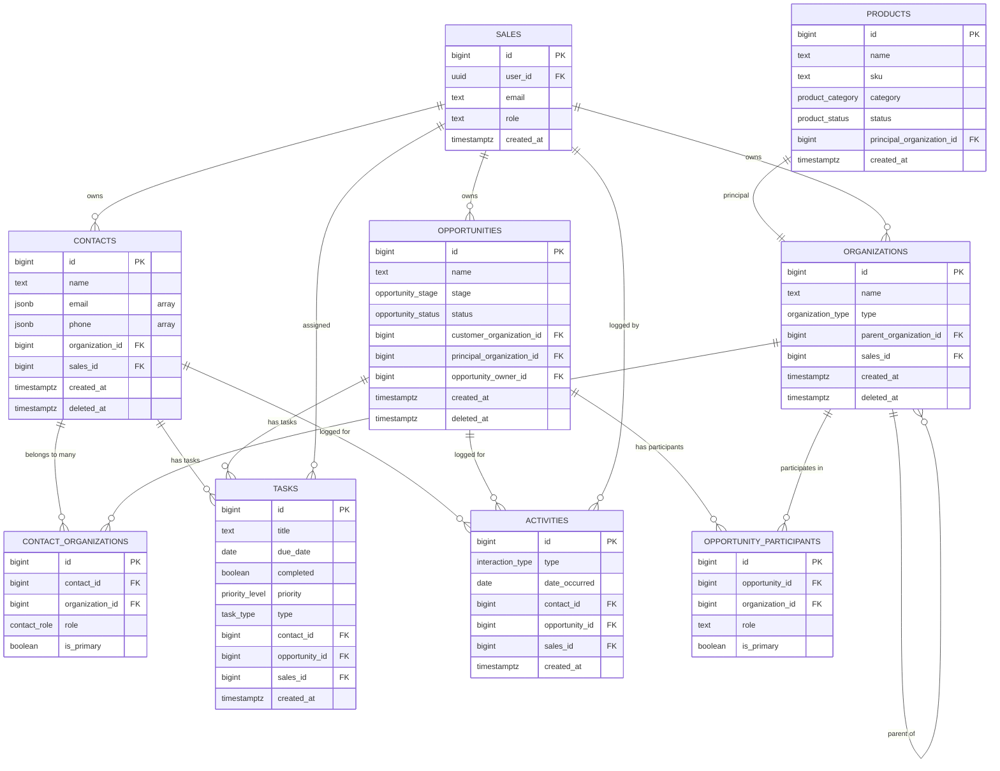

# Database Schema & ERD

## Overview

Atomic CRM uses PostgreSQL (via Supabase) with Row Level Security (RLS) enabled on all tables. The schema supports multi-tenant access with role-based permissions. All tables use `bigint` primary keys with auto-incrementing sequences.

## Core Entities

### contacts

**Purpose:** Individual people within organizations

**Key Fields:**
| Field | Type | Required | Description | Example |
|-------|------|----------|-------------|---------|
| id | bigint | Yes | Primary key (auto-increment) | 42 |
| name | text | Yes | Full name | "John Doe" |
| first_name | text | No | First name | "John" |
| last_name | text | No | Last name | "Doe" |
| email | jsonb | No | Array of {email, type} objects | `[{"email":"john@example.com","type":"Work"}]` |
| phone | jsonb | No | Array of {phone, type} objects | `[{"phone":"555-1234","type":"Mobile"}]` |
| title | text | No | Job title | "VP of Operations" |
| department | text | No | Department name | "Procurement" |
| organization_id | bigint | No | Primary organization FK | 15 |
| sales_id | bigint | No | Assigned sales rep FK | 7 |
| tags | bigint[] | No | Array of tag IDs | `{1,5,12}` |
| created_at | timestamptz | Yes | Creation timestamp | "2025-01-15 10:30:00+00" |
| updated_at | timestamptz | Yes | Last update timestamp | "2025-01-20 14:22:00+00" |
| deleted_at | timestamptz | No | Soft delete timestamp | NULL (active) |

**Relationships:**
- `organization_id` → `organizations.id` (primary organization)
- `sales_id` → `sales.id` (assigned sales representative)
- Many-to-many with organizations via `contact_organizations` junction table

**JSONB Array Pattern:**
- Email and phone use JSONB arrays with sub-objects
- Default value: `'[]'::jsonb` (empty array)
- Structure: `[{value, type}]` where type is user-defined (e.g., "Work", "Home", "Mobile")

---

### organizations

**Purpose:** Companies, principals, distributors, customers, prospects

**Key Fields:**
| Field | Type | Required | Description | Example |
|-------|------|----------|-------------|---------|
| id | bigint | Yes | Primary key (auto-increment) | 123 |
| name | text | Yes | Organization name | "Acme Corporation" |
| organization_type | organization_type | No | Type enum | 'customer' |
| is_principal | boolean | No | Flag for principals | true |
| is_distributor | boolean | No | Flag for distributors | false |
| parent_organization_id | bigint | No | Parent org FK (hierarchy) | 50 |
| priority | varchar(1) | No | Priority rating (A/B/C/D) | 'A' |
| website | text | No | URL | "https://acme.com" |
| phone | text | No | Main phone | "555-0100" |
| email | text | No | Main email | "info@acme.com" |
| annual_revenue | numeric(15,2) | No | Revenue in dollars | 5000000.00 |
| employee_count | integer | No | Number of employees | 250 |
| segment_id | uuid | No | Segment classification FK | UUID |
| sales_id | bigint | No | Assigned sales rep FK | 7 |
| created_at | timestamptz | Yes | Creation timestamp | "2025-01-10 09:00:00+00" |
| deleted_at | timestamptz | No | Soft delete timestamp | NULL (active) |

**Relationships:**
- `parent_organization_id` → `organizations.id` (self-referencing hierarchy)
- `segment_id` → `segments.id` (market segment)
- `sales_id` → `sales.id` (account owner)

**Enums:**
- `organization_type`: `customer`, `principal`, `distributor`, `prospect`, `partner`, `unknown`

---

### opportunities

**Purpose:** Sales pipeline tracking for potential deals

**Key Fields:**
| Field | Type | Required | Description | Example |
|-------|------|----------|-------------|---------|
| id | bigint | Yes | Primary key (auto-increment) | 456 |
| name | text | Yes | Opportunity name | "Q1 Widget Deal" |
| description | text | No | Detailed description | "500 units for..." |
| stage | opportunity_stage | No | Pipeline stage | 'demo_scheduled' |
| status | opportunity_status | No | Active status | 'active' |
| priority | priority_level | No | Priority level | 'high' |
| estimated_close_date | date | No | Expected close date | "2025-03-31" |
| customer_organization_id | bigint | No | Customer FK | 123 |
| principal_organization_id | bigint | No | Principal FK | 50 |
| distributor_organization_id | bigint | No | Distributor FK | 75 |
| opportunity_owner_id | bigint | No | Owner FK → sales.id | 7 |
| account_manager_id | bigint | No | Account manager FK | 7 |
| contact_ids | bigint[] | No | Array of contact IDs | `{42, 83}` |
| tags | text[] | No | Tag strings | `{urgent, big-deal}` |
| lead_source | text | No | Source enum | 'referral' |
| created_at | timestamptz | Yes | Creation timestamp | "2025-01-15 11:00:00+00" |
| deleted_at | timestamptz | No | Soft delete timestamp | NULL (active) |

**Relationships:**
- `customer_organization_id` → `organizations.id`
- `principal_organization_id` → `organizations.id`
- `distributor_organization_id` → `organizations.id`
- `opportunity_owner_id` → `sales.id`
- `account_manager_id` → `sales.id`
- Many-to-many with organizations via `opportunity_participants` junction table

**Stage Enum (`opportunity_stage`):**
| Stage | Description |
|-------|-------------|
| new_lead | Initial contact or inquiry |
| initial_outreach | First communication sent |
| sample_visit_offered | Product sample or site visit proposed |
| awaiting_response | Waiting for customer feedback |
| feedback_logged | Customer response recorded |
| demo_scheduled | Demonstration or presentation scheduled |
| closed_won | Deal successfully closed |
| closed_lost | Deal lost to competitor or abandoned |

**Status Enum (`opportunity_status`):**
- `active` - Currently being pursued
- `on_hold` - Temporarily paused
- `nurturing` - Long-term follow-up
- `stalled` - No recent progress
- `expired` - Opportunity no longer valid

**Lead Source Enum:**
- `referral`, `trade_show`, `website`, `cold_call`, `email_campaign`, `social_media`, `partner`, `existing_customer`

---

### tasks

**Purpose:** Action items and reminders for sales reps

**Key Fields:**
| Field | Type | Required | Description | Example |
|-------|------|----------|-------------|---------|
| id | bigint | Yes | Primary key (auto-increment) | 789 |
| title | text | Yes | Task description | "Follow up on demo" |
| description | text | No | Detailed notes | "Discuss pricing..." |
| due_date | date | No | Due date | "2025-01-25" |
| reminder_date | date | No | Reminder date | "2025-01-24" |
| completed | boolean | No | Completion status | false |
| completed_at | timestamptz | No | Completion timestamp | NULL |
| priority | priority_level | No | Priority | 'high' |
| type | task_type | No | Task category | 'Call' |
| contact_id | bigint | No | Related contact FK | 42 |
| opportunity_id | bigint | No | Related opportunity FK | 456 |
| sales_id | bigint | No | Assigned sales rep FK | 7 |
| created_at | timestamptz | Yes | Creation timestamp | "2025-01-15 12:00:00+00" |
| updated_at | timestamptz | Yes | Last update timestamp | "2025-01-20 09:15:00+00" |

**Relationships:**
- `contact_id` → `contacts.id`
- `opportunity_id` → `opportunities.id`
- `sales_id` → `sales.id`

**Type Enum (`task_type`):**
- `Call`, `Email`, `Meeting`, `Follow-up`, `Proposal`, `Discovery`, `Administrative`, `None`

**Priority Enum (`priority_level`):**
- `low`, `medium`, `high`, `critical`

---

### products

**Purpose:** Product/service catalog

**Key Fields:**
| Field | Type | Required | Description | Example |
|-------|------|----------|-------------|---------|
| id | bigint | Yes | Primary key (auto-increment) | 101 |
| name | text | Yes | Product name | "Premium Widget" |
| sku | text | No | Stock keeping unit | "WDG-001-PRM" |
| category | product_category | No | Category enum | 'equipment' |
| status | product_status | No | Product status | 'active' |
| is_seasonal | boolean | No | Seasonal availability | true |
| season_start_month | integer | No | Season start (1-12) | 4 |
| season_end_month | integer | No | Season end (1-12) | 10 |
| principal_organization_id | bigint | No | Principal FK | 50 |
| created_at | timestamptz | Yes | Creation timestamp | "2025-01-01 00:00:00+00" |
| deleted_at | timestamptz | No | Soft delete timestamp | NULL (active) |

**Relationships:**
- `principal_organization_id` → `organizations.id`

**Category Enum (`product_category`):**
- `beverages`, `dairy`, `frozen`, `fresh_produce`, `meat_poultry`, `seafood`, `dry_goods`, `snacks`, `condiments`, `baking_supplies`, `spices_seasonings`, `canned_goods`, `pasta_grains`, `oils_vinegars`, `sweeteners`, `cleaning_supplies`, `paper_products`, `equipment`, `other`

---

### sales

**Purpose:** Sales representatives and team members

**Key Fields:**
| Field | Type | Required | Description | Example |
|-------|------|----------|-------------|---------|
| id | bigint | Yes | Primary key (auto-increment) | 7 |
| user_id | uuid | No | Auth user FK (auth.users) | UUID |
| email | text | Yes | Email address | "sales@example.com" |
| role | text | No | User role | 'admin' |
| administrator | boolean | No | Admin flag (computed) | true |
| created_at | timestamptz | Yes | Creation timestamp | "2025-01-01 00:00:00+00" |

**Relationships:**
- `user_id` → `auth.users.id` (Supabase auth)

**Roles:**
- `admin` - Full system access
- `sales_director` - Team oversight
- `account_manager` - Individual contributor

**Note:** The `administrator` column is a computed column based on `role = 'admin'` for backward compatibility. Always use the `role` column as the single source of truth.

---

### activities

**Purpose:** Log interactions (calls, emails, meetings, etc.)

**Key Fields:**
| Field | Type | Required | Description | Example |
|-------|------|----------|-------------|---------|
| id | bigint | Yes | Primary key (auto-increment) | 999 |
| interaction_type | interaction_type | Yes | Type of interaction | 'call' |
| summary | text | No | Brief summary | "Discussed pricing" |
| date_occurred | date | Yes | Interaction date | "2025-01-20" |
| contact_id | bigint | No | Related contact FK | 42 |
| opportunity_id | bigint | No | Related opportunity FK | 456 |
| sales_id | bigint | No | Sales rep who logged FK | 7 |
| created_at | timestamptz | Yes | Creation timestamp | "2025-01-20 14:30:00+00" |

**Relationships:**
- `contact_id` → `contacts.id`
- `opportunity_id` → `opportunities.id`
- `sales_id` → `sales.id`

**Interaction Type Enum (`interaction_type`):**
- `call`, `email`, `meeting`, `demo`, `proposal`, `follow_up`, `trade_show`, `site_visit`, `contract_review`, `check_in`, `social`

---

## Junction Tables

### contact_organizations

**Purpose:** Many-to-many relationship between contacts and organizations

**Key Fields:**
| Field | Type | Required | Description |
|-------|------|----------|-------------|
| id | bigint | Yes | Primary key |
| contact_id | bigint | Yes | FK → contacts.id |
| organization_id | bigint | Yes | FK → organizations.id |
| role | contact_role | No | Contact's role in organization |
| is_primary | boolean | No | Primary organization flag |
| is_primary_decision_maker | boolean | No | Decision maker flag |
| purchase_influence | smallint | No | Influence rating (1-10) |
| created_at | timestamptz | Yes | Creation timestamp |
| deleted_at | timestamptz | No | Soft delete timestamp |

**Role Enum (`contact_role`):**
- `decision_maker`, `influencer`, `buyer`, `end_user`, `gatekeeper`, `champion`, `technical`, `executive`

---

### opportunity_participants

**Purpose:** Many-to-many relationship between opportunities and organizations (customer/principal/distributor roles)

**Key Fields:**
| Field | Type | Required | Description |
|-------|------|----------|-------------|
| id | bigint | Yes | Primary key |
| opportunity_id | bigint | Yes | FK → opportunities.id |
| organization_id | bigint | Yes | FK → organizations.id |
| role | text | Yes | Participant role (customer/principal/distributor) |
| is_primary | boolean | No | Primary participant flag |
| commission_rate | numeric(5,2) | No | Commission percentage |
| created_at | timestamptz | Yes | Creation timestamp |

---

## Entity Relationship Diagram

---

## Row Level Security (RLS)

All tables have RLS enabled with the following patterns:

**Team-Wide Access (Shared Data):**
- Contacts, Organizations, Opportunities: All authenticated users can read/write
- Policy: `USING (deleted_at IS NULL)` for SELECT
- Policy: `USING (true)` for INSERT

**Personal Data:**
- Tasks: Users can only access their own tasks
- Policy: `USING (sales_id IN (SELECT id FROM sales WHERE user_id = auth.uid()))`

**Admin-Only Modifications:**
- UPDATE/DELETE policies on shared tables require admin role
- Policy: `USING ((SELECT is_admin FROM sales WHERE user_id = auth.uid()) = true)`

**Reference Migration:** See migrations `20251018203500_update_rls_for_shared_team_access.sql` and `20251108213039_fix_rls_policies_role_based_access.sql`

---

## Soft Delete Pattern

All core tables use soft delete via `deleted_at` timestamp:
- Active records: `deleted_at IS NULL`
- Deleted records: `deleted_at IS NOT NULL`
- Queries MUST filter: `WHERE deleted_at IS NULL`

---

## Audit Fields

Standard audit fields on all tables:
- `created_at` - Timestamp of record creation
- `updated_at` - Timestamp of last update (auto-updated by trigger)
- `created_by` - FK to sales.id (who created the record)
- `deleted_at` - Soft delete timestamp

---

## Full Table List

Core tables documented above:
- contacts, organizations, opportunities, tasks, products, sales, activities

Additional tables (see migrations for details):
- contactNotes, opportunityNotes - Notes attached to contacts/opportunities
- contact_preferred_principals - Contact preferences for principals
- interaction_participants - Additional participants in activities
- segments, tags - Categorization and tagging
- product_* tables - Product pricing, features, inventory, distributor authorizations
- test_user_metadata, migration_history - System tables

---

## Migration Files

Schema is defined in git-tracked migrations in `supabase/migrations/`:
- `20251018152315_cloud_schema_fresh.sql` - Complete initial schema (3,396 lines)
- Subsequent migrations add incremental changes

Apply migrations: `npx supabase db push` (local) or `npm run db:cloud:push` (production)
