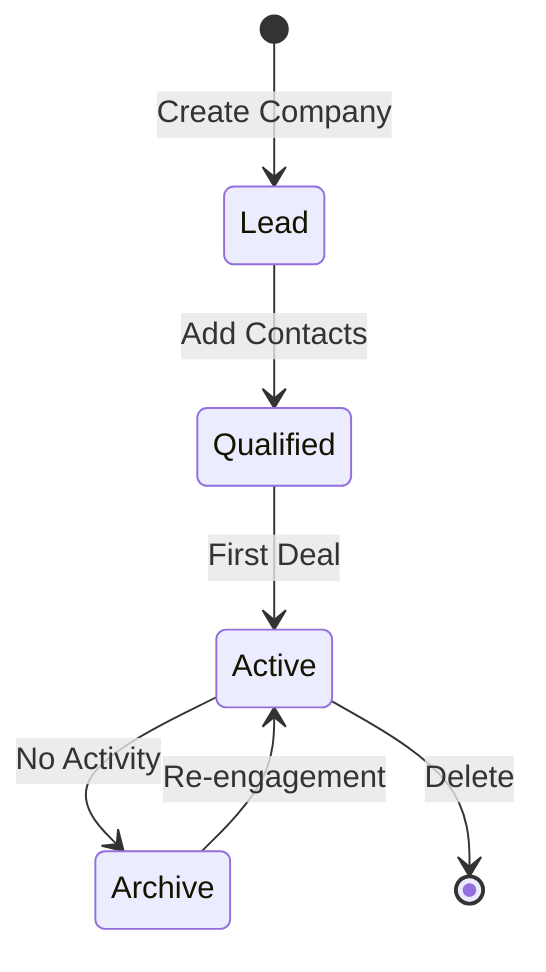
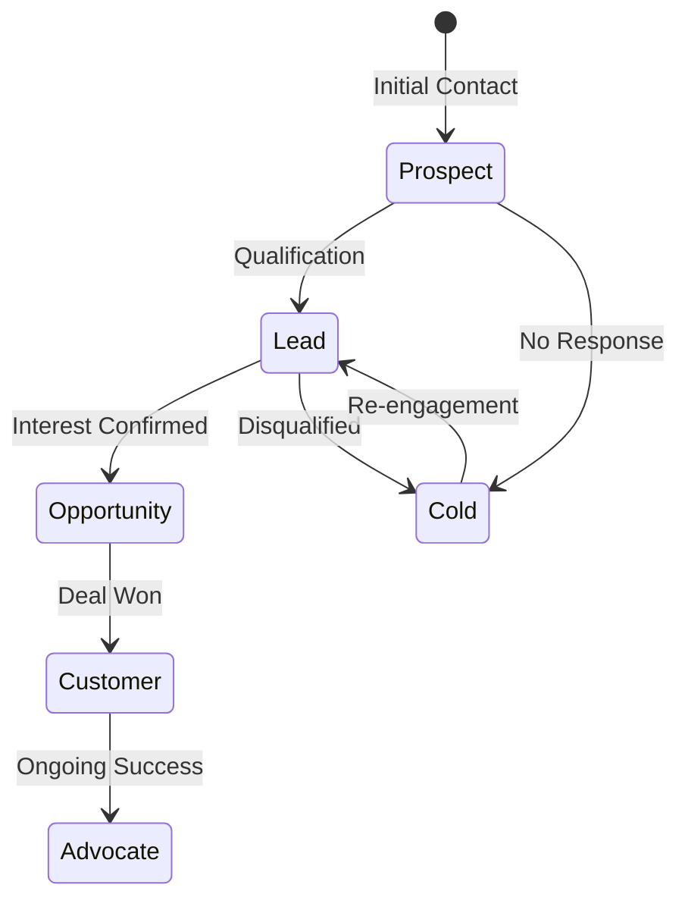
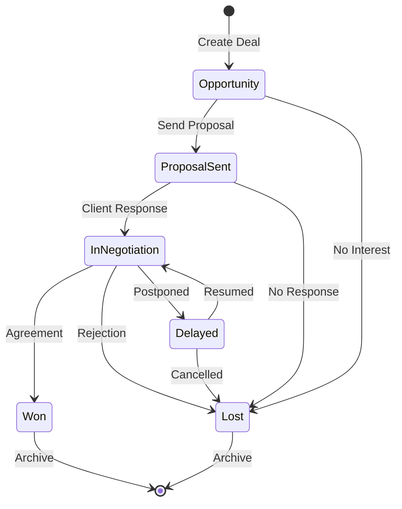
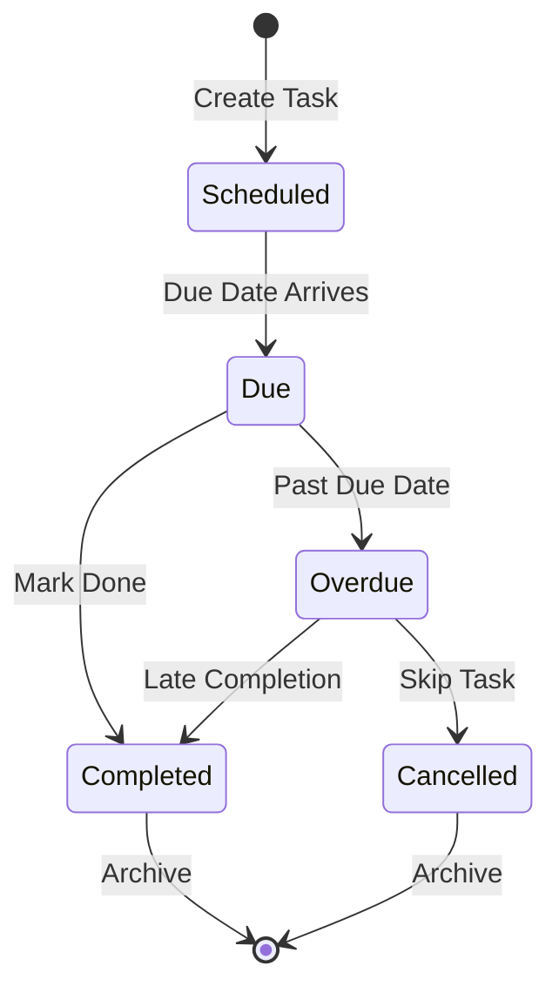
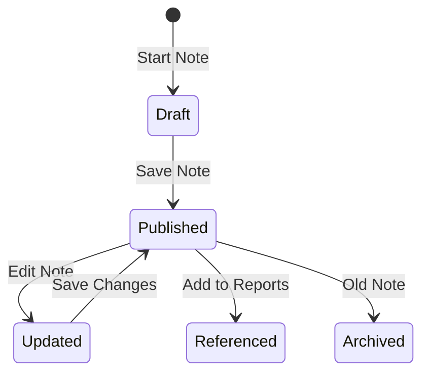
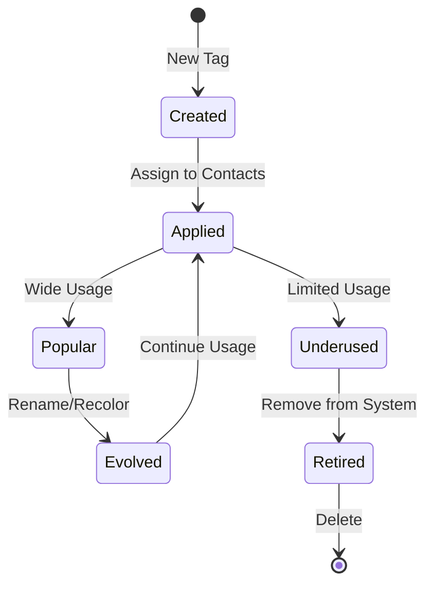

# Entity Lifecycle Cheat Sheets

## Overview
This document provides quick reference guides for the complete lifecycle of each major entity in the Atomic CRM system, including state transitions, automation rules, and business logic.

## User & Authentication Lifecycle

### User Registration → Sales Team Member

```mermaid
graph LR
    A[Sign Up Form] --> B[Supabase Auth]
    B --> C[auth.users INSERT]
    C --> D[handle_new_user() Trigger]
    D --> E[sales Table INSERT]
    E --> F{First User?}
    F -->|Yes| G[administrator = TRUE]
    F -->|No| H[administrator = FALSE]
    G --> I[Active Sales Rep]
    H --> I
```

#### States
1. **Pending**: User submitted registration, email verification required
2. **Active**: Email confirmed, sales record created
3. **Disabled**: Account deactivated (`sales.disabled = true`)

#### Automation Rules
- **First User Rule**: First sales record gets `administrator = true`
- **Profile Sync**: Changes to auth.users automatically sync to sales table
- **Data Isolation**: Each user gets access to all data (collaborative model)

#### Lifecycle Events
```sql
-- User updates profile
UPDATE auth.users SET raw_user_meta_data = '{"first_name": "New Name"}'
-- Triggers: handle_update_user() → sales table sync

-- User account disabled
UPDATE sales SET disabled = true WHERE user_id = 'uuid';
-- Result: User retains auth access but loses app functionality
```

---

## Company Lifecycle

### Lead → Qualified Company → Active Customer



#### Creation Process
1. **Initial Entry**: Company created with basic information
2. **Enrichment**: Add contacts, deals, detailed information
3. **Assignment**: Linked to sales representative
4. **Relationship Building**: Notes, tasks, ongoing engagement

#### Key Transitions
- **Lead → Qualified**: First contact added
- **Qualified → Active**: First deal created
- **Active → Archive**: No activity for extended period (manual)
- **Archive → Active**: Re-engagement or new opportunity

#### Business Rules
```sql
-- Companies with deals and contacts are "Active"
SELECT c.* FROM companies c
WHERE EXISTS (SELECT 1 FROM deals d WHERE d.company_id = c.id)
  AND EXISTS (SELECT 1 FROM contacts co WHERE co.company_id = c.id);

-- Companies needing attention (no recent activity)
SELECT c.* FROM companies c
LEFT JOIN deals d ON d.company_id = c.id
WHERE d.updated_at < NOW() - INTERVAL '90 days'
   OR d.id IS NULL;
```

#### Cascade Effects
- **Delete Company** → Cascades to contacts, deals, notes
- **Archive Company** → Deals remain active (business decision)
- **Change Sales Rep** → Can reassign entire company relationship

---

## Contact Lifecycle

### Prospect → Lead → Opportunity → Customer



#### Contact Status Flow
| Status | Definition | Typical Actions | Next Steps |
|--------|------------|-----------------|------------|
| **Prospect** | Initial contact, unqualified | Research, first outreach | Qualification call |
| **Lead** | Qualified interest | Needs analysis, demos | Proposal development |
| **Opportunity** | Active sales process | Negotiation, contracts | Deal closure |
| **Customer** | Active business relationship | Account management | Expansion opportunities |
| **Cold** | Inactive/unresponsive | Minimal touch campaigns | Re-engagement strategy |

#### Automation Triggers
```sql
-- Auto-update last_seen on note creation
UPDATE contacts SET last_seen = NOW()
WHERE id IN (SELECT contact_id FROM "contactNotes" WHERE date >= NOW() - INTERVAL '1 day');

-- Flag contacts needing follow-up
SELECT c.*,
       CASE
         WHEN last_seen < NOW() - INTERVAL '30 days' THEN 'Needs Follow-up'
         WHEN last_seen < NOW() - INTERVAL '60 days' THEN 'Going Cold'
         WHEN last_seen < NOW() - INTERVAL '90 days' THEN 'Cold'
       END as engagement_status
FROM contacts c;
```

#### Tag Evolution
- **Early Stage**: demographic tags (`manager`, `influencer`)
- **Qualification**: interest tags (`hot`, `warm`, `cold`)
- **Relationship**: personal tags (`football-fan`, `musician`)
- **Seasonal**: time-based tags (`holiday-card`)

---

## Deal Lifecycle

### Opportunity → Closed (Won/Lost)



#### Stage Definitions
| Stage | Description | Typical Duration | Success Rate | Key Activities |
|-------|-------------|------------------|--------------|----------------|
| `opportunity` | Initial interest identified | 1-2 weeks | 40% | Discovery, qualification |
| `proposal-sent` | Formal proposal submitted | 1-3 weeks | 60% | Follow-up, clarifications |
| `in-negociation` | Active discussions | 2-4 weeks | 80% | Terms, pricing, contracts |
| `won` | Deal closed successfully | Final | 100% | Implementation, onboarding |
| `lost` | Deal did not close | Final | 0% | Post-mortem analysis |
| `delayed` | Temporarily on hold | Variable | 30% | Periodic check-ins |

#### Stage Progression Rules
```sql
-- Typical forward progression
UPDATE deals SET
  stage = 'proposal-sent',
  updated_at = NOW()
WHERE id = deal_id AND stage = 'opportunity';

-- Backward movement allowed (regression analysis)
UPDATE deals SET
  stage = 'opportunity',
  updated_at = NOW()
WHERE id = deal_id AND stage = 'proposal-sent';

-- Final stages (won/lost) typically don't change
-- If needed, create new deal for continued engagement
```

#### Business Automation
- **Pipeline Reporting**: Only active stages (`opportunity`, `proposal-sent`, `in-negociation`, `delayed`)
- **Revenue Forecasting**: Weight stages by historical conversion rates
- **Activity Triggers**: Automatic task creation based on stage transitions
- **Archive Logic**: Won/Lost deals soft-archived via `archived_at`

#### Deal Value Evolution
```sql
-- Track deal value changes over time
-- (Requires custom audit table or deal history)
INSERT INTO deal_history (deal_id, stage, amount, changed_at)
VALUES (deal_id, new_stage, new_amount, NOW());
```

---

## Task Lifecycle

### Created → Due → Completed/Overdue



#### Task States
| State | Condition | Visual Indicator | Actions Available |
|-------|-----------|------------------|-------------------|
| **Scheduled** | `due_date > NOW() AND done_date IS NULL` | Blue | Edit, Complete, Delete |
| **Due Today** | `due_date::date = CURRENT_DATE AND done_date IS NULL` | Orange | Complete, Reschedule |
| **Overdue** | `due_date < NOW() AND done_date IS NULL` | Red | Complete, Reschedule, Cancel |
| **Completed** | `done_date IS NOT NULL` | Green | View Only |

#### Task Management Queries
```sql
-- Today's tasks
SELECT * FROM tasks
WHERE due_date::date = CURRENT_DATE
  AND done_date IS NULL
ORDER BY due_date;

-- Overdue tasks
SELECT t.*, c.first_name, c.last_name
FROM tasks t
JOIN contacts c ON t.contact_id = c.id
WHERE t.due_date < NOW()
  AND t.done_date IS NULL
ORDER BY t.due_date;

-- Productivity metrics
SELECT
  COUNT(*) as total_tasks,
  COUNT(done_date) as completed_tasks,
  COUNT(CASE WHEN done_date > due_date THEN 1 END) as late_completions
FROM tasks
WHERE created_at >= NOW() - INTERVAL '30 days';
```

#### Task Type Workflows
- **Email**: Often completed same day, high frequency
- **Call**: Scheduled for specific times, follow-up dependent
- **Meeting**: Tied to calendar events, preparation tasks
- **Demo**: Requires preparation, follow-up tasks generated
- **Follow-up**: Created automatically after meetings/calls

---

## Note Lifecycle

### Draft → Published → Referenced



#### Note Status Evolution
| Status | Meaning | Color | Usage Context |
|--------|---------|-------|---------------|
| `cold` | Low priority/interest | Blue | Initial contact, research |
| `warm` | Moderate engagement | Yellow | Active conversation |
| `hot` | High priority/urgency | Red | Immediate action needed |
| `in-contract` | Active business | Green | Ongoing customer |

#### Note Attachments Lifecycle
```sql
-- Attachments linked to notes
INSERT INTO "contactNotes" (contact_id, text, attachments, sales_id)
VALUES (contact_id, 'Proposal discussion',
        '[{"src": "path/to/file.pdf", "title": "Proposal v2"}]'::jsonb[],
        sales_id);

-- File cleanup (manual process)
-- 1. Identify orphaned files in storage
-- 2. Check attachment references
-- 3. Remove unused files
```

---

## Tag Lifecycle

### Created → Applied → Evolved → Retired



#### Tag Management
```sql
-- Tag usage statistics
SELECT t.name, t.color,
       COUNT(DISTINCT contact_id) as usage_count
FROM tags t
LEFT JOIN contacts c ON t.id = ANY(c.tags)
GROUP BY t.id, t.name, t.color
ORDER BY usage_count DESC;

-- Retire unused tags
DELETE FROM tags
WHERE id NOT IN (
  SELECT DISTINCT unnest(tags)
  FROM contacts
  WHERE tags IS NOT NULL
);

-- Update tag color (semantic system)
UPDATE tags SET color = 'blue'
WHERE color = 'purple' AND name LIKE '%professional%';
```

## Integration Points and Dependencies

### Cross-Entity Impacts
- **Company Deletion** → Cascades to all related entities
- **Contact Status Change** → May trigger task creation
- **Deal Stage Change** → Updates pipeline reports
- **User Disable** → Retains data but blocks access
- **Tag Retirement** → Clean up contact tag arrays

### Audit and Compliance
- **Change Tracking**: Via `updated_at` timestamps
- **User Attribution**: Via `sales_id` foreign keys
- **Data Retention**: Soft deletes for deals (`archived_at`)
- **Access Logs**: Supabase auth and RLS tracking

### Performance Considerations
- **Large Arrays**: Monitor tag array sizes for performance
- **Cascade Operations**: Company deletes can be expensive
- **View Refreshes**: Summary views update with underlying data
- **Index Maintenance**: Entity growth affects query performance