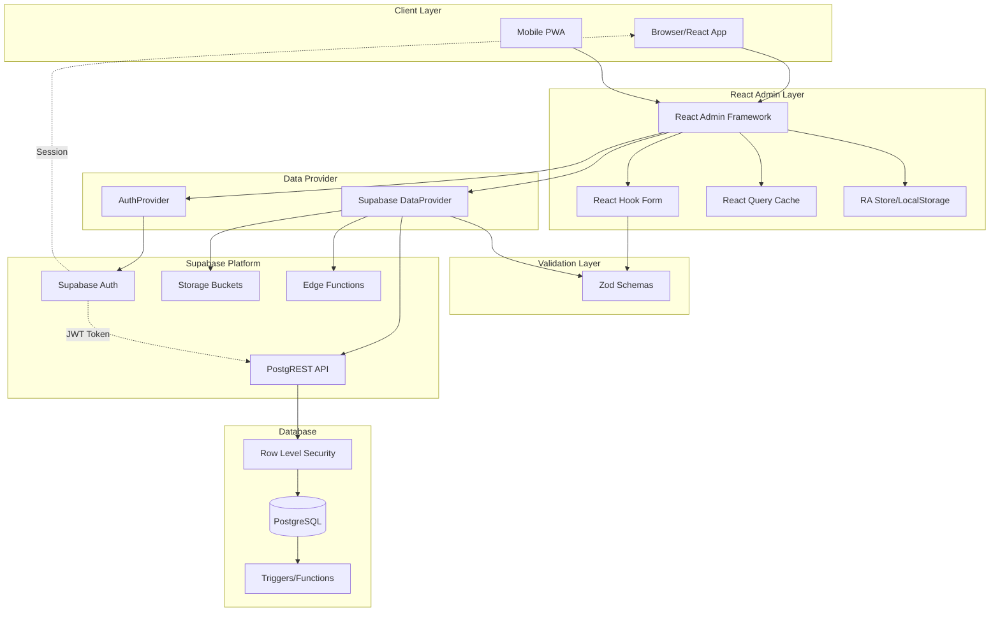

# System Context & Data Flow Diagram

## Overview
This document illustrates the complete data flow architecture of the Atomic CRM system, showing how components communicate and how authentication flows through the system.

## System Architecture



## Data Flow Patterns

### 1. Standard CRUD Operation Flow
```
1. User Action in React Component
   ↓
2. React Admin Hook (useCreate, useUpdate, etc.)
   ↓
3. React Hook Form Validation
   ↓
4. DataProvider Method Call
   ↓
5. Zod Schema Validation at API Boundary
   ↓
6. Supabase Client Request with JWT
   ↓
7. PostgREST API Processing
   ↓
8. RLS Policy Check (auth.role() = 'authenticated')
   ↓
9. PostgreSQL Operation
   ↓
10. Trigger Execution (search vectors, timestamps)
   ↓
11. Response Transformation
   ↓
12. React Query Cache Update
   ↓
13. UI State Update
```

### 2. Authentication Flow
```
1. User Login Request
   ↓
2. AuthProvider.login()
   ↓
3. Supabase Auth (Email/Google/Azure/Keycloak/Auth0)
   ↓
4. JWT Token Generation
   ↓
5. Token Storage in localStorage
   ↓
6. Session Creation
   ↓
7. Load User Profile from 'sales' table
   ↓
8. Cache Identity with Admin Flag
   ↓
9. Redirect to Dashboard
```

### 3. File Upload Flow
```
1. File Selection in Form
   ↓
2. Convert to Blob/Data URL
   ↓
3. DataProvider Upload Handler
   ↓
4. Upload to Supabase Storage 'attachments' bucket
   ↓
5. Generate Public URL
   ↓
6. Store URL Reference in Database
   ↓
7. Return URL to Component
```

## Authentication & Authorization

### Authentication Providers
- **Email/Password**: Standard Supabase Auth
- **Google OAuth**: Social authentication
- **Azure AD**: Enterprise SSO
- **Keycloak**: Open source IAM
- **Auth0**: Third-party identity platform

### Authorization Model
```typescript
// Binary role system
interface UserRole {
  is_admin: boolean;  // From sales.is_admin field
}

// RLS Policy (all tables)
CREATE POLICY "authenticated_users_only"
FOR ALL
USING (auth.role() = 'authenticated' AND deleted_at IS NULL)
```

### Token Flow
1. **Initial Auth**: User authenticates → Supabase issues JWT
2. **Token Storage**: JWT stored in localStorage
3. **API Calls**: Every request includes `Authorization: Bearer ${token}`
4. **RLS Verification**: PostgreSQL checks `auth.role()` function
5. **Token Refresh**: Automatic refresh before expiry

## Edge Functions

### Available Endpoints

#### `/users` - User Management
```typescript
POST /users
// Create new sales user (admin only)
{
  email: string,
  password: string,
  first_name: string,
  last_name: string,
  is_admin?: boolean
}

PATCH /users/:id
// Update user profile
{
  first_name?: string,
  last_name?: string,
  avatar_url?: string,
  disabled?: boolean
}
```

#### `/updatePassword` - Password Reset
```typescript
PATCH /updatePassword/:id
// Reset user password (admin only)
{
  password: string
}
```

#### `/postmark` - Email Webhook
```typescript
POST /postmark
// Inbound email processing
// Creates contact notes from emails
// IP whitelist + Basic auth required
```

## State Management Architecture

### React Admin Store
- Resource data caching
- UI preferences (filters, sort, pagination)
- Persisted to localStorage

### React Query
- Server state caching
- Automatic background refetch
- Optimistic updates with rollback
- Cache invalidation on mutations

### Local Component State
- Form dirty state
- UI toggles (modals, accordions)
- Temporary selections

## Error Handling Flow

### Error Response Format
```typescript
interface ErrorResponse {
  message: string;
  errors?: {
    [fieldPath: string]: string;
  };
  status?: number;
}
```

### Error Propagation
1. **Database Error** → Trigger logs → PostgREST formats
2. **Validation Error** → Zod catches → DataProvider formats
3. **Network Error** → Supabase client retries → Throws to UI
4. **UI Display** → React Admin shows notification

## Performance Optimizations

### Database Level
- **Summary Views**: Optimized queries for list operations
- **GIN Indexes**: Full-text search on tsvector columns
- **Partial Indexes**: Filtered queries on active records
- **Generated Columns**: Pre-calculated values

### Application Level
- **Lazy Loading**: Code splitting for routes
- **React Query Cache**: Prevents redundant API calls
- **Optimistic Updates**: Immediate UI feedback
- **Batch Operations**: Multiple mutations in single transaction

## Security Measures

### Database Security
- Row Level Security on all tables
- Soft deletes preserve audit trail
- Trigger validation for business rules
- No direct table access

### Application Security
- JWT-based authentication
- HTTPS-only communication
- Input validation via Zod
- XSS protection in React
- CSRF protection via SameSite cookies

### API Security
- Rate limiting on Edge Functions
- IP whitelist for webhooks
- Admin-only operations checked
- Parameterized queries prevent SQL injection

## Monitoring Points

### Key Metrics
- API response times
- Database query performance
- Authentication success/failure rates
- File upload success rates
- Error rates by type

### Logging
- Structured logs with correlation IDs
- User action tracking
- Error stack traces
- Performance timing

This system architecture ensures secure, performant, and maintainable data flow throughout the Atomic CRM application.