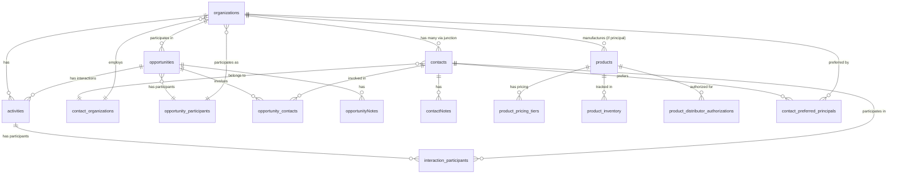

# Entity Relationship Diagram (ERD)

## Overview
This document provides a visual representation of the Atomic CRM database schema, showing all 24 tables, their relationships, and foreign key constraints. The system uses an opportunities-first design with multi-stakeholder support.

## Core Entity Relationships



## Detailed Table Relationships

### Primary Entities

#### organizations (companies)
```sql
PRIMARY KEY: id (bigint)
FOREIGN KEYS:
  - parent_company_id → organizations(id)  -- Self-referential hierarchy
  - sales_id → sales(id)                   -- Assigned salesperson

REFERENCED BY:
  - contacts.company_id (deprecated)
  - contact_organizations.organization_id
  - opportunities.customer_organization_id
  - opportunities.principal_organization_id
  - opportunities.distributor_organization_id
  - opportunity_participants.organization_id
  - activities.organization_id
  - products.principal_id
  - product_distributor_authorizations.distributor_id
```

#### contacts
```sql
PRIMARY KEY: id (bigint)
FOREIGN KEYS:
  - company_id → organizations(id)  -- Deprecated, use contact_organizations
  - tags → tags(id)[]               -- Array of tag references

REFERENCED BY:
  - contact_organizations.contact_id
  - opportunity_contacts.contact_id
  - contactNotes.contact_id
  - activities.contact_id
  - interaction_participants.contact_id
  - contact_preferred_principals.contact_id
```

#### opportunities
```sql
PRIMARY KEY: id (bigint)
FOREIGN KEYS:
  - customer_organization_id → organizations(id)
  - principal_organization_id → organizations(id)
  - distributor_organization_id → organizations(id)
  - founding_interaction_id → activities(id)
  - contact_ids → contacts(id)[]  -- Array of contacts

REFERENCED BY:
  - opportunity_participants.opportunity_id
  - opportunity_contacts.opportunity_id
  - opportunityNotes.opportunity_id
  - activities.opportunity_id
```

#### products
```sql
PRIMARY KEY: id (bigint)
FOREIGN KEYS:
  - principal_id → organizations(id)  -- Manufacturing company

REFERENCED BY:
  - product_pricing_tiers.product_id
  - product_inventory.product_id
  - product_distributor_authorizations.product_id
```

### Junction Tables (Many-to-Many)

#### contact_organizations
```sql
COMPOSITE KEY: (contact_id, organization_id)
FOREIGN KEYS:
  - contact_id → contacts(id) ON DELETE CASCADE
  - organization_id → organizations(id) ON DELETE CASCADE

Purpose: Many-to-many relationship between contacts and organizations
Fields:
  - is_primary (boolean)
  - role (enum)
  - purchase_influence (0-100)
  - decision_authority (0-100)
  - relationship_start_date
```

#### opportunity_participants
```sql
PRIMARY KEY: id (bigint)
FOREIGN KEYS:
  - opportunity_id → opportunities(id) ON DELETE CASCADE
  - organization_id → organizations(id) ON DELETE CASCADE

Purpose: Multi-stakeholder opportunities
Fields:
  - role (customer/principal/distributor/partner)
  - is_primary (boolean)
  - commission_rate (0.00-1.00)
  - territory (text)
```

#### opportunity_contacts
```sql
COMPOSITE KEY: (opportunity_id, contact_id)
FOREIGN KEYS:
  - opportunity_id → opportunities(id) ON DELETE CASCADE
  - contact_id → contacts(id) ON DELETE CASCADE

Purpose: Link contacts to opportunities
Fields:
  - role (text)
  - is_primary (boolean)
```

#### contact_preferred_principals
```sql
COMPOSITE KEY: (contact_id, principal_organization_id)
FOREIGN KEYS:
  - contact_id → contacts(id) ON DELETE CASCADE
  - principal_organization_id → organizations(id) ON DELETE CASCADE

Purpose: Track contact preferences for principals
Fields:
  - advocacy_strength (0-100)
  - last_interaction_date
```

### Activity System

#### activities
```sql
PRIMARY KEY: id (bigint)
FOREIGN KEYS:
  - contact_id → contacts(id)
  - organization_id → organizations(id)
  - opportunity_id → opportunities(id)  -- NULL for engagements

Types:
  - engagement: General activity without opportunity
  - interaction: Opportunity-specific activity
```

#### interaction_participants
```sql
PRIMARY KEY: id (bigint)
FOREIGN KEYS:
  - interaction_id → activities(id) ON DELETE CASCADE
  - contact_id → contacts(id)

Purpose: Track meeting attendees
```

### Product Ecosystem

#### product_pricing_tiers
```sql
PRIMARY KEY: id (bigint)
FOREIGN KEYS:
  - product_id → products(id) ON DELETE CASCADE

Purpose: Volume-based pricing
Fields:
  - tier_name, min_quantity, max_quantity
  - unit_price, discount_percent
  - effective_date, expiration_date
```

#### product_inventory
```sql
PRIMARY KEY: id (bigint)
FOREIGN KEYS:
  - product_id → products(id) ON DELETE CASCADE

Purpose: Stock management
Fields:
  - warehouse_location
  - quantity_on_hand, quantity_committed
  - quantity_available (generated: on_hand - committed)
  - reorder_point
```

#### product_distributor_authorizations
```sql
PRIMARY KEY: id (bigint)
FOREIGN KEYS:
  - product_id → products(id) ON DELETE CASCADE
  - distributor_id → organizations(id) ON DELETE CASCADE

Purpose: Distribution rights
Fields:
  - is_authorized, authorization_date
  - special_pricing (jsonb)
  - territory_restrictions[]
```

### Notes & Tasks

#### contactNotes
```sql
PRIMARY KEY: id (bigint)
FOREIGN KEYS:
  - contact_id → contacts(id)
  - company_id → organizations(id)
  - created_by → sales(id)
```

#### opportunityNotes
```sql
PRIMARY KEY: id (bigint)
FOREIGN KEYS:
  - opportunity_id → opportunities(id) ON DELETE CASCADE
  - contact_id → contacts(id)
  - created_by → sales(id)
```

#### tasks
```sql
PRIMARY KEY: id (bigint)
FOREIGN KEYS:
  - related_to_id (polymorphic - can reference any entity)
  - assigned_to → sales(id)
  - created_by → sales(id)
```

### Supporting Tables

#### sales (Users)
```sql
PRIMARY KEY: id (bigint)
FOREIGN KEYS:
  - user_id → auth.users(id)

REFERENCED BY:
  - organizations.sales_id
  - tasks.assigned_to/created_by
  - contactNotes.created_by
  - opportunityNotes.created_by
```

#### tags
```sql
PRIMARY KEY: id (bigint)
REFERENCED BY:
  - contacts.tags[]  -- Array reference
  - companies.tags[] -- Array reference
```

## Relationship Cardinalities

### One-to-Many
- Organization → Products (principal manufactures products)
- Organization → Activities (company has activities)
- Opportunity → Notes (opportunity has many notes)
- Contact → Notes (contact has many notes)

### Many-to-Many
- Contacts ↔ Organizations (via contact_organizations)
- Opportunities ↔ Organizations (via opportunity_participants)
- Opportunities ↔ Contacts (via opportunity_contacts)
- Products ↔ Distributors (via product_distributor_authorizations)
- Contacts ↔ Principals (via contact_preferred_principals)

### Self-Referential
- Organizations → Organizations (parent_company_id for hierarchy)

## Special Relationships

### Multi-Stakeholder Opportunities
An opportunity can have multiple participating organizations:
- **Customer**: The buying organization
- **Principal**: The manufacturer/supplier
- **Distributor**: The intermediary
- **Partner**: Additional stakeholders

### Activity Distinction
Activities are split by context:
- **Engagements**: `opportunity_id IS NULL` - General networking
- **Interactions**: `opportunity_id IS NOT NULL` - Deal-specific

### Contact Multi-Organization
Contacts can work for multiple organizations simultaneously:
- Different roles per organization
- Varying influence/authority scores
- Primary organization designation

## Cascade Rules

### DELETE CASCADE Applied To:
- Junction tables when parent entity deleted
- Opportunity notes when opportunity deleted
- Product pricing/inventory when product deleted
- Activity participants when activity deleted

### SOFT DELETE (deleted_at) Applied To:
- All primary entities (organizations, contacts, opportunities, products)
- Preserves referential integrity and audit trail

## Indexing Strategy for Relationships

### Foreign Key Indexes
All foreign keys have indexes for join performance:
```sql
CREATE INDEX idx_opportunities_customer_org
  ON opportunities(customer_organization_id)
  WHERE deleted_at IS NULL;

CREATE INDEX idx_contact_organizations_lookup
  ON contact_organizations(contact_id, organization_id)
  WHERE deleted_at IS NULL;
```

### Composite Indexes for Queries
```sql
CREATE INDEX idx_opportunity_participants_lookup
  ON opportunity_participants(opportunity_id, organization_id, role);

CREATE INDEX idx_pricing_tiers_product_quantity
  ON product_pricing_tiers(product_id, min_quantity, max_quantity);
```

This ERD represents a sophisticated CRM schema designed for complex B2B relationships with multi-stakeholder sales processes, flexible contact management, and comprehensive product distribution tracking.