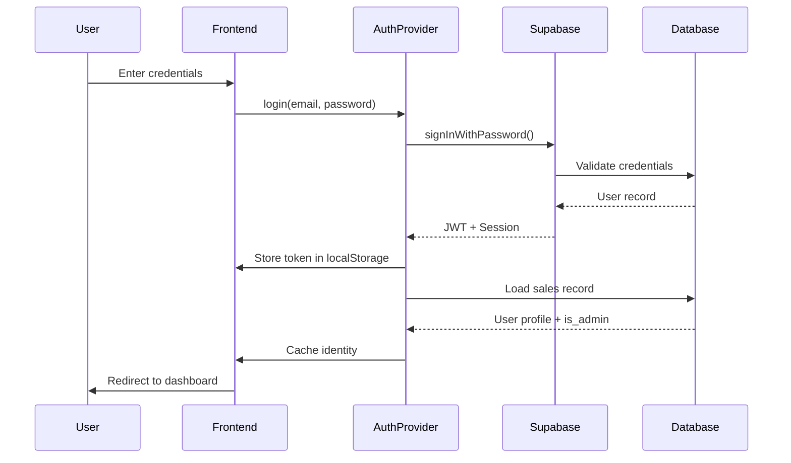

# Authentication & Access Control

## Overview
This document details the authentication flow, authorization model, and access control implementation in the Atomic CRM system, including user roles, RLS policies, and security boundaries.

## Authentication Architecture

### Authentication Stack
```
┌─────────────────────────┐
│     React Frontend      │
├─────────────────────────┤
│    React Admin Auth     │
├─────────────────────────┤
│   Supabase Auth Client  │
├─────────────────────────┤
│    Supabase Auth API    │
├─────────────────────────┤
│  PostgreSQL (auth.users)│
└─────────────────────────┘
```

### Supported Authentication Methods

#### 1. Email/Password
```typescript
// Standard email/password authentication
const { data, error } = await supabase.auth.signInWithPassword({
  email: 'user@example.com',
  password: 'SecurePassword123!'
})
```

#### 2. OAuth Providers
```typescript
// Social authentication providers
const providers = [
  'google',      // Google OAuth 2.0
  'azure',       // Azure Active Directory
  'keycloak',    // Keycloak SSO
  'auth0'        // Auth0 Universal Login
]

// Initiate OAuth flow
const { data, error } = await supabase.auth.signInWithOAuth({
  provider: 'google',
  options: {
    redirectTo: `${window.location.origin}/auth/callback`
  }
})
```

#### 3. Magic Links
```typescript
// Passwordless authentication
const { data, error } = await supabase.auth.signInWithOtp({
  email: 'user@example.com'
})
```

## User & Role Model

### User Structure
```sql
-- auth.users (Supabase managed)
CREATE TABLE auth.users (
  id uuid PRIMARY KEY,
  email text UNIQUE NOT NULL,
  encrypted_password text,
  email_confirmed_at timestamptz,
  raw_app_meta_data jsonb,
  raw_user_meta_data jsonb,
  created_at timestamptz,
  updated_at timestamptz
);

-- public.sales (Application users)
CREATE TABLE sales (
  id bigint PRIMARY KEY,
  user_id uuid REFERENCES auth.users(id),
  email text NOT NULL,
  first_name text,
  last_name text,
  full_name text GENERATED AS (first_name || ' ' || last_name),
  avatar_url text,
  is_admin boolean DEFAULT false,  -- Admin flag
  disabled boolean DEFAULT false,   -- Account status
  created_at timestamptz DEFAULT now()
);
```

### Role System
```typescript
// Binary role model
type UserRole = {
  is_admin: boolean;  // Admin privileges
  disabled: boolean;  // Account active status
}

// Role check in AuthProvider
canAccess({ resource, action }) {
  const user = getCurrentUser();

  if (user.disabled) return false;

  // Admin operations
  if (resource === 'sales' && ['create', 'delete'].includes(action)) {
    return user.is_admin;
  }

  // Standard user has access to all other resources
  return true;
}
```

## Authentication Flow

### 1. Initial Login


### 2. Session Management
```typescript
// AuthProvider implementation
export const authProvider: AuthProvider = {
  async checkAuth() {
    const { data: { session } } = await supabase.auth.getSession();

    if (!session?.user) {
      throw new Error('Not authenticated');
    }

    // Special pages bypass
    const currentPath = window.location.pathname;
    if (['/set-password', '/forgot-password'].includes(currentPath)) {
      return;
    }

    // Verify user is active
    const salesRecord = await getSalesRecord(session.user.id);
    if (salesRecord.disabled) {
      throw new Error('Account disabled');
    }

    return;
  },

  async getIdentity() {
    const { data: { session } } = await supabase.auth.getSession();
    if (!session?.user) return null;

    // Return cached sales record
    const salesRecord = getCachedSalesRecord(session.user.id);
    return {
      id: salesRecord.user_id,
      fullName: salesRecord.full_name,
      avatar: salesRecord.avatar_url,
      is_admin: salesRecord.is_admin
    };
  }
}
```

### 3. Token Lifecycle
```typescript
// JWT Token Structure
{
  "sub": "user_uuid",              // User ID
  "email": "user@example.com",
  "role": "authenticated",         // RLS role
  "exp": 1706193000,              // Expiry timestamp
  "iat": 1706189400,              // Issued at
  "iss": "https://project.supabase.co/auth/v1"
}

// Token refresh (automatic)
supabase.auth.onAuthStateChange((event, session) => {
  if (event === 'TOKEN_REFRESHED') {
    console.log('Token refreshed automatically');
  }
});

// Manual refresh
const { data: { session }, error } = await supabase.auth.refreshSession();
```

## Row Level Security (RLS)

### Universal RLS Policy
```sql
-- Applied to all tables
CREATE POLICY "authenticated_users_policy"
ON table_name
FOR ALL
TO authenticated
USING (deleted_at IS NULL);

-- Actual implementation
ALTER TABLE opportunities ENABLE ROW LEVEL SECURITY;

CREATE POLICY "Enable all access for authenticated users"
ON opportunities
FOR ALL
TO authenticated
USING (deleted_at IS NULL);
```

### RLS Enforcement
```sql
-- Every query automatically filtered
-- User query:
SELECT * FROM opportunities;

-- Actually executed:
SELECT * FROM opportunities
WHERE deleted_at IS NULL
  AND auth.role() = 'authenticated';
```

### Special RLS Considerations
```sql
-- Sales table has additional check
CREATE POLICY "sales_table_policy"
ON sales
FOR ALL
TO authenticated
USING (
  auth.uid() = user_id           -- Own record
  OR EXISTS (                     -- Or is admin
    SELECT 1 FROM sales
    WHERE user_id = auth.uid()
      AND is_admin = true
  )
);
```

## Access Control Implementation

### Frontend Permission Checks
```typescript
// React Admin resource access
const CRM = () => {
  const { permissions } = usePermissions();

  return (
    <Admin dataProvider={dataProvider} authProvider={authProvider}>
      <Resource
        name="sales"
        list={permissions?.is_admin ? SalesList : null}
        create={permissions?.is_admin ? SalesCreate : null}
        edit={SalesEdit}  // All can edit own profile
      />
      <Resource
        name="opportunities"
        list={OpportunitiesList}     // All authenticated users
        create={OpportunitiesCreate}  // All authenticated users
        edit={OpportunitiesEdit}      // All authenticated users
        delete={OpportunitiesDelete}  // Soft delete, all users
      />
    </Admin>
  );
};
```

### Backend Permission Enforcement
```typescript
// Edge Function authorization
export async function handler(req: Request) {
  // Verify JWT
  const jwt = req.headers.get('Authorization')?.replace('Bearer ', '');
  const { data: user, error } = await supabase.auth.getUser(jwt);

  if (error || !user) {
    return new Response('Unauthorized', { status: 401 });
  }

  // Check admin for sensitive operations
  if (req.method === 'POST' && req.url.includes('/users')) {
    const { data: salesRecord } = await supabase
      .from('sales')
      .select('is_admin')
      .eq('user_id', user.id)
      .single();

    if (!salesRecord?.is_admin) {
      return new Response('Admin required', { status: 403 });
    }
  }

  // Process request...
}
```

## Security Boundaries

### Data Access Boundaries
```typescript
// What each role can access
const accessMatrix = {
  anonymous: {
    read: [],
    write: [],
    delete: []
  },
  authenticated: {
    read: ['*'],        // All tables
    write: ['*'],       // All tables
    delete: ['*']       // Soft delete only
  },
  admin: {
    read: ['*'],
    write: ['*', 'sales'],  // Including user management
    delete: ['*', 'sales']
  }
}
```

### Operation Boundaries
```typescript
// Admin-only operations
const adminOperations = [
  'sales.create',         // Create new users
  'sales.delete',         // Disable users
  'sales.updatePassword', // Reset passwords
  'system.export',        // Data export
  'system.import'         // Data import
];

// User operations
const userOperations = [
  'opportunities.*',      // Full CRUD
  'contacts.*',          // Full CRUD
  'organizations.*',     // Full CRUD
  'activities.*',        // Full CRUD
  'tasks.*',            // Full CRUD
  'notes.*',            // Full CRUD
  'products.read'       // Read-only products
];
```

## Session Security

### Session Configuration
```typescript
// Supabase Auth settings
const authConfig = {
  // Session duration
  jwt_expiry: 3600,           // 1 hour
  refresh_token_expiry: 604800, // 7 days

  // Security settings
  enable_signup: false,        // Admin creates users
  enable_email_confirm: true,  // Email verification
  enable_magic_link: true,     // Passwordless option

  // Password requirements
  password_min_length: 8,
  password_require_uppercase: true,
  password_require_numbers: true,
  password_require_special: true
}
```

### Session Storage
```typescript
// Token storage strategy
localStorage.setItem('supabase.auth.token', JSON.stringify({
  access_token: 'jwt_token_here',
  refresh_token: 'refresh_token_here',
  expires_at: 1706193000
}));

// Secure cookie alternative (for SSR)
document.cookie = `sb-access-token=${token}; Secure; SameSite=Strict; HttpOnly`;
```

## Multi-Tenant Considerations

### Current Implementation
```sql
-- Single-tenant with authenticated user filtering
-- All authenticated users see all data
-- No company/organization-based filtering
```

### Future Multi-Tenant Path
```sql
-- Would require RLS policies like:
CREATE POLICY "company_isolation"
ON opportunities
FOR ALL
TO authenticated
USING (
  customer_organization_id IN (
    SELECT organization_id
    FROM user_organizations
    WHERE user_id = auth.uid()
  )
  AND deleted_at IS NULL
);
```

## Security Best Practices

### 1. Authentication
- ✅ JWT tokens with short expiry
- ✅ Automatic token refresh
- ✅ Secure password requirements
- ✅ OAuth integration for enterprise SSO
- ✅ Email verification for new accounts

### 2. Authorization
- ✅ RLS policies on all tables
- ✅ Binary role model (simple, maintainable)
- ✅ Frontend permission checks
- ✅ Backend authorization in Edge Functions
- ✅ Soft deletes preserve audit trail

### 3. Data Protection
- ✅ HTTPS-only communication
- ✅ Encrypted passwords (bcrypt)
- ✅ No sensitive data in localStorage
- ✅ SQL injection prevention via parameterized queries
- ✅ XSS protection in React

### 4. Monitoring
```typescript
// Track authentication events
supabase.auth.onAuthStateChange((event, session) => {
  switch(event) {
    case 'SIGNED_IN':
      logEvent('auth.signin', { user_id: session?.user.id });
      break;
    case 'SIGNED_OUT':
      logEvent('auth.signout');
      break;
    case 'USER_DELETED':
      logEvent('auth.user_deleted');
      break;
    case 'PASSWORD_RECOVERY':
      logEvent('auth.password_recovery');
      break;
  }
});
```

## Emergency Procedures

### Disable Compromised Account
```sql
-- Immediately disable account
UPDATE sales
SET disabled = true
WHERE email = 'compromised@example.com';

-- Terminate active sessions
DELETE FROM auth.sessions
WHERE user_id = (
  SELECT user_id FROM sales
  WHERE email = 'compromised@example.com'
);
```

### Force Password Reset
```typescript
// Admin forces password reset
await supabase.auth.admin.updateUserById(userId, {
  password: temporaryPassword,
  email_confirm: false  // Force re-verification
});

// Notify user to change password
await sendPasswordResetEmail(userEmail);
```

### Audit Trail
```sql
-- Track all authentication events
CREATE TABLE auth_audit (
  id bigint PRIMARY KEY,
  user_id uuid,
  event_type text,
  ip_address inet,
  user_agent text,
  created_at timestamptz DEFAULT now()
);

-- Trigger on auth events
CREATE TRIGGER log_auth_events
AFTER INSERT OR UPDATE ON auth.users
FOR EACH ROW
EXECUTE FUNCTION log_auth_event();
```

This comprehensive authentication and access control documentation ensures secure, maintainable user management with clear boundaries and audit capabilities.