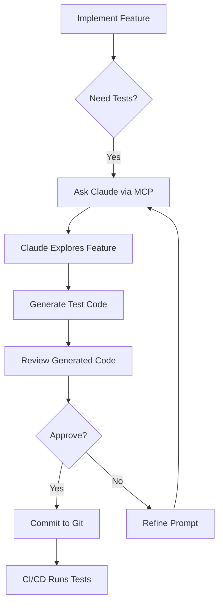
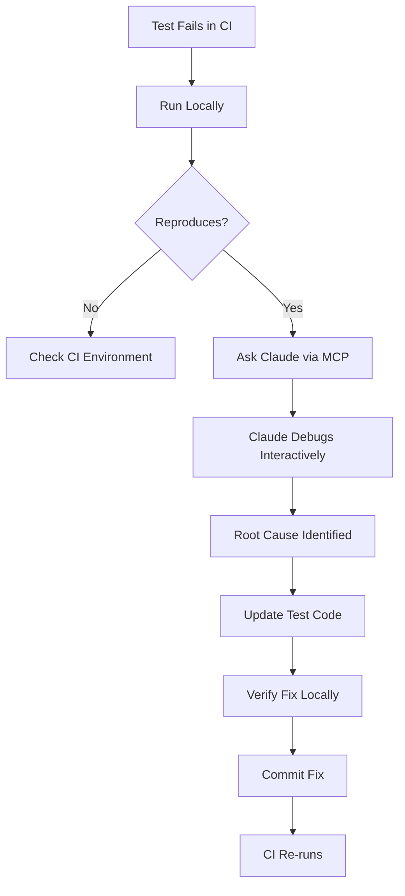

# Playwright MCP Integration Guide

## Overview

Playwright MCP (Model Context Protocol) is an AI-powered browser automation tool that enables Claude to interact with the Atomic CRM application for test generation, debugging, and exploration. This guide explains when and how to use Playwright MCP alongside traditional Playwright tests.

## Key Concept: Generation vs. Execution

**IMPORTANT**: Playwright MCP is designed for **test generation**, not **test execution**.

### The Workflow

```
1. Exploration (MCP)     → Claude explores features interactively via AI
2. Generation (MCP)      → Claude converts interactions to Playwright test code
3. Review (Human)        → Engineer reviews and refines generated test
4. Commit (Git)          → Test code committed to version control
5. Execution (CI/CD)     → Traditional Playwright runs tests in automation
```

**NOT**: Running MCP directly in CI/CD (slow, non-deterministic, costly)

---

## When to Use Playwright MCP

### ✅ Use Playwright MCP For

| Use Case | Description | Expected Output |
|----------|-------------|-----------------|
| **New Feature Tests** | Generate initial test outlines for new features | Traditional Playwright test file |
| **Edge Case Discovery** | Explore UI to find untested scenarios | Additional test cases for existing specs |
| **Test Debugging** | Investigate why traditional tests are failing | Root cause analysis + updated test code |
| **Accessibility Audits** | Analyze accessibility tree for WCAG compliance | Accessibility test suite |
| **Visual Regression** | Compare screenshots across viewports | Visual regression test cases |
| **Exploratory Testing** | Discover unexpected behaviors or UI issues | Bug reports + reproduction tests |

### ❌ Do NOT Use Playwright MCP For

| Anti-Pattern | Why Not | Use Instead |
|--------------|---------|-------------|
| **CI/CD Test Execution** | Non-deterministic, slow (LLM overhead), API costs | Traditional Playwright tests |
| **Regression Testing** | Not reproducible across runs | Version-controlled Playwright specs |
| **Performance Testing** | AI reasoning adds latency | Traditional Playwright + performance profiling |
| **Cross-Browser Testing** | MCP limited to single browser instance | Traditional Playwright multi-browser config |

---

## Available MCP Servers

The project has three Playwright MCP server configurations in `.mcp.json`:

### 1. `playwright-ipad`
**Purpose**: iPad-first responsive testing
**Viewport**: 768 x 1024 (iPad Pro)
**Device**: iPad Pro emulation
**Use For**: Testing iPad-specific layouts, touch targets, responsive behavior
**Features**: Full tracing, video recording, vision capability

**Example Usage**:
```
"Use playwright-ipad to test the Opportunities Kanban board on iPad viewport"
```

### 2. `playwright-desktop`
**Purpose**: Desktop viewport testing
**Viewport**: 1440 x 900
**Use For**: Desktop-specific features, wide-screen layouts
**Features**: Tracing enabled

**Example Usage**:
```
"Use playwright-desktop to verify the dashboard displays all widgets correctly"
```

### 3. `playwright-debug`
**Purpose**: Deep debugging with full artifact capture
**Viewport**: Default (browser-defined)
**Use For**: Investigating complex issues, capturing detailed traces
**Features**: Full tracing, video recording, vision capability, PDF generation

**Example Usage**:
```
"Use playwright-debug to investigate why the contact form submission is failing"
```

### Common Configuration

All servers share these settings:
- **Base URL**: `http://127.0.0.1:5173` (local dev server)
- **Auth State**: `tests/e2e/.auth/user.json` (authenticated session)
- **Output Directory**: `tests/e2e/.playwright-mcp/`
- **Action Timeout**: 10 seconds (matches traditional tests)
- **Navigation Timeout**: 30 seconds (matches traditional tests)

---

## Usage Examples

### Example 1: Generate Test for New Feature

**Scenario**: Organization hierarchies feature was just implemented

**Request to Claude**:
```
Use playwright-ipad to test the organization hierarchy feature:
1. Create a parent organization (type: distributor)
2. Add two branch locations
3. Navigate to a branch and verify parent link
4. Verify sister branches display correctly
5. Check console for any RLS errors
6. Generate a traditional Playwright test from this exploration
```

**What Claude Does**:
1. Uses MCP tools to interact with the UI
2. Records interactions (clicks, fills, assertions)
3. Monitors console for errors
4. Converts MCP tool calls to traditional Playwright test code
5. Applies Page Object Model pattern
6. Returns test file ready for Git commit

**Output**:
```typescript
// tests/e2e/specs/organizations/organization-hierarchies.spec.ts
import { test, expect } from '@playwright/test';
import { OrganizationFormPage } from '../support/poms/OrganizationFormPage';
import { OrganizationsListPage } from '../support/poms/OrganizationsListPage';

test.describe('Organization Hierarchies', () => {
  test('should create parent org and add branch locations', async ({ page }) => {
    const listPage = new OrganizationsListPage(page);
    const formPage = new OrganizationFormPage(page);

    // Create parent organization
    await listPage.navigate();
    await listPage.clickCreate();
    await formPage.fillOrganization({
      name: 'Main Distributor',
      type: 'distributor'
    });
    await formPage.submit();

    // Add branch locations
    await formPage.addBranch({ name: 'Branch A', city: 'Austin' });
    await formPage.addBranch({ name: 'Branch B', city: 'Dallas' });

    // Navigate to branch
    await listPage.navigateToOrganization('Branch A');

    // Verify parent link
    await expect(page.getByText('Main Distributor')).toBeVisible();

    // Verify sister branches
    await expect(page.getByText('Branch B')).toBeVisible();
  });
});
```

### Example 2: Debug Failing Test

**Scenario**: Kanban drag-and-drop test is failing intermittently

**Request to Claude**:
```
Use playwright-debug to investigate the failing Kanban drag-and-drop test:
1. Navigate to opportunities Kanban board
2. Attempt to drag "Test Opportunity" from Lead to Qualified
3. Record full trace
4. Capture console errors
5. Identify why the drag might be failing
6. Suggest fixes to the test selector or wait conditions
```

**What Claude Does**:
1. Executes the drag operation with MCP tools
2. Captures accessibility tree snapshots
3. Monitors network requests (Supabase API calls)
4. Identifies timing issues or selector problems
5. Suggests improved selectors or wait conditions

**Example Output**:
```
Root Cause: The test is failing because the drag operation starts before
the Kanban board finishes loading data from Supabase.

Recommended Fix:
1. Add explicit wait for network idle before dragging:
   await page.waitForLoadState('networkidle');

2. Use more stable selector (accessibility-based):
   const opportunity = await page.getByRole('article', {
     name: /Test Opportunity/
   });

3. Add wait for animation to complete:
   await opportunity.waitFor({ state: 'stable' });

Updated test code provided above. Apply to:
tests/e2e/specs/opportunities/kanban-board.spec.ts:42
```

### Example 3: Accessibility Audit

**Scenario**: Need to verify WCAG 2.1 AA compliance for Contact form

**Request to Claude**:
```
Use playwright-ipad to audit the Contact creation form for accessibility:
1. Navigate to /contacts/create
2. Analyze accessibility tree
3. Check keyboard navigation (tab order)
4. Verify all inputs have labels
5. Check for missing aria-labels
6. Generate accessibility test suite
```

**What Claude Provides**:
1. Accessibility tree analysis
2. WCAG compliance report
3. List of violations with severity
4. Generated test suite for accessibility

**Example Output**:
```markdown
## Accessibility Audit Report

### ✅ Passing Criteria
- All form inputs have associated labels
- Tab order is logical (top-to-bottom, left-to-right)
- Color contrast ratios meet AA standard (4.5:1 for text)
- Focus indicators visible on all interactive elements

### ⚠️ Issues Found
1. **Missing aria-label on submit button** (Medium)
   - Location: Form footer submit button
   - Impact: Screen readers announce as "Button" without context
   - Fix: Add aria-label="Create contact" to submit button

2. **Phone number fields lack input type** (Low)
   - Location: Phone array input
   - Impact: Mobile keyboards don't switch to numeric
   - Fix: Add type="tel" to phone input fields

### Generated Test Code
[Traditional Playwright test code for accessibility checks]
```

### Example 4: Visual Regression Check

**Scenario**: Verify spacing system changes don't break layouts

**Request to Claude**:
```
Use playwright-desktop and playwright-ipad to compare dashboard layout:
1. Navigate to dashboard on both viewports
2. Take screenshots of dashboard
3. Compare widget spacing, grid alignment
4. Check for any layout breaks or overflow
5. Generate visual regression test
```

---

## Workflow Integration

### Daily Development Workflow



### Test Debugging Workflow



---

## Output Locations

All Playwright MCP artifacts are saved to `tests/e2e/.playwright-mcp/` (gitignored):

```
tests/e2e/.playwright-mcp/
├── traces/               # Playwright traces (.zip files)
│   └── trace-2025-11-10-23-45-12.zip
├── videos/               # Screen recordings (.webm files)
│   └── video-2025-11-10-23-45-12.webm
└── screenshots/          # Screenshots (.png files)
    └── screenshot-2025-11-10-23-45-12.png
```

### Viewing Artifacts

**Traces**:
```bash
npx playwright show-trace tests/e2e/.playwright-mcp/traces/trace-<timestamp>.zip
```

**Videos**: Open `.webm` files in browser or VLC

**Screenshots**: Open `.png` files in image viewer

---

## Limitations & Trade-offs

### Limitations

1. **Non-Deterministic**: AI reasoning may vary between runs
2. **Slower Than Traditional Tests**: LLM processing adds latency (seconds vs milliseconds)
3. **API Costs**: Each MCP interaction requires Claude API calls
4. **Single Browser**: MCP runs one browser instance at a time
5. **Not for CI/CD**: Too slow and unreliable for automated pipelines
6. **Requires Dev Server**: Must have `npm run dev` running

### Trade-offs

| Traditional Playwright | Playwright MCP |
|----------------------|----------------|
| ✅ Fast (milliseconds) | ⚠️ Slow (seconds) |
| ✅ Deterministic | ❌ Non-deterministic |
| ✅ Version-controlled | ⚠️ Ephemeral (unless exported) |
| ✅ Parallel execution | ❌ Sequential only |
| ❌ Manual test writing | ✅ AI-assisted generation |
| ⚠️ Manual debugging | ✅ Interactive debugging |
| ⚠️ Limited accessibility analysis | ✅ Deep accessibility tree analysis |

---

## Best Practices

### 1. Start with MCP, End with Traditional Tests

```
❌ DON'T: Use MCP in CI/CD
✅ DO: Use MCP to generate traditional Playwright tests
```

### 2. Specify Viewport Explicitly

```
❌ DON'T: "Test the contact form"
✅ DO: "Use playwright-ipad to test the contact form on iPad viewport"
```

### 3. Request Traditional Test Output

```
❌ DON'T: Just explore without generating test code
✅ DO: "Generate a traditional Playwright test from this exploration"
```

### 4. Review Generated Code

```
❌ DON'T: Blindly commit AI-generated tests
✅ DO: Review for:
  - Correct selectors (accessibility-based preferred)
  - Proper assertions
  - Page Object Model usage
  - Console error monitoring
```

### 5. Use Existing Page Object Models

```
❌ DON'T: Generate inline selectors
✅ DO: Request Claude to use existing POMs:
  "Use the ContactFormPage POM from tests/e2e/support/poms/"
```

### 6. Include Console Monitoring

```
❌ DON'T: Ignore console errors during test generation
✅ DO: Always request: "Check console for RLS errors and React warnings"
```

---

## Troubleshooting

### Issue: MCP Server Won't Start

**Symptoms**: Claude reports "MCP server not available"

**Solutions**:
1. Verify dev server is running: `npm run dev`
2. Check `.mcp.json` syntax (must be valid JSON)
3. Verify auth state exists: `tests/e2e/.auth/user.json`
4. Restart Claude Code to reload MCP configuration

### Issue: Auth State Not Working

**Symptoms**: MCP navigates to login page instead of authenticated app

**Solutions**:
1. Regenerate auth state: `npx playwright test tests/e2e/global-setup.ts`
2. Verify `--storage-state` path in `.mcp.json` is correct
3. Check user credentials in `playwright.config.ts`

### Issue: Timeouts During Test Generation

**Symptoms**: MCP times out waiting for elements

**Solutions**:
1. Increase `--timeout-action` in `.mcp.json`
2. Request Claude to add explicit waits: "Wait for network idle before clicking"
3. Use `playwright-debug` for slower, more thorough debugging

### Issue: Generated Tests Don't Follow Project Patterns

**Symptoms**: Test code doesn't use Page Object Models or correct patterns

**Solutions**:
1. Reference existing tests in prompt: "Follow the pattern from tests/e2e/specs/contacts/contacts-crud.spec.ts"
2. Request specific POM usage: "Use ContactFormPage from POMs"
3. Review and refactor generated code before committing

---

## Comparison with Traditional Playwright

### Traditional Playwright (What You Have)

**Files**: 40+ spec files in `tests/e2e/specs/`
**Execution**: `npm run test:e2e`
**CI/CD**: Runs in GitHub Actions
**Speed**: Fast (parallel execution)
**Reliability**: High (deterministic)
**Maintenance**: Manual (update code when UI changes)

**Keep Using For**:
- CI/CD regression testing
- Fast local test execution
- Version-controlled test suite
- Parallel test execution

### Playwright MCP (What You're Adding)

**Interface**: Interactive via Claude Code
**Execution**: Manual (through Claude conversations)
**CI/CD**: Not recommended
**Speed**: Slow (LLM reasoning)
**Reliability**: Medium (AI-dependent)
**Maintenance**: AI adapts to UI changes

**Use For**:
- Generating new tests
- Debugging test failures
- Accessibility audits
- Exploratory testing

---

## Example: Complete Test Generation Session

### User Request
```
I need tests for the new tabbed form feature in the Organizations module.
Use playwright-ipad to test all three tabs (General, Details, Other) and
generate a traditional Playwright test.
```

### Claude's Response
```
I'll use playwright-ipad to explore the tabbed form feature and generate
a comprehensive test suite.

[Claude uses MCP tools to:]
1. Navigate to /organizations/create
2. Identify tabs via accessibility tree
3. Fill fields in each tab
4. Switch between tabs
5. Submit form
6. Verify organization creation
7. Check console for errors

Root Cause Analysis:
- All tabs load correctly
- Tab switching preserves form state
- No console errors detected
- Accessibility: All tabs keyboard-navigable

Generated Test Code:
[Provides traditional Playwright test following project patterns]
```

### Output Test File
```typescript
// tests/e2e/specs/organizations/tabbed-form.spec.ts
import { test, expect } from '@playwright/test';
import { OrganizationFormPage } from '../../support/poms/OrganizationFormPage';
import { OrganizationsListPage } from '../../support/poms/OrganizationsListPage';

test.describe('Organization Tabbed Form', () => {
  let listPage: OrganizationsListPage;
  let formPage: OrganizationFormPage;

  test.beforeEach(async ({ page }) => {
    listPage = new OrganizationsListPage(page);
    formPage = new OrganizationFormPage(page);
    await listPage.navigate();
    await listPage.clickCreate();
  });

  test('should allow switching between tabs', async ({ page }) => {
    // Verify all tabs visible
    await expect(page.getByRole('tab', { name: 'General' })).toBeVisible();
    await expect(page.getByRole('tab', { name: 'Details' })).toBeVisible();
    await expect(page.getByRole('tab', { name: 'Other' })).toBeVisible();

    // Fill General tab
    await formPage.selectTab('General');
    await formPage.fillField('name', 'Test Organization');

    // Switch to Details tab
    await formPage.selectTab('Details');
    await formPage.fillField('industry', 'Food Service');

    // Switch back to General - verify data persists
    await formPage.selectTab('General');
    await expect(formPage.getField('name')).toHaveValue('Test Organization');
  });

  test('should create organization with data from all tabs', async ({ page }) => {
    await formPage.fillTabGeneral({
      name: 'Multi-Tab Org',
      type: 'customer'
    });

    await formPage.fillTabDetails({
      industry: 'Retail',
      employees: '50-100'
    });

    await formPage.fillTabOther({
      notes: 'Created via tabbed form test'
    });

    await formPage.submit();

    // Verify redirect to show page
    await expect(page).toHaveURL(/organizations\/\d+$/);
    await expect(page.getByText('Multi-Tab Org')).toBeVisible();
  });
});
```

---

## FAQ

### Q: Should I replace all traditional Playwright tests with MCP?
**A**: No. Keep traditional tests for CI/CD. Use MCP to *generate* new tests, not *execute* them.

### Q: Can I run MCP tests in GitHub Actions?
**A**: Technically yes, but not recommended. MCP is slow and non-deterministic, unsuitable for CI/CD.

### Q: How do I handle authentication in MCP?
**A**: MCP uses the existing auth state file (`tests/e2e/.auth/user.json`). No additional setup needed.

### Q: What if MCP generates incorrect test code?
**A**: Review and refactor before committing. MCP is a starting point, not a final solution.

### Q: Can I use MCP for cross-browser testing?
**A**: MCP runs one browser at a time. Use traditional Playwright for multi-browser testing.

### Q: How much does MCP cost per test?
**A**: Depends on Claude API usage. Typically $0.01-$0.10 per test generation session.

---

## Resources

### Official Documentation
- **Playwright MCP GitHub**: https://github.com/microsoft/playwright-mcp
- **MCP Specification**: https://modelcontextprotocol.io
- **Playwright Docs**: https://playwright.dev

### Atomic CRM Relevant Files
- **Traditional Tests**: `tests/e2e/specs/`
- **Page Object Models**: `tests/e2e/support/poms/`
- **Playwright Config**: `playwright.config.ts`
- **Auth Fixture**: `tests/e2e/support/fixtures/authenticated.ts`

### Quick Commands
```bash
# Run traditional tests
npm run test:e2e

# Run specific test file
npm run test:e2e tests/e2e/specs/contacts/contacts-crud.spec.ts

# View Playwright trace
npx playwright show-trace tests/e2e/.playwright-mcp/traces/trace-*.zip

# Regenerate auth state
npx playwright test tests/e2e/global-setup.ts
```

---

## Summary

Playwright MCP is a powerful **complement** to traditional Playwright testing, not a replacement. Use it to:
- Generate new tests faster
- Debug complex test failures interactively
- Audit accessibility compliance
- Explore edge cases

Always convert MCP interactions to traditional Playwright test code for version control and CI/CD execution.

**Workflow**: MCP (generate) → Review (human) → Commit (Git) → Execute (CI/CD)
