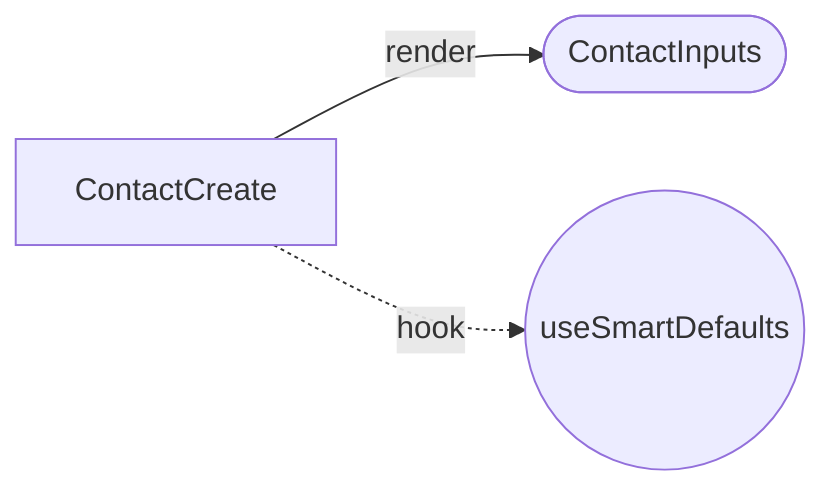
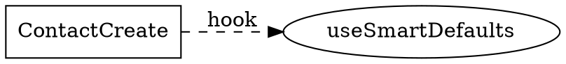

# Discovery System P4 Enhancements

> Future enhancements for the scripts/discover codebase introspection system

## Table of Contents

1. [Vector Embeddings](#1-vector-embeddings-for-semantic-search)
2. [Call Graph Extraction](#2-call-graph-extraction)
3. [Test Coverage Linkage](#3-test-coverage-linkage)

---

## 1. Vector Embeddings for Semantic Search

### Purpose

Enable semantic queries like "find components that handle user input" or "schemas with sanitization transforms" by embedding discovered metadata into searchable vectors.

### Architecture

| Component | Description |
|-----------|-------------|
| `embeddings/client.ts` | Local embedding model wrapper (sentence-transformers) |
| `embeddings/textifier.ts` | Convert component/schema metadata to embeddable text |
| `embeddings/store.ts` | pgvector storage operations in Supabase |
| `embeddings/search.ts` | Semantic search API |

### Embedding Strategy

Instead of raw code (noisy), we embed **structured metadata as natural language**:

**Component Example:**
```
ContactCreate is a entry React component. It belongs to the contacts feature.
Uses: local state management, form data from context.
Contains child components: ContactInputs, ContactTabs.
```

**Schema Example:**
```
opportunitySchema is a Zod strictObject schema. Fields: name, stage, value, principal_id.
Has security transforms on: name, notes. Validation constraints on: value, stage.
```

### Database Schema (pgvector)

```sql
CREATE TABLE discovery_embeddings (
  id UUID PRIMARY KEY DEFAULT gen_random_uuid(),
  item_type TEXT NOT NULL,           -- 'component', 'schema', 'hook'
  item_name TEXT NOT NULL,
  item_file TEXT NOT NULL,
  embedding vector(384) NOT NULL,    -- sentence-transformers dimension
  source_hash TEXT NOT NULL,         -- SHA256 for staleness
  UNIQUE(item_type, item_name, item_file)
);

CREATE INDEX ON discovery_embeddings USING hnsw (embedding vector_cosine_ops);
```

### Usage

```bash
# Generate embeddings after discovery
just discover-embed

# Semantic search
just discover-search "components handling form validation"
```

---

## 2. Call Graph Extraction

### Purpose

Extract function-to-function call relationships to:
- Understand code dependencies
- Detect circular dependencies
- Generate Mermaid/Graphviz visualizations
- Help AI assistants navigate the codebase

### Data Model

#### Nodes
```typescript
interface CallGraphNode {
  id: string;           // "file:line:name"
  name: string;         // Function/component name
  file: string;         // Relative file path
  line: number;         // Declaration line
  nodeType: 'function' | 'component' | 'hook' | 'method' | 'arrow';
  exported: boolean;
  async: boolean;
}
```

#### Edges
```typescript
interface CallGraphEdge {
  source: string;       // Node ID of caller
  target: string;       // Node ID of callee
  edgeType: 'call' | 'render' | 'hook' | 'callback' | 'import';
  line: number;         // Line where call occurs
  conditional: boolean; // Inside if/ternary?
  inLoop: boolean;      // Inside loop?
}
```

### React Pattern Handling

| Pattern | Edge Type | Example |
|---------|-----------|---------|
| JSX component render | `render` | `<ContactInputs />` |
| Hook invocation | `hook` | `useSmartDefaults()` |
| Event handler prop | `callback` | `onClick={handleSubmit}` |
| Direct function call | `call` | `validateForm()` |
| Module import | `import` | `import { foo } from './bar'` |

### Circular Dependency Detection

Uses **Tarjan's Strongly Connected Components** algorithm (O(V+E)):

```typescript
function detectCycles(nodes, edges): CircularDep[] {
  // Returns arrays of node IDs forming cycles
  // e.g., [["A", "B", "C"], ["X", "Y"]]
}
```

### Visualization Output

**Mermaid (for GitHub/docs):**


**Graphviz DOT (for complex layouts):**


### Output Structure

```
.claude/state/call-graph-inventory/
├── manifest.json           # Summary + cross-chunk edges
├── contacts.json           # Call graph for contacts feature
├── opportunities.json
├── _visualization/
│   ├── full-graph.mmd      # Complete Mermaid
│   ├── full-graph.dot      # Complete Graphviz DOT
│   ├── contacts.mmd        # Per-feature Mermaid
│   └── cycles.mmd          # Circular dependencies focus
```

### Usage

```bash
# Generate call graph
just discover-callgraph

# Generate visualizations
just callgraph-viz

# Check for circular dependencies
just callgraph-cycles
```

---

## 3. Test Coverage Linkage

### Purpose

Correlate Vitest coverage data with discovered components/hooks/schemas to:
- Identify untested code paths
- Track coverage per component
- Generate "untested items" report for prioritization

### Data Flow

```
vitest --coverage
        ↓
coverage/coverage-final.json (V8 format)
        ↓
coverage extractor reads JSON
        ↓
Links to component-inventory, hooks-inventory, schemas-inventory
        ↓
coverage-inventory/
  ├── components.json   (coverage per component)
  ├── hooks.json        (coverage per hook)
  └── untested.json     (items with 0% coverage)
```

### Coverage Info Structure

```typescript
interface CoverageInfo {
  name: string;           // Component/hook/schema name
  file: string;
  inventoryType: 'component' | 'hook' | 'schema';
  coverage: {
    statements: { covered: number; total: number; pct: number };
    functions: { covered: number; total: number; pct: number };
    branches: { covered: number; total: number; pct: number };
  };
  isTested: boolean;      // true if any coverage > 0
}
```

### Untested Item Report

```typescript
interface UntestedItem {
  name: string;
  file: string;
  type: 'component' | 'hook' | 'schema';
  reason: 'no_coverage_data' | 'zero_hits';
  suggestedTestPath: string;  // Auto-generated path
}
```

**Example output:**
```json
{
  "name": "ContactHierarchyBreadcrumb",
  "file": "src/atomic-crm/contacts/ContactHierarchyBreadcrumb.tsx",
  "type": "component",
  "reason": "zero_hits",
  "suggestedTestPath": "src/atomic-crm/contacts/__tests__/ContactHierarchyBreadcrumb.test.tsx"
}
```

### Staleness Detection

Coverage inventory is stale when:
1. `coverage-final.json` hash changed (new test run)
2. Source inventories changed (code modified)
3. Coverage inventory doesn't exist

### Usage

```bash
# Run tests + update coverage inventory
just test-discover

# Update coverage inventory only (assumes recent test run)
just discover-coverage

# Check staleness
just discover-coverage-check
```

---

## Integration with Claude Code

All three enhancements are designed for AI consumption:

| Feature | AI Use Case |
|---------|-------------|
| **Embeddings** | "Find components similar to X" semantic search |
| **Call Graph** | "What calls this function?" / "What does this call?" |
| **Coverage** | "What's untested?" prioritization for test generation |

The existing discover inventories at `.claude/state/` are already optimized for Claude's context window. These P4 enhancements add:
- Semantic understanding (embeddings)
- Relationship navigation (call graph)
- Quality insights (coverage)

---

## Implementation Priority

| Priority | Feature | Est. Time | Dependencies |
|----------|---------|-----------|--------------|
| 1 | Call Graph | 13-14 hrs | None - pure ts-morph |
| 2 | Coverage | 8-10 hrs | Existing Vitest setup |
| 3 | Embeddings | 12-15 hrs | Local model setup |

**Recommended:** Start with Call Graph (no external dependencies), validate the pattern, then extend to Coverage and Embeddings.

---

## Technical References

### ts-morph APIs for Call Graph

```typescript
// Get all call expressions within a function
const calls = functionNode.getDescendantsOfKind(SyntaxKind.CallExpression);

// Get JSX component renders
const jsxElements = node.getDescendantsOfKind(SyntaxKind.JsxElement);
const jsxSelfClosing = node.getDescendantsOfKind(SyntaxKind.JsxSelfClosingElement);

// Check if call is conditional
function isConditional(callExpr: CallExpression): boolean {
  let parent = callExpr.getParent();
  while (parent) {
    const kind = parent.getKind();
    if (kind === SyntaxKind.IfStatement || kind === SyntaxKind.ConditionalExpression) {
      return true;
    }
    parent = parent.getParent();
  }
  return false;
}
```

### Vitest Coverage JSON Format

```typescript
interface CoverageData {
  [filePath: string]: {
    fnMap: { [id: string]: { name: string, decl: Range, loc: Range } };
    f: { [id: string]: number };  // function hit counts
    s: { [id: string]: number };  // statement hit counts
    b: { [id: string]: number[] }; // branch hit counts
  }
}
```

### Existing Discover Patterns

The discover system already uses these patterns that P4 features will follow:
- **Singleton ts-morph Project**: `scripts/discover/utils/project.ts`
- **Chunked Output**: `scripts/discover/utils/output.ts` - `writeChunkedDiscovery()`
- **SHA256 Staleness**: `hashFile()`, `buildSourceHashes()`, `isChunkedDiscoveryStale()`
- **Manifest Structure**: `ChunkedManifest` interface with per-chunk hashes
