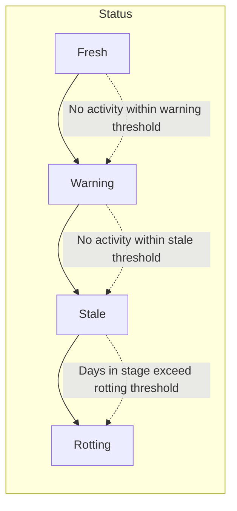

# Opportunity Pipeline Lifecycle

> **Generated:** 2025-12-22
> **Stages:** 7 | **Business Rules:** 20 | **Source:** `docs/_state/business-logic-discovery.json`

## Pipeline Overview

The Crispy CRM pipeline follows MFB's 5-phase broker sales methodology, mapping each opportunity stage to specific business activities.

```mermaid
stateDiagram-v2
    [*] --> new_lead : Create Opportunity

    new_lead --> initial_outreach : First contact made
    initial_outreach --> sample_visit_offered : Sample/visit scheduled
    sample_visit_offered --> feedback_logged : Feedback received
    feedback_logged --> demo_scheduled : Demo confirmed

    demo_scheduled --> closed_won : Deal won
    demo_scheduled --> closed_lost : Deal lost

    feedback_logged --> closed_won : Fast close
    feedback_logged --> closed_lost : No fit

    sample_visit_offered --> closed_lost : No interest
    initial_outreach --> closed_lost : Rejected

    closed_won --> [*]
    closed_lost --> [*]

    note right of new_lead : Phase 2: Planning
    note right of initial_outreach : Phase 3A: Target Distributors
    note right of sample_visit_offered : Phase 3A: Target Distributors
    note right of feedback_logged : Phase 3B: Stocking Distributors
    note right of demo_scheduled : Phase 3B: Stocking Distributors
    note right of closed_won : Phase 5: Ongoing Activities
    note right of closed_lost : Phase 4: Measuring Results
```

## Stage Reference

### 1. new_lead

| Property | Value |
|----------|-------|
| **Display Name** | New Lead |
| **Order** | 1 |
| **Stale Threshold** | 7 days |
| **Rotting Threshold** | 7 days |
| **Warning Threshold** | 5 days (75% of rotting) |
| **Color Token** | `var(--info-subtle)` |
| **MFB Phase** | Phase 2 - Planning |

**Description:**
New prospect identified. Research the operator's menu, identify which principal products fit, and prepare your pitch.

**Entry Criteria:**
- New opportunity record created
- Customer organization assigned
- Principal organization assigned

**Exit Criteria:**
- First outreach activity logged (call, email, or meeting)

**Available Actions:**
- Log call
- Log email
- Schedule meeting
- Add notes

**Source:** `src/atomic-crm/opportunities/constants/stageConstants.ts:37`

---

### 2. initial_outreach

| Property | Value |
|----------|-------|
| **Display Name** | Initial Outreach |
| **Order** | 2 |
| **Stale Threshold** | 14 days |
| **Rotting Threshold** | 10 days |
| **Warning Threshold** | 7 days (75% of rotting) |
| **Color Token** | `var(--tag-teal-bg)` |
| **MFB Phase** | Phase 3A - Target Distributors |

**Description:**
First contact made. Introduce MFB and relevant principals, qualify interest, and schedule a follow-up call or visit.

**Entry Criteria:**
- First contact activity logged
- Initial pitch delivered

**Exit Criteria:**
- Sample request received OR site visit scheduled
- Interest confirmed

**Available Actions:**
- Log follow-up call
- Log email correspondence
- Schedule site visit
- Send sample request
- Update opportunity notes

**Source:** `src/atomic-crm/opportunities/constants/stageConstants.ts:50`

---

### 3. sample_visit_offered

| Property | Value |
|----------|-------|
| **Display Name** | Sample/Visit Offered |
| **Order** | 3 |
| **Stale Threshold** | 14 days |
| **Rotting Threshold** | 14 days |
| **Warning Threshold** | 10 days (75% of rotting) |
| **Color Token** | `var(--warning-subtle)` |
| **MFB Phase** | Phase 3A - Target Distributors |

**Description:**
Product sample sent or site visit scheduled. Follow up within 3-5 days to gather feedback - this is a critical stage.

**Entry Criteria:**
- Sample activity logged with status "sent" OR
- Site visit activity scheduled

**Exit Criteria:**
- Feedback received and logged
- Customer evaluation complete

**Available Actions:**
- Log sample sent
- Track sample status (sent → received → feedback_pending → feedback_received)
- Log site visit
- Schedule follow-up
- Log feedback

**Critical Notes:**
- ⚠️ This stage requires proactive follow-up within 3-5 days
- Sample workflow: `sent` → `received` → `feedback_pending` → `feedback_received`

**Source:** `src/atomic-crm/opportunities/constants/stageConstants.ts:63`

---

### 4. feedback_logged

| Property | Value |
|----------|-------|
| **Display Name** | Feedback Logged |
| **Order** | 4 |
| **Stale Threshold** | 21 days |
| **Rotting Threshold** | 7 days |
| **Warning Threshold** | 5 days (75% of rotting) |
| **Color Token** | `var(--tag-blue-bg)` |
| **MFB Phase** | Phase 3B - Stocking Distributors |

**Description:**
Operator feedback recorded. Evaluate fit, address concerns, and determine if a formal demo or pricing discussion is warranted.

**Entry Criteria:**
- Customer feedback documented
- Sample evaluation complete OR site visit feedback logged

**Exit Criteria:**
- Demo scheduled with distributor availability confirmed OR
- Decision to close (won/lost)

**Available Actions:**
- Log feedback details
- Schedule demo
- Create proposal
- Update sentiment
- Close opportunity

**Source:** `src/atomic-crm/opportunities/constants/stageConstants.ts:78`

---

### 5. demo_scheduled

| Property | Value |
|----------|-------|
| **Display Name** | Demo Scheduled |
| **Order** | 5 |
| **Stale Threshold** | 14 days |
| **Rotting Threshold** | 5 days |
| **Warning Threshold** | 3 days (75% of rotting) |
| **Color Token** | `var(--success-subtle)` |
| **MFB Phase** | Phase 3B - Stocking Distributors |

**Description:**
Final product demonstration or tasting scheduled. Confirm distributor availability and prepare pricing/terms for close.

**Entry Criteria:**
- Demo date confirmed
- Distributor availability verified

**Exit Criteria:**
- Demo completed
- Final decision made (won/lost)

**Available Actions:**
- Log demo activity
- Create/send proposal
- Log contract review
- Close as won
- Close as lost

**Critical Notes:**
- ⚠️ Shortest rotting threshold (5 days) - deals at this stage need rapid attention
- Ensure distributor authorization is confirmed before demo

**Source:** `src/atomic-crm/opportunities/constants/stageConstants.ts:92`

---

### 6. closed_won

| Property | Value |
|----------|-------|
| **Display Name** | Closed - Won |
| **Order** | 6 |
| **Stale Threshold** | N/A (terminal) |
| **Rotting Threshold** | N/A (terminal) |
| **Color Token** | `var(--success-strong)` |
| **MFB Phase** | Phase 5 - Ongoing Activities |
| **Requires Reason** | ✅ Yes (`win_reason` field) |

**Description:**
Deal won! First purchase order placed. Ensure distributor authorization is active and hand off to account management.

**Entry Criteria:**
- Customer commits to purchase
- Win reason selected

**Required Fields:**
- `win_reason` - Must select from:
  - `relationship` - Strong Relationship
  - `product_quality` - Product Quality/Fit
  - `price_competitive` - Competitive Pricing
  - `timing` - Right Timing
  - `other` - Other (requires `close_reason_notes`)

**Post-Close Actions:**
- Verify distributor authorization active
- Hand off to account management
- Phase 5 activities: annual/quarterly goals, promotions, DSR training

**Source:** `src/atomic-crm/opportunities/constants/stageConstants.ts:105`

---

### 7. closed_lost

| Property | Value |
|----------|-------|
| **Display Name** | Closed - Lost |
| **Order** | 7 |
| **Stale Threshold** | N/A (terminal) |
| **Rotting Threshold** | N/A (terminal) |
| **Color Token** | `var(--error-subtle)` |
| **MFB Phase** | Phase 4 - Measuring Results |
| **Requires Reason** | ✅ Yes (`loss_reason` field) |

**Description:**
Opportunity lost. Review the loss reason and consider re-engagement after 90 days if circumstances change.

**Entry Criteria:**
- Customer declines or becomes unresponsive
- Loss reason selected

**Required Fields:**
- `loss_reason` - Must select from:
  - `price_too_high` - Price Too High
  - `no_authorization` - No Distributor Authorization
  - `competitor_relationship` - Competitor Relationship
  - `product_fit` - Product Didn't Fit
  - `timing` - Bad Timing
  - `no_response` - Customer Unresponsive
  - `other` - Other (requires `close_reason_notes`)

**Post-Close Actions:**
- Analyze loss reason for corrective actions
- Consider re-engagement after 90 days
- Document learnings for future opportunities

**Source:** `src/atomic-crm/opportunities/constants/stageConstants.ts:119`

---

## Staleness & Rotting Rules

### Visual Indicators



### Threshold Summary

| Stage | Stale (no activity) | Warning | Rotting (in stage) |
|-------|---------------------|---------|-------------------|
| new_lead | 7 days | 5 days | 7 days |
| initial_outreach | 14 days | 7 days | 10 days |
| sample_visit_offered | 14 days | 10 days | 14 days |
| feedback_logged | 21 days | 5 days | 7 days |
| demo_scheduled | 14 days | 3 days | 5 days |
| closed_won | — | — | — |
| closed_lost | — | — | — |

### Calculation Rules

1. **Stale Detection** (`stale_threshold_days`)
   - Triggered when no activity logged within threshold
   - Based on `last_activity_date`
   - Source: `src/atomic-crm/utils/stalenessCalculation.ts:46`

2. **Rotting Detection** (`rotting_threshold_days`)
   - Triggered when opportunity sits in stage too long
   - Based on `stage_entered_at` timestamp
   - Source: `src/atomic-crm/opportunities/constants/stageThresholds.ts:17`

3. **Warning Threshold**
   - Formula: `Math.floor(rotting_threshold * 0.75)`
   - Provides early warning before rotting
   - Source: `src/atomic-crm/opportunities/constants/stageThresholds.ts:44`

4. **Terminal Stages**
   - `closed_won` and `closed_lost` never become stale or rotting
   - Source: `src/atomic-crm/opportunities/constants/stageThresholds.ts:64`

---

## MFB Phase Mapping

| Pipeline Stage | MFB Phase | Phase Name | Key Activities |
|----------------|-----------|------------|----------------|
| new_lead | Phase 2 | Planning | Define parameters, set goals, analyze distributor landscape |
| initial_outreach | Phase 3A | Target Distributors | Intro emails, presentations, operator call coordination |
| sample_visit_offered | Phase 3A | Target Distributors | Sample coordination, site visit scheduling |
| feedback_logged | Phase 3B | Stocking Distributors | Create stock lists, develop marketing campaigns |
| demo_scheduled | Phase 3B | Stocking Distributors | Set appointments, finalize stock arrangements |
| closed_won | Phase 5 | Ongoing Activities | Annual/quarterly goals, promotions, DSR training, food shows |
| closed_lost | Phase 4 | Measuring Results | Analyze loss reasons, corrective actions |

---

## Database Enum Reference

```sql
-- Opportunity stage enum (PostgreSQL)
CREATE TYPE opportunity_stage AS ENUM (
    'new_lead',
    'initial_outreach',
    'sample_visit_offered',
    'feedback_logged',
    'demo_scheduled',
    'closed_won',
    'closed_lost'
);
```

### Deprecated Values

| Removed Value | Migration | Data Migration |
|---------------|-----------|----------------|
| `awaiting_response` | `20251129173209_remove_awaiting_response_enum_value.sql` | Records migrated to `feedback_logged` |

---

## Related Documentation

- [Business Workflows](./business-workflows.md) - Activity types, task management, business rules
- [Data Model](../architecture/data-model.md) - Database schema reference
- [Validation Schemas](../../src/atomic-crm/validation/) - Zod schemas for all entities
