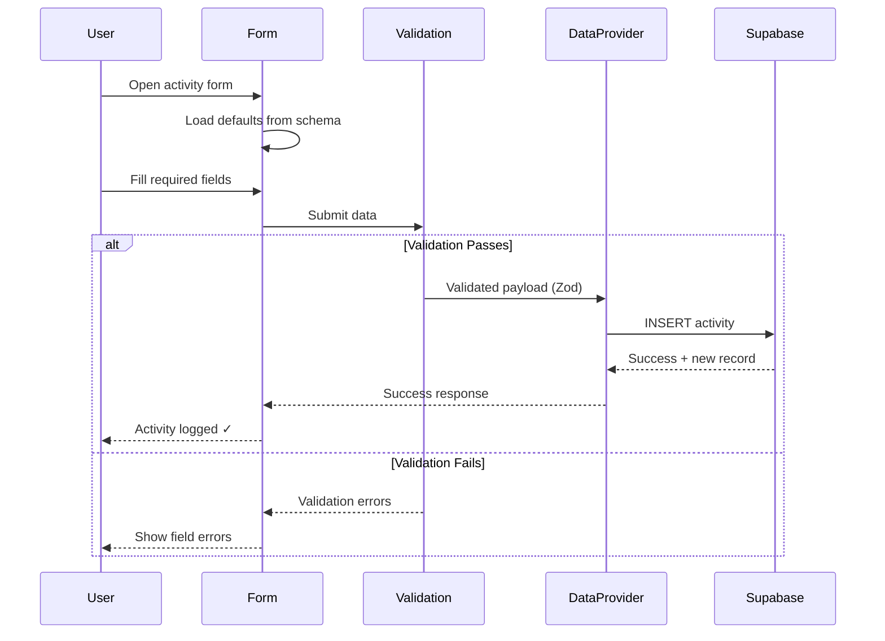
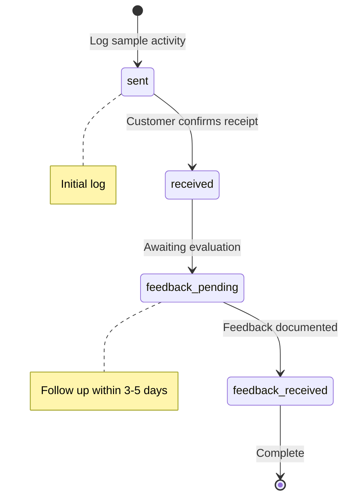
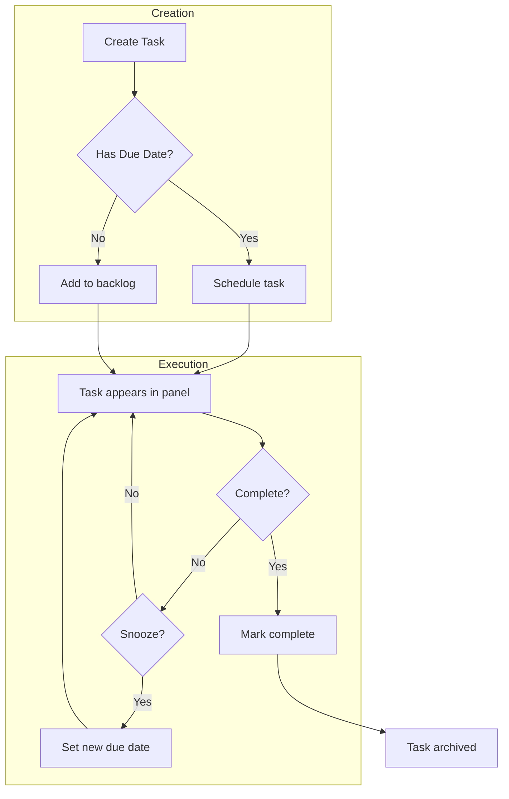

# Business Workflows

> **Generated:** 2025-12-22
> **Activity Types:** 13 | **Task Types:** 7 | **Business Rules:** 20
> **Source:** `.claude/state/business-logic-discovery.json`

## Activity Logging

Activities track all interactions with customers and prospects throughout the sales cycle.

### Activity Flow



### Activity Types Reference

#### Communication Activities

| Type | Label | Required Fields | Optional Fields | Source |
|------|-------|-----------------|-----------------|--------|
| `call` | Call | subject, activity_date | description, duration_minutes, contact_id, organization_id, outcome, sentiment | `activities.ts:17` |
| `email` | Email | subject, activity_date | description, contact_id, organization_id, outcome, attachments | `activities.ts:18` |
| `check_in` | Check In | subject, activity_date | description, duration_minutes, outcome, sentiment | `activities.ts:26` |
| `social` | Social | subject, activity_date | description, outcome | `activities.ts:27` |

#### Meeting Activities

| Type | Label | Required Fields | Optional Fields | Source |
|------|-------|-----------------|-----------------|--------|
| `meeting` | Meeting | subject, activity_date | description, duration_minutes, location, attendees, outcome | `activities.ts:19` |
| `demo` | Demo | subject, activity_date | description, duration_minutes, location, outcome, sentiment | `activities.ts:20` |
| `trade_show` | Trade Show | subject, activity_date | description, location, attendees, outcome | `activities.ts:23` |
| `site_visit` | Site Visit | subject, activity_date | description, duration_minutes, location, outcome, sentiment | `activities.ts:24` |

#### Documentation Activities

| Type | Label | Required Fields | Optional Fields | Source |
|------|-------|-----------------|-----------------|--------|
| `proposal` | Proposal | subject, activity_date | description, attachments, outcome | `activities.ts:21` |
| `follow_up` | Follow Up | subject, activity_date | description, follow_up_date, follow_up_notes | `activities.ts:22` |
| `contract_review` | Contract Review | subject, activity_date | description, attachments, outcome | `activities.ts:25` |
| `note` | Note | subject, activity_date | description | `activities.ts:28` |
| `sample` | Sample | subject, activity_date, **sample_status** | description, follow_up_date, follow_up_notes | `activities.ts:29` |

### Sample Activity Workflow

The `sample` activity type has a dedicated workflow for tracking product samples through the evaluation process.



| Status | Label | Order | Description |
|--------|-------|-------|-------------|
| `sent` | Sent | 1 | Sample shipped to customer |
| `received` | Received | 2 | Customer confirmed receipt |
| `feedback_pending` | Feedback Pending | 3 | Awaiting customer evaluation |
| `feedback_received` | Feedback Received | 4 | Evaluation documented |

### Sentiment Tracking

Activities that involve direct customer interaction can track sentiment:

| Sentiment | Label | Use Case |
|-----------|-------|----------|
| `positive` | Positive | Customer expressed interest, good feedback |
| `neutral` | Neutral | Standard interaction, no strong signals |
| `negative` | Negative | Concerns raised, objections, declining interest |

**Activities supporting sentiment:** call, demo, site_visit, check_in

---

## Task Management

Tasks are actionable items assigned to sales reps with due dates and priorities.

### Task Flow



### Task Types

| Type | Label | Description | Default |
|------|-------|-------------|---------|
| `Call` | Call | Phone call task | ✅ Yes |
| `Email` | Email | Email correspondence task | |
| `Meeting` | Meeting | In-person or virtual meeting task | |
| `Follow-up` | Follow-up | Follow-up reminder task | |
| `Demo` | Demo | Product demonstration task | |
| `Proposal` | Proposal | Formal proposal/offer task | |
| `Other` | Other | Miscellaneous task | |

**Source:** `src/atomic-crm/validation/task.ts:17-23`

### Priority Levels

| Priority | Label | Order | Default |
|----------|-------|-------|---------|
| `low` | Low | 1 | |
| `medium` | Medium | 2 | ✅ Yes |
| `high` | High | 3 | |
| `critical` | Critical | 4 | |

### Deprecated Task Types

| Removed | Migrated To | Migration File |
|---------|-------------|----------------|
| `None` | `Other` | `20251129044526_align_task_type_enum.sql` |
| `Discovery` | `Meeting` | `20251129044526_align_task_type_enum.sql` |
| `Administrative` | `Other` | `20251129044526_align_task_type_enum.sql` |

---

## Lead Sources

Track where opportunities originate for pipeline analysis:

| Source | Label |
|--------|-------|
| `referral` | Referral |
| `trade_show` | Trade Show |
| `website` | Website |
| `cold_call` | Cold Call |
| `email_campaign` | Email Campaign |
| `social_media` | Social Media |
| `partner` | Partner |
| `existing_customer` | Existing Customer |

---

## Win/Loss Reasons

### Win Reasons

| Reason | Label | Description | Requires Notes |
|--------|-------|-------------|----------------|
| `relationship` | Strong Relationship | Strong existing relationship with customer | |
| `product_quality` | Product Quality/Fit | Superior product quality/fit | |
| `price_competitive` | Competitive Pricing | Competitive pricing | |
| `timing` | Right Timing | Right timing for customer needs | |
| `other` | Other (specify) | Free-text reason required | ✅ Yes |

### Loss Reasons

| Reason | Label | Description | Requires Notes |
|--------|-------|-------------|----------------|
| `price_too_high` | Price Too High | Price not competitive | |
| `no_authorization` | No Distributor Authorization | Distributor not authorized for principal | |
| `competitor_relationship` | Competitor Relationship | Customer has existing competitor relationship | |
| `product_fit` | Product Didn't Fit | Product doesn't meet customer needs | |
| `timing` | Bad Timing | Bad timing (budget, seasonality, etc.) | |
| `no_response` | Customer Unresponsive | Customer became unresponsive | |
| `other` | Other (specify) | Free-text reason required | ✅ Yes |

---

## Business Rules Reference

### Validation Rules

#### Rule: opportunity_requires_customer
**Category:** validation
**Description:** Opportunities must have a customer_organization_id (Salesforce standard, business rule Q12)

```typescript
// src/atomic-crm/validation/opportunities.ts:117
customer_organization_id: z.string().uuid()
```

---

#### Rule: opportunity_requires_principal
**Category:** validation
**Description:** Opportunities must have a principal_organization_id

```typescript
// src/atomic-crm/validation/opportunities.ts:118
principal_organization_id: z.string().uuid()
```

---

#### Rule: activity_requires_entity_relationship
**Category:** validation
**Description:** All activities must have at least one entity relationship (contact or organization)

```typescript
// src/atomic-crm/validation/activities.ts:152
.refine(
  (data) => data.contact_id || data.organization_id,
  { message: "Activity must be linked to a contact or organization" }
)
```

---

#### Rule: task_requires_sales_rep_assignment
**Category:** validation
**Description:** All tasks must be assigned to a sales rep (sales_id is required)

```typescript
// src/atomic-crm/validation/task.ts:48
sales_id: z.string().uuid()
```

---

#### Rule: other_reason_requires_notes
**Category:** validation
**Description:** When win_reason or loss_reason is 'other', close_reason_notes (max 500 chars) must be provided

```typescript
// src/atomic-crm/validation/opportunities.ts:397
.refine(
  (data) => {
    if (data.win_reason === 'other' || data.loss_reason === 'other') {
      return data.close_reason_notes && data.close_reason_notes.length > 0;
    }
    return true;
  },
  { message: "Notes required when selecting 'Other' as reason" }
)
```

---

### Workflow Rules

#### Rule: closed_won_requires_win_reason
**Category:** workflow
**Description:** Closing an opportunity as 'won' requires a win_reason to be specified

**Source:** `src/atomic-crm/validation/opportunities.ts:370`

---

#### Rule: closed_lost_requires_loss_reason
**Category:** workflow
**Description:** Closing an opportunity as 'lost' requires a loss_reason to be specified

**Source:** `src/atomic-crm/validation/opportunities.ts:383`

---

#### Rule: sample_activity_requires_status
**Category:** workflow
**Description:** Activities with type 'sample' must have a sample_status value

**Source:** `src/atomic-crm/validation/activities.ts:171`

---

#### Rule: follow_up_date_conditional_required
**Category:** validation
**Description:** When follow_up_required is true, follow_up_date must be provided

**Source:** `src/atomic-crm/validation/activities.ts:161`

---

#### Rule: activity_interaction_requires_opportunity
**Category:** validation
**Description:** Activities with type 'interaction' must have an opportunity_id

**Source:** `src/atomic-crm/validation/activities.ts:134`

---

#### Rule: activity_engagement_prohibits_opportunity
**Category:** validation
**Description:** Activities with type 'engagement' should not have an opportunity_id

**Source:** `src/atomic-crm/validation/activities.ts:143`

---

### Staleness Rules

#### Rule: stale_opportunity_thresholds
**Category:** staleness
**Description:** Per-stage thresholds define when opportunities become stale (need attention)

| Stage | Threshold (days) |
|-------|------------------|
| new_lead | 7 |
| initial_outreach | 14 |
| sample_visit_offered | 14 |
| feedback_logged | 21 |
| demo_scheduled | 14 |
| closed_won | — |
| closed_lost | — |

**Source:** `src/atomic-crm/utils/stalenessCalculation.ts:46`

---

#### Rule: rotting_opportunity_thresholds
**Category:** staleness
**Description:** Per-stage thresholds define when opportunities are rotting (stuck in stage too long)

| Stage | Threshold (days) |
|-------|------------------|
| new_lead | 7 |
| initial_outreach | 10 |
| sample_visit_offered | 14 |
| feedback_logged | 7 |
| demo_scheduled | 5 |
| closed_won | — |
| closed_lost | — |

**Source:** `src/atomic-crm/opportunities/constants/stageThresholds.ts:17`

---

#### Rule: warning_threshold_calculation
**Category:** staleness
**Description:** Warning threshold is 75% of rotting threshold

```typescript
// src/atomic-crm/opportunities/constants/stageThresholds.ts:44
const warningThreshold = Math.floor(rottingThreshold * 0.75);
```

---

#### Rule: closed_stages_never_stale_or_rotting
**Category:** staleness
**Description:** Closed won and closed lost opportunities can never be stale or rotting

**Source:** `src/atomic-crm/opportunities/constants/stageThresholds.ts:64`

---

### Duplicate Detection Rules

#### Rule: opportunity_duplicate_detection
**Category:** duplicate
**Description:** Opportunities are exact duplicates if they share principal_organization_id + customer_organization_id + product_id
**Action:** `fail_fast_block` - Prevents creation of duplicate

**Source:** `src/atomic-crm/validation/opportunities.ts:574`

---

#### Rule: organization_duplicate_detection
**Category:** duplicate
**Description:** Organizations are detected as duplicates using case-insensitive, trimmed name comparison
**Action:** `soft_warning_dialog` - Shows warning but allows user to proceed

**Source:** `src/atomic-crm/organizations/organizationImport.logic.ts:96`

---

### Data Integrity Rules

#### Rule: soft_delete_via_deleted_at
**Category:** data_integrity
**Description:** Soft deletion is implemented by setting deleted_at timestamp; NULL means active record

```typescript
// Soft delete pattern
deleted_at: z.string().datetime().nullable()
// NULL = active record
// timestamp = soft deleted
```

**Source:** `src/atomic-crm/validation/task.ts:61`

---

#### Rule: estimated_close_date_default_30_days
**Category:** defaults
**Description:** Opportunities default to 30 days from now for estimated_close_date

**Source:** `src/atomic-crm/validation/opportunities.ts:104`

---

#### Rule: organization_priority_normalization
**Category:** data_quality
**Description:** Invalid organization priority values are normalized to 'C' (medium priority) during import

**Source:** `src/atomic-crm/organizations/organizationImport.logic.ts:156`

---

## Database Enum Reference

```sql
-- Activity/Interaction type enum
CREATE TYPE interaction_type AS ENUM (
    'call', 'email', 'meeting', 'demo', 'proposal',
    'follow_up', 'trade_show', 'site_visit',
    'contract_review', 'check_in', 'social', 'note'
);

-- Task type enum
CREATE TYPE task_type AS ENUM (
    'Call', 'Email', 'Meeting', 'Follow-up',
    'Demo', 'Proposal', 'Other'
);

-- Priority level enum
CREATE TYPE priority_level AS ENUM (
    'low', 'medium', 'high', 'critical'
);

-- Win reason enum
CREATE TYPE win_reason AS ENUM (
    'relationship', 'product_quality',
    'price_competitive', 'timing', 'other'
);

-- Loss reason enum
CREATE TYPE loss_reason AS ENUM (
    'price_too_high', 'no_authorization',
    'competitor_relationship', 'product_fit',
    'timing', 'no_response', 'other'
);

-- Organization type enum
CREATE TYPE organization_type AS ENUM (
    'customer', 'principal', 'distributor', 'prospect'
);

-- Opportunity status enum
CREATE TYPE opportunity_status AS ENUM (
    'active', 'on_hold', 'nurturing', 'stalled', 'expired'
);
```

---

## Related Documentation

- [Pipeline Lifecycle](./pipeline-lifecycle.md) - Stage definitions and transitions
- [Data Model](../architecture/data-model.md) - Database schema reference
- [Validation Schemas](../../src/atomic-crm/validation/) - Zod schemas for all entities
