# Cross-Phase Dependencies Map
**Generated:** November 3, 2025
**Critical Path Identified:** Yes
**Blocking Tasks:** 14 identified

---

## Dependency Visualization

```mermaid
graph TD
    P1[Phase 1: Foundation] --> P2[Phase 2: Core Entities]
    P1 --> P3[Phase 3: Opportunities]
    P1 --> P4[Phase 4: UX]
    P1 --> P5[Phase 5: Reports]
    P1 --> P6[Phase 6: Production]

    P2 --> P3
    P2 --> P5

    P3 --> P4_Dashboard[P4: Dashboard Widgets]
    P3 --> P5_Principal[P5: Principal Report ⭐]

    P4_Search[P4: Search System] --> P5_Search[P5: Search in Reports]

    P5 --> P6_Perf[P6: Performance]

    style P3 fill:#f9f,stroke:#333,stroke-width:4px
    style P5_Principal fill:#f9f,stroke:#333,stroke-width:4px
```



---

## Critical Blocking Dependencies

### 🔴 MUST Complete First (Blocks Everything)

#### P1-E2-S1-T1: Supabase Project Setup
- **Blocks:** ALL database tasks across all phases
- **Confidence:** 98%
- **Time:** 2 hours
- **Mitigation:** Complete in first day

#### P1-E4-S1-T1: Core Layout Components
- **Blocks:** All UI development
- **Confidence:** 90%
- **Time:** 3 hours
- **Mitigation:** Use existing patterns from codebase

#### P2-E1-S1-T1: Organizations Table Migration
- **Blocks:** Contacts (foreign key), Opportunities (3 org relationships)
- **Confidence:** 95%
- **Time:** 2 hours
- **Mitigation:** Review existing migration patterns

---

## Phase-to-Phase Dependencies

### Phase 1 → All Phases
**Foundation provides:**
- Authentication system (all phases need auth)
- Routing structure (all phases add routes)
- Layout components (all phases use layout)
- State management setup (TanStack Query, Zustand)
- Database connection (all phases need data)

**Risk:** Low - Phase 1 already complete in current codebase

### Phase 2 → Phase 3
**Core Entities provide:**
- Organizations table (opportunities need customer, principal, distributor)
- Contacts table (opportunities need contacts)
- Validation patterns (opportunities follow same Zod patterns)

**Specific Dependencies:**
| Phase 2 Task | Phase 3 Task | Impact |
|--------------|--------------|---------|
| P2-E1-S1-T1: Org table | P3-E1-S1-T2: Opportunity FK | Can't create opportunities without orgs |
| P2-E2-S1-T1: Contact table | P3-E1-S1-T3: Opp-contact junction | Can't link contacts |
| P2-E1-S3-T1: Org filters | P3-E4-S1-T2: Principal filter | Filter pattern reuse |

### Phase 3 → Phase 4
**Opportunities provide:**
- Data for dashboard widgets
- Pipeline counts for charts
- Activity entries for feed

**Specific Dependencies:**
| Phase 3 Task | Phase 4 Task | Impact |
|--------------|--------------|---------|
| P3-E2-S2-T1: Kanban view | P4-E1-S2-T1: Pipeline widget | Need stage data |
| P3-E1-S1-T1: Opp table | P4-E1-S1-T1: My Open Opps | Need opportunity data |
| P3-E6-S1-T2: Principal filter ⭐ | P4-E1-S3-T1: Opps by Principal | Critical feature |

### Phase 3 → Phase 5
**Opportunities provide:**
- Principal data for reports ⭐
- Pipeline data for exports

**Critical:** P5-E2 (Principal Report) completely depends on Phase 3 Principal tracking

### Phase 4 → Phase 5
**Search provides:**
- Search within reports
- Filter infrastructure

**Optional:** Reports work without search, but better with it

### Phase 5 → Phase 6
**Reports affect:**
- Performance optimization (large datasets)
- Offline caching decisions

---

## Parallel Work Opportunities

### Can Be Done in Parallel

#### Within Phase 2
- Organizations module (P2-E1)
- Contacts module (P2-E2)
- *After both:* Relationships (P2-E5)

#### Within Phase 3
- Database schema (P3-E1)
- Products enhancement (P3-E4)
- *After schema:* Everything else

#### Within Phase 4
- Dashboard (P4-E1)
- Notifications (P4-E3)
- Activity tracking (P4-E4)
- iPad optimizations (P4-E5)
- Keyboard shortcuts (P4-E6)
- *Separate track:* Search system (P4-E2)

#### Within Phase 6
- Performance optimization (P6-E1)
- Error handling (P6-E3)
- Monitoring setup (P6-E4)
- *Separate track:* Offline mode (P6-E2)

---

## Task Sequencing for 2 Developers

### Developer A (Senior - Complex Features)
```
Week 1-2: Phase 1 review + Architecture
Week 3: Phase 2 Organizations (complex segments)
Week 4: Phase 3 prep (spikes)
Week 5-6: Phase 3 Opportunities ⭐ (critical)
Week 7-8: Phase 4 Search System (complex)
Week 9: Support/Review
Week 10: Phase 6 Offline Mode
```

### Developer B (Supporting Features)
```
Week 1-2: Phase 1 implementation
Week 3: Phase 2 Contacts
Week 4: Phase 2 Import/Export
Week 5: Phase 3 Products
Week 6: Phase 3 Testing
Week 7: Phase 4 Dashboard
Week 8: Phase 4 Other UX
Week 9: Phase 5 Reports (all)
Week 10: Phase 6 Monitoring
```

---

## Risk Areas from Dependencies

### High Risk Dependencies
1. **Principal Tracking ⭐** - Blocks reports, dashboard, affects everything
2. **Organizations Flexible Segments** - New pattern, affects filtering
3. **Search System** - Complex, affects reports if included

### Medium Risk Dependencies
1. **Campaign Grouping** - New concept, affects trade show workflow
2. **CSV Column Mapping** - UI complexity, affects all imports
3. **Drag-and-Drop** - Library choice affects performance

### Low Risk Dependencies
1. **Basic CRUD** - Well-established patterns
2. **CSV Export** - Simple implementation
3. **Dashboard Widgets** - Independent components

---

## Dependency Resolution Strategy

### 1. Front-load Critical Path
- Complete blocking tasks first each phase
- Don't start dependent work until blockers clear

### 2. Research Spikes Early
- Run spikes at phase start
- Make technical decisions before implementation

### 3. Stub Dependencies
- Create mock data for development
- Example: Fake opportunities for dashboard development

### 4. Progressive Integration
- Build features in isolation first
- Integrate once dependencies available

### 5. Feature Flags (Simulated)
- Hide incomplete features from UI
- Deploy partially complete phases

---

## Weekly Dependency Check

### Week 3-4 Checkpoint
- [ ] Organizations table exists
- [ ] Contacts table exists
- [ ] Basic CRUD working
- [ ] Ready for Opportunities

### Week 5-6 Checkpoint
- [ ] Opportunities with Principal ⭐
- [ ] Products filtered by Principal
- [ ] Ready for Dashboard/Reports

### Week 7-8 Checkpoint
- [ ] All entities complete
- [ ] Search system started
- [ ] Ready for Reports

### Week 9 Checkpoint
- [ ] Reports working
- [ ] Import/Export complete
- [ ] Ready for Production

---

## Mitigation Plans

### If Organizations Delayed
- Use simplified version (no flexible segments)
- Add flexibility in later iteration

### If Search Complex
- Start with exact match only
- Add operators progressively
- Ship without search history initially

### If Drag-Drop Issues
- Use button-based stage changes
- Add drag-drop in v2

### If Principal Tracking Issues
- This is CRITICAL - cannot compromise
- Delay other features if needed
- Must work 100% before proceeding

---

## Communication Protocol

### Daily
- Check dependencies before starting work
- Flag any blocks immediately

### On Completion
- Mark dependency as resolved
- Notify dependent task owners
- Update this document

### On Delay
- Assess impact on dependent tasks
- Communicate new timeline
- Update risk register

---

*Update this document as dependencies are resolved or new ones discovered.*