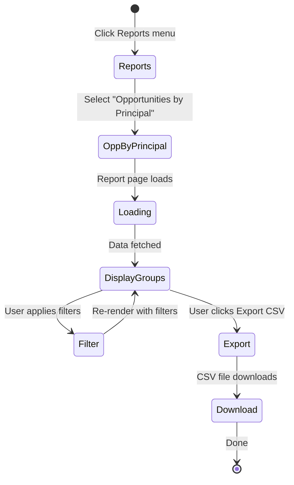
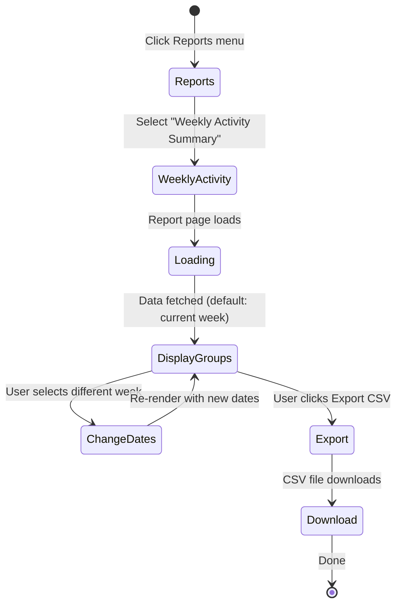

# SRS: Reports Module Implementation

**Created:** 2025-11-05
**Status:** Ready for Implementation
**Complexity:** Medium (Query Aggregation + CSV Export)
**Estimate:** 4 days

---

## Executive Summary

Create dedicated Reports module with 2 MVP reports: (1) Opportunities by Principal (⭐ HIGHEST PRIORITY) and (2) Weekly Activity Summary. Add Reports menu item to navigation. Leverage existing CSV export infrastructure from Organizations/Contacts modules.

---

## Current State Analysis

### ✅ What Exists (40% Complete):

**CSV Export Infrastructure:**
- ✅ `src/components/admin/export-button.tsx` (105 lines)
- ✅ `src/components/admin/bulk-export-button.tsx` (79 lines)
- ✅ `src/hooks/useBulkExport.tsx` - Reusable export hook
- ✅ `src/atomic-crm/opportunities/hooks/useExportOpportunities.ts` (104 lines)
- ✅ UTF-8 BOM encoding for Excel compatibility
- ✅ File naming pattern: `{module}_{date}_{time}.csv`
- ✅ JSONB array flattening logic

**List View Exports:**
- ✅ Organizations export (working)
- ✅ Contacts export (working)
- ✅ Opportunities export (working)

**Data Foundation:**
- ✅ `opportunities` table with `principal_id`
- ✅ `activities` table with `sales_id` and `activity_type`
- ✅ Database views and indexes support reporting queries

### ❌ What's Missing (60%):

**Missing Pages:**
- ❌ OpportunitiesByPrincipal.tsx - Report page
- ❌ WeeklyActivitySummary.tsx - Report page
- ❌ Reports module directory (`src/atomic-crm/reports/`)
- ❌ Reports navigation menu item

**Missing Features:**
- ❌ Report filtering UI (date ranges, Account Managers)
- ❌ Grouped display (by Principal, by Account Manager)
- ❌ Report-specific CSV export (custom columns)

---

## Functional Requirements

### FR-1: Opportunities by Principal Report ⭐ HIGHEST PRIORITY

**Purpose:** See all opportunities grouped by Principal (brand/manufacturer). Answers: "What's the status of each principal I represent?"

**Location:** `/reports/opportunities-by-principal`

**Access:** All users (democratic access)

**Display Format:**

```
══════════════════════════════════════════════════════════
Principal: Fishpeople Seafood (5 opportunities)
══════════════════════════════════════════════════════════
Customer Org         | Opportunity       | Stage              | Status | Expected Close | Account Manager
────────────────────────────────────────────────────────────────────────────────────────────────────────
Restaurant A         | Sample Visit 1    | Sample Visit...    | Active | Dec 1, 2025    | John Smith
Restaurant B         | New Lead          | New Lead           | Active | Dec 15, 2025   | Jane Doe
Restaurant C         | Demo Scheduled    | Demo Scheduled     | Active | Nov 25, 2025   | John Smith

══════════════════════════════════════════════════════════
Principal: Ocean Hugger Foods (3 opportunities)
══════════════════════════════════════════════════════════
Customer Org         | Opportunity       | Stage              | Status | Expected Close | Account Manager
────────────────────────────────────────────────────────────────────────────────────────────────────────
Restaurant D         | Proposal Sent     | Proposal Sent      | Active | Dec 5, 2025    | Jane Doe
...
```

**Features:**

1. **Grouping:**
   - Group by Principal name (alphabetical)
   - Show opportunity count per Principal
   - Expandable/collapsible groups

2. **Columns per Opportunity:**
   - Customer Organization (link to org view)
   - Opportunity Name (link to opportunity view)
   - Stage (8 stages per PRD)
   - Status (Active/Closed/On Hold)
   - Expected Close Date
   - Account Manager name

3. **Filters:**
   - Status (Active/Closed/On Hold) - default: Active only
   - Stage (multi-select from 8 stages)
   - Date Range (Expected Close Date) - default: Next 90 days
   - Account Manager (multi-select) - default: All
   - Principal (multi-select) - default: All

4. **Sort Options:**
   - By Principal name (A-Z or Z-A)
   - By opportunity count (most to least)
   - By expected close date (soonest first) within each Principal

5. **Summary Stats:**
   - Total Principals: X
   - Total Opportunities: Y
   - Active Opportunities: Z

6. **Export:**
   - CSV format with columns: `[Principal, Customer Org, Opportunity Name, Stage, Status, Expected Close, Account Manager]`
   - Filename: `opportunities_by_principal_YYYY-MM-DD_HH-mm.csv`
   - Respects current filters

**Behavior:**
- Load all opportunities with `principal_id` populated
- Group by `principal_id`, fetch Principal name from Principals data
- Apply filters before grouping
- Click Principal name → Navigate to Opportunities list filtered by that Principal
- Click Opportunity name → Navigate to Opportunity Show view
- Click Customer Org → Navigate to Organization Show view

**States:**
- Loading: Skeleton groups
- Empty: "No opportunities found for selected filters. [Clear Filters]"
- Error: "Failed to load opportunities. [Retry]"

**Performance:**
- Target load time: <1 second for 500 opportunities
- Use database view if needed for optimization

---

### FR-2: Weekly Activity Summary Report

**Purpose:** See what each Account Manager did this week (calls, meetings, emails logged). Answers: "Is everyone actively working their principals?"

**Location:** `/reports/weekly-activity-summary`

**Access:** All users (democratic access)

**Display Format:**

```
══════════════════════════════════════════════════════════
John Smith (18 activities this week)
  Calls: 8 | Emails: 5 | Meetings: 3 | Notes: 2
══════════════════════════════════════════════════════════
Date       | Type    | Description                           | Related Entity
──────────────────────────────────────────────────────────────────────────────
Nov 3      | Call    | Spoke with chef about pricing         | Restaurant A
Nov 3      | Email   | Sent follow-up to chef                | Restaurant B
Nov 2      | Meeting | Product demo at location              | Restaurant C
...

══════════════════════════════════════════════════════════
Jane Doe (15 activities this week)
  Calls: 6 | Emails: 7 | Meetings: 2 | Notes: 0
══════════════════════════════════════════════════════════
Date       | Type    | Description                           | Related Entity
──────────────────────────────────────────────────────────────────────────────
Nov 5      | Call    | Initial outreach                      | Restaurant D
...
```

**Features:**

1. **Grouping:**
   - Group by Account Manager name (alphabetical)
   - Show activity count breakdown per user
   - Activity type counts: Calls, Emails, Meetings, Notes
   - Expandable/collapsible groups

2. **Columns per Activity:**
   - Date
   - Activity Type (Call/Email/Meeting/Note)
   - Description (truncated to 60 chars with "...")
   - Related Entity (Contact/Opportunity/Organization name with link)

3. **Filters:**
   - Date Range picker (default: Current week Mon-Sun)
   - Account Manager (multi-select) - default: All
   - Activity Type (multi-select: Call/Email/Meeting/Note) - default: All

4. **Sort:**
   - Within each Account Manager group: By date (newest first)

5. **Summary Stats:**
   - Total Activities: X
   - Total Account Managers: Y
   - Average Activities per User: Z

6. **Export:**
   - CSV format with columns: `[Account Manager, Date, Activity Type, Description, Related Entity]`
   - Filename: `weekly_activity_summary_YYYY-MM-DD_HH-mm.csv`
   - Respects current filters

**Behavior:**
- Default date range: Current week (Monday to Sunday)
- Query activities table with filters
- Group by `sales_id` (Account Manager)
- Count by `activity_type`
- Click Account Manager name → Navigate to Activities list filtered by that user
- Click Related Entity → Navigate to appropriate Show view

**States:**
- Loading: Skeleton groups
- Empty: "No activities logged for selected week. [Change Week]"
- Error: "Failed to load activities. [Retry]"

**Performance:**
- Target load time: <1 second for 1000 activities
- Index on `activities(sales_id, created_at)` already exists

---

## Non-Functional Requirements

### NFR-1: Performance
- Reports load in <1 second for typical data volumes
- CSV export completes in <2 seconds for 1000 rows
- No UI lag when applying filters

### NFR-2: Usability
- Keyboard shortcut: `Shift+R` to open Reports menu
- Export button always visible (sticky header)
- Date range picker defaults to sensible values
- Clear indication of applied filters

### NFR-3: Data Integrity
- Reports use READ ONLY queries (no updates)
- Respect RLS policies (users see only their data)
- Handle missing associations gracefully (show "None" if no related entity)

---

## User Flows

### Flow 1: Run Opportunities by Principal Report


### Flow 2: Run Weekly Activity Summary


---

## Technical Implementation

### Module Structure
```
src/atomic-crm/reports/
├── index.ts                          ← Lazy-loaded exports
├── OpportunitiesByPrincipal.tsx      ← Report page (NEW)
├── WeeklyActivitySummary.tsx         ← Report page (NEW)
├── components/
│   ├── ReportFilters.tsx             ← Shared filter component
│   ├── ReportHeader.tsx              ← Shared header with export button
│   └── GroupedReportTable.tsx        ← Shared grouped table component
└── hooks/
    ├── useOpportunitiesByPrincipal.ts ← Data fetching hook
    └── useWeeklyActivitySummary.ts    ← Data fetching hook
```

### Navigation Registration
```typescript
// src/atomic-crm/root/CRM.tsx
// Add Reports to menu (not a Resource, just custom pages)

<Menu>
  <Menu.DashboardItem />
  <Menu.ResourceItem name="opportunities" />
  <Menu.ResourceItem name="contacts" />
  <Menu.ResourceItem name="organizations" />
  <Menu.ResourceItem name="tasks" />
  <Menu.Item
    to="/reports"
    primaryText="Reports"
    leftIcon={<ChartBarIcon />}
  >
    <Menu.Item
      to="/reports/opportunities-by-principal"
      primaryText="Opportunities by Principal"
    />
    <Menu.Item
      to="/reports/weekly-activity-summary"
      primaryText="Weekly Activity Summary"
    />
  </Menu.Item>
</Menu>

// Add routes
<Route path="/reports/opportunities-by-principal" element={<OpportunitiesByPrincipal />} />
<Route path="/reports/weekly-activity-summary" element={<WeeklyActivitySummary />} />
```

### CSV Export Reuse
```typescript
// Reuse existing export infrastructure
import { useBulkExport } from "@/hooks/useBulkExport";

// In report component:
const { exportData, isExporting } = useBulkExport();

const handleExport = () => {
  const csvData = groupedData.flatMap(group =>
    group.items.map(item => ({
      Principal: group.name,
      "Customer Org": item.organization_name,
      "Opportunity Name": item.name,
      Stage: item.stage,
      Status: item.status,
      "Expected Close": item.expected_close_date,
      "Account Manager": item.account_manager_name,
    }))
  );

  exportData({
    data: csvData,
    filename: `opportunities_by_principal_${Date.now()}.csv`,
  });
};
```

---

## Open Questions

- [ ] **Q1:** Should reports cache data or always fetch fresh?
  - **Impact:** 5 minutes cache = better performance but stale data
  - **Recommendation:** No cache, always fresh (report run is intentional action)

- [ ] **Q2:** Should we add "Last Run" timestamp to reports?
  - **Impact:** 1 hour UI work
  - **Recommendation:** Yes, helps users know if data is fresh

- [ ] **Q3:** Should Weekly Activity Summary show only completed activities or all?
  - **Impact:** None (clarification only)
  - **Recommendation:** All activities regardless of status

---

## Assumptions

- Reports use existing database schema (no new tables needed)
- CSV export infrastructure from Organizations/Contacts is reusable
- React Admin Menu supports nested items
- Users understand "Current week" = Monday to Sunday
- Principals data is accessible via `opportunities.principal_id`

---

## Dependencies

- ✅ CSV export hooks (`useBulkExport.tsx`)
- ✅ Opportunities table with `principal_id`
- ✅ Activities table with `sales_id` and `activity_type`
- ✅ Database indexes for performance
- ❌ Reports module directory (needs creation)
- ❌ Navigation menu updates (in CRM.tsx)

---

## Success Criteria

**MVP Definition of Done:**
- [ ] Reports module directory created
- [ ] Opportunities by Principal report page working
- [ ] Weekly Activity Summary report page working
- [ ] Reports menu item in navigation
- [ ] Both reports export to CSV
- [ ] Filters work correctly
- [ ] Performance <1 second load time
- [ ] Tests added (min 70% coverage)

**Acceptance Test:**
1. Navigate to Reports → Opportunities by Principal
2. Verify opportunities grouped by Principal
3. Apply filter: Status = Active, Date Range = Next 30 days
4. Verify filtered results display correctly
5. Click "Export CSV", verify file downloads
6. Navigate to Reports → Weekly Activity Summary
7. Verify activities grouped by Account Manager
8. Change date range to "Last Week"
9. Verify activities update
10. Export CSV, verify file correct

---

## Related Documentation

- **PRD:** `docs/prd/09-reports.md`
- **Export Infrastructure:** `src/components/admin/export-button.tsx`, `src/hooks/useBulkExport.tsx`
- **Opportunities Export:** `src/atomic-crm/opportunities/hooks/useExportOpportunities.ts`
