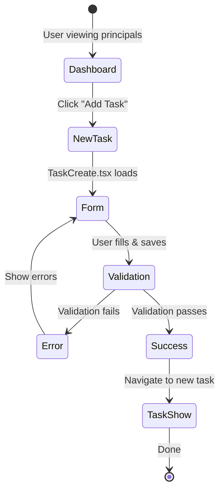
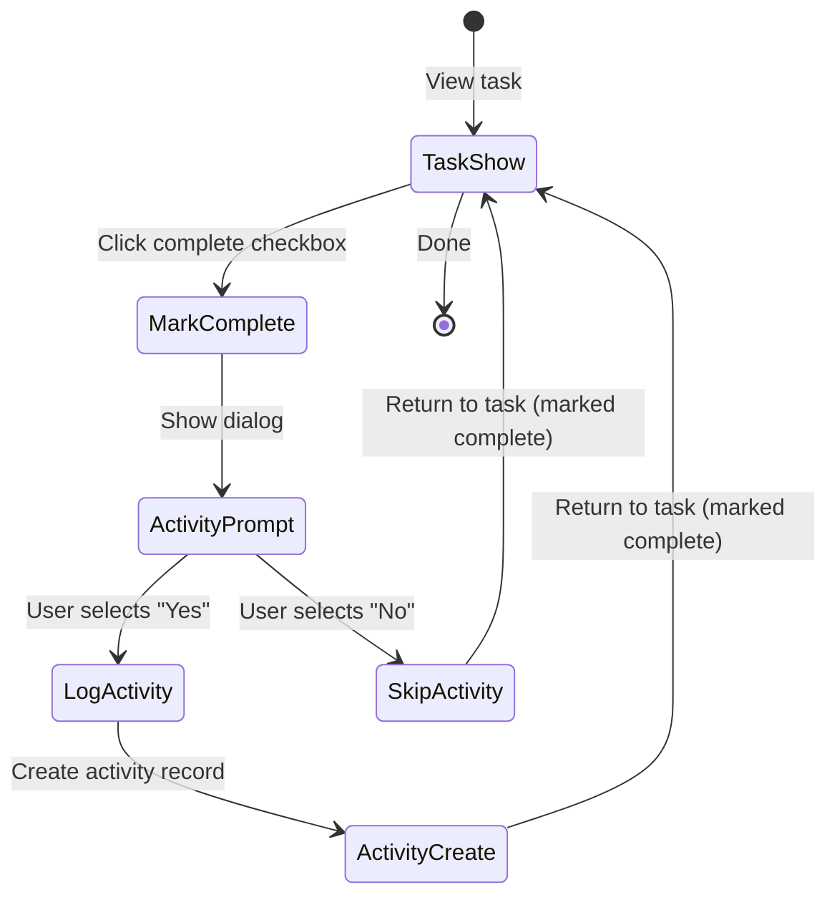

# SRS: Tasks Module Implementation

**Created:** 2025-11-05
**Status:** Ready for Implementation
**Complexity:** Medium (CRUD + Multi-assignment)
**Estimate:** 8-9 days

---

## Executive Summary

Elevate Tasks from embedded widgets (35% complete) to full resource module following Organizations/Contacts/Opportunities patterns. Implement missing List/Show/Edit/Create pages, add multi-assignment UI, and register as proper resource in CRM.tsx.

---

## Current State Analysis

### ✅ What Exists (35% Complete):

**Database Schema:** `tasks` table with columns:
- Core: `id`, `title`, `description`, `due_date`, `completed`, `completed_at`
- Assignment: `sales_id` (single assignment only)
- Associations: `contact_id`, `opportunity_id` (no `organization_id`)
- Metadata: `reminder_date`, `priority`, `type`, `created_at`, `updated_at`

**Validation:** Comprehensive Zod schemas (src/atomic-crm/validation/tasks.ts)
- `taskCreateSchema`, `taskUpdateSchema`, `taskReminderSchema`

**Embedded Components:**
- `AddTask.tsx` (193 lines) - Task creation dialog from contact view
- `TaskEdit.tsx` (101 lines) - Inline edit dialog
- `Task.tsx` (218 lines) - Task display with complete/postpone
- `TasksIterator.tsx` (762 bytes) - Iteration component

**Features Working:**
- ✅ Create tasks from contact view
- ✅ Edit via dialog
- ✅ Mark complete/incomplete
- ✅ Intelligent postpone (tomorrow/next week)
- ✅ Delete with undo
- ✅ Task type selection (8 types)

### ❌ What's Missing (65%):

**Missing Pages:**
- ❌ TaskList.tsx - Full resource list view
- ❌ TaskShow.tsx - Detail page
- ❌ TaskCreate.tsx - Standalone create page
- ❌ TaskEdit.tsx - Standalone edit page (current is dialog only)
- ❌ index.ts - Module exports for lazy loading

**Missing Features:**
- ❌ Multi-assignment (primary/secondary/tertiary Account Managers)
- ❌ Organization association
- ❌ Opportunity association UI
- ❌ Activity integration (log when task completed)
- ❌ Advanced filtering/sorting
- ❌ Resource registration in CRM.tsx

**Database Gaps:**
- ❌ No `organization_id` foreign key
- ❌ No multi-assignment columns (`primary_account_manager_id`, `secondary_account_manager_id`, `tertiary_account_manager_id`)
- ✅ Has `priority` field but PRD says "deferred from MVP" (exists but unused)

---

## Functional Requirements

### FR-1: Task List View (TaskList.tsx)

**Location:** `/tasks` accessible from main navigation

**Behavior:**
- Standard React Admin List component
- Default view: Incomplete tasks only, sorted by due date (soonest first), filtered to current user
- Pagination: 25 per page

**Columns:**
- Title (clickable to Show view)
- Due Date (default sort: closest first)
- Primary Account Manager
- Related To (Contact/Opportunity/Organization name with link)
- Task Type (Call, Email, Meeting, etc.)
- Completed (checkbox - marks complete inline)

**Filters:**
- Completed (Yes/No)
- Due Date range (date picker)
- Primary Account Manager (multi-select)
- Task Type (multi-select)
- Related Entity Type (Contact/Opportunity/Organization)

**Sort Options:**
- Due Date (default)
- Created Date
- Account Manager name

**Bulk Actions:**
- Mark Complete
- Delete
- Reassign Primary Account Manager

**States:**
- Loading: Show skeleton rows
- Empty: "No tasks found. Create your first task!"
- Error: "Failed to load tasks. [Retry]"

---

### FR-2: Task Show View (TaskShow.tsx)

**Location:** `/tasks/:id`

**Displays:**
- Task title (editable inline)
- Description (full text, editable)
- Due date (editable date picker)
- Completion status (toggle checkbox with confirmation)
- Completed date/time (if completed)
- Primary Account Manager (editable dropdown)
- Secondary Account Manager (optional, editable)
- Tertiary Account Manager (optional, editable)
- Related Entity (Contact/Opportunity/Organization with link)
- Task type (editable select)
- Created/updated timestamps (read-only)

**Actions:**
- Edit (navigates to /tasks/:id/edit)
- Delete (confirmation dialog)
- Mark Complete / Mark Incomplete (toggle)
- Postpone (tomorrow / next week)
- Clone Task (creates copy with new due date)

**Activity Integration (Optional Prompt):**
When task marked complete, show dialog:
```
✅ Task completed!

Log this as an activity? [Yes] [No]

If Yes:
- Activity Type: [Auto-fill from task type]
- Description: [Auto-fill from task title]
- Related To: [Auto-fill from task association]
```

**Validation:**
- Title: Required, max 200 chars
- Due date: Optional (can be null)
- At least one Account Manager required
- At least one association (Contact OR Opportunity OR Organization) recommended but not required

**States:**
- Loading: Skeleton layout
- Not Found: "Task not found. [Return to List]"
- Error: "Failed to load task. [Retry]"

---

### FR-3: Task Create View (TaskCreate.tsx)

**Location:** `/tasks/create`

**Form Fields:**

**Required:**
- Title* (text input, max 200 chars)
- Due Date* (date picker, default: +3 days from today)
- Primary Account Manager* (searchable select, default: current user)

**Optional:**
- Description (textarea, max 2000 chars)
- Secondary Account Manager (searchable select)
- Tertiary Account Manager (searchable select)
- Related To (tab interface):
  - Contact tab (searchable dropdown)
  - Opportunity tab (searchable dropdown)
  - Organization tab (searchable dropdown)
  - None (default)
- Task Type (select dropdown):
  - Call, Email, Meeting, Follow-up, Proposal, Discovery, Administrative, None (default)

**Behavior:**
- Save button: Creates task, navigates to TaskShow
- Cancel button: Returns to TaskList
- Form validation via Zod schema

**Validation Errors:**
- Title required: "Task title is required"
- Title too long: "Title must be 200 characters or less"
- Due date invalid: "Please select a valid date"
- No Account Manager: "At least one Account Manager is required"

**States:**
- Idle: Form ready
- Submitting: Disabled form, loading spinner on Save button
- Error: Show error banner with message

---

### FR-4: Task Edit View (TaskEdit.tsx)

**Location:** `/tasks/:id/edit`

**Same form as TaskCreate** but:
- Pre-populated with existing task data
- Title changes to "Edit Task: {title}"
- Save button updates task, returns to Show
- Additional action: Delete button (confirmation required)

---

### FR-5: Multi-Assignment Model

**Assignment Structure:**

1. **Primary Account Manager** (required)
   - Main owner
   - Appears first in lists
   - Default: Current user

2. **Secondary Account Manager** (optional)
   - Collaborator/backup
   - Full read/write access
   - Can complete task

3. **Tertiary Account Manager** (optional)
   - Additional team member (manager oversight, training)
   - Full read/write access

**Database Implementation:**
Requires migration to add:
```sql
ALTER TABLE tasks
  ADD COLUMN primary_account_manager_id BIGINT REFERENCES sales(id),
  ADD COLUMN secondary_account_manager_id BIGINT REFERENCES sales(id),
  ADD COLUMN tertiary_account_manager_id BIGINT REFERENCES sales(id),
  ADD COLUMN organization_id BIGINT REFERENCES organizations(id);

-- Migrate existing data
UPDATE tasks SET primary_account_manager_id = sales_id WHERE sales_id IS NOT NULL;

-- Drop old column
ALTER TABLE tasks DROP COLUMN sales_id;
```

**UI Display:**
- Show page: Stack Account Managers vertically with labels
- List page: Show Primary Account Manager only
- Edit page: Three separate select dropdowns

---

### FR-6: Task Filtering by Principal

**Dashboard Integration:**
- Click "Next Action" in principal table → Opens TaskShow for specific task
- Click Principal name → Navigates to Opportunities filtered by principal
- From Opportunities view → "View Tasks" button → Opens TaskList filtered to tasks where `opportunity_id IN (opportunities for this principal)`

**Filter Logic:**
```typescript
const tasksForPrincipal = tasks.filter(task =>
  task.opportunity?.principal_id === selectedPrincipalId
);
```

---

## Non-Functional Requirements

### NFR-1: Performance
- Task list loads in <500ms for 100 tasks
- Search/filter response <200ms
- No pagination lag (use React Admin built-in)

### NFR-2: Usability
- Keyboard shortcuts: `n` for New Task, `e` for Edit
- Inline editing for title/due date on Show view
- Toast notifications for Create/Update/Delete

### NFR-3: Data Integrity
- Cascade delete: When contact deleted, tasks remain but contact_id set to null
- Cascade delete: When opportunity deleted, tasks remain but opportunity_id set to null
- Soft delete option: Consider adding `deleted_at` for recoverability

---

## User Flows

### Flow 1: Create Task from Dashboard


### Flow 2: Mark Task Complete with Activity


---

## Technical Implementation

### Module Structure
```
src/atomic-crm/tasks/
├── index.ts              ← Lazy-loaded exports
├── TaskList.tsx          ← List view (NEW)
├── TaskShow.tsx          ← Detail view (NEW)
├── TaskCreate.tsx        ← Create form (NEW)
├── TaskEdit.tsx          ← Edit form (NEW - standalone, not dialog)
├── AddTask.tsx           ← Embedded dialog (KEEP for contact view)
├── Task.tsx              ← Task display component (KEEP)
└── TasksIterator.tsx     ← Iterator (KEEP)
```

### Resource Registration
```typescript
// src/atomic-crm/root/CRM.tsx
import Tasks from "../tasks";

<Resource
  name="tasks"
  {...Tasks}
  icon={TasksIcon}
/>
```

### Module Exports (index.ts)
```typescript
import { lazy } from "react";

const TaskList = lazy(() => import("./TaskList"));
const TaskShow = lazy(() => import("./TaskShow"));
const TaskEdit = lazy(() => import("./TaskEdit"));
const TaskCreate = lazy(() => import("./TaskCreate"));

export default {
  list: TaskList,
  show: TaskShow,
  edit: TaskEdit,
  create: TaskCreate,
  recordRepresentation: (record) => record.title,
};
```

### Data Provider
Uses `unifiedDataProvider.ts` with standard operations:
- `GET_LIST` with filters
- `GET_ONE`
- `CREATE`
- `UPDATE`
- `DELETE`

### Query Optimization
**Indexes needed:**
- ✅ EXISTS: `idx_tasks_due_date` (WHERE completed = false)
- ✅ EXISTS: `idx_tasks_contact_id`
- ✅ EXISTS: `idx_tasks_opportunity_id`
- ❌ MISSING: `idx_tasks_organization_id` (after adding column)
- ❌ MISSING: `idx_tasks_primary_account_manager_id`

---

## Open Questions

- [ ] **Q1:** Should we keep `priority` field visible in UI or continue hiding it per PRD?
  - **Impact:** If added, 4 hours UI work
  - **Recommendation:** Keep hidden per PRD, add post-MVP if requested

- [ ] **Q2:** Should we keep `reminder_date` field and add reminder notifications?
  - **Impact:** 2 days notification integration
  - **Recommendation:** Defer to post-MVP per PRD

- [ ] **Q3:** Activity integration - is it mandatory or truly optional?
  - **Impact:** If mandatory, remove dialog, always create activity
  - **Recommendation:** Keep optional per PRD (some tasks internal, some customer-facing)

---

## Assumptions

- Tasks will follow Organizations/Contacts/Opportunities resource pattern exactly
- Existing Zod validation schemas are sufficient (may need minor updates for multi-assignment)
- React Admin List/Show/Edit/Create patterns handle 95% of functionality
- Current user has access to all sales (Account Manager) records for assignment dropdowns
- Activity module exists and has create API (for optional integration)

---

## Dependencies

- ✅ Supabase tasks table (exists)
- ✅ Zod schemas (exist in src/atomic-crm/validation/tasks.ts)
- ❌ Database migration (needs multi-assignment columns + organization_id)
- ✅ React Admin components (standard library)
- ⚠️ Activity module API (for optional integration - verify exists)

---

## Success Criteria

**MVP Definition of Done:**
- [ ] All 4 pages exist (List/Show/Edit/Create)
- [ ] Multi-assignment UI functional
- [ ] Organization association available
- [ ] Resource registered in CRM.tsx
- [ ] Navigation menu includes Tasks
- [ ] All filters/sorts working
- [ ] Activity integration dialog appears on complete
- [ ] Tests added (min 70% coverage)

**Acceptance Test:**
1. Create task with secondary Account Manager and organization association
2. View task in list, verify all columns display
3. Click into task, see full details including multi-assignment
4. Edit task, change secondary to tertiary
5. Mark task complete, prompted to log activity
6. Choose "Yes", verify activity created
7. Filter tasks by Account Manager, see only assigned tasks
8. Bulk delete 3 tasks, verify success

---

## Related Documentation

- PRD: `docs/prd/08-tasks-module.md`
- Validation: `src/atomic-crm/validation/tasks.ts`
- Database: `supabase/migrations/20251018152315_cloud_schema_fresh.sql` (line 1945)
- Example Resource: `src/atomic-crm/organizations/` (pattern to follow)
