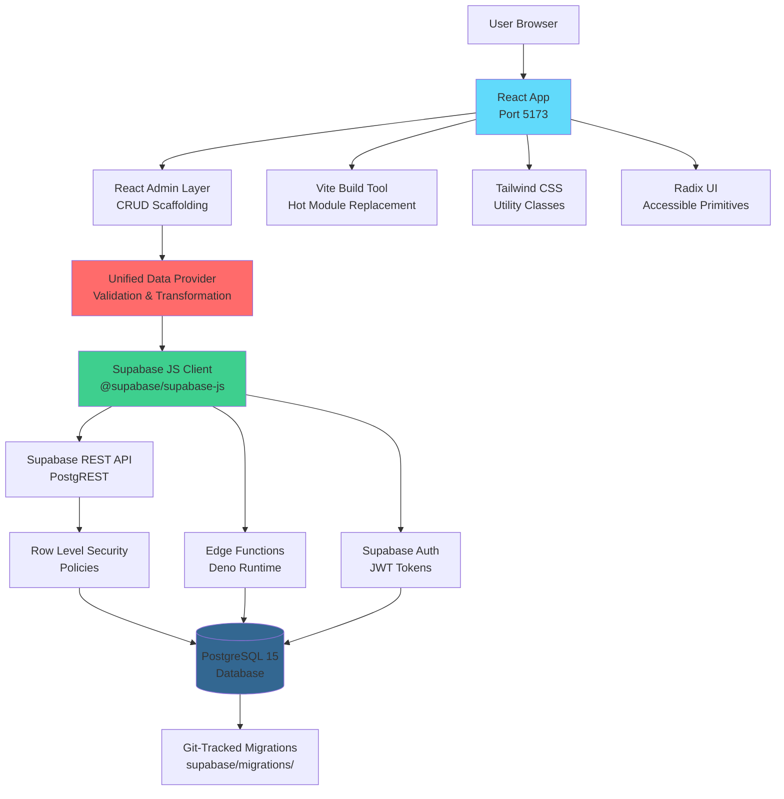
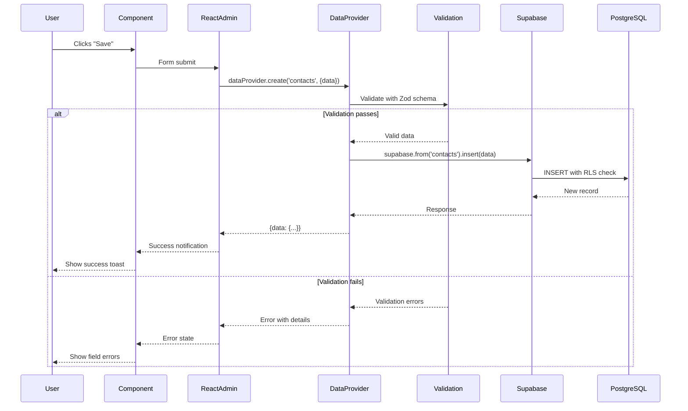

# System Architecture

## Technology Stack

### Frontend

| Technology | Version | Purpose |
|------------|---------|---------|
| React | 19.1.0 | UI library for component-based interface |
| TypeScript | 5.8.3 | Type-safe JavaScript with compile-time checks |
| Vite | 7.0.4 | Fast build tool with HMR (Hot Module Replacement) |
| React Admin | 5.10.0 | Admin framework providing CRUD scaffolding |
| Tailwind CSS | 4.1.11 | Utility-first CSS framework |
| Radix UI | Latest | Unstyled, accessible UI primitives |
| React Hook Form | 7.66.1 | Performant form management |
| Zod | 4.1.12 | Runtime type validation and schema definition |
| React Query | 5.85.9 | Server state management (via @tanstack/react-query) |
| React Router | 6.30.1 | Client-side routing |

### Backend / API

| Technology | Version | Purpose |
|------------|---------|---------|
| Supabase | 2.51.0 (CLI) | Backend-as-a-Service (BaaS) |
| PostgreSQL | 15+ | Relational database (via Supabase) |
| Supabase Auth | Latest | Authentication and user management |
| Edge Functions | Deno runtime | Serverless functions for complex operations |

### State Management

| Technology | Purpose |
|------------|---------|
| React Query | Server state (data fetching, caching, synchronization) |
| React Context | Global UI state (theme, configuration, user identity) |
| React Hook Form | Form state (validation, dirty fields, submission) |
| URL State | List filters and pagination (query parameters) |
| Local Storage | User preferences (dashboard layout, sidebar collapsed) |

### UI Components

| Library | Purpose |
|---------|---------|
| @radix-ui/* | Accessible primitives (Dialog, Dropdown, Tabs, etc.) |
| lucide-react | Icon set (0.542.0) |
| recharts | Charts and data visualization (3.3.0) |
| @hello-pangea/dnd | Drag-and-drop for Kanban board (18.0.1) |
| react-day-picker | Date picker component (9.11.1) |
| sonner | Toast notifications (2.0.7) |

### Development Tools

| Tool | Purpose |
|------|---------|
| Vitest | Unit and integration testing |
| Playwright | End-to-end testing |
| ESLint | Code linting |
| Prettier | Code formatting |
| Husky | Git hooks |

### Hosting

**Local Development:**
- Frontend: Vite dev server (port 5173)
- Backend: Docker Supabase (ports 54321-54323)

**Production:**
- Frontend: Static hosting (Vercel, Netlify, or CDN)
- Backend: Supabase Cloud (managed PostgreSQL + Edge Functions)

---

## System Diagram



---

## Application Structure

### Entry Points

```
src/
├── main.tsx                    # Application entry (ReactDOM.render)
├── App.tsx                     # Root component (providers, routing)
└── atomic-crm/
    └── root/
        └── CRM.tsx             # Main CRM container (React Admin setup)
```

**Flow:** `main.tsx` → `App.tsx` → `CRM.tsx` → Resource components

---

### Resource-Based Architecture

Each CRM entity (contacts, organizations, opportunities, etc.) follows a consistent structure:

```
src/atomic-crm/<resource>/
├── index.ts                    # Lazy-loaded exports
├── <Resource>List.tsx          # List view with filters
├── <Resource>Show.tsx          # Detail view (DEPRECATED - use slide-overs)
├── <Resource>Edit.tsx          # Edit form
├── <Resource>Create.tsx        # Create form
├── <Resource>SlideOver.tsx     # Slide-over panel (view/edit mode)
├── <Resource>Filter.tsx        # Filter sidebar component
└── __tests__/                  # Unit tests
```

**Example:** `src/atomic-crm/contacts/`
- `ContactList.tsx` - List with StandardListLayout + PremiumDatagrid
- `ContactSlideOver.tsx` - Slide-over for viewing/editing
- `ContactCreate.tsx` - Full-page create form
- `ContactListFilter.tsx` - Filter sidebar

---

### Component Organization

```
src/
├── atomic-crm/              # CRM-specific business logic
│   ├── contacts/
│   ├── organizations/
│   ├── opportunities/
│   ├── products/
│   ├── tasks/
│   ├── sales/               # User management
│   ├── activities/          # Activity logging
│   ├── dashboard/           # Dashboard variants (v1, v2, v3)
│   ├── reports/             # Reporting pages
│   ├── layout/              # CRM layout components
│   ├── providers/           # Data and auth providers
│   ├── services/            # Business logic services
│   ├── validation/          # Zod schemas
│   └── types.ts             # TypeScript types
│
├── components/              # Reusable UI components
│   ├── admin/               # React Admin wrappers
│   ├── ui/                  # Base UI components (shadcn-style)
│   └── layouts/             # Layout components
│
├── lib/                     # Utilities and helpers
└── hooks/                   # Custom React hooks
```

---

### Data Flow



---

## Key Architectural Decisions

### 1. React Admin Framework

**Rationale:** React Admin provides CRUD scaffolding out-of-the-box, reducing boilerplate code for list views, forms, and data operations. The framework follows established patterns for admin interfaces.

**Impact:**
- Fast feature development (minutes vs hours for new resources)
- Consistent UI patterns across all resources
- Built-in support for pagination, sorting, filtering
- Tight coupling to React Admin patterns (migration cost if switching frameworks)

**Alternatives Considered:** Building custom admin interface from scratch (rejected due to time investment)

---

### 2. Supabase Backend

**Rationale:** Supabase provides a complete backend solution (database, auth, storage, edge functions) with excellent TypeScript support and PostgreSQL's robustness.

**Impact:**
- Rapid backend development (no server infrastructure code)
- PostgreSQL provides ACID guarantees, JSON support (JSONB), full-text search
- Row Level Security (RLS) enforces access control at database level
- Vendor lock-in to Supabase (mitigation: PostgreSQL is standard, schema is git-tracked)

**Alternatives Considered:**
- Firebase (rejected: NoSQL doesn't fit relational CRM data model)
- Custom Node.js backend (rejected: longer development time)

---

### 3. Tailwind CSS v4 + Semantic Design System

**Rationale:** Utility-first CSS enables rapid UI development without writing custom CSS. Tailwind v4 introduces CSS variables for theming. Semantic color system (--primary, --brand-700) ensures design consistency.

**Impact:**
- Fast UI prototyping
- Consistent design system via semantic utilities
- Small CSS bundle (unused utilities purged)
- Requires learning Tailwind conventions

**Alternatives Considered:**
- CSS Modules (rejected: more verbose)
- Styled Components (rejected: runtime cost)

---

### 4. Zod Validation at API Boundary

**Rationale:** Single source of truth for validation. Zod schemas define both runtime validation and TypeScript types (via `z.infer<>`).

**Impact:**
- Type-safe forms and API operations
- Validation errors caught early (before database)
- Schema changes require code changes (no dynamic validation rules)

**Pattern:**
```typescript
// Define once
const schema = z.object({ name: z.string().min(1) });
type Input = z.infer<typeof schema>;

// Use everywhere
const validated = schema.parse(input);  // Runtime
const form = useForm<Input>({ ... });   // TypeScript
```

---

### 5. Slide-Over Pattern for View/Edit

**Rationale:** Modern UX pattern (popularized by GitHub, Linear, Notion) keeps users in context while viewing/editing details.

**Impact:**
- Faster navigation (no full-page load)
- URL state preserved (`?view=123` or `?edit=123`)
- Requires more complex state management than full-page views

**Implementation:**
- Width: 40vw (min 480px, max 720px)
- Animation: slide from right (200ms ease-out)
- Focus trap required (accessibility)

---

### 6. Lazy Loading for Routes

**Rationale:** Code splitting reduces initial bundle size. Non-critical routes load on-demand.

**Impact:**
- Faster initial page load (< 100KB gzipped)
- Slight delay when accessing lazy-loaded routes first time
- Better Lighthouse performance scores

**Implementation:**
```typescript
const ReportsPage = React.lazy(() => import("../reports/ReportsPage"));
```

---

## Performance Optimizations

### Code Splitting

**Strategy:** Route-based code splitting via React.lazy()

**Bundles:**
- Main bundle: ~90KB gzipped (React, React Admin core, Supabase client)
- Resource chunks: ~20-30KB each (contacts, opportunities, products)
- Dashboard V3: ~30KB (lazy-loaded)
- Reports: ~25KB (lazy-loaded)

---

### Caching Strategy

**React Query Caching:**
- Default stale time: 5 minutes
- Cache time: 30 minutes
- Automatic refetch on window focus
- Optimistic updates for mutations

**Browser Caching:**
- Static assets: Hashed filenames (cache forever)
- HTML: No caching (always fresh)

---

### Database Indexing

**Key Indexes:**
- Primary keys: `id` (all tables)
- Foreign keys: `organization_id`, `sales_id`, `contact_id`, `opportunity_id`
- Soft delete: `deleted_at` (partial index: `WHERE deleted_at IS NULL`)
- Full-text search: `search_tsv` (tsvector with GIN index)
- Timestamps: `created_at DESC` (for sorting lists)

**Example:**
```sql
CREATE INDEX idx_contacts_organization_id ON contacts(organization_id);
CREATE INDEX idx_contacts_deleted_at ON contacts(deleted_at) WHERE deleted_at IS NULL;
```

---

## Security Architecture

### Authentication Flow

1. User submits email/password at `/login`
2. Supabase Auth validates credentials
3. JWT access token (short-lived, 1 hour) and refresh token (long-lived, 30 days) returned
4. Tokens stored securely (httpOnly cookies or encrypted localStorage)
5. All API requests include JWT in Authorization header
6. Server validates JWT signature and expiry
7. If expired, client automatically refreshes using refresh token

---

### Row Level Security (RLS)

**Pattern:** Database-level access control enforced by PostgreSQL

**Example Policy:**
```sql
-- Contacts are shared across team (all authenticated users can read/write)
CREATE POLICY authenticated_select_contacts ON contacts
  FOR SELECT TO authenticated
  USING (deleted_at IS NULL);

-- Tasks are personal (users can only see their own tasks)
CREATE POLICY personal_select_tasks ON tasks
  FOR SELECT TO authenticated
  USING (sales_id IN (SELECT id FROM sales WHERE user_id = auth.uid()));
```

**Benefits:**
- Impossible to bypass (even with SQL injection)
- Single source of truth (no duplicate logic in application code)
- Works for direct database access (e.g., admin tools)

---

### Input Validation

**Layers:**
1. **Client-side (UX):** React Hook Form + Zod for immediate feedback
2. **API Boundary (Security):** Zod schemas in unified data provider
3. **Database (Integrity):** CHECK constraints, NOT NULL, foreign keys

**Defense-in-Depth:** All three layers provide redundant protection.

---

### CSRF Protection

**Not Required:** Supabase uses JWT tokens (not cookies), so CSRF attacks are not applicable.

---

## Deployment Architecture

### Local Development

```
Developer Machine
├── Vite Dev Server (localhost:5173)
├── Docker Desktop
│   └── Supabase Stack
│       ├── PostgreSQL (port 54322)
│       ├── REST API (port 54321)
│       ├── Studio GUI (port 54323)
│       └── Edge Functions (local runtime)
└── .env (local configuration)
```

**Start command:** `npm run dev:local` (starts Docker Supabase + Vite)

---

### Production (Cloud)

```
User Browser
    ↓
CDN / Static Host (Vercel, Netlify)
    ↓ (HTTPS)
React App Bundle
    ↓
Supabase Cloud (project: aaqnanddcqvfiwhshndl)
    ├── PostgreSQL (managed)
    ├── REST API (auto-scaled)
    ├── Auth (managed)
    └── Edge Functions (Deno Deploy)
```

**Deployment:**
1. Build: `npm run build` → `dist/` folder
2. Deploy static files to CDN
3. Migrations: `npm run db:cloud:push` (applies migrations to production database)
4. Edge Functions: `supabase functions deploy`

---

## Monitoring & Observability

**Current Implementation:** Basic console logging

**Error Tracking:**
- Data provider logs all errors with context
- React Error Boundaries catch component crashes
- No external error tracking service (e.g., Sentry) configured

**Performance Monitoring:**
- Vite build analyzer (rollup-plugin-visualizer)
- Lighthouse audits (manual)
- No APM solution configured

**Database Monitoring:**
- Supabase Dashboard provides query performance metrics
- PostgreSQL EXPLAIN ANALYZE for slow query debugging

---

## Extensibility Points

### Custom Fields

Add fields to entities by creating database migrations and updating Zod schemas.

**Example:** Add "company_size" to organizations
1. Migration: `ALTER TABLE organizations ADD COLUMN company_size TEXT;`
2. Schema: `organizationSchema.extend({ company_size: z.string().optional() })`
3. Form: `<TextInput source="company_size" />`

---

### Custom Dashboards

Add new dashboard variants in `src/atomic-crm/dashboard/`.

**Example:** Dashboard V3 (default at root URL)
- Location: `src/atomic-crm/dashboard/v3/`
- Entry: Registered in `CRM.tsx` with `<CustomRoutes>`

---

### Custom Reports

Add report pages in `src/atomic-crm/reports/`.

**Pattern:**
1. Create component: `src/atomic-crm/reports/MyReport.tsx`
2. Register route in `ReportsPage.tsx`
3. Query data via React Admin hooks (`useGetList`, `useDataProvider`)

---

## Technology Choices Rationale

| Choice | Why Not Alternative? |
|--------|---------------------|
| React Admin | Custom admin UI: Too much boilerplate |
| Supabase | Firebase: NoSQL doesn't fit relational model; Custom backend: Longer dev time |
| PostgreSQL | MongoDB: Lacks transactions, referential integrity; MySQL: Weaker JSON support |
| Tailwind CSS | CSS Modules: More verbose; Styled Components: Runtime cost |
| Vite | Create React App: Slower build times; Webpack: More configuration |
| Zod | Yup: Weaker TypeScript integration; Joi: Backend-focused |
| TypeScript | JavaScript: Lack of type safety increases bugs |
