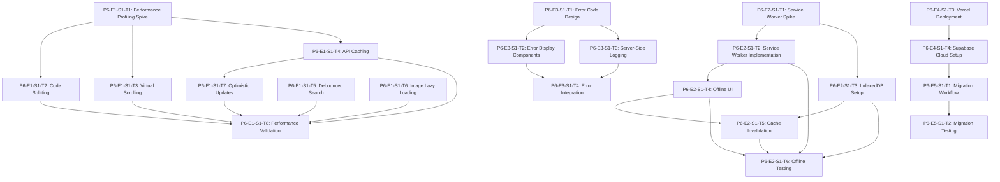

# 🚀 Phase 6: Production Readiness - Implementation Plan

**Plan Created:** 2025-11-03
**Status:** ⚠️ **~10% COMPLETE** - Basic error handling exists, offline mode and optimization not started
**Last Updated:** 2025-11-05 (Status verified via code review)
**Based on:** PRD Section 5.3-5.9, Section 10 (Operational Requirements)
**Timeline:** Week 10 (40 hours) → ~36h remaining
**Approach:** Radical simplicity - no complex monitoring, basic error handling, scripted migrations
**Total Tasks:** 24

**Completed:**
- ⚠️ Basic error handling in some components (63 references to error handling code)

**Not Started (~36h remaining):**
- ❌ Performance optimization (<2s load, <500ms interaction targets) - ~12h
- ❌ Offline mode with Service Worker - ~10h
- ❌ Comprehensive error handling with E1xxx-E5xxx error codes - ~8h
- ❌ Production deployment configuration (Vercel + Supabase Cloud) - ~4h
- ❌ Database migration scripts - ~2h

---

## Executive Summary

Phase 6 prepares the CRM for production deployment with a focus on **radical simplicity**. This phase includes:

- **Performance Optimization:** Meet <2s load, <500ms interaction targets
- **Offline Mode:** Read-only caching with Service Worker
- **Error Handling:** User-friendly messages with E1xxx-E5xxx error codes
- **Basic Monitoring:** Uptime-only monitoring (no APM)
- **Deployment:** Vercel + Supabase Cloud configuration
- **Migration Scripts:** Database migration workflow with planned downtime

**Key Principles:**
- No automatic retry logic - users retry manually
- No feature flags or gradual rollouts
- No APM or performance monitoring dashboards
- Scripted migrations with 5-10 minute downtime acceptable
- 30-day log retention only
- English only (no i18n)

---

## Epic Breakdown

### E1: Performance Optimization (8 tasks, 12 hours)
- Code splitting and lazy loading
- API response caching
- Virtual scrolling
- Image optimization
- Performance profiling and tuning

### E2: Offline Mode Implementation (6 tasks, 11 hours)
- Service Worker setup
- Cache strategy implementation
- Offline UI indicators
- IndexedDB for structured data

### E3: Error Handling System (4 tasks, 6 hours)
- Error code system (E1xxx-E5xxx)
- User-friendly error display
- Server-side logging
- Error dictionary for support

### E4: Monitoring & Deployment (4 tasks, 7 hours)
- Uptime monitoring setup
- Vercel deployment configuration
- Supabase Cloud setup
- Activity logging

### E5: Migration Workflow (2 tasks, 4 hours)
- Migration scripts and testing
- Production deployment procedures

---

## E1: Performance Optimization

### Task P6-E1-S1-T1: Spike - Performance Profiling Strategy

**ID:** P6-E1-S1-T1
**Story:** As a developer, I need to identify performance bottlenecks before optimization
**Estimate:** 2 hours
**Confidence:** 75%

**Description:**
Research and document performance profiling approach using React DevTools Profiler, Lighthouse, and Web Vitals. Establish baseline metrics for current application performance.

**Prerequisites:**
- Application running in production mode locally
- Chrome DevTools and Lighthouse installed

**Implementation Steps:**
1. Document performance profiling tools and workflow (30 min)
2. Run Lighthouse audit on all major pages (30 min)
3. Use React DevTools Profiler to identify slow components (30 min)
4. Document Core Web Vitals baseline metrics (30 min)

**Acceptance Criteria:**
- [ ] Profiling workflow documented in `/docs/performance/profiling-guide.md`
- [ ] Baseline metrics recorded: LCP, FID, CLS, TTI
- [ ] Top 5 performance bottlenecks identified
- [ ] Lighthouse score recorded for dashboard, list views, detail pages

**Deployment Considerations:**
- Use production build: `npm run build && npm run preview`
- Test on throttled network (Fast 3G) for realistic metrics

---

### Task P6-E1-S1-T2: Implement Route-Based Code Splitting

**ID:** P6-E1-S1-T2
**Story:** As a user, I want pages to load faster by only downloading code I need
**Estimate:** 1.5 hours
**Confidence:** 85%

**Description:**
Split application code by route using React.lazy() and Suspense. Implement lazy loading for all resource modules (contacts, organizations, opportunities, etc).

**Prerequisites:**
- P6-E1-S1-T1 completed (baseline metrics established)

**Implementation Steps:**
1. Audit current import structure in `CRM.tsx` (15 min)
2. Convert all resource imports to React.lazy() (30 min)
3. Add Suspense boundaries with loading indicators (30 min)
4. Verify bundle splitting in build output (15 min)

**Acceptance Criteria:**
- [ ] All resource modules use React.lazy()
- [ ] Suspense boundaries show loading state
- [ ] Build output shows separate chunks per route
- [ ] Initial bundle size reduced by >30%
- [ ] Page transition shows loading indicator

**Files Modified:**
- `src/atomic-crm/root/CRM.tsx`
- Potentially add `src/atomic-crm/components/SuspenseFallback.tsx`

**Deployment Considerations:**
- Test loading indicators on slow network
- Verify all routes still accessible after code splitting

---

### Task P6-E1-S1-T3: Add Virtual Scrolling to Large Lists

**ID:** P6-E1-S1-T3
**Story:** As a user, I want long lists to scroll smoothly
**Estimate:** 2 hours
**Confidence:** 70%

**Description:**
Implement virtual scrolling for lists with >100 items using react-window or react-virtualized. Target opportunity list, contact list, and organization list.

**Prerequisites:**
- P6-E1-S1-T1 completed

**Implementation Steps:**
1. Install react-window library (5 min)
2. Create VirtualizedList wrapper component (45 min)
3. Update OpportunityList to use virtual scrolling (30 min)
4. Update ContactList and OrganizationList (30 min)
5. Test with 500+ records (15 min)

**Acceptance Criteria:**
- [ ] Lists with >100 items use virtual scrolling
- [ ] Smooth scrolling at 60fps with 1000+ records
- [ ] Scroll position preserved on navigation back
- [ ] Select/multi-select still works with virtualization

**Files Modified:**
- `src/atomic-crm/components/VirtualizedList.tsx` (new)
- `src/atomic-crm/opportunities/OpportunityList.tsx`
- `src/atomic-crm/contacts/ContactList.tsx`
- `src/atomic-crm/organizations/OrganizationList.tsx`

**Deployment Considerations:**
- Test with edge cases: empty list, single item, 10,000 items
- Verify accessibility (keyboard navigation, screen readers)

---

### Task P6-E1-S1-T4: Implement API Response Caching

**ID:** P6-E1-S1-T4
**Story:** As a user, I want faster page loads by reusing cached data
**Estimate:** 1.5 hours
**Confidence:** 80%

**Description:**
Configure React Query caching strategy with appropriate staleTime and cacheTime. Implement background refetching for frequently accessed data.

**Prerequisites:**
- React Query already in use (verify in codebase)

**Implementation Steps:**
1. Audit current React Query configuration (15 min)
2. Set default cache times: staleTime=5min, cacheTime=30min (15 min)
3. Configure per-resource cache strategies (45 min)
   - Dashboard: staleTime=2min (frequently changing)
   - Lists: staleTime=5min
   - Detail pages: staleTime=10min
4. Enable background refetching for dashboard (15 min)

**Acceptance Criteria:**
- [ ] Global cache defaults configured in QueryClient
- [ ] Dashboard refreshes in background every 2 minutes
- [ ] Navigation to previously visited pages instant (<100ms)
- [ ] Stale data shows stale indicator if >5min old
- [ ] Cache invalidation works on mutations

**Files Modified:**
- `src/main.tsx` (QueryClient configuration)
- `src/atomic-crm/providers/supabase/unifiedDataProvider.ts`

**Deployment Considerations:**
- Monitor memory usage with large caches
- Test cache invalidation after updates

---

### Task P6-E1-S1-T5: Add Debounced Search Inputs

**ID:** P6-E1-S1-T5
**Story:** As a user, I want search to feel responsive without excessive API calls
**Estimate:** 1 hour
**Confidence:** 90%

**Description:**
Add 300ms debounce to all search inputs to reduce API calls while maintaining responsive feel.

**Prerequisites:**
- Identify all search input components

**Implementation Steps:**
1. Create useDebouncedValue hook (20 min)
2. Apply debounce to opportunity search (15 min)
3. Apply debounce to contact/org search (15 min)
4. Add loading indicator during debounce (10 min)

**Acceptance Criteria:**
- [ ] Search inputs debounced by 300ms
- [ ] Loading indicator shows during search
- [ ] No API calls during rapid typing
- [ ] Search feels responsive (not laggy)
- [ ] Clear button immediately clears search

**Files Modified:**
- `src/atomic-crm/hooks/useDebouncedValue.ts` (new)
- `src/atomic-crm/opportunities/OpportunityList.tsx`
- `src/atomic-crm/contacts/ContactList.tsx`
- `src/atomic-crm/organizations/OrganizationList.tsx`

**Deployment Considerations:**
- Test with slow network to verify UX
- Consider 200ms debounce for very fast connections

---

### Task P6-E1-S1-T6: Optimize Image Loading with Lazy Loading

**ID:** P6-E1-S1-T6
**Story:** As a user, I want pages to load faster without waiting for images
**Estimate:** 1 hour
**Confidence:** 85%

**Description:**
Add lazy loading to all images using native `loading="lazy"` attribute and IntersectionObserver fallback for older browsers.

**Prerequisites:**
- Audit image usage across application

**Implementation Steps:**
1. Create LazyImage component with fallback (30 min)
2. Add blur placeholder while loading (15 min)
3. Replace all  tags with LazyImage (15 min)

**Acceptance Criteria:**
- [ ] Images outside viewport not loaded initially
- [ ] Blur placeholder shows while loading
- [ ] Images load as user scrolls
- [ ] Works on older browsers (Chrome 75+)

**Files Modified:**
- `src/atomic-crm/components/LazyImage.tsx` (new)
- Update components using images (TBD based on audit)

**Deployment Considerations:**
- Test on slow 3G network
- Verify no layout shift (CLS) during image load

---

### Task P6-E1-S1-T7: Add Optimistic UI Updates for Mutations

**ID:** P6-E1-S1-T7
**Story:** As a user, I want instant feedback when I update data
**Estimate:** 2 hours
**Confidence:** 75%

**Description:**
Implement optimistic updates for common mutations (status changes, field updates) to show immediate UI feedback before server confirmation.

**Prerequisites:**
- P6-E1-S1-T4 completed (caching configured)

**Implementation Steps:**
1. Identify high-frequency mutations (opportunity stage, priority) (15 min)
2. Add optimistic update to opportunity stage change (45 min)
3. Add rollback on error (30 min)
4. Test with network throttling (30 min)

**Acceptance Criteria:**
- [ ] Stage/status changes update UI immediately
- [ ] Changes persist after page refresh
- [ ] Failed mutations revert UI with error message
- [ ] Related queries invalidated after mutation
- [ ] No flickering or double-updates

**Files Modified:**
- `src/atomic-crm/opportunities/OpportunityShow.tsx`
- `src/atomic-crm/providers/supabase/unifiedDataProvider.ts`

**Deployment Considerations:**
- Test with poor network conditions
- Verify rollback behavior on 500 errors

---

### Task P6-E1-S1-T8: Run Performance Validation and Generate Report

**ID:** P6-E1-S1-T8
**Story:** As a developer, I need to verify performance targets are met
**Estimate:** 1 hour
**Confidence:** 90%

**Description:**
Run Lighthouse audits after optimizations, compare to baseline metrics, and generate performance report. Verify all targets met: <2s load, <500ms interactions.

**Prerequisites:**
- All E1 optimization tasks completed (P6-E1-S1-T2 through T7)

**Implementation Steps:**
1. Run Lighthouse audits on all major pages (20 min)
2. Measure Core Web Vitals: LCP, FID, CLS (15 min)
3. Test interaction timing with React DevTools (15 min)
4. Generate comparison report vs baseline (10 min)

**Acceptance Criteria:**
- [ ] Lighthouse Performance Score >85
- [ ] First Contentful Paint <2s
- [ ] Time to Interactive <3s
- [ ] Interaction response time <500ms
- [ ] Report saved to `/docs/performance/phase6-results.md`
- [ ] All PRD targets met or documented exceptions

**Files Modified:**
- `/docs/performance/phase6-results.md` (new)

**Deployment Considerations:**
- Test on production build: `npm run build && npm run preview`
- Test on throttled network (Fast 3G)
- Document any targets not met with explanation

---

## E2: Offline Mode Implementation

### Task P6-E2-S1-T1: Spike - Service Worker Implementation Strategy

**ID:** P6-E2-S1-T1
**Story:** As a developer, I need to understand Service Worker best practices and caching strategy
**Estimate:** 2 hours
**Confidence:** 65%

**Description:**
Research Service Worker implementation patterns, cache strategies, and IndexedDB usage for offline mode. Document architecture and edge cases.

**Prerequisites:**
- None

**Implementation Steps:**
1. Research Workbox vs manual Service Worker (30 min)
2. Design cache invalidation strategy (30 min)
3. Plan IndexedDB schema for offline data (30 min)
4. Document edge cases (stale data, sync conflicts) (30 min)

**Acceptance Criteria:**
- [ ] Service Worker architecture documented in `/docs/offline/architecture.md`
- [ ] Cache strategy defined (Cache-First for assets, Network-First for data)
- [ ] IndexedDB schema designed for last 100 records per resource
- [ ] Edge cases documented with mitigation plans
- [ ] Workbox vs manual decision made and justified

**Deployment Considerations:**
- Consider Workbox for simpler implementation
- Plan for Service Worker updates without breaking cached data

---

### Task P6-E2-S1-T2: Implement Service Worker with Workbox

**ID:** P6-E2-S1-T2
**Story:** As a user, I want the app to work offline with cached data
**Estimate:** 3 hours
**Confidence:** 60%

**Description:**
Set up Service Worker using Workbox for caching static assets and API responses. Configure cache strategies per resource type.

**Prerequisites:**
- P6-E2-S1-T1 completed (strategy documented)

**Implementation Steps:**
1. Install Workbox and configure Vite plugin (30 min)
2. Create Service Worker with cache strategies (60 min)
   - Cache-First: Static assets (CSS, JS, images)
   - Network-First: API data with fallback
3. Register Service Worker in main.tsx (15 min)
4. Configure cache expiration (24 hours) (15 min)
5. Test offline mode in browser DevTools (60 min)

**Acceptance Criteria:**
- [ ] Service Worker registered and active
- [ ] Static assets cached on first load
- [ ] API responses cached with 24-hour expiration
- [ ] App loads offline with cached data
- [ ] Console shows cache hits/misses for debugging
- [ ] Service Worker updates automatically

**Files Modified:**
- `vite.config.ts` (add Workbox plugin)
- `src/service-worker.ts` (new)
- `src/main.tsx` (register Service Worker)

**Deployment Considerations:**
- Test Service Worker updates don't break app
- Verify HTTPS requirement (Service Workers require HTTPS)
- Test on multiple browsers (Chrome, Firefox, Safari)

---

### Task P6-E2-S1-T3: Implement IndexedDB for Offline Data Storage

**ID:** P6-E2-S1-T3
**Story:** As a user, I want to view recently accessed records offline
**Estimate:** 2 hours
**Confidence:** 65%

**Description:**
Set up IndexedDB to store last 100 viewed records per resource type for offline access. Implement background sync to update cache when online.

**Prerequisites:**
- P6-E2-S1-T1 completed (schema designed)

**Implementation Steps:**
1. Install Dexie.js for IndexedDB wrapper (10 min)
2. Create database schema with tables per resource (30 min)
3. Implement cache write on record view (40 min)
4. Implement LRU eviction (keep last 100 records) (40 min)

**Acceptance Criteria:**
- [ ] IndexedDB stores last 100 records per resource
- [ ] Viewed records automatically cached
- [ ] Cache size limited (evict oldest when >100)
- [ ] Data readable offline
- [ ] Schema versioning for future updates

**Files Modified:**
- `src/atomic-crm/lib/offlineDB.ts` (new)
- `src/atomic-crm/providers/supabase/unifiedDataProvider.ts` (add cache writes)

**Deployment Considerations:**
- Test with large datasets (>100 records)
- Verify IndexedDB quota limits (50MB typical)
- Handle quota exceeded errors gracefully

---

### Task P6-E2-S1-T4: Add Offline UI Indicators

**ID:** P6-E2-S1-T4
**Story:** As a user, I want to know when I'm viewing offline data
**Estimate:** 1.5 hours
**Confidence:** 85%

**Description:**
Add visual indicators for offline mode: banner in header, disabled action buttons, clock icon on cached data, "Last synced" timestamp.

**Prerequisites:**
- P6-E2-S1-T2 completed (Service Worker active)

**Implementation Steps:**
1. Create useOnlineStatus hook (20 min)
2. Add offline banner to app header (30 min)
3. Disable Create/Edit/Delete buttons when offline (20 min)
4. Add "Last synced" timestamp to cached records (20 min)

**Acceptance Criteria:**
- [ ] "Offline Mode" banner shows at top when offline
- [ ] Action buttons grayed out with tooltip "Offline"
- [ ] Cached records show clock icon and timestamp
- [ ] Banner dismissible but persists until online
- [ ] Auto-reconnect detection and banner removal

**Files Modified:**
- `src/atomic-crm/hooks/useOnlineStatus.ts` (new)
- `src/atomic-crm/components/OfflineBanner.tsx` (new)
- `src/atomic-crm/root/CRM.tsx` (add banner)
- Resource components (disable buttons)

**Deployment Considerations:**
- Test offline detection accuracy (navigator.onLine)
- Verify banner styling matches brand theme

---

### Task P6-E2-S1-T5: Implement Cache Invalidation Strategy

**ID:** P6-E2-S1-T5
**Story:** As a user, I want fresh data when I go back online
**Estimate:** 1.5 hours
**Confidence:** 70%

**Description:**
Implement background sync to refresh cached data when connection restored. Invalidate stale caches (>24 hours old).

**Prerequisites:**
- P6-E2-S1-T3 completed (IndexedDB implemented)
- P6-E2-S1-T4 completed (online status detection)

**Implementation Steps:**
1. Add online event listener for reconnection (20 min)
2. Trigger cache refresh on reconnect (40 min)
3. Delete caches older than 24 hours (20 min)
4. Show "Syncing..." toast during refresh (10 min)

**Acceptance Criteria:**
- [ ] Cache refreshes automatically when back online
- [ ] Stale caches (>24h) deleted on reconnect
- [ ] "Syncing..." toast shows during background sync
- [ ] User can continue working during sync
- [ ] Sync errors handled gracefully

**Files Modified:**
- `src/atomic-crm/lib/offlineDB.ts` (add sync methods)
- `src/atomic-crm/hooks/useOnlineStatus.ts` (add sync trigger)

**Deployment Considerations:**
- Test rapid online/offline transitions
- Verify sync doesn't block UI

---

### Task P6-E2-S1-T6: Test Offline Mode Across All Resources

**ID:** P6-E2-S1-T6
**Story:** As a user, I want consistent offline experience across all modules
**Estimate:** 1 hour
**Confidence:** 90%

**Description:**
End-to-end testing of offline mode for all resources: opportunities, contacts, organizations. Verify read-only access and proper error messages for write attempts.

**Prerequisites:**
- All E2 tasks completed (P6-E2-S1-T2 through T5)

**Implementation Steps:**
1. Test offline access to dashboard (10 min)
2. Test each resource list view offline (20 min)
3. Test record detail views offline (15 min)
4. Verify write operations blocked offline (15 min)

**Acceptance Criteria:**
- [ ] All resources viewable offline with cached data
- [ ] Dashboard shows cached metrics
- [ ] Create/Edit/Delete blocked with clear message
- [ ] Navigation works offline
- [ ] No console errors or crashes
- [ ] Offline indicator visible throughout

**Files Modified:**
- None (testing only)
- Document results in `/docs/offline/test-results.md` (new)

**Deployment Considerations:**
- Test on actual mobile devices (iOS Safari, Android Chrome)
- Test with completely disabled network (airplane mode)

---

## E3: Error Handling System

### Task P6-E3-S1-T1: Design Error Code System

**ID:** P6-E3-S1-T1
**Story:** As a developer, I need a consistent error code system for support and debugging
**Estimate:** 1.5 hours
**Confidence:** 90%

**Description:**
Design and document error code ranges E1xxx-E5xxx with specific codes for common errors. Create error dictionary for support team reference.

**Prerequisites:**
- None

**Implementation Steps:**
1. Define error code ranges by category (30 min)
   - E1xxx: Auth errors (E1001-E1999)
   - E2xxx: Validation errors (E2001-E2999)
   - E3xxx: Database errors (E3001-E3999)
   - E4xxx: Network errors (E4001-E4999)
   - E5xxx: Business logic errors (E5001-E5999)
2. Document common error codes (45 min)
3. Create error dictionary template (15 min)

**Acceptance Criteria:**
- [ ] Error code system documented in `/docs/errors/error-codes.md`
- [ ] At least 30 common errors defined with codes
- [ ] Error dictionary includes: code, user message, technical details
- [ ] Code ranges support future expansion
- [ ] Dictionary format suitable for support team

**Files Modified:**
- `/docs/errors/error-codes.md` (new)
- `/docs/errors/error-dictionary.json` (new)

**Error Code Examples:**
```
E1001: Invalid email or password
E1002: Session expired, please login again
E2001: Organization name is required
E2002: Invalid email format
E3001: Database connection failed
E4001: Network request timeout
E5001: Cannot delete organization with active opportunities
```

**Deployment Considerations:**
- Keep user messages non-technical but actionable
- Include error codes in all error responses

---

### Task P6-E3-S1-T2: Implement Error Display Components

**ID:** P6-E3-S1-T2
**Story:** As a user, I want clear error messages with codes when something goes wrong
**Estimate:** 2 hours
**Confidence:** 85%

**Description:**
Create reusable error display components: ErrorBanner, ErrorToast, ErrorDialog. Display error codes in format "Unable to save (E2001)".

**Prerequisites:**
- P6-E3-S1-T1 completed (error codes defined)

**Implementation Steps:**
1. Create ErrorBanner component (30 min)
2. Create ErrorToast component (30 min)
3. Create ErrorDialog component for critical errors (30 min)
4. Add manual retry button to all error displays (30 min)

**Acceptance Criteria:**
- [ ] Error messages show user-friendly text + code
- [ ] Format: "Unable to save organization (E2001)"
- [ ] Retry button on all error displays
- [ ] Error dialogs dismissible
- [ ] Toasts auto-dismiss after 5 seconds
- [ ] Consistent styling across all error types

**Files Modified:**
- `src/atomic-crm/components/ErrorBanner.tsx` (new)
- `src/atomic-crm/components/ErrorToast.tsx` (new)
- `src/atomic-crm/components/ErrorDialog.tsx` (new)

**Deployment Considerations:**
- Test with long error messages (wrap properly)
- Verify error codes always visible
- Test accessibility (screen reader support)

---

### Task P6-E3-S1-T3: Implement Server-Side Error Logging

**ID:** P6-E3-S1-T3
**Story:** As a developer, I need server-side logs to debug production issues
**Estimate:** 1.5 hours
**Confidence:** 80%

**Description:**
Set up error logging in Supabase Edge Functions to log all errors with request context. Store logs in `error_logs` table with 30-day retention.

**Prerequisites:**
- P6-E3-S1-T1 completed (error codes defined)

**Implementation Steps:**
1. Create `error_logs` table migration (20 min)
2. Create logging utility function (30 min)
3. Add error logging to data provider (30 min)
4. Create nightly cleanup job for 30-day retention (10 min)

**Acceptance Criteria:**
- [ ] All errors logged to `error_logs` table
- [ ] Log includes: timestamp, user_id, error_code, message, stack_trace, request_context
- [ ] IP address captured for debugging
- [ ] Cleanup job deletes logs >30 days old
- [ ] No sensitive data (passwords) logged

**Files Modified:**
- `supabase/migrations/[timestamp]_create_error_logs_table.sql` (new)
- `src/atomic-crm/lib/errorLogger.ts` (new)
- `src/atomic-crm/providers/supabase/unifiedDataProvider.ts` (add logging)

**Schema:**
```sql
CREATE TABLE error_logs (
  id BIGINT PRIMARY KEY GENERATED ALWAYS AS IDENTITY,
  timestamp TIMESTAMPTZ DEFAULT NOW(),
  user_id UUID REFERENCES auth.users(id),
  error_code TEXT,
  message TEXT,
  stack_trace TEXT,
  ip_address TEXT,
  request_context JSONB,
  created_at TIMESTAMPTZ DEFAULT NOW()
);
```

**Deployment Considerations:**
- Verify 30-day retention cleanup runs nightly
- Monitor table size growth
- Consider log sampling for high-volume errors

---

### Task P6-E3-S1-T4: Integrate Error Handling Across Application

**ID:** P6-E3-S1-T4
**Story:** As a user, I want consistent error handling throughout the app
**Estimate:** 1 hour
**Confidence:** 85%

**Description:**
Integrate error display components and logging into all data provider methods and form submissions. Test error scenarios.

**Prerequisites:**
- P6-E3-S1-T2 completed (error components)
- P6-E3-S1-T3 completed (logging setup)

**Implementation Steps:**
1. Add error handling to all dataProvider methods (30 min)
2. Add error boundaries to catch React errors (15 min)
3. Test error scenarios (validation, network, auth) (15 min)

**Acceptance Criteria:**
- [ ] All API errors show user-friendly messages with codes
- [ ] Error boundaries catch rendering errors
- [ ] Form validation errors display with codes
- [ ] Network errors show retry button
- [ ] Auth errors redirect to login
- [ ] All errors logged server-side

**Files Modified:**
- `src/atomic-crm/providers/supabase/unifiedDataProvider.ts`
- `src/atomic-crm/components/ErrorBoundary.tsx` (new)
- `src/atomic-crm/root/CRM.tsx` (wrap with ErrorBoundary)

**Deployment Considerations:**
- Test with network throttling
- Simulate server errors (500 responses)
- Test auth token expiration

---

## E4: Monitoring & Deployment

### Task P6-E4-S1-T1: Set Up Uptime Monitoring

**ID:** P6-E4-S1-T1
**Story:** As an admin, I want to be alerted when the site goes down
**Estimate:** 1 hour
**Confidence:** 95%

**Description:**
Set up UptimeRobot (free tier) to monitor application uptime. Configure email alerts on downtime.

**Prerequisites:**
- Production URL available (or use staging URL)

**Implementation Steps:**
1. Create UptimeRobot account (free tier) (10 min)
2. Add HTTP monitor for main application URL (10 min)
3. Configure 5-minute check interval (5 min)
4. Set up email alerts to admin email (10 min)
5. Test alert by simulating downtime (15 min)
6. Document monitoring setup (10 min)

**Acceptance Criteria:**
- [ ] UptimeRobot monitoring main application URL
- [ ] Check interval: 5 minutes
- [ ] Email alerts sent to admin on downtime
- [ ] Alert tested and verified
- [ ] Monitoring credentials saved in password manager
- [ ] Setup documented in `/docs/operations/monitoring.md`

**Files Modified:**
- `/docs/operations/monitoring.md` (new)

**Deployment Considerations:**
- Use production domain, not IP address
- Test alert emails not marked as spam
- Consider adding status page for users (UptimeRobot public page)

---

### Task P6-E4-S1-T2: Configure Activity Logging

**ID:** P6-E4-S1-T2
**Story:** As an admin, I need audit trails of user actions for debugging and compliance
**Estimate:** 2 hours
**Confidence:** 85%

**Description:**
Implement user activity logging to capture all actions (including views) with automatic 30-day cleanup.

**Prerequisites:**
- None

**Implementation Steps:**
1. Create `activity_logs` table migration (20 min)
2. Create logging middleware (40 min)
3. Add logging to all CRUD operations (40 min)
4. Create nightly cleanup job (20 min)

**Acceptance Criteria:**
- [ ] All user actions logged: create, update, delete, view
- [ ] Log format: timestamp, user_id, action, entity_type, entity_id, ip_address
- [ ] IP address captured from request headers
- [ ] Automatic cleanup deletes logs >30 days
- [ ] Cleanup job runs nightly at 2 AM UTC
- [ ] No performance impact on user actions

**Files Modified:**
- `supabase/migrations/[timestamp]_create_activity_logs_table.sql` (new)
- `src/atomic-crm/lib/activityLogger.ts` (new)
- `src/atomic-crm/providers/supabase/unifiedDataProvider.ts` (add logging)

**Schema:**
```sql
CREATE TABLE activity_logs (
  id BIGINT PRIMARY KEY GENERATED ALWAYS AS IDENTITY,
  timestamp TIMESTAMPTZ DEFAULT NOW(),
  user_id UUID REFERENCES auth.users(id),
  action TEXT NOT NULL, -- 'create', 'update', 'delete', 'view'
  entity_type TEXT NOT NULL, -- 'opportunity', 'contact', 'organization'
  entity_id UUID,
  ip_address TEXT,
  created_at TIMESTAMPTZ DEFAULT NOW()
);

CREATE INDEX idx_activity_logs_user_timestamp ON activity_logs(user_id, timestamp);
CREATE INDEX idx_activity_logs_entity ON activity_logs(entity_type, entity_id);
```

**Deployment Considerations:**
- Monitor table size growth
- Consider sampling high-frequency actions (views)
- Verify cleanup job runs nightly

---

### Task P6-E4-S1-T3: Configure Vercel Deployment

**ID:** P6-E4-S1-T3
**Story:** As a developer, I need to deploy the application to Vercel
**Estimate:** 2 hours
**Confidence:** 92%

**Description:**
Set up Vercel project, configure build settings, environment variables, and deploy production version.

**Prerequisites:**
- Vercel account created
- GitHub repository ready

**Implementation Steps:**
1. Create Vercel project from GitHub repo (15 min)
2. Configure build settings (30 min)
   - Build command: `npm run build`
   - Output directory: `dist`
   - Install command: `npm install`
3. Add environment variables (30 min)
   - `VITE_SUPABASE_URL`
   - `VITE_SUPABASE_ANON_KEY`
4. Configure custom domain (if available) (15 min)
5. Test deployment and verify functionality (30 min)

**Acceptance Criteria:**
- [ ] Vercel project connected to GitHub repo
- [ ] Automatic deployments on main branch push
- [ ] Environment variables configured
- [ ] Custom domain configured (if applicable)
- [ ] HTTPS enabled
- [ ] Preview deployments for PRs enabled
- [ ] Build succeeds and app loads

**Files Modified:**
- `vercel.json` (new, optional for custom config)
- `/docs/operations/deployment.md` (new)

**Vercel Configuration:**
```json
{
  "buildCommand": "npm run build",
  "outputDirectory": "dist",
  "installCommand": "npm install",
  "framework": "vite",
  "routes": [
    { "handle": "filesystem" },
    { "src": "/.*", "dest": "/index.html" }
  ]
}
```

**Deployment Considerations:**
- Test on production URL before announcing
- Verify environment variables not exposed in client bundle
- Set up preview deployments for testing

---

### Task P6-E4-S1-T4: Configure Supabase Cloud Production

**ID:** P6-E4-S1-T4
**Story:** As a developer, I need production Supabase instance configured
**Estimate:** 2 hours
**Confidence:** 88%

**Description:**
Set up Supabase Cloud production project, configure database, link to Vercel, and verify connectivity.

**Prerequisites:**
- Supabase account created
- P6-E4-S1-T3 completed (Vercel configured)

**Implementation Steps:**
1. Create Supabase production project (15 min)
2. Run all migrations: `npm run db:cloud:push` (20 min)
3. Verify database schema and tables (15 min)
4. Configure Row Level Security policies (20 min)
5. Set up database backup settings (10 min)
6. Update Vercel environment variables with production keys (10 min)
7. Test connection from Vercel deployment (30 min)

**Acceptance Criteria:**
- [ ] Supabase production project created
- [ ] All migrations applied successfully
- [ ] RLS policies active and tested
- [ ] Database backups configured (daily, 7-day retention minimum)
- [ ] Vercel connected to production Supabase
- [ ] Authentication works from production app
- [ ] CRUD operations work from production app

**Files Modified:**
- None (configuration only)
- Document setup in `/docs/operations/supabase-production.md` (new)

**Deployment Considerations:**
- Save Supabase credentials securely (password manager)
- Use service role key only in secure contexts
- Test authentication flow thoroughly
- Verify RLS policies prevent unauthorized access

---

## E5: Migration Workflow

### Task P6-E5-S1-T1: Document Migration Workflow and Scripts

**ID:** P6-E5-S1-T1
**Story:** As a developer, I need documented procedures for production migrations
**Estimate:** 2 hours
**Confidence:** 88%

**Description:**
Create comprehensive migration guide with scripts for planned downtime migrations. Include rollback procedures and testing checklist.

**Prerequisites:**
- P6-E4-S1-T4 completed (production Supabase configured)

**Implementation Steps:**
1. Document migration workflow (45 min)
   - Pre-migration checklist
   - Downtime notification template
   - Migration execution steps
   - Rollback procedure
   - Post-migration verification
2. Create migration script templates (45 min)
3. Document testing procedures (30 min)

**Acceptance Criteria:**
- [ ] Migration workflow documented in `/docs/operations/migration-workflow.md`
- [ ] Includes downtime notification template (email/announcement)
- [ ] Rollback procedure documented for each migration type
- [ ] Testing checklist for pre-production migration testing
- [ ] Script templates for common migration patterns
- [ ] Maintenance window duration guidelines (5-10 minutes)

**Files Modified:**
- `/docs/operations/migration-workflow.md` (new)
- `/scripts/migrations/migration-template.sql` (new)

**Migration Workflow Template:**
```markdown
## Migration Workflow

### Pre-Migration (Day Before)
1. Test migration on local database
2. Generate migration file: `npx supabase migration new <name>`
3. Review SQL carefully
4. Commit to git
5. Schedule maintenance window (5-10 minutes)
6. Notify users via email 24 hours in advance

### During Migration (Maintenance Window)
1. Announce downtime on status page
2. Take database backup snapshot
3. Apply migration: `npm run db:cloud:push`
4. Verify schema changes
5. Run smoke tests
6. Announce restoration

### Rollback (If Needed)
1. Restore from backup snapshot
2. Investigate issue
3. Fix migration locally
4. Reschedule maintenance window

### Post-Migration
1. Monitor error logs for 1 hour
2. Verify key features working
3. Tag git commit: `git tag v1.x.x-migration-<name>`
```

**Deployment Considerations:**
- Schedule migrations during lowest usage hours (2-5 AM local time)
- Have rollback plan ready before starting
- Keep migrations small and focused

---

### Task P6-E5-S1-T2: Create Migration Testing Procedure

**ID:** P6-E5-S1-T2
**Story:** As a developer, I need to test migrations before production deployment
**Estimate:** 2 hours
**Confidence:** 85%

**Description:**
Create comprehensive testing procedure for migrations including data integrity checks, performance verification, and rollback testing.

**Prerequisites:**
- P6-E5-S1-T1 completed (workflow documented)

**Implementation Steps:**
1. Create migration testing checklist (30 min)
2. Create test scripts for common scenarios (60 min)
   - Schema changes
   - Data migrations
   - Index additions
   - RLS policy updates
3. Document rollback testing procedure (30 min)

**Acceptance Criteria:**
- [ ] Testing checklist covers all migration types
- [ ] Test scripts verify data integrity
- [ ] Performance impact measured (query timing before/after)
- [ ] Rollback tested on local database
- [ ] Documentation includes failure scenarios
- [ ] Test procedure takes <30 minutes to execute

**Files Modified:**
- `/docs/operations/migration-testing.md` (new)
- `/scripts/migrations/test-migration.sh` (new)

**Testing Checklist Template:**
```markdown
## Migration Testing Checklist

### Pre-Migration Testing
- [ ] Backup local database
- [ ] Generate migration file
- [ ] Review SQL for syntax errors
- [ ] Check for breaking changes
- [ ] Test migration on fresh local database
- [ ] Verify data integrity after migration
- [ ] Run test suite (all tests pass)
- [ ] Measure query performance impact
- [ ] Test rollback procedure

### Migration Approval
- [ ] Code review completed
- [ ] Performance impact acceptable (<10% degradation)
- [ ] No breaking changes to API
- [ ] Rollback tested successfully
- [ ] Downtime notification prepared

### Post-Migration Verification
- [ ] All tables accessible
- [ ] RLS policies working
- [ ] Seed data present (if applicable)
- [ ] Application starts successfully
- [ ] Key features functional (CRUD operations)
- [ ] No errors in logs
```

**Deployment Considerations:**
- Test on production-like dataset size
- Verify migration time estimate
- Test with production Supabase plan limits

---

## Pre-Implementation Checklist

**CRITICAL:** Verify these requirements BEFORE starting Phase 6 tasks.

### Development Environment
- [ ] Node.js >=18 installed
- [ ] Supabase CLI installed (`supabase --version`)
- [ ] Docker running (for local Supabase)
- [ ] Local database running: `npm run db:local:start`
- [ ] Production build working: `npm run build`

### Accounts & Access
- [ ] Vercel account created
- [ ] Supabase Cloud account created
- [ ] UptimeRobot account created
- [ ] Domain name configured (optional)
- [ ] Access to production credentials stored securely

### Baseline Metrics
- [ ] Current bundle size recorded
- [ ] Lighthouse score baseline recorded
- [ ] Core Web Vitals baseline recorded
- [ ] API response time baseline recorded

### Documentation
- [ ] Performance profiling guide read
- [ ] Service Worker documentation reviewed
- [ ] Migration workflow understood
- [ ] Error handling strategy reviewed

---

## Task Dependencies



---

## Phase 6 Summary

### Total Estimates
- **E1 Performance:** 12 hours (8 tasks)
- **E2 Offline Mode:** 11 hours (6 tasks)
- **E3 Error Handling:** 6 hours (4 tasks)
- **E4 Monitoring & Deployment:** 7 hours (4 tasks)
- **E5 Migration Workflow:** 4 hours (2 tasks)
- **Total:** 40 hours (24 tasks)

### Confidence Breakdown
- **High Confidence (>85%):** 10 tasks (42%)
- **Medium Confidence (70-85%):** 9 tasks (37%)
- **Lower Confidence (<70%):** 5 tasks (21%) - mostly Service Worker complexity

### Critical Path
1. Performance baseline → Optimizations → Validation (E1)
2. Service Worker spike → Implementation → Testing (E2)
3. Error code design → Components → Integration (E3)
4. Deployment setup → Migration workflow (E4 → E5)

### Risk Mitigation
- **Service Worker complexity:** 2-hour spike task to research and plan
- **Cache invalidation:** Documented edge cases and testing procedures
- **Production deployment:** Comprehensive testing and rollback procedures
- **Performance targets:** Early validation with option to descope if needed

### Success Criteria
- [ ] All performance targets met (<2s load, <500ms interactions)
- [ ] Offline mode functional with read-only access
- [ ] Error codes implemented (E1xxx-E5xxx)
- [ ] Uptime monitoring active
- [ ] Successful production deployment to Vercel + Supabase
- [ ] Migration workflow documented and tested
- [ ] 30-day log retention active
- [ ] Activity logging capturing all user actions

---

## Notes

**Radical Simplicity Principles:**
- No automatic retry logic - users click retry button
- No feature flags or A/B testing
- No APM or custom monitoring dashboards
- No complex migration strategies (5-10 min downtime OK)
- English only forever (no i18n)
- 30-day log retention only (no archival)

**Post-Phase 6:**
- Application ready for production launch
- Monitoring and error tracking active
- Migration workflow established for future updates
- Performance targets validated
- Offline mode provides basic functionality

**Future Enhancements (Not in Phase 6):**
- Advanced monitoring (APM, custom dashboards)
- Zero-downtime migrations
- Automated backup verification
- Feature flags for gradual rollouts
- Read/write offline mode with sync
- Performance optimization beyond targets
